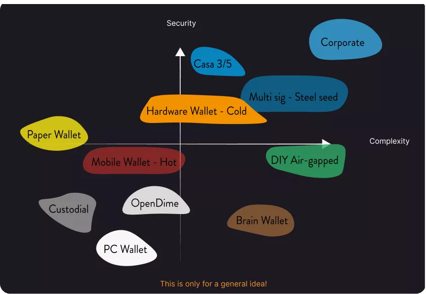
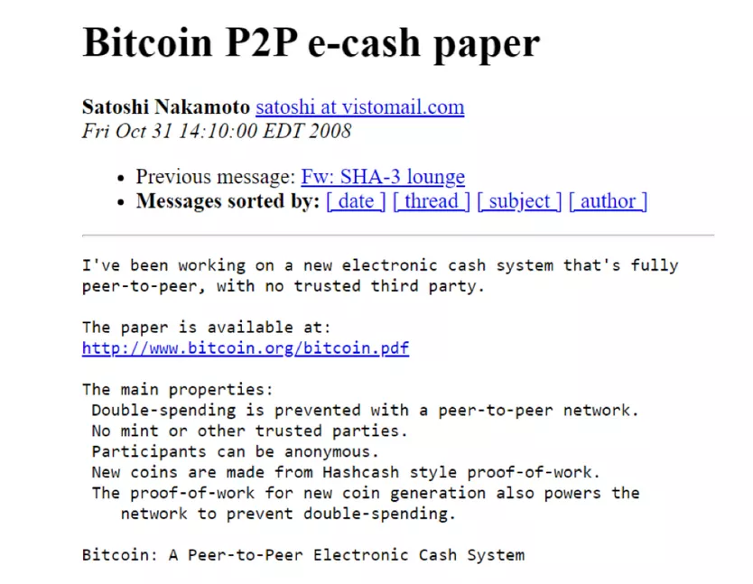
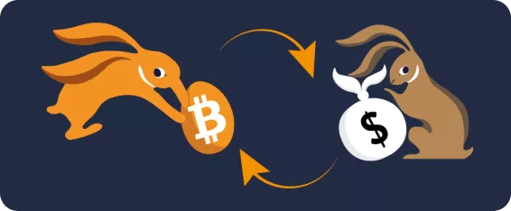
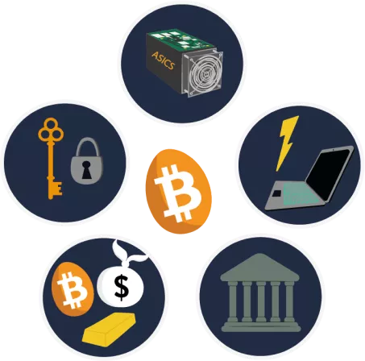
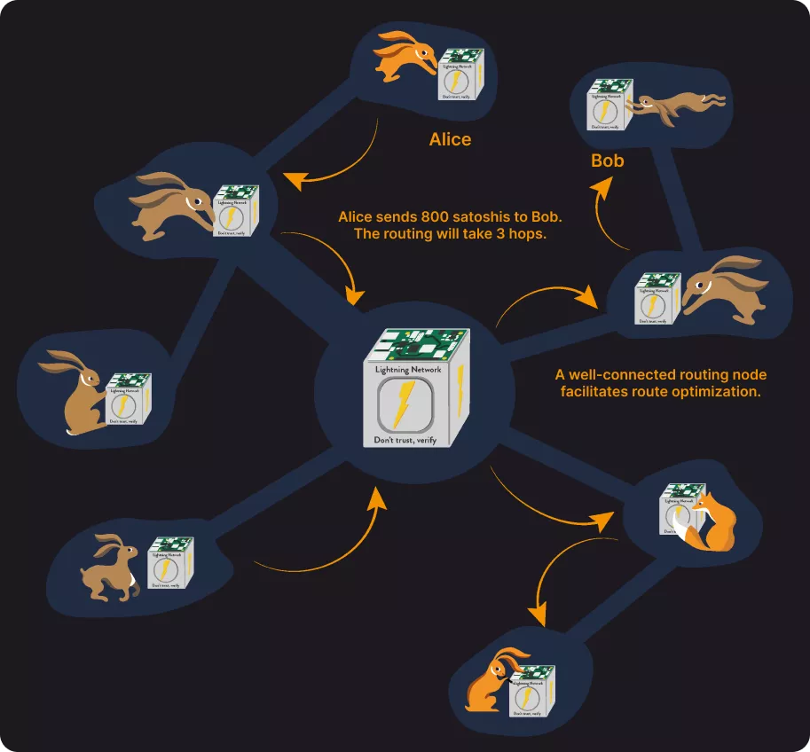
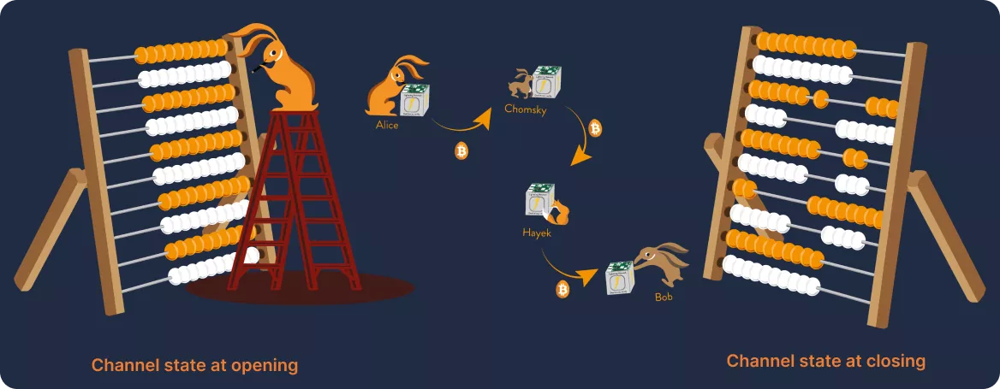
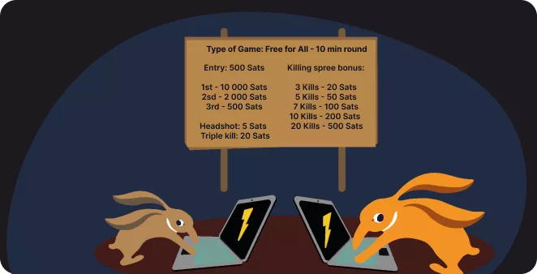

# 您的第一次比特幣冒險

在這個課程中，我將通過25個章節解釋比特幣，以便您能以簡單有效的方式理解這項技術。該課程面向所有人開放，探索整個行業：礦工、錢包、買賣平台等...

課程大約需要15小時。在整個旅程中，解釋性海報和額外資源都是可用的。

您無需任何特定知識即可開始，該課程對所有人都是開放的！

+++

# 導論
<partId>3cd2ac82-026c-53e1-874a-baf5842adc6d</partId>

## 跨入未知
<chapterId>27e3fb60-4b50-556b-9e70-c4f5475c121d</chapterId>

### 歡迎來到一個新的貨幣和技術範式。

比特幣是一項重大創新，它不僅僅是一種“互聯網貨幣”。它在技術和貨幣方面都是一場革命，能夠質疑我們與貨幣和社會的關係。比特幣是一種所謂的**中立**和**去中心化**貨幣，這意味著它不受任何實體或機構的控制。它是一項重大創新，超越了單純的貨幣。為了理解這個著名的比特幣，重要的是要明白比特幣（簡稱BTC）既是一種計算機協議（Bitcoin）也是一種貨幣單位（bitcoin）。

該協議使用底層技術，如密碼學、網絡通信和著名的“區塊鏈”，而比特幣單位是該協議正常運作所需的貨幣。在日常生活中，薩爾瓦多人或全世界的比特幣使用者使用比特幣貨幣購買和銷售商品和服務，這種貨幣依賴於比特幣協議來運作。

### 全面且易於接近的課程

在這個課程中，我們將討論比特幣的貨幣方面，包括如何購買和銷售比特幣、如何在數字錢包中安全存儲它們以及如何使用它們進行交易。我們還將檢查礦工的角色，他們對於創建新的比特幣和保護比特幣網絡至關重要。此外，我們將探索比特幣的未來以及閃電網絡技術如何改善比特幣交易。


理解比特幣是一種新的貨幣系統，它革命性地改變了我們與金錢的關係，這一點至關重要。學習使用比特幣對於任何想要控制自己貨幣的人來說都是一項必不可少的技能。

**第1節 - 貨幣**

- 第1章 - 什麼是貨幣？
- 第2章 - 法定貨幣
- 第3章 - 惡性通貨膨脹
- 第4章 - 比特幣的貨幣政策

**第2節 - 比特幣錢包**

- 第5章 - 比特幣錢包是如何工作的？
- 第6章 - 選擇您的安全性
- 第7章 - 設置您的錢包
- 第8章 - 防範時間的保護

**第3節 - 比特幣的技術方面**

- 第9章 - 交易解釋
- 第10章 - 比特幣節點
- 第11章 - 礦工
- 第12章 - 礦工與生態

**第4節 - 用比特幣儲蓄**

- 第13章 - 比特幣價格
- 第14章 - 如何購買比特幣
- 第15章 - 為比特幣工作
- 第16章 - 超比特幣化

**第5節 - 閃電網絡**

- 第17章 - 閃電網絡介紹
- 第18章 - 閃電網絡的使用案例

在討論貨幣在社會中的定義和運作（第1章）之前，我們首先從比特幣的起源開始。比特幣是一項相對較新的技術，於2009年推出，與其他任何事物都不相同。因此，一開始不理解一切是正常的。事實上，就像學習使用互聯網或汽車一樣，您不需要了解所有技術細節就可以使用比特幣（接收、支付、保護您的資金）。


這裡的重點主要是以一般方式理解這項新技術。我們希望這個培訓能夠讓您滿意，並為您提供理解並可能在這個新的全球貨幣範式中繼續進步所需的基礎。

## 比特幣的前史
<chapterId>9a94b627-5b69-5d81-9125-f1fa9b0aa6ad</chapterId>

在“比特幣”一詞成為數字貨幣和財務變革的代名詞之前，一系列的想法、創新和社會運動為其創建奠定了基礎。比特幣前史的一個基本要素是密碼朋克運動。

### 密碼朋克：數字世界的遠見者


在1980年代和1990年代的技術演進中心，一群人開始深刻質疑隱私和自由在數字時代的角色。這些後來被稱為“密碼朋克”的個體堅信，密碼學可以作為一種工具，以保護個人權利免受政府和大公司的干擾。

朱利安·阿桑奇（Julian Assange）、魏岱（Wei Dai）、蒂姆·梅（Tim May）和大衛·查姆（David Chaum）等標誌性人物為密碼朋克的哲學和願景作出了定義。這些思想家在一個有影響力的郵件列表中分享他們的想法，來自世界各地的參與者在這裡辯論如何使用技術來確保更大的個人自由。

### 密碼朋克的三大支柱文本


密碼朋克運動，以其在數字活動和密碼學中的深厚根基，依靠幾篇基本文本來表達其原則和對未來的願景。其中，特別突出的有三篇：

- 《密碼朋克宣言》：
  由埃里克·休斯（Eric Hughes）於1993年撰寫，《密碼朋克宣言》斷言隱私是一項基本權利。休斯認為，自由和保密地交流對於自由社會至關重要。宣言指出：“我們不能期望機構、公司或其他非個人實體賦予我們隱私……我們必須自己捍衛它。”

- 《加密無政府主義宣言》：
  由蒂莫西·C·梅（Timothy C. May）於1992年撰寫，這份宣言解釋了如何使用密碼學可能導致一個加密無政府主義的時代，政府將無力干預公民的私事。梅設想了一個未來，信息、金錢和消息可以在不需要第三方介入且匿名的情況下交換。

- 《賽博空間獨立宣言》：
雖然不完全是密碼朋克，但這篇文章反映了運動中許多參與者的情緒。這篇文章由John Perry Barlow於1996年撰寫，是對政府日益增加的互聯網監管的回應。該宣言斷言，網絡空間是一個與物理領域不同的獨立領域，不應受到相同法律的約束。它聲明：“我們沒有選舉產生的政府，我們不能被治理。”

### 比特幣的前身

在比特幣出現之前，已經有幾次嘗試創建數字貨幣。例如，David Chaum在1980年代提出了“匿名電子貨幣”的概念，並通過他的項目“DigiCash”實現。不幸的是，由於各種限制，DigiCash從未真正起飛。

另一個重要的前身是Wei Dai的“b-money”。雖然從未實施，但它提出了一個匿名數字貨幣的想法，其中欺詐檢測由一個評估者社區而不是中央權威執行。


正是在這個肥沃的環境中，神秘的中本聰於2008年發布了比特幣白皮書。他結合了密碼朋克運動的幾個想法，如工作證明和加密時間戳，創造了一種去中心化且抗審查的數字貨幣。

比特幣不僅僅是一種數字貨幣；它代表了密碼朋克理想的實現。除了其技術外，它象徵著對傳統金融系統的革命，並提供了一種基於透明度、去中心化和個人主權的替代方案。

### 結論

比特幣的前史深深植根於密碼朋克運動和對數字時代更大自由的集體追求中。通過結合密碼學、去中心化和完整性的原則，比特幣已經成為遠超過一種貨幣的東西；它是一場哲學和技術革命的產物，持續重塑我們的世界。

因此，比特幣是一個跨越長時間的協議，鼓勵我們質疑我們與能源、時間和金錢的關係。但比特幣是一種“真實”的貨幣嗎？什麼是金錢？它是否存在於多種形式中？我們將在下一章探討這些問題。


# 貨幣
<partId>e913df1a-4cbd-5380-ba67-ca2a0414f671</partId>

## 貨幣的歷史
<chapterId>c838e64d-d59f-5703-8c74-ea5e8c4fdd31</chapterId>

貨幣的演變是人類歷史上一個迷人的方面，反映了文明在滿足不斷演變的經濟需求方面的創造力。


### 從貝殼到銀行賬戶

最初，貨幣是有形的，經常與基本商品如糧食、牲畜和其他商品掛鉤。然而，這些商品有重大缺點，如易腐壞，使它們難以作為長期儲蓄媒介使用。例如，一次失敗的收穫或疾病可能一夜之間消滅個人的財富。
隨著文明的進步和貿易擴展到新的地區，出現了對通用交換媒介的需求。實驗過的對象包括貝殼和寶石，但它們並不完美。金子最終成為標準，因為它的稀有性、耐用性和可分割性。它一直是，並且至今仍是財富和權力的象徵。


### 貨幣的作用是什麼？

貨幣是一種高度精緻的溝通工具：
- 它允許現在與未來之間的溝通。我們將我們的時間和能量轉化為一種資產，可以在未來重複使用，而不會有貶值的風險。
- 它允許使用一種普遍的共同語言進行溝通。即使不認識對方，不講同一種語言，兩個陌生人也可以交流、交易，並就事物的價值達成一致。

它在我們世界中的功能難以人工複製。沒有任何人或人群可以創造貨幣；它是一種必須從市場和自願共識中自然產生的社會現象。價格是信號，是幫助社會選擇如何分配資源的信息。

黃金作為貨幣是基於3個功能，經過4000年貨幣達爾文主義選擇的結果：

- 價值儲存
- 交換媒介
- 計價單位


### 貨幣的特性

黃金理想地滿足了一種高效貨幣的標準：其自然稀缺性使其具有價值，而其化學特性使其能夠不隨時間腐蝕。然而，這種形式的貨幣不容易分割或長距離運輸。在一個全球化和數字化的世界中，黃金無法跟上，需要一個中央實體使其可分割並容易交換（鑄幣）。

這些缺陷使黃金成為了一種價值儲存工具，但不是一種通用貨幣，這對於易於使用但不斷被控制它們的實體（國王、中央銀行、皇帝、獨裁者）貶值的國家信用貨幣（法定貨幣）不利。

一種有效貨幣的標準是多方面的。一種好的貨幣必須是：


- **可互換的**，意味著可以無損失地交換價值
- **可分割的**，以便於進行不同規模的交易
- **流動性強**，意味著容易轉換成商品或服務。

為了滿足這些標準，貨幣逐步演變：

- 原石 -> 硬幣
- 鈔票 -> 銀行卡
- 區塊鏈 -> 閃電網絡

今天，貨幣仍在演變，調整其形式以滿足不同的用途。例如，雖然黃金是一個優秀的價值儲存工具，但它不再適合當前的全球化經濟。同樣，法定貨幣如美元和歐元因為現在主要是數字化的，所以非常流動且容易運輸，然而它們的價值卻不斷被貨幣通脹侵蝕。

另一方面，比特幣提出了新的可能性。由於其特性，如嚴格限制的供應量，它提供了一個優秀的價值儲存。此外，作為一種中立的互聯網貨幣，它代表了一種不認識邊界的良好交換手段。然而，儘管[不斷有新的採用](https://btcmap.org/map)，它今天在商業中仍然未被廣泛接受。

### 快速回顧海報！


## 信用貨幣
<chapterId>25151d46-7db1-5b48-8bba-cbde1944555a</chapterId>

喬治·桑塔亞那曾說：“那些不從歷史中學習的人，注定要重複同樣的錯誤。”這句話在談到當前的貨幣系統時尤其有共鳴。

### 信用 = 信任

今天，主要貨幣如歐元和美元被認為是信用貨幣。這意味著它們沒有內在價值。它們的價值完全依賴於我們對調節它們的機構所放置的信任和信念。
信託貨幣是一種由機構，如國家（例如中國的人民幣）或政經聯盟（如歐洲聯盟的歐元）頒布為貨幣的貨幣形式。負責發行信託貨幣的實體是中央銀行（例如，我們可以提到中國人民銀行、美國聯邦儲備系統或幾內亞共和國中央銀行）。這些實體負責決定貨幣政策，因此決定應該將多少貨幣投入流通或印製。


### 貨幣貶值：一種源自羅馬帝國的策略

自古以來，黃金一直作為貨幣參考。然而，其剛性經常導致領導者——無論是羅馬皇帝還是現代政府——採用替代貨幣，這些貨幣通常是信託貨幣。

這種機制簡單，靈感來自於自文明起源以來就存在的做法。渴望控制財富的領導者首先開始集中黃金，通常是利用他們的權力並承諾提供保護和安全。擁有了這些珍貴的儲備後，他們引入一種新的貨幣，其價值等同於黃金，但鑄有他們的肖像。這種貨幣隨後開始流通，人們很快就習慣了其便利性。

逐漸地，這些領導者悄悄地貶值新貨幣，每年將其價值相對於最初的黃金貶低幾個百分點。這種無聲的貶值通常被認為是符合人民利益的。因此，那些以這種信託貨幣儲蓄的人會看到他們儲蓄的價值侵蝕，而國家則通過通貨膨脹為其項目融資。此外，這種貶值使債務更容易償還。


在關鍵時刻，宣布這一消息：貨幣不再由黃金支持。現在已經習慣於信託貨幣且經常對財務事務誤解的公眾接受了這一現實。國家隨後可以自由地操縱貨幣供應量，幾乎無成本地印製大量貨幣。

這種策略，如果執行得當，可以持續數十年。然而，過快的貶值或信心喪失可能導致超級通貨膨脹（見下一章）。歷史表明，美元在100年內失去了98%的價值，歐元在20年內失去了30%的價值，英鎊自創建以來失去了99%的價值。

最終，貨幣可能不再與黃金有任何聯繫，讓人回想起帝國末期的羅馬硬幣，或甚至被降低為一個純數字值，與有形現實脫節。

今天，我們正在見證一個歷史性的轉折點。長期占主導地位的美元似乎正在衰落，黃金失去了其中心地位。我們正處於一個新的貨幣周期的轉軸，提醒我們歷史的教訓經常被遺忘。


### 比特幣是解決方案嗎？

正是在這種背景下，比特幣革命正在獲得動力。這種貨幣**不需要可信的第三方**，旨在將國家與貨幣分離。

貨幣印製導致通貨膨脹，逐漸使人口貧困。另一方面，金融機構和富裕個人從這種做法中受益，創造了不平等的差距並促進了專制主義。當前的金融系統受到監管和限制，以避免其崩潰，任何干擾都可能引發重大經濟危機。由於政治行為者從這一系統中受益，他們沒有動力進行根本性變革，讓系統繼續其進程，直到可能的爆炸。
面對這些系統性挑戰，比特幣呈現自己作為一種去中心化的解決方案：一個新的平行貨幣系統。歷史上，由於其抗偽造的特性，黃金一直被偏愛作為貨幣。同樣地，比特幣通過其去中心化和加密的本質，不能被偽造，且其數量限制為2100萬單位。比特幣是一種依賴透明性和中立性的貨幣，提供了對當前中心化貨幣系統的有吸引力的替代方案。

同時，中央銀行數字貨幣（CBDCs）的出現似乎是不可避免的。這種新形式的貨幣將提供一個更加中央計劃的經濟，這可能會阻礙個人的財務自由並促進專制濫用。
我們可以用1984年諾貝爾獎得主F.A. 海耶克的引言來結束本章：“我不相信我們將會找到一種好的貨幣，直到我們將其從政府手中拿走。然而，我們不能以暴力從他們那裡奪取；我們所能做的就是引入一些他們無法通過巧計阻止的東西。”

### 快速回顧海報！


## 超級通貨膨脹
<chapterId>b04c024c-54f3-50cb-997f-58721cfc74be</chapterId>

超級通貨膨脹是一種特定於法定貨幣的貨幣現象。它的特點是對貨幣完全失去信心和通過當局的貨幣印刷導致的通脹急劇增加。結果，個人積累的儲蓄可以在相對短的時間內消散，將國家推向經濟、社會和政治崩潰的邊緣。

### 通脹失控！

讓我們嘗試理解通脹對儲蓄的影響，考慮不同的通脹率。

- 2%的通脹率，你每年會失去2%的購買力，這在5年內累計達到10%。
- 7%的話，你在10年內會失去一半。
- 20%的話，你在3年內幾乎會失去一半。

在超級通脹期間，我們不再談論每年20%，而是談論每月甚至在高峰期每天20%。在3天內每天100%的通脹是一個已經發生並且在我們的世界中繼續發生的現實情景。

重要的是要理解，超級通脹不是憑空發生的，不是偶然的，不是資本主義或政治對手造成的。超級通脹是中央銀行家和政治家做出錯誤貨幣決策的直接後果。其後果影響所有公民，並將影響幾代人。我邀請您花5分鐘研究這個表格，以充分實現這一現象的真實影響（ECON204課程將詳細討論這個主題）。"


### 超級通脹是如何發生的？


第一階段 - 信心喪失

- 貨幣權力的中央集權化促進了貨幣的創造及其濫用。然後可以出現對貨幣的信心喪失，並觸發超級通脹。個體開始質疑貨幣的來源和強制性貨幣政策的好處。這種信心喪失通常是由外部因素引起的，如戰爭、社會措施或關鍵資源（如小麥或汽油）價格的上漲。

第二階段 - 貨幣崩潰 & 價格上漲
隨著政府對信任的控制力下降，個人開始將他們的貨幣兌換成另一種更穩定的貨幣，例如在委內瑞拉的美元。這導致價格上漲，創造了一個惡性循環，商品和服務變得越來越昂貴。為了滿足這些需求，國家印製更多貨幣以糾正貨幣政策，導致指數型通貨膨脹。
第三階段 - 貨幣印製的惡性循環

- 購買商品需要越來越多的鈔票，造成紙幣短缺。這導致更多的鈔票印製，創造了更多的通貨膨脹。


第四階段 - 新貨幣的出現

- 然後引入新貨幣以取代舊貨幣。一個著名的超級通貨膨脹例子是1920-1924年的德國。為了振興經濟，創建了一種新貨幣，由德國、法國和英國的債務支持，並由德國土地擔保。

解決超級通貨膨脹危機通常需要根本性的變革，如革命、政府更迭、中央銀行家的更換等。信任喪失、貨幣崩潰和重建是基於法定貨幣的新經濟復興的關鍵階段。

### 三個著名例子

- 德國，1922-1923

  第一次世界大戰後的德國魏瑪共和國發生的超級通貨膨脹是最引人注目的例子之一。

  德國借入了巨額資金來資助戰爭努力，不僅德國沒有贏得戰爭，而且還必須支付數十億美元的賠償金。最高通貨膨脹的月份是1923年10月，達到29,500%，或每天20.9%的通貨膨脹率。價格每3.7天翻一番！
  據說在餐廳裡，服務員必須每30分鐘宣布一次菜單價格以應對通貨膨脹。德國貨幣變得如此無用，以至於一些公民寧願燒紙幣而不是木頭，因為這實際上更便宜。

  

- 匈牙利，1945-1946

  到目前為止，歷史上經歷最嚴重的超級通貨膨脹時期的國家是第二次世界大戰後的匈牙利。

  匈牙利發現自己處於衝突的失敗一方，戰爭摧毀了其大部分工業生產能力。最高通貨膨脹的月份是1946年7月，價格通貨膨脹率為41,900,000,000,000,000%，相當於每天207%。價格每15小時翻一番！

  最後一張投入流通的鈔票是1946年的一百萬億彭戈（100,000,000,000,000,000）鈔票。


- 辛巴威，2007-2008
  直到2000年，辛巴威幾乎自給自足，除了石油以外。

  1997年，在政府同意補償戰爭退伍軍人相當於4.5億美元的金額後，辛巴威元貶值超過72%。由於政府並沒有這樣的金額在庫中，它不得不訴諸於運行印鈔機。2005年，通貨膨脹達到586%，到了2007年3月，月通貨膨脹達到50%。

  2007年6月，政府通過實施價格控制來做出反應。商店實際上被“洗劫一空”。商人現在再也沒有辦法補充他們的商店存貨。
在2009年4月，財政部長宣布暫停使用辛巴威元，並授權使用不同的外幣進行貿易。所有銀行帳戶、退休金和金融機構的餘額一夜之間蒸發。


總之，通貨膨脹會迅速降低貨幣的價值，導致儲蓄的侵蝕和對貨幣系統的信心喪失。正如伏爾泰曾經暗示的，一種依賴於像金融機構這樣的可信第三方的貨幣，在實踐中和長期來看，是一種有缺陷的貨幣，因為它無法保證購買力或保存儲蓄。

### 快速回顧海報！


## 2100萬比特幣
<chapterId>f4a06d76-1963-56fd-93ff-dfa41489bcde</chapterId>

### 比特幣的貨幣政策

比特幣是一種去中心化的數字貨幣，其最大數量預定為**2100萬單位**。這種稀缺性的內在特徵由其電腦代碼決定，並通過參與協議的所有用戶的共識加以強化。


關於其貨幣發行，可以通過一條S曲線來說明，該曲線代表隨時間創建的比特幣數量。例如，在2022年，大約有1850萬比特幣在流通。預測指出，到2025年，將有大約1950萬比特幣，代表總供應量的約93%，而到2037年，這個數字將達到2040萬。

### 如何創造新的比特幣？

新比特幣的創造是挖礦過程的結果，這是一種在比特幣網絡上驗證交易的程序。


執行此任務的礦工每十分鐘就會獲得新比特幣的發行獎勵。這個獎勵計劃每21萬個區塊減半一次，大約每四年發生一次，這一事件被稱為“減半”——使得貨幣發行曲線呈階梯狀。由於這種減半機制，可以數學預測比特幣的創造將在2140年停止，當比特幣總數達到其限額的2100萬時。

| 減半次數 | 區塊高度 | 減半後的BTC獎勵  | 減半後的估計BTC流通量 |
| -------- | -------- | ----------------- | ---------------------- |
| 1        | 210,000  | 25 BTC            | 10,500,000 BTC         |
| 2        | 420,000  | 12.5 BTC          | 15,750,000 BTC         |
| 3        | 630,000  | 6.25 BTC          | 18,375,000 BTC         |
| 4        | 840,000  | 3.125 BTC         | 19,687,500 BTC         |
| 5        | 1,050,000| 1.5625 BTC        | 20,343,750 BTC         |
| 6        | 1,260,000| 0.78125 BTC       | 20,671,875 BTC         |
| 7        | 1,470,000| 0.390625 BTC      | 20,835,937.5 BTC       |
| 8              | 1,680,000    | 0.1953125 BTC             | 20,917,968.75 BTC                          |
| 9              | 1,890,000    | 0.09765625 BTC            | 20,958,984.375 BTC                         |
| 10             | 2,100,000    | 0.048828125 BTC           | 20,979,492.188 BTC                         |
| 11             | 2,310,000    | 0.0244140625 BTC          | 20,989,746.094 BTC                         |
| 12             | 2,520,000    | 0.01220703125 BTC         | 20,994,873.047 BTC                         |
| 13             | 2,730,000    | 0.006103515625 BTC        | 20,997,436.523 BTC                         |
| 14             | 2,940,000    | 0.0030517578125 BTC       | 20,998,718.262 BTC                         |
| 15             | 3,150,000    | 0.00152587890625 BTC      | 20,999,359.131 BTC                         |
| 16             | 3,360,000    | 0.000762939453125 BTC     | 20,999,679.566 BTC                         |
| 17             | 3,570,000    | 0.0003814697265625 BTC    | 20,999,839.783 BTC                         |
| 18             | 3,780,000    | 0.00019073486328125 BTC   | 20,999,919.892 BTC                         |
| 19             | 3,990,000    | 0.000095367431640625 BTC  | 20,999,959.946 BTC                         |
| 20             | 4,200,000    | 0.0000476837158203125 BTC | 20,999,979.973 BTC                         |

我們將在挖礦章節詳細回顧礦工。

### 保障數位稀缺性

比特幣的稀缺性由兩個關鍵機制保障：挖礦難度調整和博弈論：

- 挖礦難度調整是每2016個區塊，或大約兩週一次的機制，以確保平均每十分鐘就有一個新區塊被加入區塊鏈。區塊創建的頻率和比特幣的總量是比特幣協議的固定方面，無法在沒有普遍共識的情況下更改，這與傳統貨幣系統中的任意決策不同。


> 你知道嗎？礦工被激勵去挖掘一個區塊以賺取新的比特幣（區塊補助）和與他們在區塊中包含的交易相關的交易費。隨著發行的比特幣數量接近2100萬的限制，礦工將通過交易費而不是區塊補助獲得更多的報酬。

- 博弈論是一個依賴於人類理性的數學概念。在這裡，對於比特幣，是用戶對協議變更進行投票。是的，你沒看錯：任何對比特幣協議的修改都需要得到整個用戶社群的同意，這非常複雜。所以，如果有人想要創造第2200萬個比特幣，他們必須說服所有用戶自願貶值他們自己的儲蓄，這是不太可能發生的，因為比特幣是全球性的，不受一個中央集團的管轄。

對貨幣進行貶值的想法與比特幣的基本哲學背道而馳，因此改變這一限制的可能性極低。

### 從一開始到永遠，每秒都可審計的貨幣政策！

比特幣的稀缺性是其主要資產之一，流通中的比特幣最大數量為2100萬，這一數字是公開且任何人都可以驗證的。

事實上，任何人都可以通過在比特幣節點上輸入一個簡單的命令來驗證流通中的比特幣數量：`bitcoin-cli gettxoutsetinfo`。這種透明度和可驗證性增強了對比特幣系統的信任，這種信任不是基於中心化的機構或個人，而是基於其協議中固有的數學和加密保證。（您將在LN201中輕鬆學會如何做到這一點）

```json
{
  "height": 710560,
  "bestblock": "0000000000000000000887384d67103412ea7f18a43953e65c8c4ac36bf42e54",
  "transactions": 473244,
  "txouts": 1018917,
  "bogosize": 2183872374,
  "hash_serialized_2": "eebb9987337700ffaacbbaa11223344",
  "disk_size": 178239584,
  "total_amount": 18745998.12345678
}
```

比特幣通過其設計，通過限制其創建並保護用戶的儲蓄來保證健全的貨幣管理，使其與其他貨幣區別開來。與奧地利經濟學的原則（詳見ECON201）一致，其控制的數量和可預測的分配保護了它免受傳統貨幣中固有的通脹風險。

總之，比特幣憑藉其去中心化的本質、程序化的稀缺性和透明度，提供了一種獨特的傳統貨幣系統替代方案。它展示了如何使用技術創建一種不僅有用且可驗證的貨幣，而且通過嚴格限制其供應來保護用戶儲蓄的價值。

### 快速回顧海報！


### 第1節結論！

# 比特幣錢包
<partId>28860585-4f61-59d9-b242-f4c57d837cc1</partId>

## 什麼是比特幣錢包？
<chapterId>1c0166ab-cb7a-5bc6-9175-d13482bd91f1</chapterId>

在本節中，我們將探討比特幣在錢包中的存儲和安全性。這將使您更好地理解這些著名的比特幣位於何處以及如何與它們互動！

### 揭開比特幣錢包的神秘面紗

在這個行業中，我們使用錢包與比特幣網絡互動，它有3個功能：

- 允許接收比特幣
- 允許發送比特幣
- 保護它們免受黑客和盜竊企圖

錢包可以是您電腦上的軟件、智能手機上的應用程序、像USB鑰匙一樣的實體設備，甚至是一張紙。這些不同類型的比特幣錢包各自適用於不同的用例。有些用於大量資金，強調安全性，有些則用於隱私，或甚至用於每日支付小額款項。

因此，錢包被劃分為大型家族使用，始終圍繞一個核心問題：您是資金的擁有者還是將控制權留給第三方？我們將在下一章詳細回到這個話題，但想法很簡單：錢是在您的口袋裡還是在您的銀行家口袋裡！


### 比特幣錢包是如何運作的
無論是您的比特幣“銀行家”還是您自己，一般來說，絕大多數比特幣錢包都採用類似的技術運作，那就是非對稱加密技術，因此有一套密鑰對系統：一個私鑰用於支付，一個公鑰用於接收。

- 私鑰
  初始化錢包時，會生成一個秘密恢復短語（私鑰），以24個單詞的形式提供給您。
  
  私鑰非常重要，因為它代表了比特幣的所有權，因此也就是使用或發送它們的權利。私鑰的持有者就是比特幣的擁有者。
  
  這把鑰匙必須保密並妥善保存，因為它是開啟您財富的鑰匙！

- 公鑰 & 地址
  公鑰是由私鑰創建的，因此與之相關聯。公鑰用於生成比特幣地址，從而接收資金。分享公鑰會涉及隱私風險，但不會影響安全性。
  
  這些地址由您的錢包創建，可以安全地分享。建議只使用一次以最大化您的隱私。
  
因此，重要的是要理解，多虧了這項技術，我們可以輕鬆接收比特幣，而不允許發送者竊取我們的資金！想象它就像一個郵箱：人們在其中存錢，但只有您能打開它。


### 那麼，比特幣是存放在錢包裡嗎？

雖然您的密鑰存儲在您的錢包中，但比特幣本身實際上是“存儲”在比特幣區塊鏈中，這是比特幣點對點網絡內的一個公共分布式賬本（我們將在第3節中查看）。這就是為什麼失去您擁有錢包的設備並不一定意味著失去您的比特幣。讓您能夠重新創建您的錢包並花費您的比特幣的是私鑰。因此，妥善保護它至關重要。


幸運的是，自2017年以來，這個私鑰可以編碼成一個簡單的12或24個單詞的列表，稱為助記詞。這個短語是您比特幣錢包的備份，它允許您使用任何比特幣錢包軟件/應用重新創建您的錢包。因此，任何能夠訪問這個單詞列表的人都能夠訪問您的比特幣。

### 黑客怎麼辦？

有人可能會問：如果有人偶然猜到我們的12或24個單詞列表怎麼辦？簡短的回答是，由於用於創建錢包的加密技術，這種可能性極低。從另一個角度來看，偶然找到訪問您錢包的方式，就像在$2^256$中找到“正確”的數字，這幾乎等同於在宇宙中找到“正確”的原子。然而，如果您對這種默認安全性不滿意，您可以通過為您的比特幣錢包添加一個密碼短語來進一步加強它。


因此，如果您遵循良好的安全實踐，您的比特幣錢包被黑客攻擊的概率極低。我們將在下一節詳細介紹這些實踐。

選擇一個適合您需求和使用的錢包。在我們大學的[教程部分](https://planb.network/tutorials/wallet)提供了關於使用和保護不同錢包的詳細教程。

### 快速回顧海報！


## 安全性與比特幣錢包
<chapterId>00c1afea-e54a-511f-bab3-2efc2fbfa6a1</chapterId>

### 在開始之前提出正確的問題
當您擁有比特幣時，資金的安全是一個主要的擔憂。定義適合您情況的安全最好方法是提出（並回答）一系列問題；您的安全模型將取決於您的答案。讓我們開始：

- 誰可以訪問我的資金？換句話說，是只有您自己能夠訪問您的比特幣，還是有第三方，例如一家公司，允許您訪問您的資金？
- 第二個問題可能是：您計劃用您的比特幣做什麼？是您經常使用的一筆金額嗎？是中期儲蓄？長期儲蓄？
- 您的技術技能如何？
- 您的安全預算是多少？

請記住，沒有普遍的解決方案。因此，花時間回答這些問題，因為它將幫助您量身定制安全措施。



### 從複雜性角度思考比特幣錢包

讓我們嘗試為您的比特幣建立幾個安全級別：

- **級別 0**，您使用所謂的託管服務，您不是您的比特幣的唯一持有者。請注意，這個可信的第三方可以隨時限制您訪問您的資金，您擁有的財務主權與通過銀行賬戶使用傳統銀行系統相同。


- **級別 1**，您在手機或電腦上使用比特幣錢包，您是您的比特幣的唯一持有者。您可以輕鬆進行交易。然而，備份助記詞以防手機或電腦丟失時重新獲取您的資金至關重要。這通常被稱為“熱錢包”，因為私鑰存儲在一個連接互聯網的設備上。

- **級別 2**，您使用一個實體錢包，並且您已經保護了您的12個或24個單詞列表。要進行交易，您將總是需要用您的設備簽名。這使得您的資金在日常基礎上不那麼容易獲取。這通常被稱為“冷錢包”，因為您的鑰匙存儲在一個未連接互聯網的設備上。


- **級別 3**，您使用級別 1 或 2 的錢包，但增加了一個附加的密碼短語。請注意，您現在需要備份12個或24個單詞的列表**和**您的密碼短語。理想情況下，這兩條信息存儲在兩個不同的地方。


- **級別 4**，您使用一組錢包來創建一個“多簽名”錢包，這意味著它需要多個簽名來進行交易。請注意，多簽名的每一部分應存儲在不同的位置。這通常被認為是比特幣的高級使用，主要用於大量和企業使用。


當然，我們可以有多種使用案例，在這種情況下，建議使用多個比特幣錢包。沒有一種萬能的解決方案。

### 安全必須適應
每個人願意在特定安全級別上留下的金額取決於個人。對於一些人來說，在熱錢包上留下1 BTC是合理的，而對另一些人來說，這絕對不是。無論如何，當你想要保護一小筆金額時，避免花費大量金錢購買實體錢包來提高安全性。同時，請記住，過度複雜化你的比特幣的安全性和可訪問性可能會在你比如說錯誤處理錢包備份時對你造成傷害。

總之，直接擁有自己的比特幣是確保財務主權的一個重要元素。建議使用移動錢包來支付日常開銷，並使用離線或“冷”實體錢包來存儲較大金額。另一方面，企業應考慮使用多重簽名系統，或“多重簽名”，以增加和共享安全性。避免盡可能使用託管服務也是至關重要的，這些服務可能複製傳統金融系統的一些漏洞。

現在我們已經了解了這一點，讓我們繼續到下一節，看看創建比特幣錢包的步驟。然而，如果你希望進一步探索安全主題，你可以閱讀這篇[DarthCoin的文章](https://asi0.substack.com/p/bitcoin-soyez-votre-propre-banque)。

### 快速回顧一下海報！


## 設置錢包
<chapterId>615519eb-4565-557d-86a0-021badf7616f</chapterId>

你的比特幣安全至關重要，一個簡單的錯誤可能會帶來昂貴的後果。這就是為什麼我們現在將看看創建新比特幣錢包時的最佳實踐。

> 請注意，BTC102課程將引導你完成這一步。

### 這一步不是開玩笑！

你的私鑰，通常由一個24個單詞的列表（通常稱為“種子”或“助記詞”）表示，代表著對你資金的訪問。如果這個鑰匙被泄露給第三方，請認為相關資金不再安全。因此，在初始化你的錢包時，重要的是遵循這些規則：

- 遮住所有攝像頭。
- 不要拍攝單詞列表的照片。
- 不要在電腦或手機上輸入它。
- 不要將其保存為聯繫人或通過短信發送給自己。
- 永遠不要讓你的單詞在你的桌子上無人看管。
- 永遠不要在一個不尋常的地方隱藏你的單詞列表。

你將實際上拿一張空白紙或打印這個[模板](https://bitcoiner.guide/backup.pdf)，並用筆整齊清晰地按順序寫下單詞列表。如果墨水隨時間褪色，你可能會失去你的資金；因此，保護這張紙不受元素侵害是重要的。


### 正確做法的提示

除了紙張，還有其他替代方案，比如在金屬板上雕刻你的助記詞。如果你寫錯了，你的繼承人可能無法讀懂它，因此可能無法恢復資金。一旦單詞被寫下，建議製作第二份副本並將其存放在與第一份不同的地方。這提供了一份備份，以防第一份副本丟失或發生意外。


一旦副本製作完成，將單詞列表存放在一個你會記得去找它們的安全地方！不要創建一個過於複雜的隱藏計劃，以免你失去它們。

> 你的單詞 = 你的錢。
"冷"錢包通常會有這些單詞列表，就像移動或PC上的"熱"錢包一樣。這種備份私鑰的方法現在已成為標準。這意味著您可以將您的助記詞輸入任何錢包軟件以恢復您的錢包。我們強烈不鼓勵使用的壞錢包不會給您一個24個單詞的列表，但可能會要求一個帳戶、一個電子郵件地址，或更糟，一個身份證明。
**注意：缺少24個單詞的列表應該讓您警覺。**

### 快速回顧海報！


## 經得起時間的考驗
<chapterId>f58cd446-c202-5eff-aab7-e61cc40e5c06</chapterId>

安全是比特幣生態系統中的一個主要關注點。的確，就像任何形式的財富一樣，您的比特幣必須被保護以防止丟失、盜竊和退化，特別是在長期內。保護您的比特幣需要一些技術知識和對相關風險的認識，這導致我們討論兩個主要策略：將您的比特幣鐫刻在鋼材上和創建遺產計劃。

### 石刻

一種長期保護您的比特幣的方法是將您的助記詞鐫刻在像鋼這樣的耐用材料上。這創建了您密鑰的物理備份，能夠抵抗水損害和火災。

實現這一目標有許多解決方案，有些成本低廉，如"Blockmit"，而其他則需要更多設備。您可以通過這個大學的教程部分自行探索這個主題。


### 考慮下一代！

與此同時，創建遺產計劃也是確保您的比特幣在您去世後能被妥善管理的關鍵步驟。這個計劃可以包括一封手寫信，詳細說明您的資產、它們的訪問方法，以及要聯繫的可信個人的聯繫信息。與公證人討論比特幣的繼承也很重要，以確保稅收合規，儘管永遠不要直接將您的比特幣委託給第三方，包括公證人。

如果您希望進一步探索比特幣遺產計劃的主題，我們推薦Pamela Morgan的書[Cryptoasset Inheritance Plan](https://planb.network/resources/books/28)或參加BTC102課程，我們將在其中指導您創建它。


### 隱私很重要

保護您的比特幣的長期安全不僅限於創建物理備份或開發遺產計劃。隱私是另一個重要考慮因素。例如，最好在不提供身份證明的情況下購買比特幣，以最小化身份盜竊的風險，或僅僅是由任何擁有足夠手段的實體追踪您的資金。如果需要，BTC 205課程可以協助您。

關於隱私，避免向每個人談論您的比特幣至關重要。的確，我們不知道這項資產將走向何方，保持對其所有權的謹慎是明智的決定。您不想吸引對您自己和您的錢包的注意。

同樣，避免在比特幣會議或與陌生人的遇見中大聲透露您的安全系統...

### 快速回顧海報！


### 關於比特幣錢包安全的總結

比特幣錢包是允許您存儲和交易比特幣的軟件。有幾種類型：移動或PC錢包，適合小額和/或定期開支；實體錢包，更適合中長期存儲比特幣；多簽名錢包，管理更複雜，需要多個簽名才能進行交易。
當創建一個錢包時，您必須首先備份您的私鑰。這種備份形式是一個由12個或24個單詞組成的列表，或者是您可以寫在一張紙或一塊金屬板上的12個單詞。這個助記詞短語允許您在任何比特幣錢包應用上恢復您的錢包。任何能夠訪問這個列表的人也就能夠訪問您的比特幣。在比特幣中，財務主權與個人責任並行，因此確保您的錢包和備份的訪問安全至關重要。為此，遵循某些規則很重要：
- 創建一個繼承計劃：以確保您的親人在出現問題時可以取回錢。
- 避免交易平台：建議避免將您的比特幣留在交易平台上，因為它們可能容易受到黑客攻擊。
- 調整您的安全級別：花時間解釋您的需求和用途，這將幫助您在不同的比特幣錢包中做出選擇。

現在我們已經介紹了比特幣錢包的基礎知識和保護它們的最佳實踐，我們將在下一章討論比特幣的技術運作。再次強調，了解比特幣協議的基礎知識將使您更好地理解其運作，這將使您能夠更好地使用它。

# 比特幣的技術方面。
<partId>a86d7439-e7a2-5f21-b1e9-6b5e23ca265b</partId>

## 啟動比特幣
<chapterId>b7561082-8943-519d-95d1-a5f60dd2686d</chapterId>

### 讓我們從一點歷史開始。



2008年10月31日標誌著一項新的金融技術的誕生：比特幣。就在這一天，比特幣的匿名作者中本聰通過一封發送給密碼朋克郵件列表的電子郵件向世界展示了他的創新，這是一個對互聯網上的隱私充滿熱情的加密學愛好者社區。

這封電子郵件包含了一份文件，稱為“白皮書”，它介紹了比特幣的運作方式。鑑於數字現金系統之前的失敗，這一舉措並未立即激起熱情。然而，這份白皮書最終成為比特幣用戶的參考資料，並在比特幣生態系統中引發了許多辯論。


2009年1月3日，中本聰正式通過創建第一個區塊，也就是創世區塊，來啟動比特幣網絡，這標誌著比特幣區塊鏈的啟動。這個區塊包含了一條揭示比特幣使命的信息：“03/Jan/2009 Chancellor on brink of second bailout for banks.”


> “我們可以在武器競賽中贏得一場重大戰役，並為自由贏得新的領土數年。” - 中本聰


### 比特幣協議開始運作

2009年1月8日，中本聰宣布發布Bitcoin-0.1.0。不久之後，Hal Finney開始使用該軟件並加入網絡。現在，網絡中有了2個節點，因此也有了2個礦工。Finney通過發推文“運行比特幣”來記錄這一步。2009年1月12日，中本聰和Hal Finney之間進行了第一筆比特幣交易。這筆交易，10 BTC，被記錄在170號區塊中。


對比特幣的興趣迅速增長，許多人開始測試、辯論、解決錯誤，並反思比特幣的倫理、經濟和哲學方面。為了促進這些交流，比特幣論壇BitcoinTalk於2009年11月22日由中本聰創建。這個論壇很快成為比特幣用戶討論的首選地點。許多與比特幣相關的迷因和符號都是在這裡誕生的，例如[比特幣標誌](https://bitcointalk.org/index.php?topic=64.0)、著名的[Hodl](https://bitcointalk.org/index.php?topic=375643.0)，甚至是[披薩日](https://bitcointalk.org/index.php?topic=137.msg1195)。

> **你知道嗎？** 的確，在2010年5月22日，Laszlo Hanyecz用比特幣創造了歷史，他提出用10,000 BTC買2個披薩。這是比特幣首次被用來購買實體商品。


### 中本聰的消失

2010年，隨著比特幣開始吸引媒體關注，中本聰決定疏遠自己。2010年12月12日，他在論壇上發布了他的最後一篇帖子，宣布他的離開。2011年4月23日，他進行了最後已知的私人郵件交流。此後，中本聰消失了，將他的創造留給了社區。

> “政府擅長切斷像Napster這樣的中央控制網絡的頭部，但像Gnutella和Tor這樣的純P2P網絡似乎能夠自保。” - 中本聰

儘管中本聰不在，比特幣繼續發展。每10分鐘，比特幣的歷史就被寫下，協議繼續按照預期運作。不管是恐懼、不確定性或懷疑（FOMO即錯失恐懼症或FUD即恐懼不確定性懷疑），比特幣繼續前進，線上可用性達到99.988%。

每個人對比特幣的看法不同。對於一些人來說，它像[菌絲體](https://brandonquittem.com/bitcoin-is-the-mycelium-of-money/)那樣是一種真菌實體，對於其他人來說，它是一個[黑洞](https://dergigi.com/2019/05/01/bitcoins-gravity/)。不管是愛它還是恨它，比特幣持續存在，以每個區塊10分鐘的恆定節奏，像新貨幣系統的心跳一樣。

要了解更多關於中本聰著作的信息，我推薦[Phil Champagne的書](https://planb.network/resources/books)或ARTE紀錄片"le mystaire Satoshi"。


> “傳統貨幣的根本問題在於所有必須賦予的信任才能使其運作。中央銀行必須被信任不會貶值貨幣，但法定貨幣的歷史充滿了對這種信任的違背。銀行必須被信任保管我們的錢並進行電子轉賬，但它們在幾乎沒有儲備的情況下，以信貸泡沫的形式借出。”

現在我們已經有了一些背景知識，讓我們來看看一般比特幣交易是如何運作的。

### 快速回顧海報！


## 比特幣交易
<chapterId>03482644-5473-590b-975b-b43bb65eac21</chapterId>
一筆比特幣交易僅僅是使用比特幣地址轉移比特幣所有權的過程。以Alice和Bob為例：Alice希望獲得比特幣，而Bob已經擁有一些。

### 步驟1 - 通過錢包創建交易

為了將比特幣轉移給Alice，Alice必須提供給Bob她的一個比特幣地址。這個地址，源自Alice的公鑰，是她比特幣錢包的唯一標識。

具體來說，Alice打開她的錢包並按下“接收”。一個QR碼或像這樣的地址bc1q7957hh3nj47efn8t2r6xdzs2cy3wjcyp8pch6hfkggy7jwrzj93sv4uykr將被顯示。這是她的“比特幣IBAN”之類的東西。她將它提供給Bob。

然後Bob使用Alice的接收地址發起交易。Bob依次打開他的比特幣錢包，按下“發送”，複製並粘貼地址，添加一個金額和交易費用。這些費用是對礦工將交易包含在下一個區塊中的激勵。


> **為什麼要支付費用？** 這些費用對於創建一個自由市場以將交易包含在區塊中是必要的，因為一個區塊中的交易數量是有限的。實際上，一個區塊的大小為1MB（在Segwit更新後可以擴展到4MB），這相當於每個區塊幾千筆交易。交易的費用與其大小成正比。交易的大小，反過來，取決於交易的複雜性。

為了完成交易，Bob必須使用他支付Alice的地址的私鑰提供一個簽名。這證明了他是他想要轉移的比特幣的擁有者。這一步通常在移動錢包上自動完成，或者是您的實體錢包上的一個確認：“您確定要將X發送給Y嗎？是或否”。

### 步驟2：通過節點向礦工傳播交易

在這個階段，交易已經被創建，Bob的錢包將其與比特幣網絡共享。為此，他的錢包將與比特幣網絡的一個節點通信，這個節點將這個信息傳播給其他節點。這個傳播步驟允許整個網絡看到這個新交易並將其納入考慮。


儘管這筆交易現在已經為所有人所知（通過一個叫做Mempool的工具），交易並不一定被認為是確認的！實際上，是礦工通過將交易包含在我們著名的區塊鏈的一個區塊中來驗證交易。

礦工的角色是取出有效且未確認的交易，然後將它們編譯成一個區塊。為了使他們的區塊成為比特幣區塊鏈中的下一個，他們必須解決一個叫做“工作證明”的加密謎題。


### 步驟3：交易被一個礦工在一個區塊中挖出。

這個工作證明需要為相關區塊找到一個有效的“哈希”。可以將其視為與該區塊相關聯的獨特指紋，由256個字符組成。這個哈希的有效性取決於比特幣網絡的難度。我們稍後將更詳細地討論這個機制。現在，考慮到一個礦工已經找到了一個有效的區塊，並且Bob對Alice的交易被包含在其中。
這個新的有效區塊被添加到比特幣區塊鏈中，這是一個記錄所有比特幣交易的公共且不可更改的賬本。可以將其視為所有比特幣用戶的共同賬本。根據協議規則，由於難度調整，大約每十分鐘就會添加一個區塊。在關於礦工的部分，我們將看到什麼機制防止了比特幣交易賬本的修改。


### 步驟4：區塊有效且經過愛麗絲的錢包節點驗證。

在此階段，交易被認為是有效的，礦工隨後會通過他們的節點將新區塊傳播到網絡，並且愛麗絲的錢包將被更新。


> 注意：即使愛麗絲看到她在其中一個地址上收到了比特幣，也建議只有當交易有6次確認時才將交易視為不可更改。這意味著在包含鮑勃交易的區塊上方又挖出了6個其他區塊。換句話說，區塊鏈中的交易越老，就變得越不可更改。

### 快速回顧海報！


### 這一切的意義是什麼？

最終，比特幣交易系統是去中心化的，並且是點對點工作的，不需要任何可信中介。

鮑勃將他的交易發送到比特幣網絡，當一個礦工發布包含鮑勃交易的有效區塊時，愛麗絲可以開始認為這些比特幣屬於她。在比特幣所有權轉移的任何步驟中都不需要信任；只有協議規則和經濟激勵使得在比特幣協議內惡意行為的成本過高。

用戶通過用他們的私鑰數字簽名交易來轉移他們的貨幣所有權。礦工的權力很小，因為用戶通過處理新區塊和包含的交易的驗證的比特幣節點也有顯著的控制權。正是通過這個比特幣節點的網絡，網絡真正實現了去中心化。

事實上，要完全摧毀比特幣網絡，必須摧毀所有比特幣節點上的所有區塊鏈副本 - 由於這些節點的地理分布和實際上難以物理奪取它們，這是一項實際上不可能完成的任務。

讓我們更仔細地看看比特幣節點是如何工作的。

## 比特幣節點
<chapterId>8533cebc-f799-528b-89df-8d75d4c37f1c</chapterId>

節點是比特幣網絡架構的基本要素。它們執行各種關鍵功能：

- 維護一份比特幣區塊鏈的副本
- 驗證交易
- 向其他節點傳輸信息
- 執行比特幣協議的規則。

因此，任何運行比特幣軟件的設備（通常通過[Bitcoin Core](https://bitcoin.org/en/bitcoin-core/)），都對網絡的去中心化做出了貢獻。


### 因此，節點是比特幣的中心核心。

每個節點都保留了一份區塊鏈的副本，這允許進行交易驗證並防止任何試圖欺詐的行為。網絡的去中心化特性賦予了比特幣非凡的韌性和堅固性 - 要停止比特幣協議，全世界的所有節點都必須被關閉。供您參考，目前（2023年9月）全球大約有[45,000個節點](https://bitnodes.io/nodes/all/)分布。
節點能夠驗證區塊和交易的有效性，因為它們遵循比特幣共識的規則。這些規則在其他方面中，還管轄著比特幣的貨幣政策，例如礦工的獎勵金額（我們將在下一節中更詳細討論）以及流通中的比特幣數量。節點在某種方式上充當網絡的法律系統。多虧了它們，所有網絡參與者都遵循相同的規則。它們確保了比特幣協議的中立性。共識規則很少變化，如果有的話，因為要進行更改，需要所有節點的批准。


協議內的治理超出了本訓練的範圍，但請知道，每個運行比特幣節點的用戶都決定他們想要遵循哪些規則。因此，用戶可以決定遵循其他規則（即，對代碼進行修改），但如果這些修改使當前的共識規則無效，那麼該節點將不再是比特幣網絡的一部分。因此，重大修改是罕見的，並且需要在數千個擁有不同意識形態和利益的行動者之間進行重大協調，這迫使協議只產生使其對所有比特幣用戶來說“更好”的更新。

### 節點是什麼樣子？

當我們想擁有自己的節點時，有幾個選項可供我們選擇，它們的維護成本各不相同。您可以簡單地在您的電腦上運行比特幣核心軟件，但這將需要大量的存儲空間，因為區塊鏈大約有~500GB。為了克服這個限制，您可以選擇僅在內存中保留最後N個區塊，這種方式稱為“修剪節點”。對於這種解決方案，成本可以忽略不計，因為節點只在您需要時才開啟。


第二個選項是使用專用硬件，例如配備足夠大的SSD（約~1TB）的Raspberry Pi 4。如果您需要購買硬件，這第二個選項更昂貴，但就電力消耗而言，每年代表的成本略低於€10。
從帶寬的角度來看，考慮到每10分鐘1MB的區塊，這大約代表每月5GB的數據量。

### 節點必須對所有人保持可訪問！

比特幣節點在硬件資源、存儲和帶寬方面的負擔輕微且易於獲得，這是非常重要的一點，因為它促進了網絡的去中心化。

實際上，每個人都有充分的理由運行一個節點！價格和努力對於所獲得的好處來說是最小的。您只需踏上冒險之旅，加入成千上萬的比特幣用戶，因為我們一起構成了比特幣網絡。


例如，如果區塊的大小是目前的100倍，我們當然可以在每10分鐘內進行100倍更多的交易，但運行一個比特幣節點將需要一個50TB的硬盤，超過500GB/月的帶寬，以及能夠在不到10分鐘內驗證數十萬筆交易的硬件。在這種假設情況下，具有100倍更大區塊的情況下，運行一個比特幣節點對於普通人來說將不再可行，這將危及協議的去中心化以及交易和共識規則的不可變性。因此，協議限制也被選擇為允許盡可能多的人運行他們自己的比特幣節點。
這種情況並非純屬假設，因為2017年被一場激烈的爭議所標記，這場爭議被稱為「區塊戰爭」。這場衝突是由希望通過增加區塊大小來增加交易容量的行為者，與那些尋求保持用戶獨立性和權力的人相對立。最終，用戶和節點通過拒絕礦工、交易平台和機構發起的變更提案而獲勝。

在這場勝利之後，節點啟動了一個名為SegWit的更新，為實施閃電網絡鋪平了道路，這是一個使用比特幣區塊鏈的即時比特幣支付網絡。這種情況表明，用戶通過他們的節點，在比特幣內擁有真正的權力，使他們能夠對抗大型機構。

### 海報上的摘要！


## 礦工
<chapterId>dbb8264a-7434-57e4-9d1b-fbd1bae37fdf</chapterId>

> 礦工的作用是保護網絡並將交易添加到區塊中。他們通過ASIC機器使用電力來解決比特幣的工作證明。


### 工作證明的解釋

工作證明（Proof of Work，簡稱POW）是比特幣協議的安全共識。它是允許比特幣運作並確保其堅固性的規則。POW是一切的基礎，並在比特幣的博弈論中扮演著關鍵角色。

可以將其視為一個每個人都可以參與的巨大彩票。目標是找到一個特定的數字，該數字將允許簽署一個有效的區塊，而獲勝者將收到比特幣獎勵。這個數字非常容易驗證，但很難找到。事實上，簡單的驗證是通過SHA-256哈希函數完成的，該函數包含在挖礦算法中。為了找到這個數字，參與者（礦工）將嘗試數十億甚至更多的可能性，如1、52、2648、26874615、15344854131318631等。

如果選擇的數字是正確的：大獎！否則，搜索繼續。為了優化嘗試次數，他們將使用稱為ASIC的特定機器，這些機器的唯一角色是每秒計算數十億的可能性。嘗試的總數量稱為HashRate，用於量化比特幣協議的安全性。要運行這些機器，必須消耗大量的電力。因此，POW將能源轉化為貨幣，將現實世界與數字世界連接起來，創造了第一種基於能源的貨幣。

機器運行，平均每10分鐘，就會出現一個獲勝者。他們將找到正確的哈希值，低於難度閾值。唯一的大獎得主將簽署新的區塊到時間戳服務器並繼續區塊鏈。獲勝者收到他們的獎勵並返回，嘗試下一個區塊的運氣。這個過程已經重複了12年，每10分鐘，一個獲勝者確認比特幣交易的同時繼續保護過去的交易。使我們的比特幣區塊鏈更加堅固和安全。

每2週（2016個區塊），難度調整會根據參與者的數量重新平衡全球挖礦遊戲。


### 礦業不斷發展
多年來，礦工們配備了越來越高效的計算機硬件，以每秒產生盡可能多的哈希值（稱為HashRate），同時以最節能和最經濟的方式消耗最少的能量。早期的礦工如Satoshi或Hal Finney僅使用他們的CPU進行挖礦，後來其他人開始使用他們的顯示卡挖礦。如今，礦工使用所謂的ASICs（Application-Specific Integrated Circuit，特定應用集成電路），這些機器專為應用SHA256算法而設計。


比特幣網絡的Hashrate代表每秒嘗試找到下一個區塊的次數。今天大約是400 TH/s，這是每秒400,000億次嘗試！全球hashrate越高，惡意行為者壟斷獲得大多數挖礦所需資源並進行雙重支付的難度就越大。因此，遵循比特幣協議的規則比違反它們更具經濟可行性。這提出了一個問題：礦工如何獲得報酬？


### 區塊中可以找到什麼？


區塊頭包含幾個元素，如時間、難度目標、上一個區塊的編號、使用的版本，以及前一筆交易的Merkel Root。

coinbase交易總是第一筆；它包括了執行驗證者工作所獲得的獎勵。然後是被驗證的交易。礦工將選擇支付最多的交易，並嘗試創建一個最大化他們收入的區塊，即小尺寸交易與最大費用。

### 礦工的報酬

最初，當礦工找到一個有效的區塊時，他們會得到報酬。更確切地說，他們以兩種方式獲得報酬：（i）通過包含在區塊中的補貼（新鑄造的比特幣）和（ii）通過包含在區塊中的交易的交易費。補貼的金額由共識規則定義，並取決於我們所處的Epoch。區塊獎勵 = 區塊補貼 + 交易費。

實際上，對於最初的區塊，區塊補貼是50比特幣，然後每210,000個區塊（大約每4年）減半一次。今天（在2023年），我們處於第4個Epoch；因此，補貼是6.25比特幣。這種補貼是在比特幣中創建新比特幣的機制。隨著補貼隨時間減少，這意味著比特幣的限額為2100萬 - 目前，已經有超過1940萬比特幣在流通，這超過了92%。


第二種報酬方式由用戶為交易費選擇的金額定義。由於礦工希望最大化他們的收入，他們將傾向於優先處理具有高交易費的交易；交易費反映了用戶希望他們的交易在下一個區塊中被包含的迫切性。


此外，為了穩定依賴於他們為每個有效區塊收到的獎勵的礦工經濟模型，礦工經常通過“礦池”合作，他們在礦池中合併他們的計算資源。

### 為什麼要做所有這些？
簡而言之，比特幣的創新之處在於提出了一種解決雙重支付問題的方案，這種方案基於工作量證明的區塊鏈，並具有浮動的難度。在數字世界中，所有權的概念與物理世界不同。實際上，在數字世界中，一切都可以被複製和粘貼，這對於有價值的數字資產的雙重支付問題提出了挑戰。信任的中介機構，如銀行，被創建來解決這一技術問題，並確保當資產被轉移時，它不再屬於發送者。但是，如何在沒有信任的中介的情況下做到這一點呢？這個問題等同於拜占庭將軍問題，即在各個行動者無法被信任的系統中協調信息的問題。


因此，比特幣是解決這個問題的一種方案，或者至少是一種迂迴的解決方式。比特幣的“將軍”或礦工，生產信息塊（blocks），而比特幣節點使用共識規則來驗證金融交易，以確保信息的真實性。信息生產與驗證之間的能源成本不對稱性，確保了信息的可靠性，無需信任的第三方。

礦工是比特幣網絡安全的建造者。通過花費能源產生哈希值，他們建立了一道牆，使惡意代理重寫交易歷史的成本極高。這種經濟上的威懾力量阻止了他們的不誠實行為。

即使在51%攻擊的情況下，意味著某個代理擁有超過一半的算力，網絡仍然是安全的，因為攻擊者必須花費與所有礦工合計一樣多的能源來嘗試修改區塊鏈。正是由於這種需要能源才能完成的工作量證明機制，網絡才得以保持安全。

### 總結

應用於比特幣的博弈理論消除了不誠實的礦工。礦工使用ASIC機器進行挖礦，在成功的情況下獲得獎勵。此外，他們經常加入礦池，以分享他們的計算能力，並獲得較小但更規律的獎勵。比特幣挖礦是一個能源成本高昂的過程，但對於比特幣網絡的運行和安全至關重要。工作量證明和區塊鏈解決了雙重支付問題，並在沒有任何信任的第三方的情況下確保信息的真實性。產生信息需要耗費大量能源，但驗證信息的成本可以忽略不計。這種不對稱性保證了網絡的安全。因此，遵循共識規則比破壞它們在經濟上更可行。

### 快速回顧海報！


## 比特幣與生態
<chapterId>4b227ae6-443a-5739-b443-60b7931130d9</chapterId>

我們在前一節中看到，比特幣協議的安全性依賴於產生無需信任第三方的公共交易記錄的高能源成本。整體能源成本經常與一個小國的電力消耗相比較。但是，這種比較有意義嗎？了解這種成本背後的原因是否相關？
首先，讓我們從質的角度評估礦業的環境成本。礦工必須擁有像ASIC這樣的機器以及以電力形式的能源來驅動這些機器。ASIC主要由鋁製成，可以回收或用於第二個目的（如[Attakaï project](https://decouvrebitcoin.fr/attakai/)所示，將Antminer S9轉變為空間加熱器）。因此，主要關注點是能源消耗。讓我們試著提供更多的背景信息。


電力消耗幾乎代表了礦工的所有成本。因此，他們被鼓勵尋找便宜的電力來源。然而，由於礦工具有流動性，他們可以前往已安裝但尚未連接到該地區電網的發電廠。礦工充當最後買家，允許發電廠在連接到電網之前就獲得融資。當它們連接時，電力需求將增加，這將提高價格，使得礦工在這些地方獲得電力變得不那麼有利可圖。然後，礦工將決定移動他們的設施，並遷移到需求低廉、因此價格也低的地方。

### 一場無休止的辯論

因此，關於比特幣的生態影響的辯論往往是誤導的，主要是由於對其用途和運作的理解不足。不能僅從每筆交易的能源成本來評估比特幣，因為礦工同時保護當前和歷史網絡，交易被分組且並非全部等同，而且沒有考慮到閃電網絡的影響。那些聲稱比特幣消耗太多能源的人可能有政治動機或尋求銷售自己的區塊鏈解決方案。生態藉口被用來證明禁止比特幣的合理性。

然而，不應忘記，作為一項革命性發明，比特幣為生活在金融壓迫或獨裁政權下的個體提供了爭取自由的手段。作為最後的手段，比特幣提供了一種逃避審查和銀行限制的財務自由形式。比特幣不僅僅是一種貨幣。它是一種溝通和表達自由的形式。礦工所花費的能源有助於我們自由的捍衛。比特幣允許從當前由債務和中央銀行過度貨幣創造所主導的金融體系中解放出來。


對於生活在高通脹國家的人來說，比特幣是生存的問題。它提供了一種在財務不穩定情況下生存的手段。此外，比特幣提供了一個更公平、更平等的金融體系。它還為全球數十億人提供了進入金融體系的機會。從這個角度看，能源消耗合理嗎？

### 比特幣對環境可能是正面的嗎？

最後，討論比特幣採用的經濟和環境問題至關重要。

特別是與當前的金融體系相比。後者由於鼓勵過度消費和債務，帶來嚴重問題。易於獲得的信貸、銀行的貨幣發行和使用部分儲備銀行制度都是促進過度負債和因此過度消費的因素。


有必要改革貨幣體系，以反映我們資源的稀缺性與我們貨幣的稀缺性。這將鼓勵更負責任的消費和長期視角。相反，通脹通過鼓勵消費和投資，對環境有長期負面影響。
當前的金融系統與凱恩斯經濟學的理念相一致，與奧地利經濟學不同，後者不考慮情況和資源的時間性和動態性。換句話說，無限的貨幣不能有效反映我們星球有限的資源。


政治家們由於他們的短視和為了重新選舉需要經濟增長，無法從長遠解決生態問題。相反，採用像比特幣這樣的健全貨幣是一個可能的替代方案，能夠在經濟上賦予人民力量。

燃燒甲烷以防止污染的油井火焰，可以由比特幣礦工熄滅，這對環境有益。比特幣促進了綠色能源的使用。甲烷可以轉化為電力來供電礦機，這對每個人都是有利的。

比特幣的技術經常被誤解，對其環境影響的批評往往簡單化且短視。這些批評往往是出於政治利益。比特幣有潛力幫助生態轉型並為綠色世界做出貢獻。媒體經常傳播關於比特幣和生態的錯誤觀念。所以花時間形成你自己的觀點。比特幣的一切都是透明的。

> 遵循比特幣的一條格言：不要信任，親自驗證！

### 快速回顧海報！


### 比特幣技術方面的簡要概述

中本聰於2009年1月發布了比特幣協議，此後得益於不斷增長的開發者、礦工和擁有比特幣節點的用戶社群而不斷發展。通過保留比特幣區塊鏈的自己的副本，一個公共的所有比特幣交易的記錄，這些節點可以根據比特幣的共識規則確保交易的有效性。這包括確保礦工產生有效的區塊，其中包含成千上萬的待處理交易。

平均每10分鐘創建一個區塊，並且找到下一個區塊有效哈希的礦工會通過協議獲得獎勵，其數量由共識規則定義，以及包含在有效區塊中的所有交易的交易費。由於對於給定輸入的哈希算法（SHA256）的結果被認為是不可預測的，挖礦過程涉及構建眾多候選區塊並測試其哈希是否有效。然而，為了確保兩個區塊之間的平均時間保持恆定（約10分鐘）不受礦工數量和他們的計算能力影響，每2016個區塊，大約每2週，調整一次找到有效哈希的難度。礦工隨著時間開發了專門的SHA256機器，稱為ASIC，以增加每焦耳的哈希率，這意味著每秒和每消耗能量的嘗試次數。

為了使礦工的活動盡可能盈利，他們必須獲得盡可能便宜的電力，這通常在遠離電網的偏遠地區內的發電廠。然後礦工充當最後買家，並且一旦電力價格因需求增加而上漲，礦工將傾向於將他們的活動遷移到其他地方。
因此，比特幣協議是一個不可審查且不可阻止的貨幣系統，因為該協議的每個組件都在全球地理上分佈 - 例如，全球大約有40,000個比特幣節點。比特幣的共識規則是這樣的，遵循它們在經濟上比試圖破壞它們更有利可圖，因此，參與者之間不需要信任。比特幣沒有領導者且無法被停止。可以對交易平台進行監管以限制比特幣，但這在影響上是有限的。簡而言之，沒有任何法官或國家可以審查或停止比特幣。
# 如何獲得比特幣？
<partId>517e1bb7-f032-51a0-930a-a91fe5148d3f</partId>

## 比特幣從不休眠！
<chapterId>d5e35e41-ea26-5478-8eb9-07daf9dff508</chapterId>

比特幣的價格常常因顯著的波動而特別受到關注。其價值可以根據市場變化以及牛市和熊市階段大幅波動。這在包括比特幣在內的100%的金融市場中都存在。


> 簡單來說：人們同時買入和同時賣出。比特幣也無法免疫人性。

### 理解採納浪潮

比特幣的發展和演進在很大程度上與逐漸融入其生態系統的不同群體的行為者有關。


- 信仰者：

比特幣的早期用戶主要是技術愛好者、密碼朋克、自由主義者和黃金愛好者。這些群體被比特幣所吸引，因為它能夠提供如無需信任的電子現金、抵抗審查或透明且不可更改的貨幣政策等解決方案。

- 暗網和犯罪分子

然後，比特幣的使用擴展到像絲路這樣的暗網市場，由於其不可控制和匿名的特性。這個網站引起了人們對比特幣不可控制和匿名特性的關注，這促使一些犯罪行為者使用它。然而，應該注意的是，使用工具本身不確定其合法性或非法性。應該注意，比特幣的非法使用本身並不使一個人成為罪犯。是使用方式，而不是工具本身，可能被歸類為非法。例如，根據活動發生地的規定，使用比特幣進行某些藥物購買可能是合法或非法的。

- ICO狂熱和大眾的到來。

2017年是加密貨幣世界一個顯著的投機泡沫標誌，特別是隨著成千上萬的首次代幣發行（ICOs）的推出。然而，這些新加密貨幣中的許多沒有具體的開發或實用性，並且很快就消失了。這個2017年的泡沫隨後在2018-2019年經歷了一次強烈的修正。

- NFT泡沫和DeFi

然後在2020年，市場再次經歷了另一個推動比特幣價格達到60,000美元的投機泡沫。這個泡沫與之前的泡沫不同，因為投資者更加多元化，包括金融機構和大公司。但是，一旦狂熱消退，強烈的修正再次發生。

### 比特幣與波動性

基於過去的周期，比特幣經濟周期的週期性似乎等同於兩次减半之間的持續時間。也許是因為减半事件通過減半新比特幣的發行量，充當了一個觸發器。
這些顯著的波動為比特幣創造了一種聲譽，被認為是一種極其危險的資產，導致其用戶損失金錢。雖然價格可能在幾天內下跌10-20甚至50%，但重要的是要理解，比特幣協議本身並不受價格變動的影響。
這種顯著的波動性今天已被比特幣行動者完全接受，並且可以通過幾種解決方案來緩解，例如金融對沖（穩定幣）、強烈的長期信念（持有），或者僅僅是不將自己100%的資金投入比特幣而不了解任何事情。因此，理解比特幣價格為何如此大幅波動對於能夠在這個行業中取得進展至關重要，因為最終，正是價格和周期在某種程度上調節和規範我們的市場。然而，我們可以注意到，隨著比特幣的成長和成熟，波動性變得不那麼顯著。


儘管btc/美元對在短期內波動，但由於比特幣的數量有限（2100萬比特幣）以及其減半過程（平均每4年將貨幣創造減半一次），比特幣遵循一種幾乎是機械式的普遍上升趨勢。當然，像任何金融資產一樣，比特幣受經濟周期的影響，包括歡欣鼓舞、投機泡沫和修正期。這種現象在新興技術中相當常見，市場並不總是理性或高效的。

### 獨特的市場

這些投機泡沫的周期在世界上是相當獨特的，因為同一資產經歷如此多的泡沫是非常罕見的。這可以簡單地解釋，因為比特幣不是一個會消失的泡沫，而是一種實際上在世界各地被使用的貨幣。比特幣協議的獨特之處在於它以全球規模運作，每天24小時、每週7天，使得金融監管機構難以進行監管。


今天，在2023年，比特幣繼續生存並通過越來越多地融入傳統市場而增長。比特幣ETF的即將到來、更清晰的監管以及更好的獲取或存儲工具只會鼓勵這一趨勢。比特幣再次度過了其投機泡沫，所以也許這並非全是空話！


### 快速回顧海報！


## 通過工作獲得比特幣
<chapterId>be2d83be-406f-582c-83ca-6aa905ff7b04</chapterId>

### 正在發展的平行經濟

比特幣可以被視為與法定貨幣平行的經濟。這意味著可以銷售商品或服務並以比特幣支付。交易可以直接用比特幣進行，無需通過交換平台，僅從比特幣錢包到比特幣錢包。

比特幣經濟存在並在世界某些地區發展，例如薩爾瓦多，自2021年以來比特幣已成為法定貨幣。此外，一些個人、企業和組織已經接受比特幣作為其產品或服務的支付手段。


此外，為了促進比特幣在日常交易中的使用，一個開源且協作的項目已經啟動：BTCMap (https://btcmap.org/map#2/21.28937/5.46680)。這個平台列出了所有接受比特幣的商家以及世界各地不同的比特幣社區。您可以訪問他們的網站，發現您周圍的比特幣生態系統。因此，儘管存在困難和猶豫，像BTCMap這樣的倡議有助於使比特幣經濟更加易於訪問和方便每個人。

### 為什麼接受比特幣而不是購買它？

要獲得比特幣，您可以在法國金融市場管理局（AMF）等組織監管的平台上購買。這種方法涉及某些風險和您交易的可追蹤性。另一種獲得比特幣的方法是接受它作為您提供的產品或服務的支付方式。這種方法允許您通過您的工作獲得比特幣，而不用不斷擔心比特幣的價格。

此外，作為商家接受比特幣有幾個優點，包括抵抗審查、降低交易費用、提高效率、保護免受通貨膨脹以及財務自由和主權。


### 如何進行：

要接受比特幣，需要研究不同的可用解決方案並選擇最適合您業務的方案。沒有完美的解決方案，必須考慮幾個因素來進行選擇，如預期的交易量、分配的預算和業務類型（在線或實體）。

我們將在另一個培訓中詳細討論這個話題，但為了保持簡單，我們可以考慮幾類業務和因此相關的解決方案：

- 簡單的在線解決方案：OpenNode
- 業餘商家的解決方案：Swiss Bitcoin Pay
- 大型結構或熱情比特幣者的解決方案：BTCpay Server

### 快速回顧海報！


## 使用比特幣儲蓄
<chapterId>1d9570c6-5b63-51a6-b87c-7bdb0fc4aa87</chapterId>

### 開始前的警告！

比特幣已成為一項主要的金融資產，主要由於其供應有限且需求不斷增加。然而，購買比特幣存在風險，需要特別注意。因此，建議進行自己的研究並了解更多有關主題的信息，以便在投資前熟悉技術。

- 只投資您能承受損失的金額。
- 比特幣是一種高波動性金融資產；其價格可能跌至0。
- 過去的表現不代表未來的表現。
- 如有需要，請聯繫您的財務顧問。

> DécouvreBitcoin (Rogzy) 不提供投資建議，此處的任何陳述都不應該被視為這樣。

### 潛水前的迷你清單

在深入購買比特幣之前，確保您擁有：

- 一個安全的錢包。
- 對比特幣的堅固理解。
- 一個要遵循的儲蓄計劃。
- 長期的視野。

如果主題仍然不清楚，請知道BTC102課程將指導您在獲取和保護您的第一筆比特幣方面。

具體來說，有兩個問題需要自問：

- 什麼收購策略：逐步或一次性？
- 使用哪個平台：受監管或未受監管？

### 收購策略

- 定期投資法（Dollar Cost Average）
定期購買涉及以固定間隔購買少量比特幣。這種方法隨著時間推移平滑了價格，並提供了所擁有比特幣數量的持續增長。這是一個理想的解決方案，用於長期儲蓄，無需擔心比特幣的價格和波動性。設置好後就可以忘記它。


> 注意UTXOs：記得定期在您的錢包中整合您的UTXOs。這種做法對於有效管理您的比特幣並在交易過程中避免不必要的費用至關重要。

- 即興購買

即興購買用於立即獲得比特幣的曝光。無論是在崩盤期間購買還是利用獎金，決定權在您。您需要鼓起勇氣並按下購買按鈕。

鑑於比特幣的顯著波動性，必須特別注意您的情緒。在這種情境下，FOMO（錯失恐懼症）和FUD（恐懼、不確定、懷疑）是您最壞的敵人！保持冷靜，提前遵循您已建立的策略，以避免衝動和可能有害的決策。

### 我們應該從誰那裡購買比特幣？

獲取比特幣有幾種方式，每種方式都有其自己的規定。一些平台需要身份驗證，而其他平台則不需要。了解每個平台相關的規定至關重要。

- DCA平台

累積比特幣的一種常見方法是平均成本法（DCA），即定期投資少量。我們的[專頁](https://planb.network/tutorials/exchange)上列出了提供此服務的幾個平台。除了設置DCA的簡單性外，提款到您的錢包通常是自動的，這意味著您將始終控制您的資產。

如今，幾乎所有DCA解決方案都相對高效，費用幾乎相同，因此選擇將更多地取決於您所在國家的可用性。

- 經紀平台

對於大規模投資，建議使用受監管且公認的平台，如Kraken、Bitstamp和Paymium。這些平台為高量交易提供了一個安全可靠的環境。

它們的使用簡單，人人都能上手：

1. 設置KYC/*帳戶
2. 將資金轉賬到您的帳戶
3. 購買比特幣
4. 將比特幣提現到您的錢包


購買後，建議立即將比特幣從交易平台提現，以最小化被黑客攻擊和資金封鎖的風險。提現費用可能很高，有時高達25歐元，具體取決於平台。

> 知道您的客戶（KYC）規定要求用戶提供身份證明，以打擊恐怖主義融資、逃稅和洗錢。

值得注意的是，KYC在我們行業中是一個重要話題，因為其有效性仍然容易受到質疑，而其負面影響眾多。在我們大學的許多培訓程序和內容中，我們建議如果您已經是一名高級用戶，則避免使用完全KYC平台。

### 非KYC解決方案

此外，還有幾個[市場](https://planb.network/tutorials/exchange)可以進行比特幣的點對點買賣。如果您對這些感興趣，您可以參加我們的BTC 205課程。通常，這些解決方案包括：

- 比特幣ATM
- 與其他比特幣愛好者的面對面會議
- 非法和未受監管的平台
- 點對點配對解決方案
- 在比特幣友好國家運營的新型銀行。


也重要的是要注意，您所在的司法管轄區可能會實施稅收。我們邀請您在採取任何可能使您面臨風險的行動之前，先諮詢您國家的規定。

### 快速回顧一下海報！


## 超級比特幣化
<chapterId>b7275d31-3b60-5fb7-b9f5-030097010553</chapterId>

### 狂野的賽跑才剛剛開始！

就像任何新技術一樣，比特幣的採用遵循一個S曲線。我們已經超越了早期採用者的時代，指標似乎指向比特幣的完全民主化。這是一項無法停止的病毒性技術。薩爾瓦多大膽地採用了比特幣，宣布它為法定貨幣。然而，每個國家對這項技術的反應不同。有些國家禁止並將其使用定罪，增加了基於文化、時代和國家的比特幣採用的複雜性。


比特幣的崛起迫使公司、大學、監管機構和個人考慮這項新技術。需要創建新工具，服務需要適應，創新必須持續以確保它們的生存。這種情境提出了許多與各個領域相關的問題，包括密碼學、博弈論、經濟學和貨幣政策、計算機科學、哲學、能源、法律和規章。簡而言之，比特幣是一個多學科的對象。



### 比特幣是從0到1

我們邀請您反思這場新的貨幣革命。有這麼多關於比特幣的內容需要探索，一次性吸收一切是很複雜的。慢慢來，比特幣不會消失。相反，革命才剛剛開始。我們相信，我們有能力創造一個我們想要交給我們孩子的世界。一個人類主權是一項權利、隱私默認受到尊重、貨幣不被操縱的世界。我們希望我們能夠一起實現這一點。


如果您想擴展您對比特幣的知識，許多作者、思想家和散文家已經為比特幣的教育層做出了貢獻。在過去的幾年中，我們一直在列出和分類這些作品，為你們中最好奇的人提供一個[資源庫](https://planb.network/resources)。您將找到最好的播客、網站、文章、教程、書籍和其他內容。

> 著名經濟學家米爾頓·弗里德曼在1999年預測：“我認為互聯網將成為減少政府作用的主要力量之一。缺少的一件事，但很快就會開發出來的，是一種可靠的電子現金——一種方法，通過它在互聯網上你可以從A轉資金到B，而A不知道B，B也不知道A。”

### 快速回顧一下海報！


# 比特幣的未來：閃電網絡
<partId>899fd35e-39e6-5a25-a73e-6fed6e725094</partId>

## 閃電網絡簡介
<chapterId>b403f1e4-f1ff-572b-a242-9b58cb3736d0</chapterId>
現在我們已經掌握了比特幣協議的基礎知識，我們將介紹一個支付網絡，它利用比特幣協議來實現閃電般快速的交易。我們顯然在談論閃電網絡（Lightning Network）！

### 簡而言之

閃電網絡是一項革命性技術，深刻改變了我們對比特幣的認識。它是解決比特幣可擴展性問題的一種解決方案。

要充分理解閃電網絡，關鍵是要了解比特幣是如何發展的。比特幣在基礎設施層面上發展：第一層是區塊鏈，第二層是閃電網絡。


作為比特幣的一層，閃電網絡在2017年得到了驗證和實施。它允許即時、低成本的比特幣交易，從而解決了比特幣的可擴展性問題。但比特幣面臨的這個可擴展性問題是什麼呢？

### 區塊鏈不能無限增長

可擴展性問題指的是實施一個能夠提供越來越多的每秒交易數量的貨幣系統的挑戰，隨著它的採用而增加。這與區塊鏈三難問題有關。想像一個三角形，其頂點是去中心化、安全性和可擴展性。


基於區塊鏈的協議只能滿足這三個方面中的兩個。在比特幣協議中，選擇了優先考慮去中心化/安全性。一方面，1MB的區塊大小和兩個區塊之間的時間（平均10分鐘）允許以較低成本運行一個比特幣節點，優先考慮去中心化。另一方面，通過工作量證明產生區塊使協議內的欺詐行為成本極高，同時便於網絡節點的驗證，從而優先考慮安全性。然而，這些選擇對區塊中的平均交易數量設定了限制，大致相當於每秒幾筆交易。與VISA這樣的支付處理器的處理能力1700/s相比，這個數字是可笑的。然而，這個限制是必要的，以便以抗審查和無需信任的方式進行比特幣交易。儘管如此，從一開始比特幣的開發者就一直在思考這個問題。

### 作為頂層的閃電

經過多年的反思和多次嘗試，閃電協議出現了。利用一定數量的規範，該協議允許通過利用比特幣交易協議的安全性和可編程性構建一個點對點支付網絡。閃電網絡作為一個支付通道網絡，使發送方能夠進行即時交易，並且費用低廉。這個支付通道網絡甚至使得可以在沒有直接通道連接的個體之間進行交易。



如果西聯匯款、中央銀行、Visa和萬事達卡等傳統匯款服務不採用閃電網絡技術，它們可能會消失。閃電網絡比當前的支付系統更有效、成本更低。實際上，閃電網絡允許在共享一個通道的兩個對等方之間進行幾乎無限的交易，除了宣布創建通道的交易外，不會在基礎區塊鏈上產生能源開銷。



交易通過密碼學和間接通過比特幣上礦工消耗的能源來保障安全。交易可以立即進行，沒有地理限制，費用極低，通常少於0.5%。

總之，閃電網絡是部署一個高效的比特幣交易支付系統的有希望的嘗試。我們已經有了許多可用的閃電錢包，您可以在我們的教程部分或通過我們的閃電網絡培訓發現它們。

### 快速回顧海報！


## 閃電網絡的使用案例<chapterId>684e31f9-ebd1-51b6-91c0-1e6a315f1141</chapterId>

正如我們剛剛看到的，比特幣協議雖然具有革命性，但在擴展性方面面臨著重大挑戰，以處理我們日常的交易。為了解決這些問題，2016年提出了一種稱為閃電網絡的第二層解決方案，現在有幾種不同的實現方式，所有這些實現方式都是互通的：

- Blockstream的Core-lightning
- Acinq的Eclair
- Lightning strike的LND

這個點對點網絡旨在促進微交易，這些交易的價值非常低，如果通過比特幣區塊鏈進行，由於高費用和長時間的確認，這將是不切實際的。

### 這個網絡的使用案例有哪些？

這項技術為比特幣開啟了一扇大門，使得之前由於確保比特幣的安全性和去中心化而無法實現的潛在應用成為可能。在日常生活中，我們可以提到的應用包括商業中的即時計費（無論是實體還是在線）、實時支付的流式資金，以及內容的微捐贈。通過部署一個幾乎即時、安全且低成本的交易網絡（平均低於0.5％），許多以前難以想像的商業模式可以實施。這是因為閃電網絡使用sats（比特幣的小數）來運作。


視頻遊戲行業提供了一個特別有趣的例子，展示了閃電網絡如何被用來轉變現有的商業模式。"遊戲中的股份"的概念是最近在這個背景下獲得了人氣的一個想法。它本質上涉及在遊戲結果中擁有財務利益。
閃電網絡允許玩家在玩遊戲時下注非常小的金額，比如幾個satoshi（大約是歐元分的一小部分）。這允許建立一個激勵競爭的股份，同時顯著增加部署機器人的成本。



總之，由於像閃電網絡這樣的創新，比特幣的微交易的未來看起來很有希望。隨著這些技術繼續發展和成熟，我們可以期待在不久的將來出現新的和令人興奮的應用。以"金錢流動"的概念為例。有了閃電網絡，我們可以每分鐘進行微交易（可能無需可信的第三方），這為嘗試基於消費者所消費內容付費的經濟模型打開了大門。


在這樣的系統中，基於預定的百分比，金錢會自動在不同的服務或產品貢獻者之間分配。這可能會徹底改變我們對支付模型的看法。例如，用戶可以按他們使用服務的時間來收費，而不是支付一個月的訂閱費，可能是按分鐘，甚至是按秒計費。這樣的經濟模型對內容創作者來說可能會有深遠的影響，他們將被激勵產生高質量的內容以保持用戶的注意力。反過來，用戶只需為他們消費的內容付費，從而消除了預付的訂閱費。甚至可以想像使用這個系統來租賃商品。


總結來說，閃電網絡為比特幣用戶開啟了眾多令人興奮的使用案例。由此產生的經濟模型和商業機會多種多樣。我們鼓勵您通過嘗試播客應用程序[Fountain](https://www.fountain.fm/)來親自測試，該應用程序允許您通過聽您喜愛的播客來獲得一些sats作為獎勵！

### 快速回顧一下海報！


## 選擇紅色藥丸還是藍色藥丸？
<chapterId>c81cdb45-6aa9-5462-9835-c4852084b2cc</chapterId>

正如莫菲斯對尼歐所說：“你如果選擇藍色藥丸，故事就此結束，你會醒來發現自己躺在床上，相信任何你想相信的。你如果選擇紅色藥丸，你將留在仙境，我會向你展示兔子洞有多深。”你準備好探索比特幣的兔子洞了嗎？小心，你可能會重新發現你的財務自由！


### 技術未來及其影響

技術正在以指數方式發展，沒有人能確定地預測其未來發展。世界的連接性和人工智能持續進步。個人通過互聯網可以獲取的知識隨著時間的推移變得越來越不可估量。

以AI為例。這些技術已經超越或接近在越來越多領域達到人類水平的表現，如視頻遊戲、圖像和文本產生以及數據分析。一個潛在的影響是，由於AI和自動化，超過80%的工作將會消失。我們有幾個選擇，例如限制技術進步或利用AI創造的生產力增長帶來的增加資本。

需要問的關鍵問題是：

- 我們如何管理一個80%的工作將會消失的社會？
- 我們如何振興一個人口？
- 是否還需要這麼多老師？
- 自動化的地緣政治、政治和人類後果沒有得到充分討論。
  計算、互聯網、流媒體和VR將改變教育。我們可以有一個由政府管理的所有法國學生的通用課程，老師不再講課，而是直接陪伴學生。孩子們可以進入虛擬世界，在學習歷史時得到陪伴。

- 老師和AI之間的界限在哪裡？
- 我們如何保證一個生活在繁榮中的社會？

這些是我們未來必須討論和集體決定的基本問題。但這與比特幣有什麼關聯呢？就像互聯網對通信方式一樣，比特幣是一場技術革命，為新的大規模組織模式帶來可能性，讓我們有可能在沒有任何信任第三方的情況下交換價值。我們是想阻礙貨幣系統的技術進化，還是通過使用比特幣和閃電協議從十倍的生產力增長中獲得資本增加？

### 金融的未來是什麼？

這些反思也提出了關於誰應該持有、授權和追踪我們使用的金錢的問題。目標是在一個由未經選舉的領導者管理的封閉系統和一個沒有信任第三方、中立性占主導地位的開放系統之間做出選擇。

- 貨幣是否是一種私人財產？
- 可以在沒有最高法院命令的情況下封鎖抗議者的賬戶嗎？
- 誰來保障金融系統？
- 一個人如何對自己的錢擁有主權並依賴於一個信任的第三方？
- 可以在沒有費用或中介的情況下將錢發送到世界的另一端嗎？
接受這些新技術可能會在全球範圍內產生巨大的規模經濟。我們應該允許資本流動的自由運動嗎？國際封鎖有經濟和政治後果。使用像是西聯這樣的金融中介機構（有時收取高達25%的費用）是否道德？我們相信，在一個日益數位化的世界中，金錢應該被民主化，被視為屬於人民而非國家或不透明金融機構的共同財富。

誰應該控制銀行系統的問題至關重要，因為銀行遊戲的規則不透明且不為所有人所理解，允許一個政治家和監管者的階層維持對系統的控制。重要的是要質疑自由市場還是一群知識分子應該控制銀行系統。

### 我們的自由岌岌可危。

審查制度也必須受到質疑，因為誰有知識來決定什麼應該被審查或不被審查？媒體對某些資訊的立場已經改變，而之前被審查的人今天不再被審查。

- 誰決定什麼是審查或宣傳？
- 誰對我們的系統擁有神聖的掌控？

容忍審查可以破壞言論自由和集會權利。實施審查在技術上困難，而不創造一個完全的反烏托邦。哪個實體應該擁有審查權力？審查的問題複雜，難以知道誰應該被審查。審查可能對創新和自由創業產生負面影響。

世界上有24億人沒有銀行帳戶，這必然產生地理不平等。比特幣允許交易平等，不論您的社會地位或政治立場如何。比特幣協議是非政治性的，不會給予總統或其他行動者特定的特權。領導者應該與普通人擁有相同的特權，以推動發展向上，而不是讓一些人處於頂端而其他人處於底層。每個人是否應該擁有相同的貨幣，不論他們的社會地位如何？思考我們想留給孩子們的世界是很重要的。我們希望留下一個開放的世界，在那裡他們可以自由地使用他們的金錢。

比特幣很重要，不應僅被視為一場賭博。繼續對比特幣提問是至關重要的。

### 比特幣：一個革命性的協議

正如我們在前一章中所見，比特幣協議對所有用戶都保持中立。多虧了共識規則和密碼學，我們可以在全球公共賬本中不可變地記錄交易，保證無需任何信任的第三方即可進行貨幣價值轉移。第二層基礎設施（以及不久的第三層，與RGB一起）允許網絡擴展性和新功能的開發，特別是為了解決擴展問題。

比特幣具有成為一種有效且健康貨幣所需的所有特性：可分割、即時可轉移、不可審查、驗證成本微不足道，且其貨幣政策已為未來數百年設定，擁有這2100萬單位。比特幣是匿名的，可以在世界任何地方交換，不需要任何實體的授權，你只需要持有自己的私鑰 - 正如俗語所說“不是你的鑰匙，不是你的比特幣”。

比特幣被各種人群採用，從密碼學家到自由主義者，到傳統企業甚至一個國家。然而，比特幣是為每個人而設，其用戶數量正在增長，就如比特幣節點的數量一樣，這些節點作為交易歷史的守護者，確保其去中心化。
比特幣已無法被阻止，也無法被審查。它是一場和平革命，旨在改變貨幣系統並實現金融包容性。用戶可以通過接受比特幣作為交易的對價或通過受管制或不受管制的平台購買比特幣來獲得比特幣。比特幣可以儲存在錢包、移動應用程序或實體設備中。比特幣沒有信任的中介，比特幣倡導透明、自由和個人責任——正如俗語所說：“不要信任，要核實”。

改變金融系統需要改變貨幣。中本聰在2008年創建了比特幣，提出了這樣的嘗試。輕易獲得和“神奇”的金錢會腐化人心。因此，比特幣是建立一個新的中立貨幣系統的替代方案。比特幣允許從銀行系統中解放出來。它是一種社會現象，引領我們參與一場和平革命。你準備好加入了嗎？

## 致謝並繼續探索兔子洞
<chapterId>c153facd-fe77-5954-b18b-d0e2243e787a</chapterId>

### 深入了解

恭喜你完成了這個BTC 101課程！我真誠地希望你喜歡它，並且它為你打開了新的大門。你對比特幣的探索才剛剛開始，我邀請你探索大學裡提供的所有其他課程。

- [BTC 102](https://planb.network/courses/btc102) 將幫助你制定你的比特幣計劃
- [LN 201](https://planb.network/courses/ln201) 和 [LN 202](https://planb.network/courses/ln202) 將讓你發現閃電網絡，一個第二層支付網絡
- [ECON 201](https://planb.network/courses/econ201) 將涵蓋奧地利經濟學
- [SECU 101](https://planb.network/courses/secu101) 將幫助你更新你的數字安全
- [MINAGE 201](https://planb.network/courses/min201) 了解更多關於挖礦的信息
- 以及更多...

## 支持我們
<chapterId>3e6e756b-b6c4-5d41-bece-767922348067</chapterId>

這門課程以及這所大學上的所有內容都是由我們的社區免費提供給你的。為了支持我們，你可以與他人分享它，成為大學的成員，甚至通過[我們的GitHub](https://github.com/DecouvreBitcoin/sovereign-university-data)貢獻其發展。我代表整個團隊，謝謝你！

## 注意培訓評分
<chapterId>44d01865-5c89-55a5-a397-a014960eec0f</chapterId>

培訓的評分系統將很快被整合到這個新的E-learning平台中！與此同時，非常感謝你參加這個課程，如果你喜歡它，請考慮與他人分享。

非常感謝我們的Patreon支持者、會員和捐贈者的財務支持，感謝那些分享的人，以及感謝那些使這次培訓成為可能的人：Rachel, Muriel, StackinSat團隊, JohnOnChain, Fanis, Guillaume, Lounes, 校對者和審稿人。

很快見！