# Rännak Frédéric Bastiati maailma

See kursus, mida juhib Damien Theillier, kutsub teid sukelduma Frédéric Bastiati maailma, Prantsuse majandusteadlase ja filosoofi maailma, kelle ideed jätkuvalt mõjutavad kaasaegset majandusmõtet. 21 video kaudu uurib Damien Theillier Bastiati elu, tema intellektuaalseid mõjutajaid, tema ideoloogilisi vastaseid, samuti tema majandusteooriaid.

Kursus algab üksikasjaliku sissejuhatusega Bastiati elusse ja ajaloolisse konteksti, enne kui vaadeldakse mõtlejaid, kes märkisid tema mõtet, nagu Adam Smith, Jean-Baptiste Say, Antoine Destutt de Tracy, Charles Comte, Charles Dunoyer ja Richard Cobden. Seejärel vaatab kursus Bastiati vastaseid, sealhulgas Rousseau, klassikaline haridus, protektsionism, sotsialism ja Proudhon.

Oluline osa kursusest on pühendatud majanduslikele sofismidele, mida Bastiat taunis, nagu "Mis on nähtav ja mis mitte", "Küünlatootjate petitsioon", röövimine maksustamise kaudu ja kahe majandusmoraali eristamine. Kursus käsitleb ka majanduslikke harmooniaid, mida Bastiat pooldas, sealhulgas turu ime, vastutuse jõud ja tõeline solidaarsus.

Lõpuks lõpeb kursus mõtisklusega "Seadus", käsitledes võtmemõisteid nagu omandiõigus, seaduslik röövimine ja riigi roll. Kursuse lõpetuseks vaadatakse üle Frédéric Bastiati pärand ja tema püsiv mõju kaasaegsele majandusele.

Liituge Damien Theillieriga selles rikastavas uurimuses Frédéric Bastiati mõtte kohta ja avastage, kuidas tema ideed võivad valgustada praeguseid majandus- ja poliitilisi arutelusid.

+++

# Sissejuhatus

<partId>e4a0cf13-2fc5-5ced-a528-ace3f9029f22</partId>

## Kursuse sissejuhatus

<chapterId>7f21b617-9810-5484-ad1c-befc61432126</chapterId>

See kursus on sissejuhatus Frédéric Bastiati, tunnustamata geeniuse ja meie aegade majakasse. Selles lühikeses sissejuhatuses püüan aidata teil avastada, kes Frédéric Bastiat oli ja millised on peamised teemad, mida me selle sarja jooksul käsitleme.

Tõepoolest, Frédéric Bastiat, kes sündis 1801. aastal ja elas 19. sajandi esimesel poolel, oli mõnda aega oluline autor. Ja siis, järk-järgult, ta kadus ja täna ei kuule keegi temast, keegi ei tea, kes ta on. Ometi on see autor paradoksaalselt tõlgitud paljudesse keeltesse, sealhulgas itaalia, vene, hispaania ja inglise keelde.

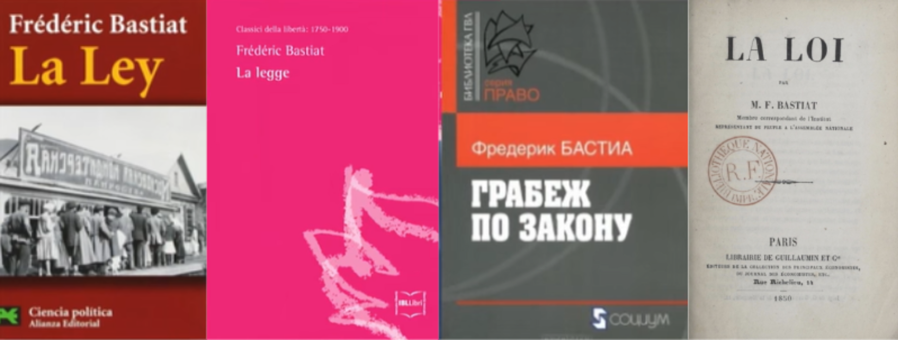
Selgub, et pärast Teist maailmasõda avaldati üks tema raamatuid Ameerika Ühendriikides. See sai väga kuulsaks, nii et Ronald Reagan ise ütles, et see oli tema lemmikraamat, ja see väike raamat on nimelt "Seadus". Seega on Bastiat üks kahest kõige kuulsamast Prantsuse autorist Ameerika Ühendriikides, teine neist on ka Prantsusmaal hästi tuntud, Alexis de Tocqueville.

_(Turg Mugronis Landes'is, Bastiati kodulinn)_

Niisiis, tunnustamata geenius, kuid samas ka meie aegade valgus. Tõepoolest, Frédéric Bastiat, kes sündis Bayonnes, elas esmalt osa oma elust Landes'is, kus ta juhtis päranduseks saadud põllumajandusettevõtet ja elas lõppkokkuvõttes ettevõtjana. Ja siis, väga varakult, hakkas ta majanduse vastu huvi tundma, ta reisis Inglismaale, kohtus Richard Cobdeniga, kes oli vabakaubandusliikumise juht. Bastiat oli selle liikumise poolt vaimustatud, ta oli veendunud, et vabakaubandus on lahendus Prantsusmaale ja otsustas seejärel püüda oma ideid Prantsusmaal levitada. Ta kirjutas artikleid, mis olid väga edukad, ja kolis Pariisi, et juhtida tol ajal Journal des économistes nime kandnud ajalehte.

Ta oli ka filosoof ja ühiskonna, sotsiaalse korra, õigluse, seaduse, õiguste mõtleja. Selles mõttes võime öelda, et Bastiat on meie aegade valgus. Ja ma tahaksin sellega lõpetada. Ta on keegi, kes üritas mõista poliitilise turu toimimist. Loomulikult on ta ka turumajanduse kaitsja, kelle jaoks lõppkokkuvõttes on turumajandus parim viis rikkuse loomiseks. Kuid peale selle, ja siin on ta tunnustamata, mõistis ta poliitilise turu mehhanisme.
Kui ta valiti deputaadiks, oli see Teise Vabariigi ajal, ja alates sellest hetkest olid seaduste tegijateks inimesed. Sel ajal oli Bastiat tunnistajaks seaduste inflatsioonile igas suunas, sealhulgas avalike teenuste, sotsiaalõiguste, maksude jne loomisele.

Ja ta mõistis, et põhimõtteliselt ei olnud midagi tõeliselt muutunud. Inimesed disposeerisid teiste vara üle hääletamise ja seaduse kaudu, mida ta nimetas legaalseks röövimiseks. See legaalse röövimise nähtus oli tema töö keskmes, eriti selles lühitekstis, mille ta kirjutas oma elu lõpus, "Seadus", kus ta võrdleb legaalset röövimist omandiõigusega, omandiõigusega. Ta näitab, et põhimõtteliselt on tõeline lahendus sotsiaalsele probleemile vabadus, see tähendab omand, kontroll iseenda ja oma töö viljade üle.

Selles kursuses rändame koos läbi Frédéric Bastiati mõtte, alustades autorite mõjudest, kes kujundasid teda väga varakult tema nooruses, seejärel vaatame tema majandussofisme ja lõpetame selle suure tekstiga, "Seadus", mis tutvustab meid poliitilise turu analüüsiga, ühiskonna analüüsiga.

## Elu ja ajalooline kontekst

<chapterId>e9d92b63-83dd-552c-84e1-dd535608c109</chapterId>

1844. aastal tegi Frédéric Bastiat ärireisi Hispaaniasse. Pärast peatumist Madridis, Sevillas, Cadizis ja Lissabonis otsustas ta sõita Southamptoni ja külastada Inglismaad. Londonis oli tal võimalus osaleda Anti-Corn Law League'i koosolekutel, mille tööd ta oli jälginud kaugelt. Ta kohtus selle ühenduse peamiste liidritega, sealhulgas Richard Cobdeniga, kes saaks tema sõbraks.

Just seal muutus tema elu radikaalselt. Ta ise jutustab, et just sel hetkel otsustati tema kutsumus kui majandusteadlase oma. Prantsusmaale naastes oli tal ainult üks mõte peas: teha Prantsusmaa teadlikuks Inglismaal liikvel olevast liberaalsest liikumisest.
Frédéric Bastiat sündis 30. juunil 1801 Bayonnes. Üheksa-aastaselt orvuks jäänuna jätkas ta õpinguid Sorèze'i katoliku kolledžis. Ta oli keelte alal andekas, õppides inglise, hispaania ja isegi baski keelt. Siiski ei motiveerinud teda tema õpingud ja ta otsustas mitte sooritada bakalaureuseeksamit, eelistades selle asemel töötada oma onu impordi-ekspordi äris Bayonnes.

1825. aastal päris ta oma vanaisalt põllumajandusliku maa, mida ta haldas oma sõnade kohaselt kui "härrasfarmi". Just siis puutus ta esimest korda kokku probleemidega, mida põhjustas omandiõiguste selge määratluse puudumine. Ta otsustas saada oma kodulinnas Mugronis, Landes'i südames, mis oli kaubanduslik ja jõeline risttee Bordeaux' ja Bayonne'i sadamate vahel, rahukohtunikuks. Hiljem valiti ta Landes'i Üldnõukogu liikmeks.

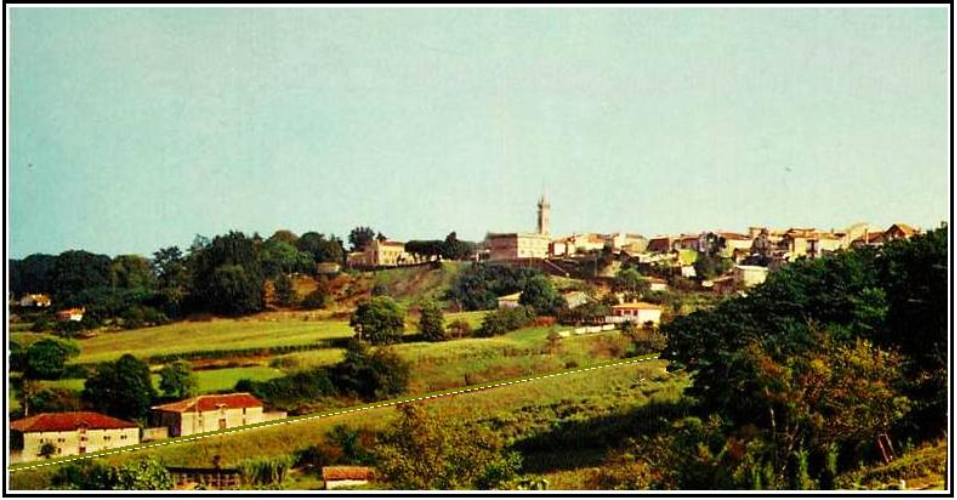

Ta arendas kiiresti kirge poliitilise majanduse vastu ja uuris Adam Smithi, Jean-Baptiste Say, Destutt de Tracy, Charles Dunoyer ja Charles Comte töid. Ta luges inglise ajalehti ja just seal sai ta teada vabakaubanduse inglise liiga olemasolust.

_(Say, Cobden, Smith, Chevalier, Dunoyer, Destutt de Tracy)_

Inglismaalt naasnuna kirjutas ta artikli pealkirjaga: "Inglise ja Prantsuse tariifide mõjust kahe rahva tulevikule", mille ta saatis Pariisi Journal des Économistes'ile. Artikkel ilmus 1844. aasta oktoobri numbris ja see oli täielik edu. Kõik imetlesid tema võimsat ja teravat argumentatsiooni, tema tagasihoidlikku ja elegantset stiili.

Seejärel palus Journal des Économistes temalt rohkem artikleid ja mitmed Poliitilise Majanduse Seltsi liikmed, eriti Horace Say, Jean-Baptiste Say poeg, ja Michel Chevalier, tuntud professor, õnnitlesid teda, julgustades teda jätkama nendega majandustõdede levitamise töös. See tähistas tema uue elu algust Pariisis.

Ta avaldas esimese seeria Majanduslikke Sofisme, milles ta ründas julgelt ja irooniaga protektsioniste. Pariisis alustas ta isegi poliitilise majanduse kursust privaatses ruumis, mida innukalt külastasid üliõpilaste eliit.

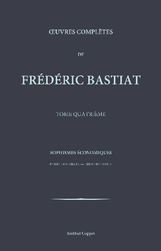

Järgmisel aastal asutas ta Prantsusmaal "Vabakaubanduse Ühingu" ja heitis end võitlusse protektsionismi vastu Prantsusmaal. Ta kogus raha, lõi nädalalehe ja pidas loenguid üle kogu riigi.
Esimese kohtumise toimus Bordeaux's 23. veebruaril 1846, mille käigus asutati Bordeaux Vabakaubanduse Assotsiatsioon. Peagi levis liikumine üle kogu Prantsusmaa. Pariisis moodustus algne tuumik Majandusteadlaste Seltsi liikmete hulgas, millele liitusid deputaadid, töösturid ja kaupmehed. Olulised rühmad moodustusid ka Marseille's, Lyonis ja Le Havre'is. 

Veebruarirevolutsioon 1848 kukutas Louis-Philippe'i monarhia, tuntud kui Juuli Monarhia (1830-1848), ja tõi kaasa Teise Vabariigi. Bastiat valiti seejärel Landes'i deputaadiks seadusandlikku kogusse. Ta istus kesk-vasakul, koos Alexis de Tocqueville'iga, monarhistide ja sotsialistide vahel. Seal püüdis ta kaitsta individuaalseid vabadusi, nagu kodanikuvabadused, ja vastustas kõiki piiravaid poliitikaid, olgu need siis paremalt või vasakult. Ta valiti Rahanduskomitee asepresidendiks ja püüdis pidevalt meenutada oma kaasdeputaatidele seda lihtsat tõde, mis parlamendis sageli unustatakse:

> Seadusega ei saa mõnele anda, ilma et oleks kohustatud teistelt võtma teise seaduse alusel.

Peaaegu kõik tema raamatud ja esseed kirjutati tema elu viimase kuue aasta jooksul, aastatel 1844 kuni 1850. Aastal 1850 kirjutas Bastiat kaks oma kuulsaimat teost: "Seadus" ja esseedeseeria "Mis on nähtav ja mis ei ole nähtav". "Seadus" on tõlgitud paljudesse võõrkeeltesse, sealhulgas inglise, saksa, hispaania, vene ja itaalia keelde.

Ta suri 1850. aastal Roomas tuberkuloosi. Ta on maetud Roomas asuvasse Saint Louis des Français kirikusse.

# Mõjutused

<partId>4d312b17-5740-5d33-8309-015e2b59b6dd</partId>

## Adam Smith ja Jean-Baptiste Say

<chapterId>bcc7a12a-6cc4-5061-85e3-0e31fb1f0a49</chapterId>

Majanduses tunnistas Bastiat alati oma võlga Adam Smithi ja Jean-Baptiste Say ees. 26-aastaselt kirjutas ta ühele oma sõbrale: "Ma pole nendel teemadel lugenud muud kui neid nelja teost, Smith, Say, Destutt ja Censor."

_(Jean-Baptiste Say ja Adam Smith)_
Poliitiline majandus, nagu Adam Smith ja J.-B. Say seda ette kujutasid, on kokku võetav ühe sõnaga: vabadus. Kaubandusvabadus, individuaalne vabadus, vabakaubandus ja vaba initsiatiiv. Vabakaubandust kaitsesid esmalt füsiokraadid, nagu François Quesnay ja Vincent de Gournay, seejärel sünteesis Adam Smith nende ideed oma vaatlustega. Lõpuks, 18. sajandi lõpus, selgitas ja parandas Jean-Baptiste Say oma meistri Adam Smithi doktriini mõningaid punkte oma meisterlikus Poliitilise Majanduse Traktaadis.

_(Say, Destutt de Tracy, Quesnay, de Gournay)_
Adam Smith oli huvitatud jõukusest, mitte iseenesest, vaid kui vahendist üksikisikute moraalseks tõstmiseks. Tema jaoks koosneb rahvaste rikkus üksikisikute rikkusest. Kui soovite jõukat rahvast, ütleb Adam Smith, laske üksikisikutel vabalt tegutseda. Ja turg toimib, sest see võimaldab kõigil oma eelistusi väljendada ja oma huve järgida.

18. sajandi alguse modernsete majandusteadlaste suur uudsus on see, et nad on huvitatud iga üksikisiku tegutsemisvõime taastamisest, mõeldes samal ajal, kuidas ohjeldada kirgi ja konflikte. Inimene soovib loomulikult parandada oma ja oma lähedaste olukorda kaupade ja teenuste vahetamise kaudu.

Mida Adam Smith näitab, on see, et saab teenida ainult oma huve, teenides teiste huve.

> Anna mulle, mida vajan, ja sa saad minult, mida ise vajad. (...) Me ei oota oma õhtusööki lihuniku, õlletootja või pagaripoe heatahtlikkusest, vaid nende oma huvi arvestamisest.

Vahetus on positiivse-summa mäng. Mida üks võidab, võidab ka teine. See erineb poliitilisest ümberjaotamisest, kus on alati võitja ja kaotaja. Kui me kaalume Inglise koolkonda, siis Smithi, Ricardo ja nende eelkäija Locke jaoks on väärtus seotud tööga. Marxile on see sama.

_(Marx, Ricardo, Smith, Locke)_

Teisest küljest tunnistab Bastiat koos Jean-Baptiste Sayga, et kasulikkus on tõeline väärtuse alus. Töö ei loo väärtust. Nappus samuti mitte. Kõik tuleneb kasulikkusest. Tõepoolest, keegi ei nõustu maksma teenuse eest, kui ta ei pea seda kasulikuks. Toodetakse ainult kasulikkust.
Kuid Bastiat täpsustas ka Sayd selles punktis. Asi pole asjade kasulikkuses, vaid teenuste suhtelises kasulikkuses. "Väärtus on kahe vahetatud teenuse suhe," vastavalt tema enda sõnadele. Seega on väärtus subjektiivne ja ainus viis üksikisikute eelistuste mõistmiseks on jälgida nende käitumist vabal turul. Turg paljastab üksikisikute eelistused ja on suurepärane ühiskonna regulaator vahetuse kaudu.

Majandus allub mitmele lihtsale seadusele, mis tulenevad inimkäitumisest. Üks neist, mida nimetatakse "Say seaduseks", on järgmine: "Tooted ja teenused vahetatakse toodete ja teenuste vastu." Tema idee on, et rahvad ja üksikisikud saavad kasu tootmise taseme tõusust, sest see pakub suuremaid võimalusi vastastikku kasulikeks vahetusteks.

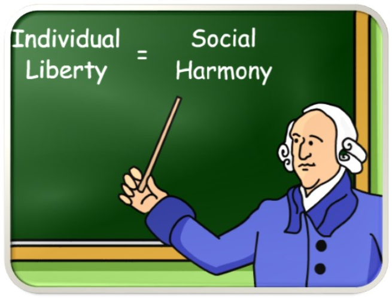

Tõepoolest, tooteid ostetakse ainult oodatavate teenuste eelarvamuses: ma ostan plaadi selleks, et kuulata muusikat, mida kuulan, ma ostan kinopileti filmi jaoks, mida vaatan. Ja vahetuses otsustab iga osapool, sest ta arvab, et saab sellest, mida ta omandab, rohkem teenuseid kui loobub. Selles kontekstis on raha lihtsalt vahendav kaup, see kompenseerib osutatud teenuse ja avab teisi teenuseid.

Bastiat'i jaoks on vahetuste majandus, see tähendab vastastikku vabalt pakutud ja vastu võetud teenuste majandus, see, mis toetab rahu ja jõukust, võimaldades huvide harmooniat.

Kuid Jean-Baptiste Saylt pärib Frédéric Bastiat ka võtmemõiste, nimelt röövimise. Sest, nagu ta ütleb, kajastades Say sõnu:

> On ainult kaks viisi, kuidas hankida elu säilitamiseks, kaunistamiseks ja parandamiseks vajalikke asju: tootmine ja röövimine.
Tootjad kasutavad veenmist, läbirääkimisi ja lepinguid, samal ajal kui röövlid kasutavad jõudu ja pettust. Seega on seaduse ülesanne pärssida röövimist ning kaitsta tööd ja vara. Nagu Adam Smith juba märkis, on kodanike turvalisuse tagamine avaliku võimu peamine missioon ja just see õigustab maksude kogumist.

## Antoine Destutt de Tracy

<chapterId>ddf64e9f-2ce0-5651-8eb8-bae578eb0b9b</chapterId>

Vähe on teada, kuid Destutt de Tracyl oli otsustav mõju tulevasele Ameerika Ühendriikide presidendile Thomas Jeffersonile, kui too oli 1780ndatel Pariisis suursaadik.
> "Iga mehe esimene kodumaa on tema sünnimaa ja teine on Prantsusmaa" & "Türannia on siis, kui rahvas kardab oma valitsust; vabadus on siis, kui valitsus kardab rahvast."
>
> Thomas Jefferson

Tõepoolest, tema poliitilise ökonoomia traktaat mõistis hukka protektsionismi ja Napoleoni laienemise. Seetõttu keelati see Prantsusmaal Bonaparte'i poolt avaldamast. Siiski tõlkis selle inglise keelde ja avaldas Ameerika Ühendriikides Jefferson ise. Ta tegi selle teksti Virginia Ülikooli esimeseks poliitökonoomia õpikuks, mille ta oli just Charlottesville'is asutanud. Traktaati ei avaldatud Prantsusmaal enne 1819. aastat!

Destutt de Tracy, filosoof ja ökonomist, oli nn "Ideoloogide" koolkonna juht, kuhu kuulusid inimesed nagu Cabanis, Condorcet, Constant, Daunou, Say ja Germaine de Staël. Nad on Füsiokraatide pärijad ja Turgot' otsesed õpilased.

Ideoloogia all mõtles Tracy lihtsalt teadust, mis tegeleb ideede uurimisega, nende päritolu, seaduste, keelega seotusega, ehk tänapäeva terminites, epistemoloogiaga. Terminil "ideoloogia" ei olnud veel pejoratiivset tähendust, mille Marx hiljem andis, et diskrediteerida "laissez-faire" ökonomiste. Ideoloogide liikumise ajakiri oli nimetatud La Décade philosophique et littéraire.

See domineeris revolutsioonilisel perioodil ja seda juhtis Jean-Baptiste Say. Destutt de Tracy valiti Prantsuse Akadeemia liikmeks 1808. aastal ja Moraali- ja Poliitikateaduste Akadeemia liikmeks 1832. aastal. Tema tütar abiellus 1802. aastal Georges Washington de La Fayette'iga (esimese Ameerika presidendi poeg), mis näitab endiselt tihedat lähedust, mis sel ajal Prantsusmaa ja noore Ameerika vahel eksisteeris.

Tema "Poliitilise Ökonoomia Traktaadi" eesmärk on "uurida parimat viisi, kuidas kasutada kõiki meie füüsilisi ja intellektuaalseid võimeid meie erinevate vajaduste rahuldamiseks." Tema idee on, et kaubandus on kõigi inimhüvede allikas; see on tsiviliseeriv, ratsionaliseeriv ja rahustav jõud maailmas. Poliitilise ökonoomia suurim põhimõte on tema poolt sõnastatud järgmiselt: "kaubandus on kogu ühiskond, samuti nagu töö on kogu rikkus." Tõepoolest, ta näeb ühiskonda kui "pidevat vahetuste seeriat, milles mõlemad lepingupooled alati võidavad." Seega on turg vastand röövimisele. See rikastab mõningaid ilma teisi vaesustamata. Nagu hiljem öeldakse, ei ole see "nullsummamäng", vaid positiivse summaga mäng.

Meie autor ei lähe nii kaugele, et defineerida poliitilist ökonoomiat kui vahetuste teadust. Kuid sama põhjendust võetakse üles ja viiakse läbi Bastiati poolt. Müümine on objektide vahetus, rentimine on teenuste vahetus ja laenamine on lihtsalt edasilükatud vahetus. Poliitiline ökonoomia muutub Bastiati jaoks "vahetuste teooriaks".

Destutt de Tracy sõnul tuleneb omand paratamatult meie olemusest, meie soovide võimest. Kui inimene ei sooviks midagi, ei oleks tal ei õigusi ega kohustusi. Oma vajaduste rahuldamiseks ja kohustuste täitmiseks peab inimene kasutama vahendeid, mille ta omandab oma tööga. Ja sotsiaalse korralduse vorm, mis vastab sellele eesmärgile, on eraomand. Seetõttu on valitsuse ainus eesmärk kaitsta omandit ja võimaldada rahumeelset vahetust.

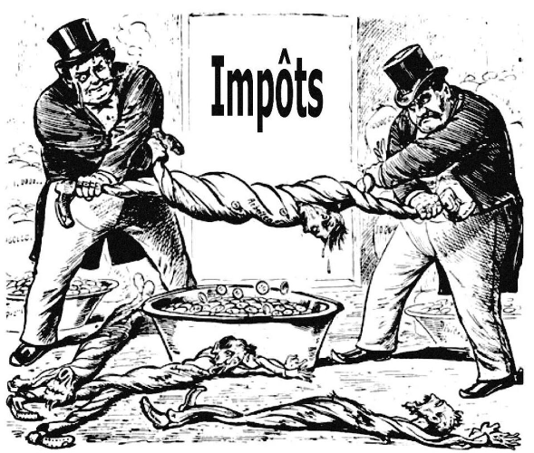

Tema jaoks on parimad maksud kõige mõõdukamad maksud, ja ta soovib, et riigi kulutused oleksid võimalikult piiratud. Ta mõistab hukka ühiskonna rikkuse riigi poolt röövimise avaliku võla, maksude, pangamonopolide ja kulutuste kujul. Jällegi peaks seadus ainult kaitsma vabadust; see ei tohiks kunagi röövida.

Lõpuks lisab ta selle soovituse, mis ei ole kaotanud oma asjakohasust:

> Las valitsus ei tee ega saa teha võlgu, mis seovad tulevasi põlvkondi ja viivad alati riigid nende hukatusse.

Kokkuvõttes oli Ideoloogidel sügav intuitiivne arusaam, nimelt et tootmine ja vahetused on poliitiliste probleemide tegelik lahendus ja tõeline alternatiiv sõdadele. Sõjad on alati röövellikud, olgu need siis sisemised, nagu Revolutsiooni ajal, või välised, nagu need, mida pidasid vanad kuningad ja Napoleon.

## Charles Comte ja Charles Dunoyer

<chapterId>80bc5c4e-ac07-52c8-9dd7-e224ac291bda</chapterId>

Kõigi tsivilisatsioonide ajalugu on võitluse lugu röövivate klasside ja tootvate klasside vahel. See on kahe autori, keda me arutame, usutunnistus. Nad on liberaalse klassivõitluse teooria algatajad, mis inspireeris nii Frédéric Bastiati kui ka Karl Marxi, kuigi viimane seda moonutas.

Comte'i ja Dunoyer'i jaoks on röövimine, mis tähendab kõiki ühiskonnas tugevate poolt nõrkade üle teostatavaid vägivallavorme, suur võti inimajaloo mõistmiseks. See on kõigi nähtuste, kus üht klassi ekspluateeritakse teise poolt, algus.

Kui Frédéric Bastiat võlgneb oma majandushariduse Smithile, Destutt de Tracy'le ja Say'le, siis oma poliitilise hariduse on ta saanud ajakirja Le Censeur juhtidelt, Charles Comtelt ja Charles Dunoyer'lt.
See ülevaade (1814-1819), mis pärast Saja Päeva sündmusi nimetati ümber Le Censeur européen'iks, levitas liberaalseid ideid, mis saavutasid võidu 1830. aastal Kolme Hiilgava Päeva ülestõusu ja Orléans' hertsogi, Louis-Philippe I võimuletõusuga.

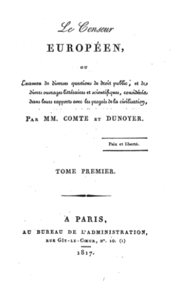

Charles Comte, Auguste Comte'i nõbu ja Say väimees, on ülevaate asutaja. Peagi liitus temaga Charles Dunoyer, samuti jurist, ja seejärel noor ajaloolane, Augustin Thierry, endine Saint Simoni sekretär. Nende motoks iga ajakirja numbris oli "Rahu ja Vabadus".

Mis on ülevaate eesmärk? Pealkiri räägib enda eest: valitsuse tsenseerimine. Võidelda võimu meelevaldsuse vastu, valgustades avalikku arvamust, kaitsta pressivabadust.

_(Benjamin Constant)_

Nad võtavad Benjamin Constantilt üle eristuse Antiiksete ja Modernsete vahel, mida iseloomustab ühelt poolt sõda ja teiselt poolt kaubandus ja tööstus. Kuid nad lisavad Say'ga, et poliitiline majandus annab parima seletuse sotsiaalsetele nähtustele. Nad mõistavad eriti, et rahvad saavutavad rahu ja jõukuse, kui austatakse omandiõigusi ja vaba kaubandust. Nüüdsest on nende jaoks poliitiline majandus tõeline ja ainus poliitika alus. Filosoofiale, mis piirdub valitsusvormide abstraktse kriitikaga, tuleb asendada teooriaga, mis põhineb majandushuvide tundmisel.
Poliitiline majandus, demonstreerides, kuidas rahvad õitsevad ja allakäivad, on rajanud tõelised poliitika alused.
> Dunoyer

See uus sotsiaalteooria sisaldab üht elementi, mis saaks Marx'i ja Engels'i teadusliku sotsialismi nurgakiviks: klassivõitlus. Kuid milles seisneb liberaalse klassivõitluse teooria ja kuidas see erineb marksismist?

See algab üksikisikust, kes tegutseb oma vajaduste ja soovide rahuldamiseks. Hetkest, mil keegi loob, st suurendab asjade kasulikkust, tõstes nende väärtust, osaleb ta tööstuses. Siin ei ole tööstur mitte tööstuse omanik, nagu praegune keelekasutus võib viidata, vaid tootja, sõltumata valdkonnast, milles ta töötab. Seetõttu nimetatakse nende teooriat industrialismiks. See väidab, et ühiskonna eesmärk on kasulikkuse loomine laias mõttes, st inimestele kasulikud kaubad ja teenused.

Sel punktil seisavad üksikisikud silmitsi kahe fundamentaalse alternatiiviga: nad võivad rüüstata teiste poolt toodetud rikkust või nad võivad töötada, et ise rikkust toota. Igas ühiskonnas saab selgelt eristada neid, kes elavad rüüstamisest, ja neid, kes elavad tootmisest. Ancien Régime'i ajal ründas aadel otse kõige töökamaid, et elada uut tüüpi tribuudist: maksust. Ahnust aadlit asendasid hordid bürokraate, mitte vähem ahneid.

Kuigi Marxile on klassivastuolu paiknenud tootmistegevuses endas, töötajate ja tööandjate vahel, siis Comte'i ja Dunoyer'i jaoks on vastandlikud klassid ühelt poolt ühiskonna tootjad, kes maksavad makse (kaasa arvatud kapitalistid, töölised, talupojad, teadlased jne) ja teiselt poolt mittetootjad, kes elavad maksudest finantseeritud rentidest, "jõude ja neelava klass" (bürokraadid, ametnikud, poliitikud, toetuste või kaitsemeetmete saajad).
Seejärel, erinevalt Marxist, ei propageeri Censeur Européen'i autorid klassivõitlust. Selle asemel nad kampaania sotsiaalse rahu eest. Ja see, nende sõnul, on võimalik ainult ühiskonna depolitiseerimise kaudu. Selleks on oluline esmalt vähendada avalike ametite prestiiži ja hüvesid. Seejärel on oluline anda tootjatele mõju poliitilises kehas.

Lõpuks, ainus viis maailmast ühe klassi ekspluateerimise kaotamiseks teise poolt on hävitada mehhanism, mis teeb selle ekspluateerimise võimalikuks: riigi võim jaotada ja kontrollida vara ning sellega seotud hüvede jaotust (nn "positsioonid").

Nende ideed, sügavalt uuenduslikud, jätaksid igaveseks jälje Frédéric Bastiat'le, kes ise saaks sügavaks mõtlejaks poliitiliste kriiside üle.

## Cobden ja Liiga

<chapterId>7181435c-5eae-56e4-8e55-02a24273fdd6</chapterId>

On 1838. aasta Manchesteris, kus väike hulk seni vähetuntud mehi koguneb, et leida viis nisuomanike monopoli ümberpööramiseks seaduslike vahenditega ja saavutada, nagu Bastiat hiljem kirjeldaks,

> Ilma vereta, ainult arvamuse jõul, revolutsioon sama sügav, võib-olla sügavam kui see, mille meie isad teostasid 1789. aastal.

Sellest kohtumisest tekiks Liiga teraviljaseaduste vastu või, nagu Bastiat neid nimetaks, teraviljaseadused. Kuid väga kiiresti saaks sellest eesmärk teraviljaseaduste täielik ja ühepoolne kaotamine.

See majanduslik võitlus vabakaubanduse eest hõivaks kogu Inglismaa kuni 1846. aastani. Prantsusmaal, välja arvatud väike hulk asjatundjaid, oli selle laia liikumise olemasolu täiesti tundmatu. Inglise ajalehest, millele ta oli juhuslikult tellinud, sai Frédéric Bastiat teada Liiga olemasolust 1843. aastal. Vaimustunud, tõlkis ta Cobdeni, Foxi ja Brighti kõnesid. Seejärel suhtles ta Cobdeniga ja lõpuks, 1845. aastal, läks ta Londonisse, et osaleda Liiga tohututel koosolekutel.

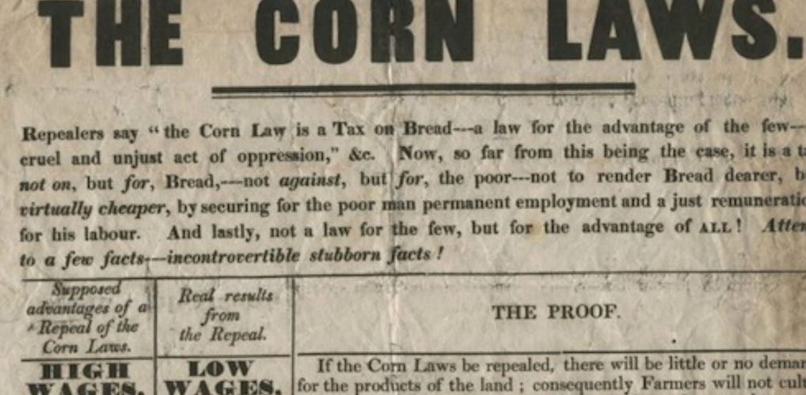

See vabakaubanduse eest agiteerimise kampaania kogu kuningriigis, kümnete tuhandete liikmetega, süütas Bastiati sule ja muutis radikaalselt ja lõplikult tema elu kulgu.

Liigat võib võrrelda rändava ülikooliga, mis haris majanduslikult neid, kes osalesid selle koosolekutel üle riigi - tavalised inimesed, töösturid, haritlased ja põllumehed, keda kõiki Liiga oma tiiva alla võttis ja kelle huve teraviljaseadused rõhusid. Richard Cobden oli liikumise hing ja silmapaistev agitaator.
Võluv ja võimas kõneleja, tal oli erakordne anne luua löövaid ja lühikesi väljendeid, mis olid kaugel majandusteadlaste abstraktsetest diskursustest.
> Mis on leiva monopol? hüüatas ta. See on leiva nappus. Teid üllatab teada saada, et selle riigi seadusandlus selles küsimuses ei taotle muud, kui toota võimalikult suurt leiva nappust. Ja ometi on see nii. Seadusandlus saab oma eesmärki saavutada ainult nappuse kaudu.

1845. aastal avaldas Bastiat Pariisis oma raamatu Cobden ja Liiga, oma tõlgetega, millele lisas kommentaare. Raamat algab sissejuhatusega Inglismaa majandusolukorrast, Liiga tekke ja arengu ajaloost. Alates 1815. aastast oli Inglismaal väga arenenud protektsionism. Eelkõige oli olemas seadusi, mis piirasid teravilja importi ja millel olid rahva jaoks väga rängad tagajärjed. Tõepoolest, nisu oli vajalik leiva valmistamiseks, mis oli tol ajal elutähtis kaup. Lisaks soosis see süsteem aristokraatiat, st suurmaaomanikke, kes sellest renti said.

> Mis Inglismaal kaasneb, kirjutas Bastiat, on väike arv röövleid ja suur hulk röövitavaid, ning selleks, et järeldada esimeste jõukust ja viimaste viletsust, ei pea olema suur majandusteadlane.

Liiga eesmärk oli mobiliseerida avalikku arvamust, et avaldada parlamendile survet teraviljaseaduse tühistamiseks. Pikemas perspektiivis lootsid Cobden ja tema sõbrad:

- Suurendada tööstuslikke väljundeid
- Suurendada tööhõivet
- Vähendada leiva hinda
- Muuta põllumajandus ja tööstus konkurentsi kaudu tõhusamaks
- Edendada rahu rahvaste seas

_(Jeremy Bentham)_

Benthami utilitarismi jüngerina oli Cobdeni veendumus, et töö ja kaubanduse vabadus teenis otseselt kõige arvukamate, vaeseimate ja kõige enam kannatavate ühiskonnakihtide huve. Vastupidi, toll kui suvaliste keeldude ja privileegide instrument võis kasu tuua ainult teatud kõige võimsamatele tööstustele.

1841. aasta valimistel valiti liiga viis liiget, sealhulgas Cobden, parlamenti. 26. mail 1846 sai ühepoolsest vabakaubandusest kuningriigi seadus. Sellest ajast alates kogeks Ühendkuningriik vabaduse ja jõukuse hiilgavat perioodi.
Huvitav on see, et Bastiat omastas osa nende meetodist; ta omandas nende keele ja kohandas selle Prantsuse konteksti. Raamat Cobdenist ja Liigast sai kiiresti edukaks ja Bastiat tegi majandusteadlaste maailmas sensatsioonilise sisenemise. Ta asutas Bordeaux's vabakaubanduse pooldajate ühenduse ja kolis seejärel selle Pariisi. Talle pakuti Journal des Économistes juhi kohta. Liikumine oli sündinud ja see jätkus kuni 1848. aastani.

Alles pärast Bastiati surma, 1866. aastal, allkirjastaks Napoleon III Inglismaaga vabakaubanduslepingu, omamoodi järelhüve mehele, kes oli pühendanud oma lühikese elu viimased kuus aastat sellele suurele ideele.

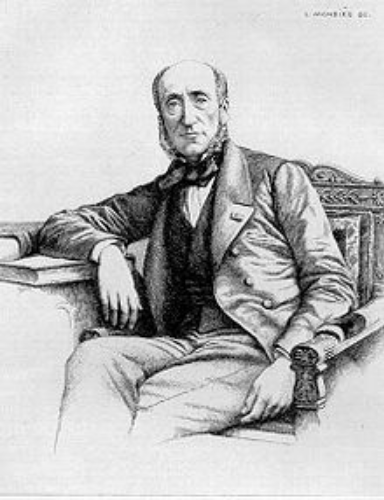

_(Michel Chevalier)_
Vaba kaubanduse küsimus on tänapäeval endiselt aktuaalne. Koolide geograafiaõpikud väidavad, et globaliseerumine on süüdi ja et vaesed riigid vajavad lääne abi, et hakkama saada. Ometi on äärmuslik vaesus 20 aasta jooksul poole võrra vähenenud. Avatuse valimisega on riigid nagu India, Hiina või Taiwan suutnud vaesusest välja tulla, samal ajal kui stagnatsioon iseloomustab suletud riike nagu Põhja-Korea või Venezuela. ÜRO andmetel elas 1990. aastal täielikus viletsuses 36% inimkonnast. 2010. aastal on neid "ainult" 18%. Äärmuslik vaesus on endiselt suur väljakutse, kuid see on taandumas.

# Vastased

<partId>f902ed30-269e-5e44-a76d-8efd1a4e4085</partId>

## Rousseau

<chapterId>c3926110-e0b2-503c-96d9-5d3a6a661484</chapterId>

Frédéric Bastiat, kes väljendas ennast 1840. aastatel, on valgustusfilosoofide põlvkonna pärija, kes võitles tsensuuri vastu ja aruteluvabaduse eest. Mõelge Montesquieu'st, Diderot'st, Voltaire'ist, Condorcet'st, aga ka Rousseau'st.

Nende jaoks oli idee lihtne: mida rohkem lubatakse ideid väljendada, seda rohkem edeneb tõde ja seda kergemini lükatakse ümber vead. Teadus areneb alati sel viisil.

_(Montesquieu, Diderot, Voltaire, Condorcet, Rousseau)_
Vastupidi, vähesed on mõistnud, et see, mis kehtis ideede kohta, kehtis ka kaupade ja teenuste kohta. Teistega kauplemise vabadusel on tõepoolest kaks voorust: see on tõhus ja viib õiglasema jaotuseni. Mitte ainult ei mõistnud Rousseau seda, vaid ta võitles ka selle vabaduse vastu vale õiguse ja õigluse idee nimel. Üks sotsialismi peamisi allikaid, märgib Bastiat, on Rousseau arvamus, et kogu sotsiaalne kord tuleneb seadusest.

Bastiat peab Rousseau'd tõeliseks sotsialismi ja kollektivismi eelkäijaks. "Ühiskondliku lepingu" autorist on fraas, mis kokkuvõtlikult väljendab tema filosoofiat: "me hakkame saama inimesteks alles pärast kodanikeks saamist."

Algselt on inimene lihtsalt kodanik. Kuid kodanik on arvutaja; ta tahab oma kohest naudingut, ta on orjastatud oma meeltele, oma soovidele, oma erihuvi. Lühidalt, ta ei ole ratsionaalne, seega ta ei ole vaba. Teda on vaja harida, et mõista, et tema tõeline huvi on üldine huvi. Sellepärast kirjutas Rousseau "Ühiskondlikus lepingus":

> Kes iganes keeldub üldise tahte kuuletumisest, sunnitakse kogu keha poolt: see tähendab midagi muud, kui et neid sunnitakse olema vabad.

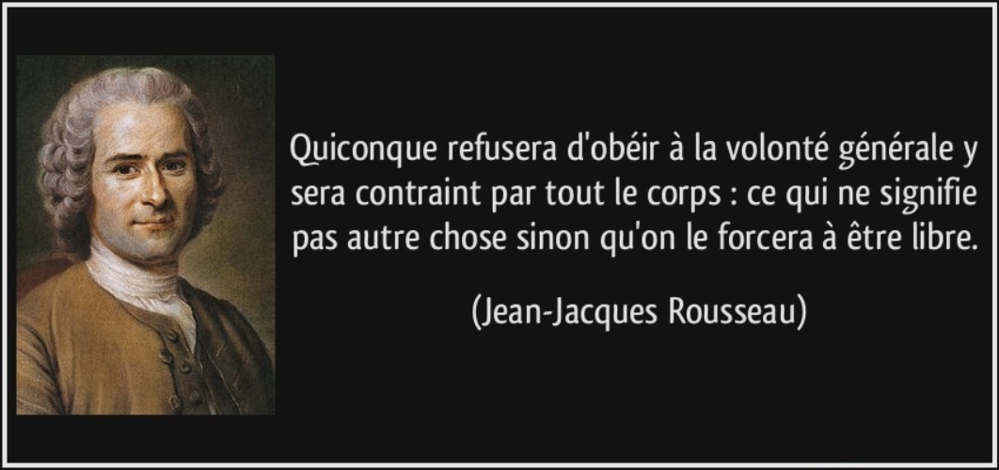

Selle doktriini kohaselt on inimesel endas kaks tahet: tahe, mis kaldub isikliku huvi poole, see on kodaniku oma, ja tahe, mis kaldub üldise huvi poole, see on kodaniku oma. Inimesi isegi jõuga suunata soovima ratsionaalset lõppu, üldist huvi, on viia inimesed vabaduseni. Mida nad tõeliselt tahavad, on ratsionaalne lõpp, isegi kui nad seda ei tea.
Seega on Rousseau järgi täiesti legitiimne sundida inimesi nimel, mida nad ise, olles valgustatumad, oleksid taotlenud, kuid mida nad ei taotle, kuna on pimedad, teadmatud või korrumpeerunud. Ühiskond on loodud selleks, et sundida neid tegema seda, mida nad peaksid spontaanselt soovima, kui nad oleksid valgustatud. Ja seda tehes ei tehta neile vägivalda, kuna viiakse nad olema "vabad", st tegema õigeid valikuid, valikuid, mis on kooskõlas nende tõelise minaga.

Veendunud, et hea ühiskond on seaduse loomine, annab Rousseau seega seadusandjale piiramatu võimu. Tema ülesanne on muuta üksikisikud täiuslikeks meesteks, kodanikeks.
Kuid, seadus peab ka omandi eksistentsi võimaldama. Rousseau sõnul saab omand olla legitiimne ainult siis, kui seda reguleerib seadusandja. Tõepoolest, kurjus peitub ebavõrdsuses ja orjuses, mis mõlemad tulenevad omandist. See on tugevate leiutis, mis on viinud halva ühiskonna, buržuaa ühiskonna, domineerimissuhete juurde. Oma teoses "Arutlus ebavõrdsuse päritolust ja alustest" kirjutab ta selle kuulsa lõigu:

> Esimene inimene, kes piiras tüki maad ja ütles: See on minu oma, ning leidis inimesi, kes olid piisavalt lihtsameelsed, et teda uskuda, oli tsiviilühiskonna tõeline rajaja. Kui palju kuritegusid, sõdu, mõrvu, kui palju õnnetust ja õudust oleks inimkonnale säästetud selle poolt, kes, tõmmates välja vaiad või täites kraavi, oleks hüüdnud oma kaaslastele: "Olge ettevaatlikud, ärge kuulake seda petist; te olete hukas, kui unustate, et viljad kuuluvad kõigile ja maa kuulub mitte kellelegi!"

Seega on loomulik omand kurjuse allikas. Ja Marx, kes oli Rousseau suur lugeja, mäletaks seda. Kuidas seda kurjust võidelda? Sotsiaalse lepingu kaudu, vastab Rousseau. Tõepoolest, hea ühiskond on see, mis tuleneb lepingust, mis näeb ette üksikisiku kõigi tema õiguste võõrandamise kogukonnale. Sealt edasi on kogukonna ülesanne anda üksikisikule õigusi seaduse kaudu.

Erinevalt Rousseau'st ütleb Frédéric Bastiat, et "inimene sünnib omandiomanikuna". Tema jaoks on omand inimese olemuse, tema konstitutsiooni vältimatu tagajärg. Ta kirjutab, et "inimene sünnib omandiomanikuna, sest ta sünnib vajadustega, mille rahuldamine on eluks hädavajalik, organite ja võimetega, mille kasutamine on nende vajaduste rahuldamiseks hädavajalik". Kuid võimed on ainult isiku laiendus ja omand on ainult võimete laiendus. Teisisõnu, see on meie võimete kasutamine töös, mis legitimeerib omandi.

Bastiat'i sõnul eksisteerivad ühiskond, inimesed ja varad enne seadusi, ja tal on see kuulus fraas: "Ei ole nii, et seaduste olemasolu tõttu on omand, vaid seetõttu, et on omand, on olemas seadused". Seetõttu peab seadus olema negatiivne: see peab takistama tungimist inimestele ja nende varadele. Omand on seaduse raison d'être, mitte vastupidi.

## Klassikaline haridus

<chapterId>87d9a8c9-2352-5cb2-8b93-678118a8145c</chapterId>

24. veebruaril 1848, pärast kolme päeva kestnud rahutusi Pariisis, loobus kuningas Louis-Philippe I võimust. See tähistas Teise Vabariigi sündi.

Bastiat oli Pariisis, olles sündmuste tunnistajaks. Hiljem kirjutaks ta:

> 24. veebruaril, nagu paljud teisedki, kartsin, et rahvas ei ole valmis iseennast valitsema. Pean tunnistama, et kartsin Kreeka ja Rooma ideede mõju, mis on meile kõigile akadeemilise monopoli poolt peale surutud.

See lõik on üllatav. Mis pistmist on Kreeka ja Rooma antiigil sellega?

Bastiat viitab Platoni "Riigile" ja tema filosoof-kuninga teooriale, aga ka Sparta'le, mida Rousseau nii imetles, Rooma impeeriumile, mille järele Napoleon nii nostalgiline oli. Kahjuks, Bastiati sõnul, põhinevad need Kreeka ja Rooma ideed valel eeldusel: seadusandja kõikvõimsuse ideel, seaduse absoluutsest suveräänsusest.

Piisab peaaegu iga filosoofia, poliitika või ajaloo raamatu suvalisest kohast avamisest, et leida see idee, mis on meie kultuuris juurdunud, et inimkond on inertne aine, mis saab elu, korralduse, moraali ja heaolu poliitilisest võimust. Jäetuna oma seadmetele, kaldub inimkond anarhia poole ja päästetakse sellest katastroofist ainult seadusandja müstilise ja kõikvõimsa käe poolt. Siiski, Bastiat ütleb, et see idee on saanud pikka aega küpseda ja valmistuda sajandite klassikalise hariduse poolt.

Esiteks, ütleb ta, pidasid roomlased omandit puhtalt konventsionaalseks faktiks, kirjutatud seaduse kunstlikuks loominguks. Miks? Lihtsalt, Bastiat selgitab, sest nad elasid orjusest ja röövimisest. Nende jaoks olid kõik varad röövimise viljad. Seetõttu ei saanud nad seadusandlusse tuua ideed, et legitiimse omandi aluseks on töö, ilma et nad hävitaksid oma ühiskonna alused.
Neil oli tõepoolest empiiriline omandi definitsioon, "jus utendi et abutendi" (õigus kasutada ja kuritarvitada). Siiski puudutas see definitsioon ainult tagajärgi, mitte põhjuseid, teisisõnu, omandi eetilisi algpõhjuseid. Omandi õigesti kehtestamiseks tuleb minna tagasi inimese väga konstitutsiooni juurde ja mõista vajaduste, võimete, töö ja omandi vahelist suhet ja vajalikku seost. Roomlased, kes olid orjaomanikud, kas nad võisid mõelda ideele, et "iga mees omab iseennast ja seega oma tööd ning sellest tulenevalt oma töö vilju"? Bastiat imestab.

> Seetõttu, Bastiat järeldab, ärme ole üllatunud, kui näeme Rooma ideed, et omand on konventsionaalne fakt ja seaduslik institutsioon, taasilmumas kaheksateistkümnendal sajandil; et, kaugel sellest, et Seadus oleks Omandi korollaar, on Omand hoopis Seaduse korollaar.

Tõepoolest, Rousseau jagab seda ühist õiguslikku ideed, mis põhineb omandil seadusel. Rousseau omistab seadusele ja seeläbi rahvale absoluutse võimu üksikisikute ja varade üle.

Ja selles kontseptsioonis, mis moodustab vabariigi väga idee alates Prantsuse revolutsioonist, peab seadusandja korraldama ühiskonda, nagu sotsiaalne arhitekt, nagu mehaanik, kes leiutab masina inertsest ainest, või nagu potissepp, kes vormib savi. Seadusandja asetab end seega inimkonnast väljapoole, selle kohale, et seda oma tahtmist mööda korraldada, vastavalt plaanidele, mida on kujundanud tema valgustatud intelligents.

Vastupidi, Bastiati jaoks on omandiõigus seadusest eespool. See on see, mida ta nimetab majandusteadlaste põhimõtteks, vastandina juristide põhimõttele. Kui "juristide põhimõte sisaldab sisuliselt orjastamist," ütleb Bastiat, "siis majandusteadlaste oma sisaldab vabadust.
Mis siis on vabadus? See on omand, õigus nautida oma töö vilju, õigus töötada, areneda, kasutada oma võimeid, nagu ise sobivaks peetakse, ilma et riik sekkub muul viisil kui oma kaitsetegevuse kaudu.

On kurb mõelda, et meie sotsiaalne ja poliitiline filosoofia on jäänud kinni ideesse, et kõigi meie probleemide lahendus pidi tulema ülalt, seadusest, riigist. Kuid see on seletatav. Neid ideid süstitakse noortele iga päev koolides ja ülikoolides, hariduse monopoliga.

Siiski, nagu Bastiat meile meenutab, monopol välistab progressi.

## Protektsionism ja sotsialism
<chapterId>ce6cb8a8-7dc9-5ef7-939d-9a559b4d2c74</chapterId>

_(Richard Cobden)_

Nagu me juba nägime, oli see eelkõige Cobdeni võitlus protektsionismi vastu Inglise liigas maisiseaduste kaotamise nimel, mis ajendas Bastiati artikleid kirjutama ja seejärel raamatuid.

Protektsionism on tegelikult majandusliku rahvusluse vorm. Selle eesmärk on kõrvaldada väliskonkurents, teeseldes, et "kaitstakse rahvuslikke huve". Seejärel üritavad nad saada avaliku võimu nõusoleku puhtalt demagoogiliste valede kogumile, mida esitatakse vooruslikena: töökohtade kaitse, konkurentsivõime jne. Loomulikult alluvad valitud ametnikud tootjate survele, sest see on neile suurepärane võimalus oma klientuuri konsolideerida ja võimu laiendada.

Töökohtade kaitsmise argument on see, mida Bastiat nimetab eksituseks. Sest tegelikkuses on see võrdne maksuga. Sellel on toodete kallinemise mõju. Võtame näite, mille Bastiat ise andis.

Kujutage ette inglise nuga, mis meie riigis müüakse 2 euro eest, ja Prantsusmaal valmistatud nuga maksab 3. Kui me lubame tarbijal vabalt osta nuga, mida ta soovib, säästab ta franki, mille ta saab investeerida mujale (raamatusse või pliiatsisse).

Kui me keelame inglise toote, maksab tarbija oma noa eest ühe frangi rohkem. Protektsionism toob seega kasu rahvuslikule tööstusele ja kaks kahju, ühe teisele tööstusele (pliiatsitele) ja teise tarbijale. Vastupidi, vabakaubandus teeb kaks õnnelikku võitjat.

Protektsionism on samuti klassivõitluse vorm. Bastiati sõnul on see süsteem, mis põhineb tootjate isekusel ja ahnusel. Oma tasu suurendamiseks nõuavad põllumehed või töösturid makse, et sulgeda turg välismaistele toodetele, sundides seeläbi tarbijaid oma toodete eest rohkem maksma.

Bastiat seisab kindlalt tarbijate poolel. Klassihuvi vastu seab ta üldise huvi, mis on tarbija huvi, st kõigi huvi. Riik peaks alati tegutsema tarbija vaatepunktist.
Veebruaris 1848 toimunud revolutsioon ja selle barrikaadid tõid esile ohtlikuma vaenlase kui protektsionism, millega tal on palju ühist: sotsialism. Mis see on? See on poliitiline liikumine, mis nõuab töö korraldamist seadusega, tööstuste ja pankade rahvastamist ning varade ümberjaotamist maksustamise kaudu. Bastiat pühendaks nüüd kogu oma energia, talendi ja kirjutised selle uue doktriini vastu, mis võiks viia ainult võimu eksponentsiaalse kasvu ja igavese klassivõitluseni. Seega, revolutsiooni esimestest päevadest alates panustas ta lühiajalisse ajalehte nimega "La République Française", mis sai kiiresti tuntuks kui kontrrevolutsiooniline ajakiri. See oli aeg, mil ta kirjutas oma pamflette omandiõiguse, riigi, röövimise ja seaduse teemal.
27. juunil 1848, päev pärast verist uut ülestõusu Pariisis, kirjutas ta pikas kirjas Richard Cobdenile, arutledes sündmuste võimalike põhjuste üle.

- 1° Esimene neist põhjustest on majanduslik teadmatus. Just see valmistab meeli ette sotsialismi ja vale vabariikluse utoopiate omaksvõtuks. Viitan eelmisele videole klassikalise ja ülikoolihariduse suundumuste kohta selles punktis.

- 2° Rahvas armus mõttesse, et vendlust ja solidaarsust saab seadusse viia. See tähendab, et riigilt nõuti otsest õnne loomist oma kodanikele. Siin näeb Bastiat heaoluriigi algust.

Ja ta jätkaks selle perverssete mõjude analüüsimist edaspidi. Siin on üks näide, mida tsiteeritakse kirjas Cobdenile:

> Inimhinge loomulike kalduvuste tõttu hakkas igaüks riigilt nõudma endale suuremat heaolu osa. See tähendab, et riik või avalik kassa pandi rüüstamisele. Kõik klassid nõudsid riigilt justkui õigusega eksistentsi vahendeid. Riigi selles suunas tehtud pingutused viisid ainult maksude ja takistuste suurenemiseni ning vaesuse kasvuni.

- 3° Bastiat lisab, et tema arvates oli protektsionism selle häire esimene ilming. Kapitalistid alustasid seaduse sekkumise nõudmisega, et suurendada oma varanduse osa. Paratamatult tahtsid töölised teha sama.

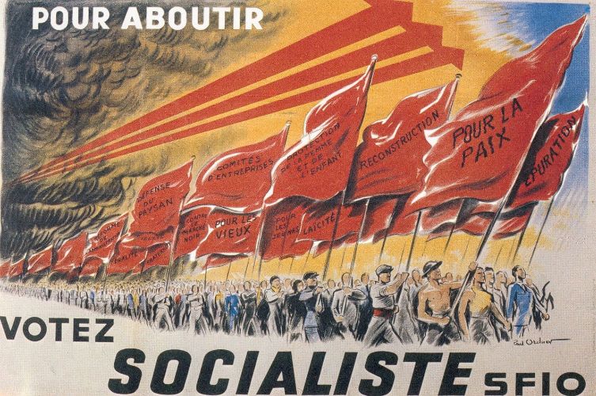
Kokkuvõtteks, Bastiati sõnul jagavad protektsionistid ja sotsialistid ühist punkti: mida nad seaduselt otsivad, ei ole mitte kõigi vaba tegevusvõime tagamine ja nende pingutuste õiglane tasustamine, vaid pigem ühe kodanike klassi rohkem või vähem täielik ärakasutamine teise poolt. Protektsionismi korral on vähemus see, kes ärakasutab enamust. Sotsialismi puhul on enamik see, kes ärakasutab vähemust. Mõlemal juhul on õiglus rikutud ja üldine huvi on ohus. Bastiat seab need üksteise vastu.

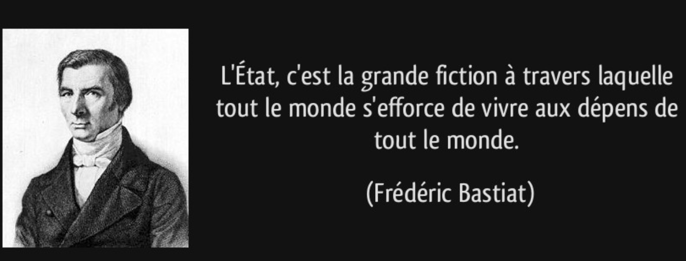

## Proudhon

<chapterId>96902abd-6915-5b25-a187-a4790162b86c</chapterId>

Pierre-Joseph Proudhon on üks 19. sajandi keskpaiga Prantsuse sotsialismi peamisi esindajaid. Ta on eriti kuulus oma väitega: "Omand on vargus" teoses "Mis on omand?" aastal 1840.

Selles väites on midagi loogiliselt absurdset. Kui õiguspäraselt omandatud vara ei eksisteeriks, ei saaks loogiliselt olla ka sellist tegu nagu vargus. Seetõttu täpsustas Proudhon hiljem, et tema jaoks on varguseks tegelik varade jaotus, mitte vara iseenesest, mida ta kirjeldab kui revolutsioonilist jõudu, mis on anarhistliku ühiskonna aluseks.

Kuid Proudhon on individualistlik anarhist. Ta ei pea proletariaati ega riiki legitiimseteks võimuallikateks. Ta kritiseerib teravalt kommunismi ja pooldab töötajate vastastikuse abi vormi, struktureeritud kooperatiivset solidaarsust, mis tugineks vabatahtlikule ressursside ühendamisele vastastikuseks abiks. Vähem tuntud on aga asjaolu, et Bastiat ei olnud selle idee vastu põhimõtteliselt. Ta lihtsalt kartis, et riik muudab selle de facto monopolistlikuks avalikuks teenuseks. Ajalugu tõestas teda õigeks.

Teisest küljest on hästi teada, et "Filosoofia vaesuses" ründas Marx vägivaldselt Proudhoni ja tema sotsialismi, mida ta nimetas "utoopiliseks", eelistades nn "teaduslikku" sotsialismi.

Juunis 1848 valiti Proudhon koos Bastiat'ga Rahvusassambleesse. Nad olid tuttavad ja pidasid teineteist suures lugupidamises. Siiski, 1849. aastal, kõmulises vaidluses, vahetas Bastiat temaga La Voix du Peuple veergudel neliteist kirja. Selles energilises vahetuses selgitas ta oma seisukohta raha- ja pangandusküsimustes. Vaidlus taandus järgmisele alternatiivile: vaba krediit või krediidi vabadus?

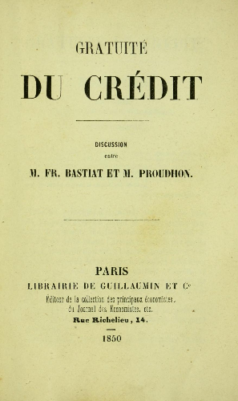

Proudhon nägi kapitali intressis pauperismi ja tingimuste ebavõrdsuse algpõhjust. Ta pooldas piiramatut rahaloomet riigipanga (Vahetuspanga või Rahvapanga) poolt ja nägi "vabas krediidis" lahendust sotsiaalsele probleemile. Teisest küljest oli Bastiat pankade vabaduse pooldaja, mis tähendab raharingluse reguleerimist läbi ametialasele tegevusele juurdepääsu vabaduse, koos vajaliku vastutusega oma vahendite üle ja konkurentsi vabaduse.

Bastiat lükkas oma vastase argumendid mitmel etapil ümber. Esiteks analüüsis ta vaba krediidi ja rahaloomise perversseid mõjusid. Selline süsteem võiks ainult julgustada pankade ja eraisikute riskantsemaid ja hooletumaid tegusid, sest nad teavad, et riik, st maksumaksjad, katab nad: "See on tõsine asi panna kõik inimesed olukorda, kus nad ütlevad: Proovime õnne kellegi teise varaga; kui mul õnnestub, seda parem minu jaoks; kui ma ebaõnnestun, liiga halb teistele." Ettenägelik väide, kuna see võib kehtida ka meie ajastul.

Keskpankade praktiseeritav madalate intressimäärade poliitika on viis raha kunstlikuks loomiseks. Ja finantssüsteemi viimase sajandi jooksul toimunud järjestikused kriisid, riikide võlakoormusega, on selle otsesed tagajärjed.

Seejärel näitab Bastiat, et on võimalik parandada tööklassi ostujõudu, kuid teiste, õiglasemate ja tõhusamate vahenditega. Tema jaoks on intressimäärade vähendamine ka liberaalse poliitika eesmärk. Kuid see saavutatakse kapitali vabastamise ja kogunemise kaudu, mitte intressi kaotamise, st vaba krediidi kaudu.

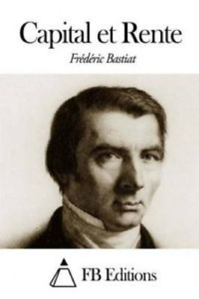
Tõepoolest, Bastiati sõnul langeb inimkonna progress kokku kapitali kogunemisega. Oma pamfletis pealkirjaga Kapital ja Rent selgitab Bastiat seda Robinson Crusoe näitel oma saarel.

Ilma kogunenud kapitali või materjalideta oleks Robinson hukule määratud. Ta selgitab edasi, et kapital rikastab töölist kaht viisi:
- See suurendab tootmist, vähendades seeläbi tarbekaupade hinda
- Mis omakorda suurendab palku.

Kaasaegses ühiskonnas toimib kapital võrdsustava jõuna. Tõepoolest, Bastiat ütleb:

> "kui kapital suureneb, konkureerib see iseendaga; selle tasu väheneb, või teisisõnu, intressimäär langeb."

Kokkuvõttes tunnustasid nii Proudhon kui ka Bastiat kapitali kogunemise tähtsust ja mõnede inimeste kalduvust teisi ära kasutada. Siiski ei jõudnud nad samadele järeldustele. Proudhon, nagu Marx, ennustas kapitalistlikes riikides masside üha suurenevat vaesumist. Bastiat uskus, et kapitalism viib enneolematu jõukuseni kõikides klassides ja üha olulisema keskklassi arenguni. Tõepoolest, nii ka läks.

# Majanduslikud Sofismid

<partId>59686d1d-58c6-59a8-9fc4-74a10d24cdbe</partId>

## Mis on Nähtav ja Mis ei ole Nähtav

<chapterId>25fb02a9-5d68-5c58-bd0f-d4b8e1fd91f9</chapterId>

Sel peatükis paljastan ma täiesti uue tehnoloogia, revolutsioonilise tehnoloogia. Teadlane on välja töötanud paari bionilisi prille, mille esiküljele on paigaldatud ülivõimas mini-kaamera. See tehnoloogia võimaldab näha detaile, mida palja silmaga näha ei ole võimalik. Käepidemetes on elektrooniline kiip, mis edastab pilte otse pilve minu nutitelefoni kaudu.

Esimese selliste prillide prototüübi leiutaja oli Frédéric Bastiat 1850. aastal kuulsas pamfletis: Mis on Nähtav ja Mis ei ole Nähtav. Need prillid on majandusteadlase prillid. Need võimaldavad mõõta otsuste mõju, mida võimud meie eludele teevad. Need on prillid, mis "võimaldavad meil näha seda, mida me ei näe": klientelistlike poliitikate ja valede majandusteooriate põhjustatud hävingut. Sageli me ei näe nende ohvreid, ega nende kasusaajaid, lühidalt, nende tegelikke mõjusid võrreldes ametlikes kõnedes esitatud väidetega, mida Bastiat nimetab "Majanduslikeks Sofismideks".
Hea majandusteadlane, Bastiati sõnul, peab kirjeldama poliitiliste otsuste mõjusid ühiskonnale. Siiski peavad nad olema tähelepanelikud, mitte nende lühiajaliste mõjude suhtes konkreetsele grupile, vaid pigem nende pikaajaliste tagajärgede suhtes ühiskonnale tervikuna. Kes on nende poliitikate ohvrid ja kes on kasusaajad? Mis on teatud seaduse või poliitilise otsuse varjatud kulud? Mida oleksid maksumaksjad teinud valitsuse asemel rahaga, mis neilt maksudes võeti? Need on küsimused, mida hea majandusteadlane Bastiati sõnul esitab.

Seega, Avalike Tööde puhul kirjutab Bastiat:

> Riik avab tee, ehitab palee, sirgendab tänavat, kaevab kanali; sellega annab see tööd teatud töölistele, see on nähtav; kuid see võtab töö ära teatud teistelt, see on nähtamatu.

Üks tuntumaid sofisme on katkise akna eksiarvamus. Mõned väidavad, et akna purustamine majas ei kahjusta majandust, kuna see toob kasu klaasipaneelijale. Kuid Bastiat tõestab, et hävitamine ei ole meie huvides, kuna see ei loo rikkust. See maksab rohkem, kui see toob sisse. Noor poiss, kes purustab naabri akna, annab tööd klaasipaneelijale. Kuid siin on, kuidas tema sõbrad teda lohutavad:
> "Igal pilvel on hõbedane serv. Sellised õnnetused hoiavad tööstust käigus. Kõigil on vaja elada. Mis saaks klaasipaneelijatest, kui aknaid kunagi ei purustataks?"

Seega, Keynesi järgi, stimuleeriks vara hävitamine, sundides kulutama, majandust ja omaks "multiplikaatorefekti", elavdades tootmist ja tööhõivet. See on ainult see, mida näeme.

Kuid see, mida ei nähta, on see, mida omanik oleks selle rahaga ostnud, kuid millest ta nüüd ilma peab olema, kuna ta peab oma akent parandama. See, mida ei nähta, on katkise akna omaniku kaotatud võimalus. Ta oleks võinud suunata summa, mis anti klaasipaneelijale, millegi muu peale. Kui ta poleks pidanud akent parandama, oleks ta võinud raha kulutada oma tarbimiseks, seeläbi inimesi tootmises tööle pannes.

Seega ei ole majanduse "stimuleerimist" akna purustamisega rohkem kui ilma selleta. Siiski on esimesel juhul olnud netokahjum: akna väärtus.

Esimene õppetund, mida õppida, on see, et "hea" otsus või "hea" poliitika on see, mis maksab ühiskonnale vähem kui see, mida oleks võinud maksta teine ressursside jaotus. Poliitika tõhusust tuleks hinnata mitte ainult selle mõjude, vaid ka nende alternatiivide põhjal, mis oleksid võinud juhtuda. See on "võimaluse kulu" kontseptsioon, mis on Bastiat'le kallis.

Teine õppetund on see, et hävitamine ei stimuleeri majandust, nagu Keyneslased arvavad, vaid viib vaesumiseni. Materiaalsete hüvede hävitamisel ei ole majandusele positiivset mõju, vastupidiselt levinud arvamusele. Kasutades Frédéric Bastiat' teksti lõppsõnu: "ühiskond kaotab väärtuse, mida asjatult hävitati."

Võtame praeguse näite. Niipea, kui autotööstusel on raskusi, kujutavad poliitikakujundajad ette vanaraua skeeme, et seda "taaskäivitada". Mida me näeme, on Renault' ja Peugeot' müügi suurenemine. Mida me ei näe, on teiste majandussektorite kahju ja see, et täiesti töökorras autod hävitatakse.

Kuid majanduse elavdamiseks on ka teisi viise. Kui riik tegeleb suurprojektidega või investeerib vahendeid teatud tööstussektoritesse tööhõive toetamiseks, kas see pole siis hea uudis kasvu jaoks? Mitte enam, vastaks Bastiat. Sest millega rahastataks avalikke kulutusi? Maksude tõstmise või võlaga, see tähendab nähtamatute, kuid väga reaalsete kuludega, mis mõjutavad kasvu. Pealegi valitsus ei tooda midagi; see lihtsalt suunab ressursid nende eraotstarbest kõrvale. Ja mida me ei näe, on paljud asjad, mis oleksid võinud olla toodetud, kui kapitali poleks eraõiguslikust sektorist valitsusprogrammide rahastamiseks ära võetud.

Lõpuks, peaaegu sajand enne Keynesi, võime öelda, et Bastiat lükkas ümber Keynesiaansed sofismid, mis väidavad, et riigi võlg julgustab majandust ja et avalikud kulutused toodavad kasvu.

Selle tekstide seeria suur õppetund on see, et riigi sekkumisel on perverssed mõjud, mida ei nähta. Ainult hea majandusteadlane on võimeline neid ette nägema. Poliitika on see, mida me näeme. Majandus on see, mida me ei näe.
## Küünalde valmistajate petitsioon
<chapterId>f4e759ed-1cb2-55c7-885e-0a60244758a4</chapterId>

1840. aastal hääletas Deputaatide Koda seaduse poolt, mis suurendas impordimakse, et kaitsta Prantsuse tööstust. See on kuulus majanduslik patriotism, millega me kohtume ka tänapäeval.

Bastiat koostas seejärel satiirilise teksti, mis hiljem sai üheks tema kuulsaimaks teoseks: "küünalde valmistajate petitsioon". See illustreerib, kuidas teatud hästi organiseeritud tootjate survegrupid saavad riigilt ebaõiglasi privileege kodanike kahjuks. Samal ajal demonstreerib see protektsionistliku seadusandluse absurdsust ja hävitavat olemust.

Selless petitsioonis paluvad küünalde valmistajad deputaatidelt õiguslikku kaitset ohtliku konkurendi vastu:

> Me kannatame talumatu konkurentsi all välismaise rivaali poolt, kes, tundub, on valguse tootmisel niivõrd ülekaalukates tingimustes, et ta ujutab meie riikliku turu üle uskumatult madala hinnaga.

Niisiis, kes on see ebaõiglane väliskonkurent? See on keegi muu kui päike. Tootjad rõhutavad seejärel võimalust reserveerida "riiklik turg riiklikule tööjõule", andes seadusega korralduse sulgeda "kõik aknad, katuseaknad, varjud, luugid, rulood, kardinad, fassaadivalgustid, ühesõnaga kõik avad, augud, pilud ja praod, mille kaudu päikesevalgus on harjunud majadesse sisenema".

Teisisõnu, küünalde valmistajad püüavad demonstreerida "väliskonkurendi" (päike) kahjulikke mõjusid Prantsusmaa majandusele. Sest mitte ainult ei suuda päike pakkuda sama "toodet" nagu küünlad, vaid ta teeb seda tasuta. Kakssada aastat hiljem on see lugu uskumatult asjakohane. Mõelge taksojuhtidele, kes paluvad seadusel keelata VTC-d ja Uberi. Mõelge raamatupoodidele, mis tahavad keelata Amazoni.

Bastiat'i tegelik vastane selles väljamõeldises on poliitiline ja valimisprotektsionism, mis toetub ainult tootjate ahnusele ja tarbijate naiivsusele. Ta paljastab halva kapitalisti ja riigi vahelise kokkumängu tol ajal. Halb kapitalist ei ole see, kes püüab turule uuendusi tuua ja kohanduda, vaid see, kes otsib poliitilist eelist protektsionismi kaudu. See toob alati kaasa tarbija röövimise, st ebaõigluse.
Lühidalt, protektsionism on teadlik poliitika tootjate kasuks tarbijate vastu. Siiski, Bastiati sõnul on tõelised üldise huvi esindajad tarbijad, sest me kõik oleme tarbijad. Lisaks on majanduse eesmärk rahuldada meie vajadusi, mitte töötada.
Protektsionism toetub ka varjatud sillogismile, mis osutub eksituseks:

- Mida rohkem me töötame, seda rikkamad me oleme;
- Mida rohkem raskusi meil on ületada, seda rohkem me töötame;
- Seega, mida rohkem raskusi meil on ületada, seda rikkamad me oleme.
Illustratsiooniks sellele absurdile toome mõned lühilood, mida jutustas Bastiat. Majandussofismide teise seeria III peatükis kujutab ta ette puuseppa, kes kirjutab ministrile petitsiooni, paludes protektsionistlikku seadusandlust. Puusepp formuleerib oma taotluse järgmiselt: Hr Minister, tehke seadus, mis sätestab, et "Keegi ei tohi kasutada tüüblit ja talasid, mis on valmistatud nüridest kirvestest." Teisisõnu, tehke seadus, mis keelab Prantsusmaal teravate kirveste kasutamise. Nii, kus tavaliselt antakse 100 kirvehoopi, tuleb anda 300. Puusepad on suure nõudlusega ja seetõttu paremini tasustatud.

XVI peatükis on veel üks väga irooniline tekst, pealkirjaga: Paremkäsi ja Vasakkäsi. Pärast uurimist koostab kuninglik saadik aruande, milles ta ettepaneku kuningale lõigata ära või vähemalt siduda kõik tööliste paremad käed. Nii, jätkab ta, töö ja seega ka rikkus suurenevad. Tootmine muutub palju raskemaks, mis nõuab lisatööjõu massilist palkamist ja palkade tõusu. Vaesus kaob riigist.

Järgides seda loogikat töökohtade loomisest iga hinna eest, miks mitte asendada ka veoautod kärudega ja labidad teelusikatega? Kõigil neil sofismidel on üks ühine joon: nad ajavad segi vahendid ja eesmärgi. Bastiati jaoks ei ole majanduse eesmärk töökohtade säilitamine. Me ei tohiks hinnata töö kasulikkust selle kestuse ja intensiivsuse järgi, vaid selle tulemuste järgi: vajaduste rahuldamine, kasulikkus.

See vahendite ja eesmärgi segiajamine leidub loosungis "raha on rikkus".
See on aksioom, mis juhib enamiku riikide rahapoliitikat. Tõepoolest, raha hulga kunstlik suurendamine võimaldab pankadel laenata raha eraisikutele ja riikidel kergesti oma võlga tagasi maksta, see on "mida me näeme". Kuid "mida me ei näe" on see, et raha loomine, mis ei põhine ühelgi tegelikul rikkuse loomisel, viib inflatsioonini ja säästjate hävinguni.

Tõeline rikkus, Bastiati sõnul, on seega kasulike asjade kogum, mida me töö kaudu toodame oma vajaduste rahuldamiseks. Raha on seega ainult üldkasutatav vahetusvahend, ta mängib ainult vahendaja rolli.

## Röövimine maksustamise kaudu

<chapterId>551fc499-2119-5a52-9114-412d29434c22</chapterId>

> Kui rikkad kaotavad kaalu, surevad vaesed.

See tsitaat, mida omistatakse Lao-Tzule, kirjeldab vältimatut tagajärge maksustamissüsteemile, mis on suunatud rikkamatele rohkem kui teistele.

Ometi, kas olete kunagi kuulnud öeldavat:

> Maksustamine on parim investeering: see on viljakas kaste! Vaadake, kui palju peresid see toetab, ja jälgige mõttes selle põrkumisi tööstusele: see on lõputu, see on elu.

Prantsusmaal, kus avalikke kulutusi peetakse kasuks, on maksud kõrgemad kui teistes riikides. Kuid Bastiat hoiatab meid kohe: "Iga avaliku kulutuse taga, peidus näilise hea taga on raskemini märgatav kurjus."

Millest on jutt?
Majandus kirjeldab poliitiliste otsuste häid või halbu mõjusid meie eludele. Siiski, Bastiati sõnul peab majandusteadlane olema tähelepanelik, mitte ainult lühiajaliste mõjude suhtes kindlale grupile, vaid pigem nende pikaajaliste tagajärgede suhtes ühiskonnale tervikuna.
> "Mida me näeme, on töö ja kasum, mida lubab sotsiaalne panus. Mida me ei näe, on tööd, mis oleksid loodud selle sama panusega, kui see oleks jäetud maksumaksjate kätte. Mida me näeme, on töö ja kasum, mida lubab sotsiaalne panus. Mida me ei näe, on tööd, mis oleksid loodud selle sama panusega, kui see oleks jäetud maksumaksjate kätte."
>
> F.Bastiat

Algusest peale lükkab ta ümber endiselt levinud argumendi, et maksudest rahastatud avalik kulutamine loob töökohti. Tegelikult maksud ei loo midagi, kuna riigi poolt kulutatu ei ole enam kulutatav maksumaksjate poolt.

Pealegi on riik raiskavam kui üksikisikud. Tõepoolest, ta meenutab meile, riik ei oma midagi; see ei tooda mingit varandust. Avalik kulutamine on tihti raiskamise allikas, sest tohutud summad, mis on konfiskeeritud üksikisikutelt, põgenevad nende omanike vastutusest ja kulutatakse nende asemel bürokraatide poolt, kes on survegruppide mõju all.

Muidugi, kui makse käsitletakse tasuna vastava avaliku teenuse eest, mida vastutasuks saadakse, on maksustamine täiesti kaitstav. Kuid Prantsusmaal on riik maksudele määranud mitu rolli.

Alguses oli see mõeldud ühiste kulude katmiseks. Seejärel anti maksudele ka roll majanduse reguleerimisel. Sel juhul on poliitikutel ja bürokraatidel võim, mis on piiratud ainult nende hea tahtega. Oma kunstlikes konstruktsioonides süvenenult kujundavad nad majandust, maksustades ja reguleerides sektoreid rohkem või vähem vastavalt oma kapriisidele, et neid soosida või mitte soosida.

Lõpuks määrati maksudele sotsiaalne roll. Neist tehti sotsiaalse õigluse instrument. Seega ei tohiks maksud tabada kõiki ühtemoodi. Maksud peavad olema ümberjaotavad, neilt "kes omavad rohkem" neile "kes omavad vähem".

Probleem on selles, et maksud, nagu need on ette nähtud, alluvad võimulolijate suvale. Nad soosivad või ei soosi teatud sotsiaalseid kategooriaid sõltuvalt sellest, kas võim ootab neilt hääli või mitte. Lisaks toovad progressiivsed määrad riigikassasse vähe tulu. Siiski võimaldavad need enamusel eksproprieerida vähemust ja muutuvad loomulikult konfiskeerivaks.

Sellepärast oli Bastiat juba mõistnud Lafferi kõverat. Arthur Laffer on Ameerika majandusteadlane, kes on tuntud oma kuulsa "kõvera" poolest (ellips), avaldatud 1974. aastal, mis näitab, et maksutulu suureneb maksukoormuse vähendamisega. See on liigse maksustamise väheneva tulu teooria.

Poliitikud eeldavad naiivselt, et maksukoormuse ja maksutulu vahel on automaatne ja fikseeritud suhe. Nad arvavad, et saavad maksutulu kahekordistada, kahekordistades maksukoormust. Lafferi sõnul jäetakse sellise lähenemisega tähelepanuta asjaolu, et maksumaksjad võivad oma käitumist uute stiimulite tõttu muuta.
Lafferi kõver näitab, et valitsus ei kogu tulu, kui maksukoormus on 100%. Vastupidi, igasugune maksude vähendamine stimuleerib majandustegevust ja seega riigitulusid. Tõepoolest, marginaalsete maksukoormuste vähendamine stimuleerib investeeringuid, tööd, loovust ja seega soodustab majanduskasvu. Piisav vähendamine võiks majandusliku stiimuli abil suurendada avalikke tulusid, laiendades oluliselt maksubaasi.

Bastiat võiks lisada, et riigikulutuste vähendamisele tuleks omistada sama palju tähtsust kui maksude vähendamisele. Siiski, nagu Margaret Thatcher, Frédéric Bastiati jünger, nii tabavalt ütles:
"Eesmärk ei ole teha rikkad vaeseks, vaid teha vaesed rikkaks." Ja ta ütles seda sotsialistidele kõnet pidades.

## Kaks Morali

<chapterId>c518e449-f638-553c-9a49-15da48023d41</chapterId>

Kõik teavad Tartuffet ehk Silmakirjalikku, komöödiat Molière'ilt, milles kaval jumalakartja üritab Elmire't võrgutada ja tema abikaasat Orgonit petta. Kuidas saab end kaitsta sellise silmakirjaliku petturi eest, kes teeskleb, et tahab sulle head teha, samal ajal sinu vastu sepitsedes?

Bastiat märgib, et selle liiki silmakirjalikkuse lõpetamiseks on kaks viisi: parandada Tartuffet või valgustada Orgoni. Muidugi, Tartuffeid jääb alati olema, kuid nende võim kahjustada oleks palju väiksem, kui oleks vähem Orgoneid, kes neid kuulavad.

Inimliku mõistuse nõrkus on vabaduse väärkasutamise juur. See on inimeste peamine piirang ja paljude hädade põhjus. Seetõttu on vajalik valgustada südametunnistusi inimtegude, olgu need siis individuaalsed või kollektiivsed, kasuliku või kahjuliku, ning seega õiglase või ebaõiglase olemuse osas.

Siiski on kaks täiendavat viisi kodanike otsustusvõime valgustamiseks, nagu Bastiat kirjeldab oma teose "Majanduslikud Sofismid" teise seeria peatükis "Kaks Morali".

- Esiteks on olemas "filosoofiline või religioosne moraal", mis toimib inimtegevuse puhastamise ja parandamise kaudu (inimene kui tegutseja)
- Seejärel on olemas "majanduslik moraal", mis toimib näidates inimesele "tema tegude paratamatuid tagajärgi" (inimene kui kannataja)
Tegelikult on need kaks täiuslikult täiendavat moraaliraamistikku.

1. Esimene kõnetab südant ja julgustab inimesi head tegema; see on religioosne või filosoofiline moraal. See on kõige üllam. See juurdab inimese südamesse tema kohustuse teadlikkust. See ütleb talle:

> Paranda ennast; puhasta ennast; lõpeta kurja tegemine; tee head, taltsuta oma kirgi; ohverda oma huvid; ära rõhu oma naabrit, keda on sinu kohus armastada ja aidata; ole esmalt õiglane ja seejärel heatahtlik.

Lühidalt, see õpetab voorust, isetut tegu. See moraal, ütleb Bastiat, jääb igavesti kõige kaunimaks ja liigutavamaks, sest see näitab inimeses parimat.

2. Teine aitab kurja hukka mõista ja võidelda selle vastu, tundes selle mõjusid, see on majanduslik moraal. See kõnetab intellekti, mitte südant, eesmärgiga valgustada ohvrit käitumise negatiivsete mõjude osas. See tugevdab kogemuse õppetunde. See püüab levitada terve mõistuse, teadmiste ja umbusalduse vaimu rõhutud massidesse, muutes rõhumise raskemaks.

See majanduslik moraal püüdleb sama tulemuse poole nagu religioosne moraal, kuid alustades inimtegude mõjudest. See õpetab meid reageerima ebaõiglastele või kahjulikele tegudele ja kaitsma neid, mis on õiglased või kasulikud.

Bastiat toob siin esile teaduse, eriti majandusteaduse rolli. Kuigi see erineb traditsioonilisest moraalist, on selle roll röövimise kõigis vormides võitlemisel siiski vajalik. Moraal ründab pahe kavatsust, see harib tahet. Teisest küljest ründab teadus pahe, mõistes selle mõjusid, hõlbustades seeläbi vooruse võitu.

Konkreetselt koosneb majandusteadus, mida Bastiat kirjeldab kaitseva moraalina, majanduslike sofismide ümberlükkamisest, et need täielikult diskrediteerida ja seeläbi rööviva klassi õigustus ja võim kõrvaldada.
Poliitiline majandusteadus omab seega ilmset praktilist kasulikkust. See paljastab varjatud kuludes röövimise, takistused konkurentsile ja kõik protektsionismi vormid.
Taas kord oleks vähem Tartuffesid, kui oleks vähem Orgoneid, kes neid kuulavad. Siin on, mida Bastiat sellel teemal ütleb:

Las religioosne moraal puudutab siis Tartuffeside südameid, kui see suudab. Poliitilise majanduse ülesanne on valgustada nende pettunuid. Nendest kahest lähenemisest, kumb töötab sotsiaalse progressi jaoks kõige tõhusamalt? Kas seda tuleb öelda? Ma usun, et see on teine. Kardan, et inimkond ei saa pääseda vajadusest esmalt õppida kaitsev moraal.

Muidugi pole poliitiline majandusteadus universaalne teadus; see ei välista filosoofilisi ja religioosseid lähenemisi. "Aga kes on kunagi sellist ülemäärast nõuet selle nimel esitanud?" imestab Bastiat.

Üks asi on kindel, poliitik ei ole see, kes saab asjade kulgu muuta ja inimest täiustada. Vastupidi, on vajalik piirata poliitikut ja piirata teda tema rangesse rolli, mis on turvalisus. Pigem kultuurilises, perekondlikus, religioosses ja assotsiatiivses valdkonnas, ideedega töötades, hariduse ja õpetuse kaudu, lühidalt, kodanikuühiskonnas, saab tugevdada vastutust ja solidaarsust.

# Majanduslikud Harmooniad

<partId>db04dfa4-a53e-5d3e-a307-a68ebc36dc4f</partId>

## Turu Ime

<chapterId>895ccd1d-7b52-5a8b-8b2c-6ec0056cf632</chapterId>

Kas harmooniline ühiskond saab hakkama ilma kirjutatud seaduste, reeglite, repressiivsete meetmeteta? Kui inimesed jäävad vabaks, kas me ei näe siis korralagedust, anarhiat, desorganiseeritust? Kuidas vältida pelgalt üksikisikute kõrvuti asetsemist, kes tegutsevad ilma igasuguse kooskõlata, kui mitte seaduste ja tsentraliseeritud poliitilise organisatsiooni kaudu?

See on argument, mida tihti kasutavad need, kes nõuavad turu reguleerimist või ühiskonda, mis suudab üksikisikud koordineerida koherentseks ja harmooniliseks tervikuks.

See ei ole Bastiati vaade. Tema sõnul allub sotsiaalne mehhanism, nagu taevamehhanism või inimkeha mehhanism, üldistele seadustele. Teisisõnu, see on juba harmooniliselt organiseeritud tervik. Ja selle organisatsiooni mootoriks on vaba turg.

Vaba turu ime, räägib ta meile, on see, et see kasutab teadmisi, mida ükski inimene üksi ei saa omada, ja et see pakub rahuldusi, mis on kaugelt üle kõige, mida kunstlik organisatsioon suudaks teha.

Bastiat toob mõned näited, et illustreerida selle turu eeliseid. Oleme selle nähtusega nii harjunud, et me ei pööra sellele enam tähelepanu.
Vaadelgem küla puuseppa, ütleb ta, ja jälgigem kõiki teenuseid, mida ta ühiskonnale pakub ja kõiki neid, mida ta saab:
> Iga päev, ärgates, paneb ta riidesse, ja ta ei ole ise ühtegi oma riietest valmistanud. Ometi, et need riided talle kättesaadavaks teha, pidi kogu maailmas toimuma tohutu hulk tööd, tööstust, transporti ja geniaalseid leiutisi.
Siis sööb ta hommikusööki. Selleks, et leib, mida ta iga hommik sööb, tema lauale jõuaks, tuli maad puhastada, künda; rauda, terast, puitu, kivi tuli tööriistadeks muuta; kõik asjad, mis igaüks eraldi võetuna, eeldavad arvutamatut hulka tööd, mis on rakendatud, mitte ainult ruumis, vaid ka ajas.

See mees saadab oma poja kooli, et saada haridust, mis eeldab uurimistööd, paljude aastate pikkust eelnevat õppimist.
Ta läheb välja: ta leiab sillutatud ja valgustatud tänava.

Tema omandit vaidlustatakse: ta leiab advokaadid, et kaitsta oma õigusi, kohtunikud, et neid säilitada, õigusemõistmise ametnikud, et täide viia otsust; kõik asjad, mis ikka veel eeldavad omandatud teadmisi, seega valgustatust ja eksistentsi vahendeid.

Bastiat kirjeldab turgu kui detsentraliseeritud ja nähtamatut koostöövahendit. Hinnasüsteemi kaudu edastab see teavet kõigi vajaduste ja oskuste kohta, see ühendab inimesi, kes soovivad koostööd teha, et parandada oma olemasolu.

Mis on hämmastav, Bastiat järeldab, on tohutu ebaproportsionaalsus, mis eksisteerib nende hüvede vahel, mida see mees ühiskonnalt saab, ja nende vahel, mida ta iseendale pakuks, kui ta oleks oma ressurssidele reduitseeritud. Ühe päevaga tarbib ta kaupu, mida ta ei suudaks ise toota.

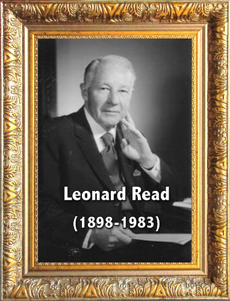

1958. aastal avaldas Ameerika kirjanik Leonard Read (Majandushariduse Fond) lühiessee ajakirjas The Freeman, mis oli kirjutatud Bastiati viisil ja sai väga kuulsaks: "Mina, Pliiats". See tekst on metafoor vabaturu kohta. See algab nii:

> Ma olen harilik pliiats, tavaline puust pliiats, mis on tuttav kõigile poistele ja tüdrukutele ning täiskasvanutele, kes oskavad lugeda ja kirjutada. See on üks lihtsamaid objekte inimtsivilisatsioonis. Ja ometi ei tea ükski inimene maailmas, kuidas mind toota.

See revisiteerib Bastiati ideed nähtamatust koostööst miljonite inimeste vahel, kes ei tunne üksteist, viies sellise argise asja nagu pliiatsi loomiseni. Keegi ei tea, kuidas teha pliiatsit üksi. Ometi osalevad miljonid inimolendid teadmatult selle lihtsa pliiatsi loomises, vahetades ja koordineerides oma teadmisi ja oskusi hinnasüsteemi sees ilma ühegi kõrgema autoriteedita, kes dikteeriks nende käitumist. See lugu demonstreerib, et vabad inimesed, kes tegutsevad oma legitiimsete huvide nimel, toimivad ühiskonna hüvanguks rohkem kui ükski planeeritud ja tsentraliseeritud majandusstrateegia.

1976. aasta Nobeli majanduspreemia laureaat, Milton Friedman, revisiteeris samuti seda pliiatsilugu, et selgitada laiemale avalikkusele, kuidas turumajandus toimib.

Oma telesarja "Vaba valik" episoodis analüüsib ta sellise argise ja lihtsa asja nagu pliiats erinevaid komponente ja rõhutab spontaanse korra imet, mida genereerivad tuhanded majanduslikud interaktsioonid üle maailma. Inimesed, kes ei tunne üksteist, kes ei jaga sama usku ega kombeid, suudavad siiski koordineerida, et toota seda eset. Ta järeldab, et vaba turg on hädavajalik mitte ainult jõukuse, vaid ka harmoonia ja rahu tagamiseks.

Friedrich Hayek selgitas oma essees "Teadmiste kasutamine ühiskonnas" aastal 1945, miks turumajandus ja otsuste detsentraliseerimine on olulised jõukuse jaoks. Hayeki sõnul ei suudaks ükski keskne planeerija ega bürokraat kunagi piisavalt teadmisi omada, et edukalt juhtida kogu majandustegevust. Ainult hinnasüsteem vabal turul võimaldab miljonitel sõltumatutel tegijatel ise otsustada, kuidas ressursse tõhusalt jaotada.
Majandusplaneerimine, mis väidab, et suudab turust paremini, viib mitte ainult ressursside vaese jaotuseni, vaid ka ühe klassi hegemooniani teise üle. Seetõttu ei ole sotsialism mitte ainult intellektuaalne eksitus, vaid viga, mis lõppkokkuvõttes genereerib tohutut ebaõiglust.

## Vabadus ja vastutus on sotsiaalse probleemi võti

<chapterId>78baa7ef-2c80-5fc7-8881-c1be4662b96f</chapterId>

1845. aastal kirjutas Bastiat Alphonse de Lamartine'ile, et tema terve filosoofia sisaldub ühes põhimõttes:

> Vabadus on parim sotsiaalse korralduse vorm.
Siiski lisab ta tingimuse

> "Seadus ei tohiks kõrvaldada igaühe tegude, olgu need positiivsed või negatiivsed, tagajärgi. See on vastutuse kõrvalpõhimõte.": "Seadus ei tohiks kõrvaldada igaühe tegude, olgu need positiivsed või negatiivsed, tagajärgi. See on vastutuse kõrvalpõhimõte."

Teisisõnu, vabadust ja vastutust ei saa lahutada; need on lahutamatud. Tema jaoks eristub liberalism sotsialismist uskumusega, et vabadus ei saa eksisteerida ilma vastutuseta. Kuid mida täpselt tähendavad sõnad vabadus ja vastutus?

Vabadust määratletakse põhimõtteliselt negatiivselt: vaba olemine tähendab tegutsemist ilma välise sunduseta oma õiguste teostamisel. Siiski ei tähenda see kõikide piirangute puudumist. Kuna vabadus nõuab vastastikkust: see paneb meile ka kohustuse tegutseda ilma teiste omandit rikkumata ja vajadusel tekitatud kahju hüvitama. See on vastutus.

Seega esindab vastutus omamoodi vabaduse positiivset aspekti: niivõrd kui keegi tegutseb vabalt, peab ta kandma oma tegude, head või halvad, tagajärgi.

Individuaalne vastutus on nii suur loovuse vektor kui ka ettevaatlikkuse ja ettenägelikkuse stiimul.

Kui keegi kulutab oma raha, on ta ettevaatlik, et mitte liiga palju võlgu võtta, kontrollib toodete kvaliteeti, tarnijate usaldusväärsust, riskides muidu rängalt karistada. Selline on vastutuse jõud, mis koos vabadusega on tõeline sotsiaalse progressi mootor.

Kuid kust tuleb vastutustundetuse või vastutusest loobumise nähtus? Frédéric Bastiat annab meile sellele küsimusele vastuse, poliitilise vastuse. Ta ütleb, ma tsiteerin:

> "Riigi sekkumine võtab meilt endi valitsemise."

Tõepoolest, riigism pidevalt vähendab eraalgatust ja inimeste vaba valikut. See teeb nende eest seda, mida nad ise saaksid teha ja paremini. Nii võtab see inimestelt nende tegude tagajärgede kandmise. See hävitab vastutuse.

Bastiat'i sõnul on seaduste hüpertroofia ja riigi liigse sekkumise tagajärjeks võimuvõitlus, röövimine, privileegid, monopolid, sõjad, lühidalt, kõik, mis takistab tsivilisatsiooni edasiminekut.
Liiga suure seadusliku või bürokraatliku kontrolli teed eelistamise risk on see, et see heidutab kõiki motivatsioone, kehtestades piirangute tulva, jättes meid ilma paljudest edusammudest, mida eraalgatus ja vaba valik võimaldavad.

Illustreerigem seda probleemi mõne praeguse peamise teemaga. Esimene näide, 2008. aasta kriis.
_(Alan Greenspan, FEDi, Ameerika keskpanga, esimees aastatel 1987 kuni 2006)_
Aastaid selgitasid rahapoliitika juhid, et kui kasumid on eraomanduses, kui kõik läheb hästi, siis kahjumid muutuvad ühiseks, kui toimub pankrot (päästepaketid, päästeplaanid, intressimäärade manipuleerimine, raha trükkimine jne). Tehes seda, lõid nad moraalse ohu, nad soodustasid ebamõistlikku riskivõtmist ja julgustasid finantsmaailma vastutustundetult käituma. Nad kiirendasid seeläbi finantskriisi, mida me kogesime.

Ja see nähtus kordub lõputult seni, kuni pangad jäävad kesksete autoriteetide domineerimise alla, kes eeldatavasti kaitsevad neid, eemaldades kõik otsustus- ja tegutsemisautonoomiad.

Teine näide: avalikud teenused

Iga avalik teenus peale surub bürokraatliku eliidi eelistused, individuaalse vaba valiku kahjuks. See toob kaasa kaks tagajärge Bastiati sõnul: Kodanik "lõpetab vaba kontrolli oma rahulduste üle ja, kuna tal pole enam vastutust, loomulikult kaotab ta ka intelligentsuse." Põhjus on lihtne: iga kirjutatud seadus on sundiv ja see kehtib kõigi jaoks ühtemoodi, see ei arvesta kodanike eriolukordi, vajadusi ja eelistusi.

Lõpuks on avalik teenus liikumatuse põhjuseks. Tõepoolest, kui eraõiguslikud teenused muutuvad avalikuks, pääsevad nad konkurentsist. Seetõttu ütleb Bastiat, ma tsiteerin: "ametnik on ilma sellest stiimulist, mis tõukab edusammude poole."

Kui me vaatleme riikliku hariduse avalikku teenust, mõistame, mida Bastiat mõtleb. See vabastab enamiku vanematest laste hariduse andmise koormast, muutes kooli lihtsalt päevahoiuks. See ei julgusta õpetajaid uuendama ja riske võtma, sest sellises süsteemis on nad lihtsalt programmide täitjad, mis on kavandatud ilma nendeta, bürokraatide poolt. Lõpuks ignoreerib see iga üksikisiku erivajaduste reaalsust.

Me näeme teises kursuses, Bastiati sõnul, riigi ainult legitiimsed avalikud teenused on kolmekordsed: sõjavägi, politsei ja kohtusüsteem. Kuid vastutuse teemal lõpetades, riigisekkumise probleem on see, et otsuseid tegevad isikud ei ole need, kes kannatavad tagajärgede all.
Teisisõnu, kollektiivsed valikud ei ole vastutustundlikud valikud, kuna ühelt poolt ei kaasne otsustajatele mingit riski ja teiselt poolt sunnitakse teisi teatud tagajärgi taluma, mis on sama katastroofiline kui see on ebaeetiline.

## Vastutuse jõud

<chapterId>0c078806-6c58-53f9-a720-5fb62386e56b</chapterId>

Eelmises kursuses nägime, miks vabadus ja vastutus on sotsiaalse probleemi võtmeks. Nüüd süveneme sellesse punkti, näidates, kuidas Frédéric Bastiat näeb ühiskondi vaevavaid kurje ja nende lahendust.

Liberale on mõnikord ette heidetud kurjuse eiramist ja puhta ja täiusliku vabaduse utoopia konstrueerimist ideaalses maailmas. See kriitika on meie autori suhtes täiesti alusetu.

Keegi ei saa eirata kurjust, mis valitseb inimühiskondade ajaloos: ebaõiglused, sõjad ja kannatused. Me tahaksime suuta need kurjused kõrvaldada. See on muide suure osa kaasaegsete filosoofiate eesmärk, alates Rousseau'st kuni Heideggerini, läbi Hegeli ja Marxi.
Kurjus ei ole mitte ainult kindel reaalsus, vaid tal on ka roll ajaloos ja inimtegevuses, ütleb Frédéric Bastiat. Seda saab vähendada, kuid kindlasti mitte täielikult kõrvaldada, sest see tähendaks vabaduse ja vastutuse tapmist. Niisiis, kust tuleb kurjus, mis on selle roll ja kuidas seda ära hoida?
Nendele küsimustele vastamiseks asub Bastiat analüüsima inimtegevust. See võib tõepoolest viia nii hea kui ka kurja teoni.

Kurjus tuleneb esmalt meie ebatäiuslikkusest. Vabalt valida tähendab riskida halva valiku tegemisega, ütleb Bastiat. Tõepoolest, meid võib petta mitmel viisil, isegi omaenda vajaduste ja huvide osas. Inimene on ekslik, ta on altid eksima majandusseaduste mõistmisel või neid nende eesmärgist kõrvale juhtima.

Seega on mõistuse ebatäiuslikkus meeste peamine piirang ja see jääb meie kannatuste algpõhjuseks.
Kui kurjus tuleneb inimlikust nõrkusest ja mitte vabadusest endast ega vabakaubandusest, siis ei ole abinõu vabaduse või vahetuse kaotamises, vaid vastutuses endas, kuna see on kogemuste allikas. See vastutuse põhimõte on järgmine, tsiteerin Bastiati:

> Iga tegutsev inimene saab oma tegude eest tasu või karistuse.

Selle loomuliku sanktsiooni kaudu õpib inimene, avastab, parandab ennast, areneb ja täiustub. Teisisõnu, vastutus on täiuslikkuse ja progressi põhimõte, nagu me eelmisel kursusel nägime.

Kui inimene kannab oma otsuste, heade või halbade, tagajärgi, siis ta püüab parandada, õppides kogemustest. Seega, individuaalne vastutus, mis on Bastiati sõnul suur rahvaste kasvataja, kõigi käitumise ja ühiskondade reguleerimise põhiprintsiip, tuleb lasta toimida.

Kurjus tekitab kannatusi ja kannatused panevad meid mõistma viga või eksimust, see toob meid tagasi õigele teele. Kurjuse tundmine on see, mis viib meid edasi.

See on seetõttu, et inimene riskib eksimise või valesti tegutsemise ja tagajärgede kandmisega, mis julgustab teda olema vastutustundlik. Ta püüab siis ette näha ohte, mis võivad teda tabada, et end kaitsta.

Seega on selge, et Bastiat ei ole pime. Ta ei eita kurjuse olemasolu. Inimene on nõrk, altid eksimustele ja süütele. Kusagil ei näe, et Bastiat eitaks asjaolu, et individuaalse vabaduse teostamine on seotud eksimise võimalusega, mõistusevastase või mõttetu valiku võimalusega.

Ta lihtsalt väidab, et kui kurjuse allikas peitub vabaduse puudumises, siis on abinõu vabaduses endas ja täpsemalt isikliku vastutuse täielikus ja terviklikus rakendamises.

Kuid kui vabaduse väärkasutus on meie hädade algpõhjus, siis on selleks õigeks kasutamiseks lahendus, see tähendab isikliku vastutuse täielik ja terviklik rakendamine, mis põhineb omandiõigusel. Sotsiaalne regulatsioon läbib seega vastutust, mitte riigi sekkumist kõigis valdkondades, mis on üks suurtest röövimise allikatest ja seega kurjusest.

Erinevalt Rousseau'st, kes püüab kurjust kõrvaldada kollektiivsete institutsioonide kaudu, kaitseb Frédéric Bastiat kurjuse ja vea võimalust, ilma milleta pole vabadust ega individuaalset vastutust. Sest just see üksinda võimaldab, läbi avastamise protsessi, edasi liikuda ja vähendada sotsiaalseid kurje.
Tuleb selgitada, et see vastutuse kaudu saavutatav progress ei ole mingil juhul automaatne. See ei ole sugugi, nagu Hegeli või Marxi puhul, mingisugune loomulik või ajalooline determinism, mis viiks imelisel või mehaanilisel viisil harmoonia ja progressini. Tegemist on järkjärgulise ja määramatu kurjuse vähendamisega, mitte kunagi selle lõpliku kõrvaldamisega.

## Tõeline ja vale solidaarsus

<chapterId>fa2172e9-22fa-5c01-a3c8-1e8316c064a4</chapterId>

Frédéric Bastiat, oma kuulsas pamfletis "Seadus", taunib seaduse perverssust, mis seisneb selles, et seadustatakse "solidaarsuse" nime all see, mida tuleks tegelikult nimetada röövimiseks. Tõepoolest, on vastuoluline soovida seaduse kaudu peale suruda vendlust, mida me tänapäeval nimetaksime "sotsiaalseks õigluseks" või solidaarsuseks.

Sest moraalsus on määratletud kui vabatahtlik käitumine. Kui indiviidi sunnitakse andma midagi, mida ta ei soovi anda, on ta alati varguse ohver.

Tõepoolest, kui annetus muutub seadusega kohustuslikuks, ei ole see enam moraalne hoiak. Moraalne annetamise hoiak asendatakse nõudega "õigustele", mis on nõuded teiste inimeste tööle. Vale solidaarsus on üleskutse elada teiste arvelt.

See on see, mida Bastiat nimetab "seadusliku vendluse sofismiks". Tsiteerigem teda sel teemal:

> Vendlus on spontaanne või seda ei ole üldse. Selle dekreetimine tähendab selle hävitamist.

Ja veel:

> Valitsused teostavad alati ainult jõuga sanktsioneeritud tegevust. Nüüd on lubatud kedagi sundida olema õiglane, kuid mitte sundida olema heategev. Seadus, kui see püüab jõuga teha seda, mida moraal saavutab veenmise teel, langeb kaugeltki heategevuse valdkonnast röövimise domeeni.
Siiski on sellel seaduse perverssusel nimi, see on sotsialism, st ideoloogia, mis seisneb riigi poolt jõuga rikkuse ümberjaotamises. Sotsialismi, Bastiati sõnul, iseloomustab seadusliku röövimise ideoloogia. Kuid selle ideoloogia kavalus seisneb selles, et see maskeerib oma vägivalla keelekuritarvituse alla: üleskutse solidaarsusele või vendlusele.

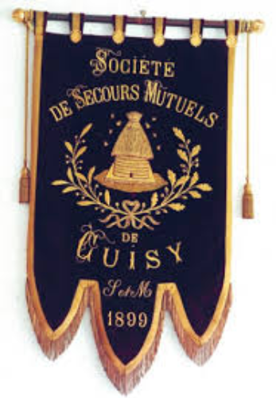

Siiski, Bastiati sõnul, on riiklikule kohustuslikule solidaarsusele alternatiiv: "vastastikuse abi ühing"

meeste vastastikune ja spontaanne abistamine omavahel tänu vastastikuse abi ühingutele. Kuid ta nägi ette ka, et riik haarab lõpuks need vastastikused abid enda kätte, muutes need unikaalseks ja tsentraliseeritud organiks, julgustades kulutamist ja raiskamist.

Pamfletis nimega "Õiglus ja Vendlus" uurib Bastiat ka lihtsustatud ja õiglase maksusüsteemi ideed kollektiivsete vajaduste (politsei, õigussüsteem, armee) rahastamiseks: sissetulekud ja kasumid oleksid allutatud ühtsele ja proportsionaalsele maksumäärale. Tänapäeval on see tuntud kui "Flat Tax".

Tõepoolest, pere-sisene solidaarsus, kohalik solidaarsus või organiseeritud filantroopia on palju arenenumad riikides, kus on kerge maksusüsteem ja suhteliselt kõrge majandusvabaduse aste, nagu Šveits ja Ameerika Ühendriigid, samas kui see on suuresti lämmatatud riikides, kus riik on suuresti asendanud individuaalse vastutuse, nagu Prantsusmaa või Saksamaa.
Tihti peetakse moekaks kurta "isekuse" üle, mis valitsevat liberaalsetes ühiskondades. Kuid tegelikkus on täpselt vastupidine. Kui ühiskonda koormavad maksud ja inimesed ei oma enam oma vara, ei julgustata neid andma, vaid pigem tõmbuma endasse.

Tegelikkuses ei põhine vaba kodanikuühiskond isekusel: turumajandus toimib naabri teenimise ja vastastikkuse alusel. Oma huvides saab teenida ainult teise huve teenides, pakkudes teisele midagi, mis viib vastastikku kasuliku vahetuseni. Teisisõnu, vabatahtlik vahetus loob tõelise solidaarsuse.

Sunniviisiline ümberjaotamine ei ole seotud autentse inimliku solidaarsusega, mis on era- või vabatahtliku iseloomuga ja mida näeme peredes või ühenduse liikmete vahel.

Seega on Bastiat siin sotsialistidele vastandumas seaduse rolli osas. Ta kirjutab:
Seadus võib sundida inimest olema õiglane, kuid ei saa teda sundida olema pühendunud. Sotsialistide vale solidaarsus kõrvaldab pühendumuse puhta riikliku sunni kasuks, mis on totalitarismi aluseks.

# Seadus

<partId>653cbe58-60e1-5401-8f91-4d9843ac6045</partId>

## Omandiõigus

<chapterId>a48a0616-2105-5520-8312-e21a0b6489c7</chapterId>

Omandi all ei tohiks siin mõista maad. See tähendab "töölise õigust väärtusele, mille ta on loonud oma tööga." Bastiat täpsustab:

> Ma pean omandiõigust vabaduseks kõigepealt oma isiku, seejärel oma töö ja lõpuks oma töö tulemuste üle - mis tõestab muuseas, et teatud mõttes ei saa vabadust ja omandiõigust üksteisest eristada.

Sellest lähtepunktist, et mõista omandi moraalset alust, alustab Bastiat lihtsast antropoloogilisest põhimõttest, et algusest peale peab inimene elamiseks töötama ja tema töö vili on tema võimete laiendus, see tähendab tema isiku laiendus.

> Isiksus, Vabadus, Omand, — see on inimene. Just neid kolme asja võib öelda, ilma igasuguse demagoogilise peenutsemiseta, et need on enne ja kõrgemal igasugusest inimlikust seadusandlusest.

Sellises mõttes mõistetuna on omandiõigus nende õiguste hulgas, mis ei tulene positiivsest õigusest, vaid eelnevad sellele ja on selle raison d'être. Tõepoolest,

> Seadus on üksikisiku õiguse legitiimse kaitse kollektiivne korraldus.
> Seadus

Selle missioon on kaitsta isikut ja tema vara.

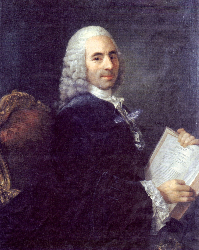

_(François Quesnay, füsiokraatide liider)_

Seega ei ole õigus sama mis seadus. Õigus ei samastu suverääni sõnaga, ega sõltu ainult tema legitiimsusest. See on traditsiooni, õiguskorra toode, mis on enne ja kõrgemal seadusest, mis kehtib nii seadusandjale kui ka ükskõik millisele tavakodanikule.

Õigus "ei looda". See ei ole välja mõeldud ideaalsest visioonist, mida ühiskonna seadused peaksid olema; see avastatakse inimese loomuses ja tsiviilsuse reeglites, mida edastab kommete tarkus.
Inimestel on loomulikud õigused, mis eksisteerivad enne seadust: omand, vabadus, isiksus. Seaduse roll peaks olema nende loomulike õiguste kaitsmine. Järelikult peab riik olema piiratud. Tänapäeval võiksime öelda, et Bastiat on minimaalse riigi pooldaja.

Rousseau süsteemis, millest me eelmisel kursusel rääkisime, on seadusandja ülesanne korraldada, muuta, isegi kaotada omand, kui see tundub asjakohane. Rousseau jaoks ei ole omand loomulik, vaid konventsionaalne, nagu ka ühiskond ise. See idee pärineb Rooma õigusest, millega Rousseau oli sügavalt tuttav.

Omakorda väidab Robespierre, et "Omand on iga kodaniku õigus nautida ja käsutada seadusega talle tagatud varade osa."

Rousseau jaoks ei ole omand seadusest eelnev; see on vaid üldise tahte poolt loodud konventsioon ja selle poolt määratud piirides. Selle tulemusena ei eksisteeri vabadust ega õigust sõltumatult ühiskonnast ja seadusandjate heast tahtest. Kuid kui eraldada omandiõigus, õigustab see kergesti valeõigusi, mis on omandatud teiste õiguste rikkumise teel.

Näiteks: õigus tööle või õigus eluasemele.

Selleks, et ma midagi tasuta saaksin, peab keegi minu eest maksma. Ja kui selle maksab riik, kuna see ei tooda rikkust, saab ta seda teha ainult kellegi kodu või selle ekvivalendi võtmisega, et see mulle anda.

See idee, et omandiõigus on seaduse loomine, viib Bastiati sõnul piiramatule väljale utopistidele, kes soovivad ühiskonda oma plaanide järgi kujundada.

Loodusliku vabaduse süsteemis eksisteerib loomulik seadus, mis on sõltumatu seadusandjate kapriisidest. See kehtib kõigi inimeste jaoks ja on eelnev igasugusele ühiskonnale. Ja valitsuse kohustus on tagada iga üksikisiku loomulikud õigused. Õiglane ühiskond on selline, kus omandiõigusi täielikult austatakse, tähendades kaitset igasuguse teiste sekkumise eest.

Siin seab Bastiat end füsiokraatide pärandi ja sellest kaugemale, õigusfilosoofia traditsiooni Cicero ja Aristotelesega. Seadus ei loo õigusi. Selle ülesanne on neid kaitsta ja seega kaitsta omandit, nii iseenese omandit, isiku terviklikkust kui ka oma töö viljade omandit.

_(Cicero)_

## Õiguslik Röövimine: Seaduse Perversioon

<chapterId>b4122847-e477-578e-ba34-d35844ac4715</chapterId>

Bastiat'i peamine idee teoses "Seadus", tema kuulsas pamfletis aastast 1850, on näidata, miks ja kuidas seadus on muutunud röövimiseks, st privileegide, situatsiooniliste rentide ja fiskaalse meelevaldsuse allikaks.

Mis on seaduse tõeline olemus?

Bastiat alustab seaduse loomulike antropoloogiliste alustega: elu, vabadus ja omand.

Loodusliku vabaduse institutsionaalne süsteem on see, mille puhul ühiskond, isikud ja varad eksisteerivad enne seadusi. Selles süsteemis lisab Bastiat:
Pole seetõttu, et on olemas seadused, on olemas ka varad, vaid seetõttu, et on olemas varad, on olemas seadused.> Omand ja Seadus

Igal inimesel on lubatud kaitsta oma elu ja kasutada oma võimeid. Ja seadus on selle legitiimse kaitse kollektiivne korraldus. Seadus kaitseb õiglust. Mitte positiivset õiglust, mis korraldaks vendlust ja solidaarsust, vaid negatiivset õiglust, mis piirab end ühe inimese õiguste teise omade ülevõtmise ärahoidmisega.

Siiski, kui seadus lakkab olemast negatiivne ja muutub positiivseks, suureneb ühiskonnas ebavõrdsuse tunne ja see genereerib konflikte. Kui me lõpmatult laiendame Seaduse valdkonda, st valitsuse vastutust, avame ukse "lõputule kaebuste, vihkamiste, häirete ja mässude seeriale," kirjutab ta.

Vale heategevus, ütleb Bastiat, on üks peamisi seaduse perverssuse põhjuseid. Mõned inimesed peavad end ülejäänud inimkonnast kõrgemaks ja võimeliseks tegema paremaid valikuid kui teised.

Nad teavad paremini, mis on teistele hea, ja peale suruvad oma heaolu kontseptsiooni kõigile; need on filantroobid. Nad on loonud valed õigused, mida täna nimetatakse sotsiaalseteks õigusteks. Sotsiaalsed õigused ei ole midagi muud kui õigused teiste inimeste töö üle, õigused käsutada oma vara, oma töö vilja üle: õigus eluasemele, õigus tervisele, haridusele, tööle, miinimumpalgale jne.

Mis on röövimine? See on täpselt vastupidine varale, ütleb Bastiat meile. Röövimine tuleb ladina keelest spoliare, mis tähendab röövimist. Oleme näinud, et inimene saab elada ainult asjade omastamise teel, rakendades oma võimeid asjadele, st töötades. Kahjuks võib ta samuti omastada oma kaasinimese võimete toodet, st röövida teda.

Seaduse kogu missioon on vältida seda seadusevastast röövimist, st kaitsta vara ja vabadust, kaks lahutamatut asja.

Niipea, kui põhimõtteliselt tunnistatakse, et seadust saab kõrvale juhtida selle tõelisest missioonist, et see võib rikkuda varasid selle asemel, et neid tagada, järgneb sellele paratamatult klassivõitlus, kas kaitseks röövimise eest või selle korraldamiseks ka enda kasuks.

Seadus muutub loomulike õiguste kaitsmisest ettevõtete ja kategooriliste huvide kaitseks. Röövimine korraldatakse seaduse abil, klasside kasuks, kes seda teevad, ja nende sõprade või klientide jaoks. Bastiat ennustab nii 20. sajandi avaliku valiku koolkonda, mille jaoks seadus on "poliitilise turu" tulemus, mille kaudu inimeste rühmad püüavad rahuldada oma huve teiste arvelt.

Tema jaoks peab Seaduse eesmärk olema lihtsalt "lõpetada kõik röövimised." Kui Riik ei sekku eraellu, on inimesed tõhusalt oma elude omanikud ja vastutavad. Nad teevad oma õnne ise. Nad kannavad oma tegude head või halvad tagajärjed.

Nad on kindlad, et nende loomulikud õigused on tagatud ja puutumatud. Turvalised omandiõigused annavad inimestele võimaluse teha pikaajalisi plaane, sest nad teavad, et nende varad on röövimise eest kaitstud.

> Röövimise puudumine, — see on õigluse, rahu, korra, stabiilsuse, lepituse, terve mõistuse põhimõte, mida ma kuulutan kogu jõuga, ah! ebapiisav, oma kopsudest, kuni viimase hingetõmbeni
Bastiat kirjutas oma teoses "Seadus" mõnda aega enne oma surma. Sajand pärast Frédéric Bastiati surma on õiguslik röövimine selgelt nähtav 1948. aasta Inimõiguste Ülddeklaratsioonis, eriti selle artiklites 22 ("igaühel on õigus sotsiaalkindlustusele"), 23 ("igaühel on õigus tööle"), 24 ("igaühel on õigus puhkusele ja vabale ajale"), 25 ("igaühel on õigus elatustasemele, mis on piisav tervise ja heaolu tagamiseks"), 26 ("igaühel on õigus haridusele").

## Seaduse ja Riigi Roll

<chapterId>52258229-7c7c-592b-aa27-203b03aa41c9</chapterId>

1848. aastal oli Bastiat deputaat. Ta nimetati rahanduskomisjoni aseesimeheks. Seega oli tal eriti hea võimalus vastata küsimusele: mis on Riik? Me pöördume Riigi poole, et tagada oma heaolu. Kuid Bastiat meenutab meile, et Riik ei saa kodanikele midagi anda, mida ta pole esmalt neilt võtnud.

Bastiat alustab tavaliselt aktsepteeritud võrrandi ümberpööramisega: riik toetab rahvast. Siiski ei saa Riik kodanikke toetada, kuna see ei tooda rikkust; see liigutab seda ümber, jaotab ümber. Vastupidi, kodanikud toetavad Riiki rikkuse loomise kaudu.

Lisaks ei eksisteeri Riik iseenesest; on ainult inimesed, kes moodustavad Riigi, kes valitsevad, administreerivad, kes elavad otseselt või kaudselt Riigi arvelt. Seega on Riiki administreerivad inimesed nagu teisedki; nad püüavad rahuldada oma isiklikke huve.

Ja kuna Riigi tegevus on puhtalt ümberjaotav, on see erihuvigruppide surve all. Tõepoolest, teatud erihuvigrupid on mõistnud, et poliitilise tegevuse kaudu on lihtsam raha teenida kui tootlike käitumiste kaudu. Nad püüavad teiste raha varastada Riigi varjus, õõnestades turu tootmisvõimet seaduste, maksude ja bürokraatlike piirangute paljususe kaudu.

Teisisõnu, Riik taotleb ainult klientelistlikke eesmärke ja üldise huvi mõiste on tähenduseta. Iga mõne poolt saadud kasu on teiste arvelt: see ei ole nullsumma mäng, vaid negatiivse summaga mäng.
Bastiat ennustab seega sajand ette poliitilise turu toimimise analüüse, mis kerkiksid esile 1950. aastate lõpus nn Avaliku Valiku koolkonna kaudu, mille asutasid majandusnobelist James Buchanan ja tema kolleeg Gordon Tullock.

Pealegi väidab Bastiat, et Riigil ei ole õigusi, mis ei eksisteeri esmalt üksikisikus. Miks on Riigil õigus tagada, isegi jõuga, iga üksikisiku omand? Lihtsalt seetõttu, et see õigus eksisteerib esmalt üksikisikus. Üksikisikutele ei saa eitada enesekaitse õigust, õigust kasutada jõudu vajadusel, et tõrjuda rünnakuid nende isikute, nende võimete ja nende omandi vastu. See loomulik enesekaitse õigus, mis resideerub kõigis kodanikes, võib võtta kollektiivse vormi ja legitimeerida ühist jõudu.
Seega, et teada saada, kas riigil on õigustatult õigus, tuleb küsida, kas see õigus on indiviidil nende organisatsiooni tõttu ja valitsuse puudumisel.
Seetõttu ei saa riik mingil juhul rikkuda loomulikke õigusi; vastupidi, ta peab neid tagama.

See tagab turvalisuse, nii sisemise kui ka välimise, ning õigluse. See võib olla tugev ja efektiivne oma valdkonnas. Kuid seadus ei saa astuda välja sellest väga rangest rollist, sest siis muutub see mõnede röövimise vahendiks teiste kasuks. Kui seadus on moonutatud, toimib see ebaõigluse vahendina. Seaduse moonutamine viib alati röövimiseni, nagu oleme eelmisel kursusel näinud. See on vahetu, automaatne, vältimatu ja kindel. Seaduse viimine väljapoole selle valdkonda saab ainult rikkuda loomulikke õigusi. Tsiviilühiskond on siis võetud oma võimust (loomulikud institutsioonid, lepingud, vahetused, ühendused) riigi juhtimise kasuks, see tähendab tehnokraatliku ja bürokraatliku juhtimise kasuks.

Selle tulemusena on riigi ainult legitiimsed avalikud teenused Bastiati järgi kolm: sõjavägi, politsei ja kohtusüsteem. Teisisõnu, riik peab tagama üksikisikute sisemise ja välimise kaitse, nende vabaduse ja nende vara. Seega on normaalne, et igaüks panustab sellesse kaitse. Siiski, üle nende legitiimsete funktsioonide, iga teine panus mõnda teise riigi poolt pakutavasse teenusesse on vaatluse all.

> Selle ringi väljaspool, kirjutab Bastiat, religioon, haridus, ühendus, töö, vahetused, kõik kuulub eraaktiivsuse valdkonda, avaliku võimu silma all, millel peaks olema ainult järelevalve ja represseerimise missioon.

Avalike teenuste osas esitab ta lihtsa põhimõtte:
Kui soovite luua funktsiooni, tõestage selle kasulikkust. Tõestage, et see on väärt teenuseid, mida see pakub, võrdne sellega, mida see maksab. Seega järeldab ta, et avalikule sektorile tuleks usaldada ainult see, mida eraõiguslik sektor absoluutselt teha ei saa.

Kokkuvõttes, kui valitsus ületab oma missiooni inimeste ja vara kaitsmisel, julgustab see huvigruppe otsima privileege ja mõjutama võimu, et saada kasu maksumaksjate ja tarbijate arvelt.

> Riik on suur väljamõeldis, mille kaudu kõik püüavad elada teiste arvelt.

Kirjutas Frédéric Bastiat lühikeses pamfletis pealkirjaga Riik.

# Järeldus

<partId>3b62de5c-5d4a-5182-ab14-f7ef13c97e28</partId>

## Frédéric Bastiati pärand

<chapterId>2a2a181a-e477-5be1-ba1f-af59490c364e</chapterId>

Bastiati mõju hakkas 19. sajandi lõpus langema, sotsialismi ja eriti marksismi tõusu tõttu ülikoolides ja teadusinstituutides, mida rahastas avalik raha.

20. sajandiga kadus teadmine ja populaarsus Bastiatist. Teda ei mainitud enam majandusõpikutes. Alles pärast Teist maailmasõda tekkis uuesti huvi vabaduse ideede vastu, mis olid Rooseveltiga ja Euroopa totalitaarsete režiimidega nii ilmselgelt unustatud. Üks selle taaselustamise arhitektidest oli Austria majandusteadlane Ludwig von Mises, üks paljudest Euroopa intellektuaalidest, kes põgenesid Euroopast läbi Hispaania ja Portugali, et jõuda Ameerikasse.
1943. aastal New Yorki asunud Mises korraldas seminare, mis meelitasid kohale märkimisväärseid mõtteid: George Stigler, Milton Friedman, mõlemad tulevased Nobeli preemia võitjad, ja Murray Rothbard, tol ajal Columbia üliõpilane. Just nendel seminaridel rääkis ta esimest korda Bastiat'st kui klassikalise liberalismi peamistest viidetest. Ta tutvustas oma kuulajatele Bastiati traktaate, "Seadus" ja "Riik", mis polnud veel inglise keelde tõlgitud. 1953. aastal laseks üks seminaril osalejatest, Leonard Read, tõlkida Bastiati "Seaduse" inglise keelde ja võtaks enda peale ülesande levitada raamatut kogu riigis oma sihtasutuse kaudu: Majandushariduse Fond.

Kuid see, kes samuti populariseeriks Frédéric Bastiati teese, oli New York Timesi majanduskolumnist Henry Hazlitt, väikeses raamatus nimega: "Majandus ühes õppetunnis", avaldatud 1946. aastal. Otseselt Bastiati ideedest lähtudes püüab ta näidata, et riiklike majanduslahenduste probleem on nende ebaõnnestumine pikemaajaliste katastroofiliste tagajärgede arvestamisel.

Hazlitt alustab oma raamatut Bastiati lõhutud akna looga. Ta võtab loo kokku lihtsa ja ainulaadse õppetunnina:

> Majanduse kunst seisneb mitte ainult otsese, vaid ka pikemaajaliste mõjude vaatlemises igast teost või poliitikast; see seisneb selle poliitika tagajärgede jälgimises mitte ainult ühele grupile, vaid kõikidele gruppidele.

Seejärel rakendab Hazlitt seda õppetundi laiale majandusprobleemide valikule: üürikontroll, miinimumpalga seadused, sõja eeldatavad kasud, avalikud tööd ja eelarvepuudujääk, rahapoliitiline inflatsioon, tariifid ja lõpuks säästud.

Bastiat oli üks Ronald Reagani lemmikökonome, kaua enne kui ta presidendiks valiti. See on vähem tuntud, kuid kaheksa aastat töötas Reagan General Electricu ettevõttes kui selle telesaate võõrustaja CBS-is ja vastutas ettevõtte töötajate koolituse eest. Tema koolitusprogramm oli üles ehitatud turumajanduse sissejuhatavatele tekstidele. Valitud teosed olid kahe austerlase, Hayeki ja Misesi, kahe inglase, Cobdeni ja Brighti, ning ühe prantslase, Frédéric Bastiati omad.

Õppetund, mida Reagan oma töötajatele õpetas, järgides Bastiati, on see, et avaliku kulutamise kaudu kasvu ja tööhõive stimuleerimise müüt on suurim müüt.

Eelkõige oli John Maynard Keynes see, kes pakkus välja, et avalikud kulutused suurendavad tootmist tänu kordajale: kui valitsus ehitab silla, siis selle silla töötajad saavad osta leiba, seejärel saab pagar osta kingi, ja nii edasi. Kui erasektor on languses, saab seda parandada suurte töödega. Kui on tööpuudus, saab riik luua avalikke töökohti.
Kuid nagu Bastiat tabavalt tõestas, on riigisekkumisel perverssed mõjud, mida ei nähta. Ainult hea ökonomist on võimeline neid ette nägema. Võtame näiteks: On illusioon uskuda, et valitsus suudab "luua töökohti", sest iga avaliku sektori loodud töökoha kohta hävitab see töökoha turul. Tõepoolest, avalikud töökohad makstakse kinni maksudega. Avalikke töökohti ei looda; neid tajutakse. Iga riigi kulutatud penn peab tingimata saama maksu või võla kaudu.

Kui me vaatame asju sellest vaatenurgast, selgitas Reagan GE töötajatele, siis nn riiklike kulutuste imed paistavad täiesti teises valguses. Kuna maksud pärsivad tootmist ja avaliku sektori kulutustega loodud rikkus ei suuda täielikult kompenseerida neid, mis jäid maksude tõttu sündimata, et neid kulusid katta.
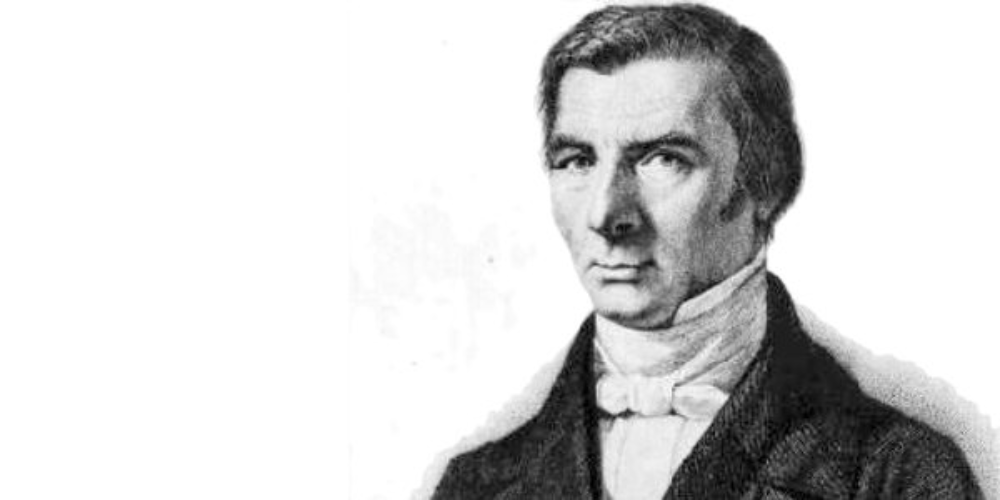

Olemuselt võttis Reagan Bastiat'lt mitu liberaalse ühiskonna- ja inimvaate võtmelementi: tsiviilühiskonna esmatähtsus riigi ees, valiku ja individuaalse vastutuse väärtus, ettevõtja tähtsus rikkuse loomisel, paindliku ja minimaalse õigusraamistiku olulisus, mis võimaldab usaldust ja lepingute austamist, fundamentaalne seadus, et rikkus tuleb luua enne selle jaotamist, soov anda kõigile võimalus konkurentsivõimelistel turgudel...