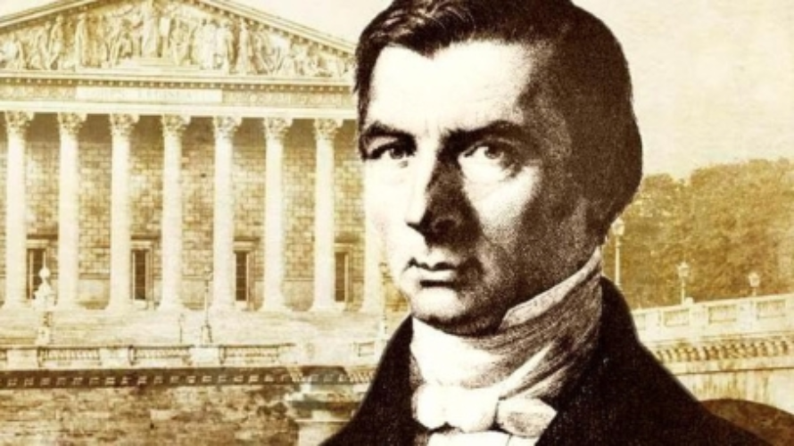
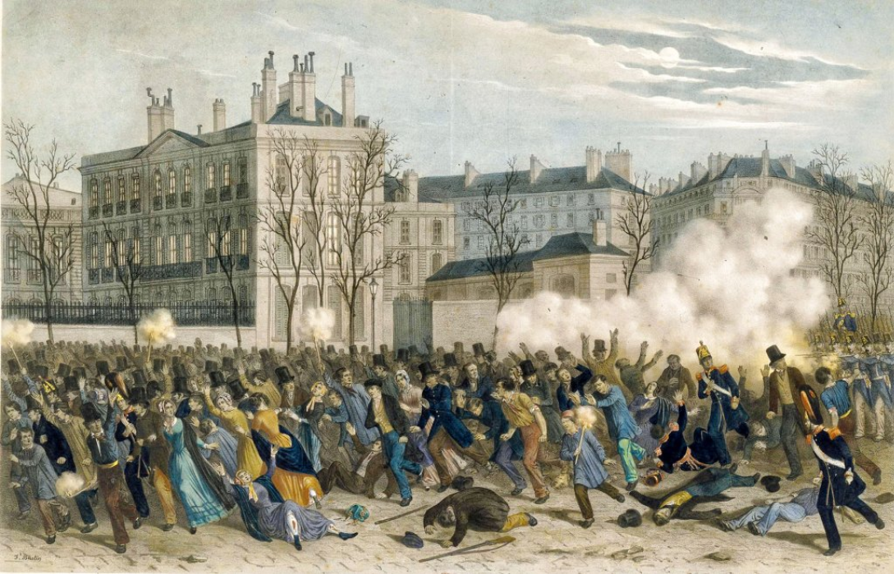
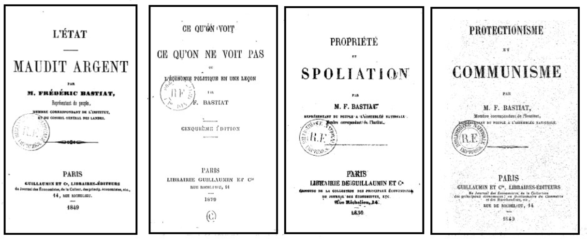
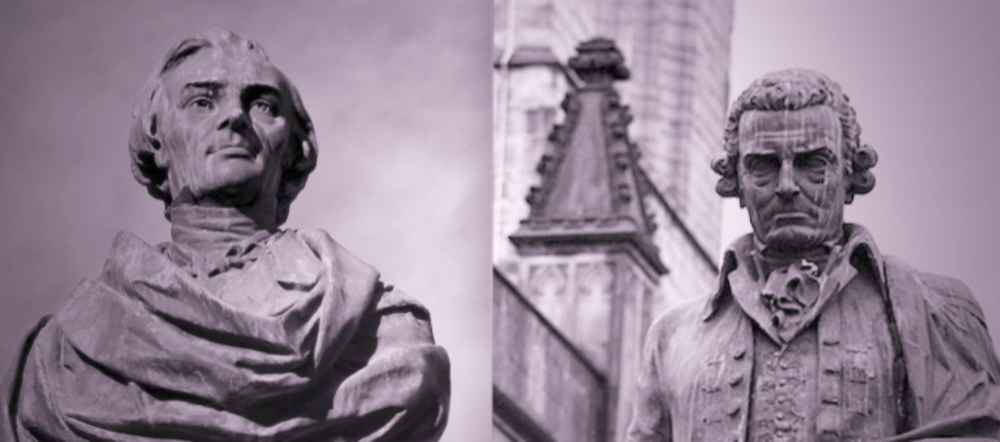
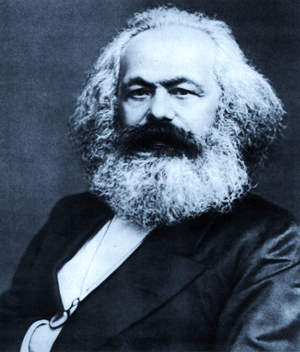
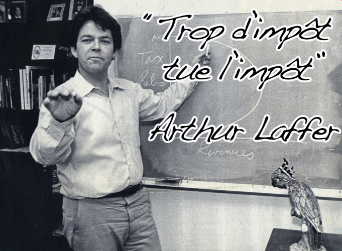
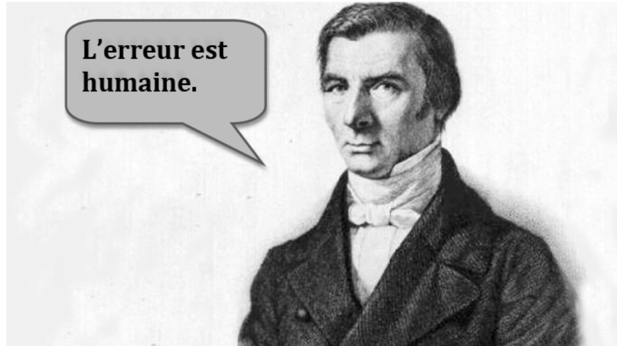
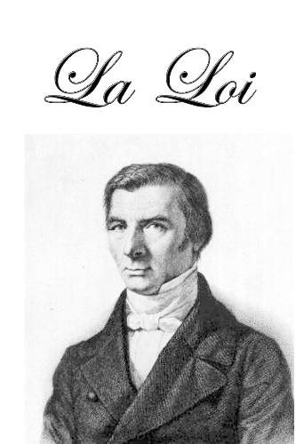

# 弗雷德里克·巴斯夏特世界之旅

本课程由Damien Theillier领导，邀请您深入了解弗雷德里克·巴斯夏特的世界，一位法国经济学家和哲学家，其思想继续影响着当代经济思想。通过21个视频，Damien Theillier探索了巴斯夏特的生活、他的智力影响、他的意识形态对手以及他的经济理论。

课程从详细介绍巴斯夏特的生活和历史背景开始，然后审视标志他思想的思想家，如亚当·斯密、让-巴蒂斯特·赛伊、安托万·德斯图特·德·特蕾西、查尔斯·孔特、查尔斯·杜诺耶和理查德·科布登。接着，课程着眼于巴斯夏特的对手，包括卢梭、古典教育、保护主义、社会主义和普鲁东。

课程的一个重要部分致力于巴斯夏特所谴责的经济诡辩，如“所见与所不见”、“蜡烛制造商的请愿书”、通过税收的掠夺，以及两种经济道德之间的区别。课程还讨论了巴斯夏特所倡导的经济和谐，包括市场的奇迹、责任的力量和真正的团结。

最后，课程以对“法律”的反思结束，讨论了财产权、合法掠夺和国家角色等关键概念。课程的结论回顾了弗雷德里克·巴斯夏特的遗产及其对现代经济的持久影响。

加入Damien Theillier，深入探索弗雷德里克·巴斯夏特的思想，并发现他的观点如何照亮当前的经济和政治辩论。

+++

# 引言

<partId>e4a0cf13-2fc5-5ced-a528-ace3f9029f22</partId>

## 课程介绍

<chapterId>7f21b617-9810-5484-ad1c-befc61432126</chapterId>

本课程是对弗雷德里克·巴斯夏特的介绍，一个未被认识的天才，是我们时代的灯塔。在这个简短的介绍中，我将尝试帮助您发现弗雷德里克·巴斯夏特是谁，以及我们在这个系列中将覆盖的主要主题。

实际上，弗雷德里克·巴斯夏特，生于1801年，在19世纪上半叶生活，曾经是一位重要的作者。然后，逐渐地，他消失了，今天，没有人听说过他，没有人知道他是谁。然而，矛盾的是，这位作者的作品已被翻译成多种语言，包括意大利语、俄语、西班牙语和英语。

二战后，他的一本书在美国出版。这本书变得非常著名，以至于罗纳德·里根本人说这是他最喜欢的书，这本小书名为《法律》。因此，巴斯夏成为在美国最著名的两位法国作者之一，另一位在法国也很知名，那就是亚历克西斯·德·托克维尔。

_(穆格龙市场，巴斯夏的家乡，位于朗德)_

所以，他是一个未被认识的天才，但也是我们时代的一束光。实际上，弗雷德里克·巴斯夏出生于巴约讷，他的一生最初在朗德度过了一段时间，在那里他管理着一个继承来的农业庄园，并最终过上了企业家的生活。然后，他很早就对经济学产生了兴趣，他前往英国，遇到了自由贸易运动的领袖理查德·科布登。巴斯夏被这个运动深深吸引，他确信自由贸易是法国的解决方案，之后决定尝试在法国传播他的思想。他写的文章非常成功，他搬到巴黎经营一份当时叫做《经济学家日报》的报纸。

他也是一位哲学家和社会、社会秩序、正义、法律、权利思考者。在这方面，我们可以说巴斯夏是我们时代的一束光。我想以此作为结论。他是一个试图理解政治市场运作的人。当然，他也是市场经济的捍卫者，对他来说，市场经济最终是创造财富的最佳方式。但除此之外，这也是他未被认识的地方，他理解了政治市场的机制。
当他在第二共和国时期被选为代表时，从那时起，制定法律的是人民。在那个时候，巴斯夏见证了法律在各个方向的膨胀，包括公共服务、社会权利、税收等的创建。

他意识到，从根本上说，没有什么真正改变。人们通过投票和法律处置他人的财产，他称之为合法掠夺。合法掠夺这一现象是他工作的核心，特别是在他生命的最后阶段写的这篇短文《法律》中，他将合法掠夺与财产、财产权进行了对比。他展示了，从根本上说，解决社会问题的真正解决方案是自由，即财产，对自己和自己劳动成果的控制。

在这门课程中，我们将一起通过弗雷德里克·巴斯夏的思想旅行，从塑造他青年时期的作者们的影响开始，然后我们将探讨他的经济诡辩，最后，我们将以这篇伟大的文本《法律》作为结尾，这将引导我们进入政治市场的分析，进入社会的分析。

## 生平和历史背景

<chapterId>e9d92b63-83dd-552c-84e1-dd535608c109</chapterId>

1844年，弗雷德里克·巴斯夏特前往西班牙出差。在马德里、塞维利亚、加的斯和里斯本停留后，他决定启程前往南安普顿，并访问英格兰。在伦敦，他有机会参加反玉米法案同盟的会议，他曾从远处关注该同盟的工作。他遇到了这个协会的主要领导人，包括后来成为他朋友的理查德·科布登。

正是在那里，他的人生轨迹发生了根本性的变化。他自己回忆说，他作为经济学家的职业生涯是在那一刻决定的。回到法国后，他心中只有一个想法：让法国意识到英格兰正在酝酿的自由主义运动。
弗雷德里克·巴斯夏特于1801年6月30日出生在巴约讷。9岁时成为孤儿，他在索雷兹的天主教学院继续他的学业。他在语言方面很有天赋，学习了英语、西班牙语，甚至是巴斯克语。然而，他对学业没有动力，决定不参加学士学位考试，而是选择在巴约讷的叔叔的进出口公司工作。

1825年，他从祖父那里继承了一处农业庄园，用他自己的话说，他作为一名“绅士农场主”管理着它。正是在那时，他首次亲身遇到了由于缺乏清晰的财产权定义而引起的问题。他决定成为他所在城镇穆格龙的和平法官，在朗德的心脏地带，这是波尔多和巴约讷港口之间的商业和河流交汇点。后来，他被选为朗德省议会的成员。

他很快对政治经济学产生了热情，并研究了亚当·斯密、让-巴蒂斯特·赛、德斯图特·德·特拉西、查尔斯·杜诺瓦和查尔斯·孔特的著作。他阅读英文报纸，正是在那里，他得知了一个英国自由贸易联盟的存在。

_(赛、科布登、斯密、谢瓦利耶、杜诺瓦、德斯图特·德·特拉西)_

从英国回来后，他写了一篇题为《英法关税对两国未来影响的探讨》的文章，他将文章发送给了巴黎的《经济学家杂志》。该文章发表在1844年10月的期刊上，取得了巨大成功。每个人都钦佩他有力和尖锐的论证，他的文风朴实而优雅。

《经济学家杂志》随后要求他提供更多文章，政治经济学会的几位成员，特别是让-巴蒂斯特·赛的儿子霍拉斯·赛和著名教授米歇尔·谢瓦利耶，向他表示祝贺，鼓励他与他们一起继续传播经济真理的工作。这标志着他在巴黎的新生活的开始。

他首先出版了《经济谬论》的初始系列，在其中他大胆且讽刺地攻击保护主义者。在巴黎，他甚至在一个私人房间开始了一门政治经济学课程，受到学生精英的热切关注。

次年，他在法国成立了“自由贸易协会”，并投身于在法国与保护主义的斗争中。他筹集资金，创建了一份周刊，并在全国各地举办讲座。
第一次会议于1846年2月23日在波尔多举行，期间成立了波尔多自由贸易协会。不久，这一运动在法国各地传播开来。在巴黎，经济学家协会的成员中形成了一个初始核心，众议员、工业家和商人加入其中。在马赛、里昂和勒阿弗尔也形成了重要团体。

1848年2月革命推翻了路易-菲利普的君主制，即七月王朝（1830-1848），并见证了第二共和国的到来。巴斯夏特随后作为朗德省的代表被选为立法议会的成员。他坐在中左派，与亚历克西斯·德·托克维尔一起，位于君主主义者和社会主义者之间。在那里，他努力捍卫个人自由，如公民自由，并反对来自右翼或左翼的所有限制性政策。他被选为财政委员会副主席，并不断努力提醒他的同僚们这一常被议会遗忘的简单真理：

> 通过法律给予某些人，就必须通过另一法律从其他人那里取走。

他几乎所有的书籍和论文都是在他生命的最后六年，即1844年到1850年期间写成的。1850年，巴斯夏特写了他最著名的两部作品：《法律》和一系列小册子《所见与所未见》。《法律》已被翻译成多种外语，包括英语、德语、西班牙语、俄语和意大利语。

他于1850年在罗马因结核病去世。他被安葬在罗马的圣路易法国教堂。

# 影响

<partId>4d312b17-5740-5d33-8309-015e2b59b6dd</partId>

## 亚当·斯密和让-巴蒂斯特·赛

<chapterId>bcc7a12a-6cc4-5061-85e3-0e31fb1f0a49</chapterId>

在经济学领域，巴斯夏特始终承认他对亚当·斯密和让-巴蒂斯特·赛的债务。26岁时，他写信给一位朋友说：“在这些主题上，我只读过这四部作品，斯密、赛、德斯图特和审查者。”

_(让-巴蒂斯特·赛和亚当·斯密)_
亚当·斯密和J.-B. 赛所构想的政治经济学可以用一个词来概括：自由。贸易自由、个人自由、自由贸易和自由倡议。自由贸易最初由重农主义者如弗朗索瓦·魁奈和文森特·德·古尔奈防御，随后亚当·斯密通过自己的观察将他们的思想综合起来。最后，在18世纪末，让-巴蒂斯特·赛在他的杰出著作《政治经济学论》中澄清和纠正了他的导师亚当·斯密的一些观点。

_(赛、德斯图特·德·特雷西、魁奈、德·古尔奈)_
亚当·斯密对繁荣感兴趣，不是把它当作一个目的，而是作为个人道德提升的手段。对他来说，国家的财富由个人的财富组成。如果你想要一个繁荣的国家，亚当·斯密说，让个人自由行动。市场之所以有效，是因为它允许每个人表达他们的偏好并追求他们的利益。

18世纪初现代经济学家的伟大新奇之处在于，他们对每个个体都感兴趣，并希望恢复他们的行动能力，同时思考如何遏制激情和冲突。人天生想通过商品和服务的交换来改善自己和亲人的处境。

亚当·斯密展示的是，一个人只有通过服务于他人的利益才能服务于自己的利益。

> 给我我需要的，你们就能从我这里得到你们自己需要的。（...）我们期待晚餐，不是出于屠夫、酿酒商或面包师的仁慈，而是出于他们对自己利益的关注。

交换是一个正和游戏。一个人获得的，另一个人也获得。因此，它不同于政治再分配，在那里总有赢家和输家。如果我们考虑英国学派，对于斯密、李嘉图以及在他们之前的洛克来说，价值与劳动相关。对于马克思来说，也是如此。

_(马克思, 李嘉图, 斯密, 洛克)_

另一方面，巴斯夏将会同意让-巴蒂斯特·赛伊的观点，即效用是价值的真正基础。劳动不创造价值。稀缺性也不创造价值。一切都源于效用。事实上，没有人愿意为一个服务付费，除非他们认为它有用。人们只生产效用。
但巴斯夏在这一点上也对赛伊有所微调。这不是关于物品中的效用，而是关于服务的相对效用。"价值是两种交换服务的比率，"根据他自己的话。因此，价值是主观的，观察个人在自由市场中的行为是把握个人偏好的唯一方式。市场揭示了个人偏好，并通过交换成为社会的伟大调节器。

经济遵循一些简单的法则，这些法则源于人类行为。其中之一，被称为"赛伊定律"，如下所述："产品和服务以产品和服务交换。"他的想法是，国家和个人从生产水平的增加中受益，因为它提供了更多的互惠互利的交换机会。

实际上，产品只是在预期买家期望的服务之前购买：我买一张光盘是为了我将要听的音乐，我买一张电影票是为了我将要看的电影。在交换中，每一方都决定，因为它认为从它获得的东西中可以获得比放弃的东西更多的服务。在这种情况下，金钱只是一个中介商品，它补偿了一个提供的服务，并开启了其他服务。

对于巴斯夏来说，交换经济，即自由提供和接受的互惠服务的经济，是支撑和平与繁荣的基础，允许利益的和谐。

但从让-巴蒂斯特·赛伊那里，弗雷德里克·巴斯夏也继承了一个关键概念，即掠夺。因为，他说，回应赛伊的话：

> 获得维持生活、美化和改善生活所必需的东西只有两种方式：生产和掠夺。
生产者依靠说服、谈判和合同，而掠夺者则依靠武力和欺骗。因此，法律的责任是压制掠夺行为，保护劳动和财产安全。正如亚当·斯密所说，确保公民的安全是公共权力的主要使命，正是这一点合法化了征税。

## 安托万·德斯图特·德·特雷西

<chapterId>ddf64e9f-2ce0-5651-8eb8-bae578eb0b9b</chapterId>

虽然鲜为人知，但德斯图特·德·特雷西对未来的美国总统托马斯·杰斐逊产生了决定性的影响，当时杰斐逊是1780年代在巴黎的大使。
> “对每个人来说，他的第一故乡是他的家乡，第二故乡是法国”&“当人民害怕他们的政府时，那就是暴政；当政府害怕人民时，那就是自由。”
>
> 托马斯·杰斐逊

事实上，他的《政治经济论》谴责了保护主义和拿破仑的扩张政策。因此，它被拿破仑禁止在法国出版。然而，它被杰斐逊本人翻译成英文并在美国出版。他将这本文本作为弗吉尼亚大学的第一本政治经济学教科书，这所大学是他刚刚在夏洛茨维尔创立的。这本论文直到1819年才在法国出版！

德斯图特·德·特雷西是一位哲学家和经济学家，是所谓的“意识形态学派”的领袖，这个学派包括像卡巴尼斯、孔多塞、康斯坦、多诺、赛伊和热尔曼·德·斯泰尔这样的人物。他们是重农主义者的继承者，也是图尔戈的直接弟子。

通过意识形态，特雷西简单地指的是处理思想研究的科学，包括它们的起源、它们的法则、它们与语言的关系，也就是用更现代的术语来说，是认识论。"意识形态"这个术语并没有马克思后来赋予它的贬义，用以抹黑“自由放任”的经济学家。意识形态运动的期刊被称为《哲学与文学十日报》。

它主导了革命时期，并由让-巴蒂斯特·赛伊领导。德斯图特·德·特雷西于1808年被选为法兰西学院的成员，1832年被选为道德与政治科学学院的成员。他的女儿在1802年与乔治·华盛顿·德·拉法耶特（第一任美国总统的儿子）结婚，这显示了当时法国与年轻的美国之间仍然存在的密切关系。

他的《政治经济论》的目的是“检查最佳方式利用我们所有的物质和智力能力来满足我们各种需求。”他的观点是，贸易是所有人类福祉的源泉；它是世界的文明化、理性化和和平化力量。他这样阐述政治经济学的伟大原则：“贸易是社会的全部，正如劳动是财富的全部。”实际上，他将社会视为“一个连续的交换系列，在这个系列中，双方承包人总是获益。”因此，市场与掠夺相反。它使一些人富裕而不使其他人贫穷。正如后来所说，它不是“零和游戏”，而是正和游戏。

我们的作者并没有将政治经济学定义为交换的科学。但是，巴斯夏将采用这种推理并加以发展。销售是物品的交换，租赁是服务的交换，而借贷仅仅是一种延期交换。因此，对于巴斯夏来说，政治经济学成为了“交换理论”。

根据德斯图特·德·特雷西的观点，财产必然源于我们的本性，源于我们的欲望能力。如果人什么都不想要，他就既没有权利也没有义务。为了满足他的需求和履行他的义务，人必须使用他通过劳动获得的手段。而符合这一目的的社会组织形式是私有财产。这就是为什么政府的唯一目标是保护财产并允许和平交换。

对他来说，最好的税收是最适度的税收，他希望国家的支出尽可能受到限制。他谴责政府以公共债务、税收、银行垄断和支出的形式掠夺社会财富。再次，法律应该只服务于保护自由；它绝不应该进行掠夺。

最后，他添加了这个建议，这个建议并没有失去其相关性：

> 让政府不制造也不能制造承诺未来几代人并总是导致国家破产的债务。

总之，意识形态家们有一个深刻的直觉，即生产和交换是解决政治问题的真正解决方案，是对战争的真正替代。无论是内部的，如革命期间的，还是外部的，如古代国王和拿破仑发动的那些，战争总是掠夺性的。

## 查尔斯·孔特和查尔斯·杜诺耶

<chapterId>80bc5c4e-ac07-52c8-9dd7-e224ac291bda</chapterId>

所有文明的历史都是掠夺阶级与生产阶级之间斗争的故事。这是我们将要讨论的两位作者的信条。他们是自由主义阶级斗争理论的创始人，这一理论既启发了弗雷德里克·巴斯夏，也启发了卡尔·马克思，尽管后者对其进行了扭曲。

对于孔特和杜诺耶来说，掠夺，即社会中强者对弱者行使的所有形式的暴力，是理解人类历史的关键。它是一类人对另一类人进行剥削的所有现象的起源。

如果弗雷德里克·巴斯夏特的经济学教育源于史密斯、德斯图特·德·特雷西和赛伊，那么他的政治教育则归功于《审查者》杂志的领导者，查尔斯·孔特和查尔斯·杜诺耶。
这份评论（1814-1819年），在百日王朝后更名为《欧洲审查者》，传播了在1830年三光荣日起义和奥尔良公爵路易-菲利普一世上台时取得胜利的自由主义思想。

查尔斯·孔特，奥古斯特·孔特的表亲和赛伊的女婿，是该评论的创始人。不久后，查尔斯·杜诺耶，和他一样的法学家，以及年轻的历史学家奥古斯丁·蒂埃里，圣西门的前秘书，加入了他们。他们在每期评论的首页上的座右铭是“和平与自由”。

这份评论的目标是什么？标题本身就说明了一切：审查政府。通过启发公众舆论来对抗权力的专断，捍卫新闻自由。

_(本杰明·康斯坦特)_

他们从本杰明·康斯坦特那里借鉴了古人和现代人之间的区别，一方面是战争，另一方面是商业和工业。但他们补充说，赛伊认为政治经济学提供了对社会现象最好的解释。他们特别理解，当财产权和自由贸易得到尊重时，国家才能实现和平与繁荣。从现在开始，对他们来说，政治经济学是政治的真正和唯一基础。必须用基于经济利益知识的理论来取代仅限于对政府形式进行抽象批评的哲学。
政治经济学，通过展示人民如何繁荣和衰落，奠定了政治的真正基础。
> 杜诺耶

这一新的社会理论包含了一个元素，这个元素后来成为马克思和恩格斯科学社会主义的基石：阶级斗争。但自由主义的阶级斗争理论是什么，它与马克思主义有何不同？

它从行动以满足其需求和欲望的个体出发。从某人创造，即增加事物的效用，提高其价值的那一刻起，某人就参与了工业。这里，工业家不是当前语言可能暗示的工业所有者，而是生产者，无论他们在哪个领域工作。这就是为什么他们的理论被称为工业主义。它认为社会的目标是在广义上创造效用，即对人类有用的商品和服务。

在这一点上，个体面临两个基本选择：他们可以掠夺他人生产的财富，或者他们可以通过工作自己生产财富。在任何社会中，都可以清楚地区分出那些靠掠夺生活的人和那些靠生产生活的人。在旧制度下，贵族直接攻击最勤劳的人，以一种新形式的贡品生活：税收。贪婪的贵族被成群的官僚所取代，他们同样贪婪。

对马克思而言，阶级对立位于生产活动本身之中，存在于雇员和雇主之间；而对于孔德和杜诺瓦来说，冲突的阶级一方是社会的生产者，他们支付税款（包括资本家、工人、农民、学者等），另一方则是非生产者，他们依靠税收资助的租金生活，“闲散和吞噬的阶级”（官僚、官员、政治家、补贴或保护的受益者）。
然后，与马克思不同，欧洲审查者的作者们并不主张阶级斗争。相反，他们倡导社会和平。据他们说，这只能通过社会的非政治化来实现。为此，首先需要降低公职的声望和利益。然后重要的是要给予生产者在政治机构中的影响力。

最后，消除一个阶级对另一个阶级的剥削的唯一方式是摧毁使这种剥削成为可能的机制：国家分配和控制财产及其相关利益的权力（“职位”）。

他们的观点，深刻创新，将永远标记弗雷德里克·巴斯夏特，他本人将成为政治危机的深刻思考者。

## 科布登和同盟会

<chapterId>7181435c-5eae-56e4-8e55-02a24273fdd6</chapterId>

1838年，在曼彻斯特，一小群直到那时还鲜为人知的男子聚集起来，寻找一种通过合法手段推翻小麦地主垄断的方法，并且，正如巴斯夏特后来回忆的，

> 无需流血，仅凭舆论的力量，发动了一场或许比我们的父辈们在1789年进行的那场革命更为深刻的革命。

从这次会议中诞生了反对玉米法的同盟会，或如巴斯夏特所称的粮食法。但很快，这个目标变成了保护主义的全面和单边废除。

这场为自由贸易而战的经济战役将占据整个英格兰直到1846年。在法国，除了少数内行人外，这一庞大运动的存在几乎完全未被人知。巴斯夏特偶然订阅的一份英文报纸让他在1843年得知了同盟会的存在。他感到兴奋，翻译了科布登、福克斯和布莱特的演讲。然后他与科布登通信，最终在1845年，他前往伦敦参加了同盟会的巨大集会。

正是这场在王国各地为自由贸易进行的鼓动活动，拥有数以万计的成员，点燃了巴斯夏特的笔，从根本上并且永久地改变了他的生活轨迹。

同盟会可以比作一所巡回大学，在全国各地举办的会议中对参加者进行经济教育——普通民众、工业家、耕作者和农民，所有这些人都被同盟会所关怀，而粮食法则压迫了他们的利益。理查德·科布登是这场运动的灵魂和杰出的鼓动者。
他是一位迷人而强大的演讲者，拥有创造引人注目且简洁短语的非凡天赋，这与经济学家的抽象论述迥然不同。
> 什么是面包垄断？他大声疑问。那就是面包的稀缺。你会惊讶地发现，这个国家关于此事的立法没有其他目的，只是为了尽可能地造成面包的最大稀缺。然而，事实正是如此。立法只能通过稀缺来实现其目标。

1845年，巴斯夏在巴黎出版了他的书《科布登与同盟》，书中包含他的翻译和评论。书的开头是关于英格兰经济状况的介绍，以及同盟起源和进展历史的回顾。自1815年以来，英格兰的保护主义非常发达。特别是，限制谷物进口的法律对人民有非常严重的后果。实际上，小麦对于制作面包——当时的一种重要商品——是必需的。此外，这一制度还偏袒了贵族，即大地主，他们从中获得了租金。

> 巴斯夏写道，在英格兰，存在着少数掠夺者和大量被掠夺者，并且不需要成为一位伟大的经济学家就可以得出前者的富裕和后者的贫困的结论。

同盟的目标是动员公众舆论，向议会施压，要求废除谷物法。从长远来看，科布登及其朋友希望：

- 增加工业出口
- 增加就业
- 降低面包价格
- 通过竞争提高农业和工业的效率
- 促进国家间的和平

_(杰里米·边沁)_

作为边沁功利主义的信徒，科布登的信念是，劳动和贸易的自由直接服务于社会中最众多、最贫穷、最受苦的大众的利益。相反，海关作为一种任意禁令和特权的工具，只能惠及某些最有权势的产业。

在1841年的选举中，包括科布登在内的同盟的五名成员被选入议会。到了1846年5月26日，单边自由贸易成为了王国的法律。从那时起，英国将经历一个自由与繁荣的辉煌时期。
有趣的是，巴斯夏借鉴了他们的一部分方法；他吸收了他们的语言，并将其转化为法国的背景。关于《科布登与同盟》的书很快就成为了成功作品，巴斯夏在经济学家世界中轰动一时。他在波尔多成立了一个支持自由贸易的协会，然后将其迁移到巴黎。他被提供了《经济学家杂志》的领导职位。运动由此诞生，并持续到1848年。

直到巴斯夏在1866年去世后，拿破仑三世才与英国签订了自由贸易条约，这对于那位将生命的最后六年奉献给这一伟大理念的人来说，是一种死后的胜利。

_(米歇尔·舍瓦利耶)_
自由贸易的问题今天仍然相关。学校的地理教科书声称，全球化是罪魁祸首，贫穷国家需要西方援助才能生存。然而，极端贫困在20年内减少了一半。通过选择开放，像印度、中国或台湾这样的国家已经能够摆脱贫困，而像朝鲜或委内瑞拉这样的封闭国家则特征为停滞不前。根据联合国的数据，1990年有36%的人类生活在绝对贫困中。到了2010年，这一比例现在“仅为”18%。极端贫困仍然是一个主要挑战，但它正在减少。

# 反对者

<partId>f902ed30-269e-5e44-a76d-8efd1a4e4085</partId>

## 卢梭

<chapterId>c3926110-e0b2-503c-96d9-5d3a6a661484</chapterId>

弗雷德里克·巴斯夏特，他在1840年代表达了自己的观点，是启蒙时代哲学家一代的继承者，他们反对审查制度，支持辩论自由。想想孟德斯鸠、狄德罗、伏尔泰、孔多塞，但也包括卢梭。

对他们来说，理念很简单：允许表达的观点越多，真理就进步得越快，错误也就越容易被驳斥。科学总是以这种方式进步。

_(孟德斯鸠、狄德罗、伏尔泰、孔多塞、卢梭)_
相反，很少有人理解，对于观点是真的，对于商品和服务也是真的。与他人自由贸易确实有两大美德：效率和导致更公平的分配。不仅卢梭没有理解这一点，而且他还以一种错误的法律和权利观念为名，反对这种自由。巴斯夏特指出，社会主义的一个主要来源是卢梭的观点，即整个社会秩序源于法律。

巴斯夏特确实认为卢梭是社会主义和集体主义的真正先驱。在《社会契约》的作者中，有一句话很好地概括了他的哲学：“我们只有在成为公民之后才开始成为人。”

最初，人只是一个市民。但市民是一个计算者；他追求即时的快乐，他被自己的感官、欲望、个人利益所奴役。简而言之，他不理性，因此他不自由。他需要被教育，理解他的真正利益是公共利益。这就是为什么卢梭在《社会契约》中写道：

> 凡是拒绝服从公共意志的人，将被整个集体强迫：这无非意味着他们将被迫自由。

根据这一理论，人内在有两种意志：一种倾向于个人利益，即市民的意志，和一种倾向于公共利益，即公民的意志。即使是通过强制，也要引导人们追求一个理性的目标，公共利益，这就是引导人们成为自由的人。他们真正想要的是一个理性的目标，即使他们不知道。
因此，根据卢梭的观点，以一个他们自己如果更有见识的话本应追求，但因为他们盲目、无知或腐败而没有追求的目标的名义来约束人们是完全合理的。社会的建立是为了强迫他们去做如果他们有见识的话本应自发渴望的事情。通过这样做，人们并没有对他们施加暴力，因为这引导他们成为“自由”的人，即做出正确的选择，这些选择与他们真实的自我相符。

深信良好社会是法律的创造，卢梭因此赋予立法者无限的权力。由他来将个体转化为成就的人，成为公民。
但是，法律也有责任使财产成为现实。根据卢梭的观点，只有当财产受到立法者的规范时，它才是合法的。实际上，邪恶存在于不平等和奴役之中，这两者都源自财产。这是强者的发明，导致了糟糕的社会，资产阶级社会，统治关系。在他的《不平等的起源和基础》一文中，他写下了这段著名的话：

> 第一个圈定一块土地并说：“这是我的”，并找到了足够简单的人相信他的人，是真正的文明社会的创始人。如果有人拔掉栅栏或填平沟渠，向他的同伴们喊道：“小心这个骗子；如果你忘记了果实属于所有人而土地无主，你们就完了！”那么，人类将会避免多少罪恶、战争、谋杀，多少苦难和恐怖啊！

因此，自然财产是邪恶的源头。马克思，作为卢梭的热心读者，会记住这一点。如何对抗这个邪恶？通过社会契约，卢梭回答。实际上，良好的社会是由一个契约产生的，该契约规定了个体将其所有权利异化给社区。从那时起，由社区通过法律授予个体权利。

与卢梭相反，弗雷德里克·巴斯夏说“人生而为财产所有者”。对他来说，财产是人的本性、他的构成的必然结果。他写道：“人生而为财产所有者，因为他生来就有满足生命所必需的需求，拥有满足这些需求所不可或缺的器官和能力”。但能力只是人的延伸，财产只是能力的延伸。换句话说，正是我们在工作中使用我们的能力使财产合法化。

根据巴斯夏的观点，在法律之前就存在社会、人民和财产，他有一句著名的话：“不是因为有法律才有财产，而是因为有财产才有法律”。这就是为什么法律必须是消极的：它必须防止对人和他们的财物的侵犯。财产是法律存在的理由，而不是反过来。

## 古典教育

<chapterId>87d9a8c9-2352-5cb2-8b93-678118a8145c</chapterId>

1848年2月24日，在巴黎发生了三天的骚乱后，路易-菲利普一世国王放弃了他的权力。这标志着第二共和国的诞生。

巴斯夏特当时在巴黎，亲眼目睹了这些事件。后来，他写道：

> 2月24日，我和许多人一样，担心国家还没有准备好自我治理。我必须承认，我害怕学术垄断强加给我们所有人的希腊和罗马思想的影响。

这段话令人惊讶。希腊和罗马的古代有什么关系呢？

巴斯夏特提到了柏拉图的《理想国》和他的哲学家-国王理论，但也提到了卢梭如此钦佩的斯巴达，对于拿破仑如此怀念的罗马帝国。不幸的是，据巴斯夏特说，这些希腊和罗马的思想基于一个错误的前提：立法者的全能，法律的绝对主权。

随便打开几乎任何一本关于哲学、政治或历史的书，都能找到这个根植于我们文化中的观点，即人类是一种被动的物质，从政治权力中获得生命、组织、道德和繁荣。如果放任自流，人类将趋向于无政府状态，只有通过立法者神秘而全能的手才能从这场灾难中得救。然而，巴斯夏特说，这个观点已经经过了几个世纪的古典教育的长期酝酿和准备。

首先，他说，罗马人认为财产是一个纯粹的惯例事实，是书面法律的人为创造。为什么？简单地说，巴斯夏特解释说，因为他们靠奴隶制和掠夺生活。对他们来说，所有的财产都是掠夺的果实。因此，他们无法在立法中引入劳动是合法财产基础的观念，而不破坏他们社会的基础。
他们确实有一个关于财产的经验性定义，“jus utendi et abutendi”（使用和滥用的权利）。然而，这个定义只涉及效果而非原因，换句话说，就是财产的伦理起源。要正确建立财产观念，必须回到人的本质构成，并理解需求、能力、劳动和财产之间存在的关系和必要联系。那些拥有奴隶的罗马人，他们能够构想出“每个人都拥有自己，因此拥有自己的劳动，从而拥有自己劳动的产品”的观念吗？巴斯夏特想知道。

> 因此，巴斯夏特总结说，不要惊讶于看到罗马人认为财产是一个惯例事实和法律机构的观念在十八世纪重新出现；远非法律是财产的推论，而是财产是法律的推论。

的确，卢梭分享了这个将财产基于法律的共同法律观念。卢梭将绝对权力归于法律，因此归于人民，对个人和财产拥有绝对权力。

在这种构想中，自法国大革命以来构成共和国的非常观念，立法者必须像社会建筑师一样组织社会，像从惰性物质中发明机器的机械师，或像塑造黏土的陶工一样。立法者因此将自己置于人类之外，高于人类，根据他那光辉智慧构想的计划随意安排。

相反，对于巴斯夏来说，财产权在法律之前就存在。这就是他所说的经济学家原则，与法学家原则相对立。巴斯夏说，"法学家的原则实际上包含了奴隶制，而经济学家的原则包含了自由。

那么自由是什么呢？它是财产，享受自己劳动成果的权利，工作的权利，发展的权利，按照自己认为合适的方式行使自己的能力，而不受国家的干预，除了其保护性行动之外。

令人悲哀的是，我们的社会和政治哲学仍然固守着这样一种观念，即所有问题的解决方案都必须来自上方，来自法律，来自国家。但这是可以解释的。这些观念每天都在学校和大学里向青年灌输，通过教育的垄断。

然而，正如巴斯夏提醒我们的，垄断排除了进步。

## 保护主义和社会主义
<chapterId>ce6cb8a8-7dc9-5ef7-939d-9a559b4d2c74</chapterId>

_(理查德·科布登)_

正如我们已经看到的，科布登首先是因为与英国联盟一起反对玉米法案的保护主义而开始写文章，然后是书籍，这引导了巴斯夏。

保护主义实际上是一种经济民族主义。它旨在消除外国竞争，同时假装“捍卫国家利益”。然后，他们试图让公共当局接受一系列纯粹的民粹主义谎言，这些谎言被呈现为美德：保护就业，竞争力等。当然，民选官员屈服于生产者的压力，因为这对他们来说是巩固客户群和扩大权力的绝佳机会。

保护就业的论点是巴斯夏所称的谬误。因为实际上，它相当于一种税。它使产品变得更加昂贵。让我们以巴斯夏自己给出的例子为例。

想象一下，一把英国制造的刀在我们国家的售价为2欧元，而一把法国制造的刀的成本为3。如果我们让消费者自由购买他想要的刀，他可以节省一法郎，这笔钱他可以投资于其他地方（在一本书或一支铅笔上）。

如果我们禁止英国产品，消费者将为他的刀多支付一法郎。因此，保护主义导致国内产业获利，而另一个产业（铅笔产业）和消费者则各自损失。相反，自由贸易使两个赢家都感到高兴。

保护主义也是一种阶级斗争的形式。根据巴斯夏的说法，它是基于生产者的自私和贪婪的系统。为了增加他们的报酬，农民或工业家要求征税以关闭市场对外国产品的进入，从而迫使消费者为他们的产品支付更多。

巴斯夏坚定地站在消费者这一边。他提出了普遍利益对抗阶级利益，即消费者的利益，也就是每个人的利益。国家在行动时，应始终从消费者的角度出发。
随着1848年2月革命及其路障的出现，比保护主义更为强大的敌人浮现了，这个敌人与保护主义有许多相似之处：社会主义。它是什么？它是一个政治运动，要求通过法律组织劳动，国有化工业和银行，并通过税收重新分配财富。巴斯夏特现在将投入他所有的精力、才华和著作来对抗这一新的学说，这一学说只会导致权力的指数级增长和永久的阶级斗争。因此，从革命的最初几天起，他就为一个短命的报纸《法兰西共和国》做出了贡献，这份报纸很快就被认为是一份反革命期刊。这是他撰写关于财产、国家、掠夺和法律的小册子的时期。
1848年6月27日，巴黎发生血腥新起义的第二天，他在给理查德·科布登的一封长信中，详细讨论了可能导致这些事件的原因。

- 1° 这些原因中的第一个是经济无知。正是这种无知准备了人们去接受社会主义和虚假共和主义的乌托邦。我在之前的视频中提到了关于这一点的古典和大学教育的倾向。

- 2° 国家开始迷恋于将兄弟情谊和团结引入法律的想法。也就是说，它要求国家直接为其公民创造幸福。在这里，巴斯夏特看到了福利国家的开端。

此后，他将继续分析其不良影响。以下是他在给科布登的信中引用的一个例子：

> 凭借人心的自然倾向，每个人开始要求国家为自己提供更多的福祉。也就是说，国家或公共财政被用来进行掠夺。所有阶层都向国家要求提供生存手段，仿佛这是一种权利。国家在这个方向上所做的努力只导致了税收和障碍的增加，以及贫困的增加。

- 3° 巴斯夏特补充说，在他看来，保护主义是这种混乱的第一种表现。资本家首先要求法律的干预来增加他们的财富份额。不可避免地，工人也想做同样的事情。

总之，根据巴斯夏特的说法，保护主义者和社会主义者有一个共同点：他们从法律中寻求的不是确保每个人自由行使他们的才能和公平奖励他们的努力，而是更多或更少地支持一类公民对另一类公民的完全开发。在保护主义下，是少数人剥削多数人。在社会主义下，是多数人剥削少数人。在这两种情况下，正义都被侵犯，公共利益受到损害。巴斯夏特将它们对立起来。

## 普鲁东

<chapterId>96902abd-6915-5b25-a187-a4790162b86c</chapterId>

皮埃尔-约瑟夫·普鲁东是19世纪中叶法国社会主义的主要代表之一。他特别以1840年在《什么是财产？》中的这句话而闻名：“财产即盗窃”。

这个断言中有些逻辑上的荒谬。因为，如果没有合法获得的财产，从逻辑上讲就不可能存在像盗窃这样的行为。这就是为什么普鲁东后来会澄清，他认为是财产的实际分配构成了盗窃，而不是财产本身，他将财产描述为无政府主义社会的革命性基础。

但普鲁东是个个人主义无政府主义者。他不认为无产阶级或国家是合法的权力来源。他严厉批评共产主义，并倡导工人互助主义，这是一种结构化的合作团结形式，依靠资源的自愿汇集以互相帮助。虽然鲜为人知，但巴斯夏特原则上并不完全反对这个想法。他只是担心国家会将其变成一个事实上的垄断性公共服务。历史证明他是对的。

另一方面，众所周知，在《哲学的贫困》中，马克思会猛烈攻击普鲁东及其他所称的“乌托邦式”社会主义，支持所谓的“科学”社会主义。

1848年6月，普鲁东与巴斯夏特一同当选为国民议会议员。他们是熟人，彼此高度尊重。然而，在1849年，一场响亮的争论中，巴斯夏特在《人民之声》的专栏中与他交换了十四封信件。在这场激烈的交流中，他澄清了自己关于货币和银行问题的立场。争论归结为以下选择：自由信贷还是信贷自由？

普鲁东认为资本利息是贫困和条件不平等的初步原因。他主张由国家银行（交换银行或人民银行）进行无限制的货币创造，并在“自由信贷”中看到解决社会问题的方案。另一方面，巴斯夏特是银行自由的支持者，意味着通过自由进入该职业的权限，加上对自己资金的必要责任，以及竞争自由来调节货币流通。

巴斯夏特分几个阶段驳斥了他的对手。首先，他分析了自由信贷和货币创造的不良影响。这样的系统只会鼓励银行和私人行为者采取最冒险和最鲁莽的行动，因为他们知道自己得到了国家的保护，即纳税人的钱：“让所有人处于这样一种情况是一件严肃的事情：他们说：让我们用别人的财产试试运气；如果我成功了，那对我有利；如果我失败了，那对别人不利。”这是一个预见性的声明，因为它可以适用于我们的时代。

中央银行实行的低利率政策是人为创造货币的一种方式。而过去一个世纪金融系统的连续危机，以及国家的债务，都是其直接后果。

然后，巴斯夏特展示了通过其他更公正、更有效的手段提高工人阶级购买力的可能性。对他来说，降低利率也是自由政策的目标。但这是通过解放和积累资本来实现的，而不是通过废除利息，即自由信贷来实现的。
确实，根据巴斯夏的说法，人类的进步与资本的形成相一致。在他的小册子《资本与租金》中，巴斯夏通过鲁滨逊·克鲁索在他的岛上的经历让我们理解了这一点。

如果没有积累的资本或物资，鲁滨逊将注定死亡。然后他解释说，资本以两种方式使工人变得富有：
- 它增加了生产，从而降低了消费品的价格
- 这有助于提高工资。

在现代社会中，资本充当了一个平衡力量。的确，巴斯夏说：

> “当资本增加时，它会与自身竞争；它的报酬减少，或者换句话说，利率下降。”

总之，普鲁东和巴斯夏都认识到了资本积累的重要性以及某些人剥削他人的倾向。然而，他们得出的结论并不相同。普鲁东，像马克思一样，预见到在资本主义国家中大众的日益贫困化。巴斯夏相信，资本主义将导致所有阶层前所未有的繁荣，以及日益显著的中产阶级的发展。这确实是发生了的事情。

# 经济谬论

<partId>59686d1d-58c6-59a8-9fc4-74a10d24cdbe</partId>

## 可见与不可见

<chapterId>25fb02a9-5d68-5c58-bd0f-d4b8e1fd91f9</chapterId>

在本章中，我将揭示一项全新的技术，一项革命性的技术。一位研究者开发了一副植入了超强大迷你摄像头的仿生眼镜。这项技术允许看到肉眼无法看到的细节。在眼镜的臂部，有一个电子芯片，可以通过我的智能手机直接将图像传输到云端。

这些眼镜的第一个原型的发明者是1850年的弗雷德里克·巴斯夏，在一篇著名的小册子中：《可见与不可见》。这些是经济学家的眼镜。它们允许衡量当局所做决策对我们生活的后果。它们是“让我们看到我们看不见的东西”的眼镜：官僚政策和错误经济理论造成的破坏。我们常常看不到它们的受害者，也看不到它们的受益者，简而言之，它们的真实效果与官方演讲中所声称的相反，这就是巴斯夏所说的“经济谬论”。
根据巴斯夏的说法，好的经济学家必须描述政治决策对社会的影响。然而，他们必须关注的不是对特定群体的短期效果，而是对整个社会的长期后果。这些政策的受害者和受益者是谁？某个法律或政治决策的隐藏成本是什么？如果不是政府，纳税人会怎样使用从他们那里征收的税款？这些是根据巴斯夏的说法，好的经济学家所提出的问题。

因此，在《公共工程》中，巴斯夏写道：

> 国家开辟了一条道路，建造了一座宫殿，矫正了一条街道，挖掘了一条运河；由此，它给某些工人提供了工作，这是可见的；但它剥夺了某些其他人的工作，这是不可见的。

最著名的诡辩之一是破窗谬误。有人声称，房屋的窗户被打破对经济没有害处，因为这对玻璃匠有利。但巴斯夏将会展示，破坏并不符合我们的利益，因为它不创造财富。它的成本超过了它的产出。打破邻居窗户的小男孩给了玻璃匠工作。但这是他的朋友如何安慰他的：
> “每朵乌云都有银色的边。这样的事故保持了行业的运转。每个人都需要生活。如果窗户从未被打破，玻璃匠将何去何从？”

因此，根据凯恩斯的观点，通过强制支出，财产的破坏将刺激经济，并对生产和就业有“乘数效应”的活化作用。这只是看到的部分。

但未被看到的是，如果没有修理窗户的开销，业主本可以用那笔钱购买的东西，现在却不得不放弃。未被看到的是破窗业主失去的机会。他本可以将给玻璃匠的钱分配给其他事物。如果他没有花钱修理窗户，他本可以将钱用于自己的消费，从而雇佣人们进行生产。

因此，打破窗户对经济的“刺激”不会比不打破窗户时更多。然而，在第一种情况下，会有净损失：窗户的价值。

要学习的第一课是，“好”的决策或“好”的政策是指对社会的成本比其他资源配置可能的成本要低的决策或政策。评判政策的有效性不仅应基于其效果，还应基于可能发生的替代方案。这就是巴斯夏所珍视的“机会成本”概念。

第二课是，破坏并不像凯恩斯主义者认为的那样刺激经济，而是导致贫困。物质财富的破坏对经济没有正面影响，与普遍信念相反。使用弗雷德里克·巴斯夏文本的结论性词句：“社会损失了被不必要破坏的物品的价值。”

以一个当前的例子。一旦汽车工业遇到困难，政策制定者就会想象出报废计划来“重新启动”它。我们看到的是雷诺和标致的销售增加。我们看不到的是其他经济部门的损失，以及完好无损的汽车被销毁。

但有其他方法可以刺激经济。如果国家从事重大项目或在某些工业部门投资资金以支持就业，这难道不是增长的好消息吗？巴斯夏会回答说，不再是了。因为公共支出将由什么来资助？通过提高税收或债务，即看不见但非常真实的成本，这将影响增长。此外，政府并不生产任何东西；它只是将资源从私人用途中转移出来。我们看不到的是，如果资本没有从私营部门撤出以资助政府计划，本可以生产的许多东西。

最后，几乎在凯恩斯之前一个世纪，我们可以说巴斯夏驳斥了凯恩斯主义的诡辩，这些诡辩声称国家债务鼓励经济，公共支出产生增长。

从这一系列文本中得到的重大教训是，国家干预有着不被看到的有害效应。只有一个好的经济学家能够预见它们。政治是我们所看到的。经济是我们看不到的。
## 蜡烛制造商的请愿书
<chapterId>f4e759ed-1cb2-55c7-885e-0a60244758a4</chapterId>

1840年，众议院投票通过了一项法律，增加了进口税，以保护法国工业。这就是我们今天仍然遇到的著名的经济爱国主义。

巴斯夏特随后撰写了一篇讽刺性文本，后来成为他最著名的作品之一：“蜡烛制造商的请愿书”。它展示了某些组织良好的生产者压力团体如何从国家获得不当的特权，而损害了公民的利益。同时，它也展示了保护主义立法的荒谬和破坏性质。

在这份请愿书中，蜡烛制造商请求众议员对抗一个危险的竞争对手提供法律保护：

> 我们遭受着一个外国竞争对手的难以忍受的竞争，这个竞争对手似乎在生产光源方面处于如此优越的条件，以至于他以极低的价格充斥我们的国内市场。

那么，这个不公平的外国竞争者是谁呢？不是别人，正是太阳。生产者们随后强调了通过法律命令关闭“所有窗户、天窗、遮阳帘、百叶窗、窗帘、风窗，一句话，所有开口、孔洞、缝隙和裂缝，这些都是太阳光习惯进入房屋的地方”的机会，将“国内市场保留给国内劳动力”。

换句话说，蜡烛制造商试图展示“外国竞争者”（太阳）对法国经济的有害影响。因为太阳不仅能提供与蜡烛相同的“产品”，而且还能免费提供。两百年后，这个故事仍然具有难以置信的相关性。考虑到出租车司机要求法律禁止VTC和Uber。想想那些想要禁止亚马逊的书店。

巴斯夏特在这个虚构作品中的真正对手是政治和选举保护主义，这种保护主义完全依赖于生产者的贪婪和消费者的天真。他揭露了当时坏资本家与国家之间的勾结。坏资本家不是通过创新和适应市场来获得利益，而是寻求通过保护主义获得政治优势。这总是导致对消费者的掠夺，即不公正。
简而言之，保护主义是一种有意针对消费者而非生产者的政策。然而，根据巴斯夏特的观点，真正代表普遍利益的是消费者，因为我们都是消费者。此外，经济的目的是满足我们的需求，而不是为了工作。
保护主义还依赖于一个隐藏的三段论，结果却是一个谬误：

- 我们工作得越多，我们就越富有；
- 我们要克服的困难越多，我们就越努力工作；
- 因此，我们要克服的困难越多，我们就越富有。
让我们用巴斯夏特讲述的几个短故事来说明这种荒谬。在《经济谬论》第二系列的第三章中，他想象了一位木匠向部长提交了一份请愿书，请求制定保护主义立法。木匠这样表达他的请求：部长先生，请制定一项法律，规定“任何人不得使用由钝斧制成的梁和椽子。”换句话说，就是制定一项在法国禁止使用锋利斧头的法律。这样，原本需要100斧击的地方，就需要施加300斧击。木匠的需求将大增，因此报酬也会更好。

在第十六章中，有另一篇非常讽刺的文本，标题为：右手和左手。一位皇家特使在调查后起草了一份报告，他向国王提议切断或至少捆绑所有工人的右手。因此，他继续说，工作和因此财富将增加。生产将变得更加困难，这将需要大量招聘额外的劳动力和增加工资。贫困将从国家消失。

遵循这种不惜一切代价创造就业的逻辑，为什么不也用独轮车替换卡车，用茶匙替换铲子呢？所有这些谬论有一个共同点：它们混淆了手段和目的。对于巴斯夏特来说，经济的目标不是保留工作岗位。我们不应该仅凭工作的持续时间和强度来判断工作的效用，而应该根据其结果：满足需求，效用。

这种手段和目的的混淆在“金钱即财富”的口号中找到了体现。
这是大多数国家货币政策的主导原则。实际上，人为增加货币数量使银行能够向个人和国家贷款，从而轻松偿还债务，这是“我们所看到的”。但是“我们没有看到的”是，这种基于任何实际财富创造的货币创造，将导致通货膨胀和储户的破产。

根据巴斯夏特的观点，真正的财富因此是我们通过工作生产出来满足我们需求的有用物品的集合。因此，金钱只是一种常用的交换手段，它只扮演了一个中介的角色。

## 通过税收的掠夺

<chapterId>551fc499-2119-5a52-9114-412d29434c22</chapterId>

> 当富人减肥时，穷人就会死去。

这句话，归功于老子，描述了一个不可避免的后果，即旨在对富人征收更重税负的税收系统。

然而，你是否听说过：

> 税收是最好的投资：它是一种滋养的露水！看看它支持了多少家庭，并且在思考中追随它对工业的影响：它是无限的，它是生命。

在法国，公共开支被视为一种福利，税收高于其他国家。但巴斯夏特立即警告我们：“在每一笔公共开支背后，都隐藏着一个更难以辨识的恶。”

这是关于什么的？
经济描述了政治决策对我们生活的好坏影响。然而，根据巴斯夏特的观点，经济学家必须注意的不仅是对特定群体的短期效应，而更应关注其对整个社会的长期后果。
> “我们看到的是社会贡献所允许的劳动和利润。我们看不到的是，如果这些贡献留给纳税人，将会产生的工作。我们看到的是社会贡献所允许的劳动和利润。我们看不到的是，如果这些贡献留给纳税人，将会产生的工作。”
>
> F.巴斯夏特

他从一开始就反驳了一个仍然流行的论点，即通过税收资助的公共支出能创造就业。实际上，税收并没有创造任何东西，因为国家所花费的，纳税人就不再花费。

此外，国家比个人更浪费。的确，他提醒我们，国家不拥有任何东西；它不产生任何财富。公共支出往往是浪费的来源，因为从个人那里没收的巨额资金逃脱了其所有者的责任，并由官僚代表他们花费，这些官僚受到压力团体的影响。

当然，作为交换获得的等价公共服务的支付，税收是完全可以辩护的。但在法国，国家给税收分配了几个角色。

最初，它应该用来覆盖共同的费用。然后，税收也被赋予了调节经济的角色。在这种情况下，政治家和官僚拥有的权力仅受他们的善意限制。沉浸在他们的人为构造中，他们通过对各个行业征税和监管，根据自己的心血来潮来偏爱或不利于它们，从而塑造经济。

最后，税收被赋予了社会角色。它们被视为社会正义的工具。因此，税收不应以相同的方式影响每个人。税收必须是再分配的，从“有更多的”人手中分配给“有更少的”人。

问题在于，税收的构想受到掌权者的任意性影响。它们根据权力方是否期望从他们那里获得选票，来偏爱或不利于某些社会类别。此外，累进税率对公共财政的贡献很少。然而，它们允许多数人剥夺少数人的权利，并自然而然地变成没收性的。

这就是为什么巴斯夏特已经理解了拉弗曲线。亚瑟·拉弗是一位美国经济学家，以其著名的“曲线”（一个椭圆）闻名，该曲线于1974年发布，显示税收收益随着税率的降低而增加。这是过度征税的递减回报理论。

政治家们天真地假设税率和税收收入之间存在自动且固定的关系。他们认为通过加倍税率可以加倍税收收入。根据拉弗，这种方法忽略了一个事实，即纳税人可能会根据新的激励措施改变他们的行为。
拉弗曲线显示，当税率达到100%时，政府收不到任何税收。相反，任何减税措施都将刺激经济活动，从而增加国家收入。实际上，降低边际税率刺激投资、工作、创造力，从而促进经济增长。足够的减税可能通过大幅扩大税基来产生足够的经济刺激，以显著增加公共收入。

巴斯夏特可能会补充说，减少国家支出的重要性应与减税同等重视。尽管如此，正如玛格丽特·撒切尔，弗雷德里克·巴斯夏特的门徒，所恰当地指出的：
目标不是让富人变穷，而是让穷人变富。她在对社会主义者发表讲话时这样说。

## 两种道德

<chapterId>c518e449-f638-553c-9a49-15da48023d41</chapterId>

每个人都知道莫里哀的喜剧《伪君子》，其中一个狡猾的虔诚者试图诱惑埃尔米尔并欺骗她的丈夫奥尔冈。如何保护自己不受这种伪君子的欺骗，他假装对你好，同时却在暗中对你不利？

巴斯夏特指出，结束这种冒名顶替的方式有两种：纠正伪君子或启蒙奥尔冈。当然，伪君子总会存在，但如果愿意听他们话的奥尔冈少了，他们造成伤害的能力将大大减弱。

人类理性的弱点是滥用自由的根源。这是人类的主要限制，也是许多邪恶的原因。因此，有必要启蒙人们的良知，关于人类行为的有益或有害，以及因此公正或不公正的本质，无论是个人还是集体行为。

然而，巴斯夏特在《经济谬论》第二系列的一章《两种道德》中概述了启蒙公民判断的两种互补方式。

- 首先，有一种“哲学或宗教道德”，通过净化和纠正人类行动（作为行动者的人）
- 然后，有一种“经济道德”，通过向人展示“他的行为的必然后果”（作为受害者的人）
实际上，这是两种完全互补的道德框架。

1. 第一种道德关注心灵，鼓励个体行善；这是宗教或哲学道德。这是最高尚的。它在人的心中植入了他的责任意识。它告诉他：

> 改善自己；净化自己；停止作恶；行善，驯服你的激情；牺牲你的利益；不要压迫你有责任去爱和帮助的邻居；先要公正，然后才能慈善。

简而言之，它教导美德，无私的行为。巴斯夏特说，这种道德将永远是最美丽和最感人的，因为它展示了人类最美好的一面。

2. 另一种通过了解其效果来揭露和对抗邪恶，这是经济道德。它针对的是智力而非心灵，旨在启蒙受害者关于一种行为的负面效果。它加强了经验的教训。它努力向被压迫的大众传播常识、知识和不信任，使得压迫变得更加困难。

这种经济道德追求的结果与宗教道德相同，但是从人类行为的效果出发。它教导我们反对不公正或有害的行为，并捍卫那些公正或有益的行为。

巴斯夏特在这里强调了科学的作用，特别是经济科学的作用。尽管与传统道德不同，但它在对抗各种形式的掠夺中的作用同样必要。道德在意图上攻击恶行，它教育意志。另一方面，科学通过理解恶行的效果来攻击恶行，从而促进美德的胜利。

具体来说，巴斯夏特描述的经济科学，作为防御性道德，包括反驳经济谬论以彻底驳斥它们，从而剥夺掠夺阶级的辩解和权力。
政治经济学因此具有明显的实用价值。它揭示了隐藏成本中的掠夺行为、竞争的障碍以及各种形式的保护主义。
再次，如果没有那么多的奥尔冈去倾听他们，塔图夫就会少很多。巴斯夏特在这个问题上有如下看法：

因此，让宗教道德触动塔图夫的心灵吧，如果可能的话。政治经济学的任务是启迪他们的愚弄者。这两种方法中，哪一种对社会进步最有效？必须说出来吗？我相信是第二种。我担心人类无法逃避首先学习防御性道德的必要性。

当然，政治经济学不是万能的科学；它并不排除哲学和宗教方法。"但是，谁曾经以其名义提出过如此过分的要求呢？"巴斯夏特想知道。

有一件事是肯定的，政治家无法改变事物的进程和完善人类。相反，有必要限制政治家并将他限制在他的严格角色内，即安全。相反，通过对思想的工作、通过教育和指导，简而言之，通过文化、家庭、宗教和社团领域的活动，通过公民社会，可以加强责任感和团结。

# 经济和谐

<partId>db04dfa4-a53e-5d3e-a307-a68ebc36dc4f</partId>

## 市场的奇迹

<chapterId>895ccd1d-7b52-5a8b-8b2c-6ec0056cf632</chapterId>

一个和谐的社会能够没有书面法律、规则、镇压措施吗？如果人们被留下自由，我们不会见证混乱、无政府状态、组织混乱吗？如果不通过法律和中央政治组织，如何避免仅仅是行动不协调的个体的并列？

这是那些要求市场监管或仅由社会协调个体成为一个连贯和谐整体的人们经常引用的论点。

这不是巴斯夏特的观点。据他说，社会机制，就像天体机制或人体机制一样，遵循一般法则。换句话说，它已经是一个和谐有序的整体。而这个组织的引擎是自由市场。

他告诉我们，自由市场的奇迹在于它使用了没有任何一个人能够单独拥有的知识，并且它提供的满足感远远超过任何人为组织所能做到的。

巴斯夏特给出了一些例子来说明这个市场的好处。我们已经变得如此习惯于这一现象，以至于我们不再注意它。
让我们考虑一个村庄里的木匠，他说，并观察他为社会提供的所有服务和他所接受的所有服务：
> 每天醒来，他穿衣服，而他亲自没有制作任何衣服。然而，为了让这些衣服能够供他使用，必须在全世界完成大量的工作、工业、运输和巧妙的发明。
然后他吃早餐。为了让面包每天早上出现在他的餐桌上，必须清理土地，耕种；铁、钢、木材、石头必须转化为工具；所有这些事物，每一项单独拿出来，都假设了投入的工作量是无法估量的，不仅在空间上，也在时间上。

这个人将送他的儿子去学校，接受教育，这预设了研究，多年的先前学习。

他走到外面：他发现一条铺好并且照明的街道。

他的财产受到争议：他将找到律师来维护他的权利，法官来维持这些权利，司法官员来执行判决；所有这些事情仍然预设了获得的知识，因此预示着启蒙和生存的手段。

巴斯夏特将市场描述为一种分散且看不见的合作工具。通过价格体系，它传递了每个人的需求和技能信息，它连接了想要合作以改善他们存在的人们。

巴斯夏特得出的结论是令人震惊的，即这个人从社会中获得的好处与如果他只依靠自己的资源所能提供的好处之间存在着巨大的不成比例。在一天之内，他消费的商品是他自己无法生产的。

1958年，美国作家莱昂纳德·里德（经济教育基金会）在《自由人》杂志上发表了一篇短文，以巴斯夏特的方式撰写，这篇文章非常著名：“我，铅笔”。这篇文章是对自由市场是什么的隐喻。它是这样开始的：

> 我是一支铅笔，一个普通的木铅笔，对所有男孩女孩和会读写的成年人来说都很熟悉。它是人类文明中最简单的物品之一。然而，这个地球上没有一个人知道如何生产我。

它重新审视了巴斯夏特关于数百万个彼此不认识的个体之间的无形合作的想法，这种合作导致了像铅笔这样平凡事物的构建。没有人知道如何独自制造一支铅笔。然而，数百万人类在不知情的情况下参与了这支简单铅笔的创造，通过一个价格体系交换和协调他们的知识和技能，没有任何上级权威指导他们的行为。这个故事证明了，追求合法利益的自由个体比任何计划和中央集权的经济策略更能造福社会。

1976年诺贝尔经济学奖得主米尔顿·弗里德曼也重新讲述了这个铅笔的故事，向公众解释市场经济是如何运作的。

在他的电视系列节目《自由选择》的一集中，他分析了像铅笔这样平凡简单物品的各个组成部分，并强调了由世界各地成千上万的经济互动产生的自发秩序的奇迹。这些彼此不认识、不共享相同宗教或习俗的人，仍然设法协调生产这个物品。他得出结论，自由市场对于确保不仅是繁荣，而且是和谐与和平至关重要。

弗里德里希·哈耶克在1945年的论文《社会中知识的使用》中已经解释了为什么市场经济和决策的去中心化对于繁荣至关重要。根据哈耶克的说法，没有任何中央规划者或官僚能够拥有足够的知识来成功指导整个经济行动。只有在自由市场中的价格体系才允许数百万独立行动者自己决定如何有效分配资源。
经济规划，宣称能比市场做得更好，不仅导致资源分配不良，还导致一个阶级对另一个阶级的霸权。这就是为什么社会主义不仅是一个智力上的错误，而且是一个最终产生巨大不公的错误。

## 自由和责任是社会问题的关键

<chapterId>78baa7ef-2c80-5fc7-8881-c1be4662b96f</chapterId>

1845年，巴斯夏在给阿方斯·德·拉马丁的一封信中写道，他的整个哲学都包含在一个原则中：

> 自由是社会组织的最佳形式。

然而，他添加了一个条件

> “法律不应消除每个人行为的正面或负面后果。这是责任的辅助原则。”

换句话说，自由和责任不可分割；它们是不可分的。对他来说，自由主义与社会主义的区别在于，自由不能没有责任存在。但是，自由和责任这些词究竟涵盖了哪些现实？

自由本质上是以一种消极的方式定义的：自由是在行使自己的权利时不受外部强制。然而，这并不意味着没有任何约束。因为自由要求互惠：它也要求我们在行动时不侵犯他人的财产，必要时还要修复任何造成的损害。这就是责任。

因此，责任在某种程度上代表了自由的积极方面：只要一个人自由行动，就必须承担自己行为的后果，无论好坏。

个人责任既是创造力的重要载体，也是谨慎和预见的激励。

当一个人花自己的钱时，会小心不过度负债，检查产品的质量，供应商的可靠性，以免遭受重大惩罚。这就是责任的力量，与自由结合，它是社会进步的真正引擎。

但是，不负责任或逃避责任的现象从何而来？弗雷德里克·巴斯夏给出了这个问题的答案，一个政治答案。他说，我引用：

> “国家的干预剥夺了我们自我管理的权利。”

的确，国家主义不断减少私人主动性和人们的自由选择。它代替他们做他们自己能做得更好的事情。因此，它使个人免受其行为后果的影响。它破坏了责任感。

根据巴斯夏的说法，法律的肥大和国家的过度干预导致了权力斗争、掠夺、特权、垄断、战争，简而言之，一切阻碍文明进步的事物。
过分偏向法律或官僚控制的路径的风险在于，它通过施加一大堆约束来消除所有动机，从而剥夺了私人主动性和自由选择所允许的多种进步。

让我们用一些主要的当前话题来说明这个问题。首先，2008年的危机。

_(艾伦·格林斯潘，美国中央银行——联邦储备系统的主席，1987年至2006年)_

多年来，货币政策领导者解释说，如果在一切顺利时利润被私有化，那么在破产时损失将会共同承担（纾困、救助计划、利率操纵、印钞等）。通过这样做，他们创造了道德风险，他们促进了不合理的风险承担，并鼓励金融界不负责任地行事。他们因此将金融推入我们所经历的危机之中。

只要银行仍然处于中央权威的控制之下，这种现象将无限期地重复，这些中央权威假定通过移除所有决策和操作的自主性来保护它们。

另一个例子：公共服务

每项公共服务都强加了官僚精英的偏好，损害了个人的自由选择。这导致了巴斯夏特所说的两个后果：公民“停止对自己的满足行使自由控制，不再承担责任，自然也就不再具有判断力。”原因很简单：每一项成文法都是强制性的，对每个人都是一样的，它不考虑公民的特定情况、需求和偏好。

最后，公共服务是导致停滞不前的原因。实际上，当私人服务变成公共服务时，它们就逃脱了竞争。因此，巴斯夏特说，我引用：“官员缺乏推动进步的刺激。”

当我们观察国家教育的公共服务时，我们理解了巴斯夏特的意思。它减轻了绝大多数父母教育孩子的负担，将学校简化为日托所。它不鼓励教师创新和冒险，因为在这样的系统中，他们仅仅是执行一个没有他们参与设计的计划的执行者，由官僚们设计。最后，它忽视了每个个体的特定需求的现实。

我们将在另一课程中看到，根据巴斯夏特的观点，一个国家的唯一合法公共服务是三个方面：军队、警察和司法系统。但是总结责任问题时，国家干预的问题在于，做出决策的人不是那些承受后果的人。
换句话说，集体选择不是负责任的选择，因为一方面，它们不要求决策者承担任何风险，另一方面，它们迫使其他人承受某些后果，这既灾难性又不道德。

## 责任的力量

<chapterId>0c078806-6c58-53f9-a720-5fb62386e56b</chapterId>

在前一课程中，我们看到了为什么自由和责任是社会问题的关键。我们现在将通过展示弗雷德里克·巴斯夏特如何看待困扰社会的弊病及其解决方案，来更深入地探讨这一点。

自由主义者有时因忽视邪恶并在理想世界中构建纯粹完美自由的乌托邦而受到批评。关于我们的作者，这种批评完全是没有根据的。

没有人能忽视人类社会历史中盛行的邪恶：不公正、战争和苦难。我们希望能够消除这些邪恶。这也是从卢梭到海德格尔，通过黑格尔和马克思的大部分现代哲学的对象。
弗雷德里克·巴斯夏特说，邪恶不仅是一个明确的现实，而且在历史和人类行动中也扮演着角色。它可以被减少，但肯定无法完全根除，因为那将意味着杀死自由和责任。那么，邪恶从何而来，它的角色是什么，又该如何预防呢？
为了回答这些问题，巴斯夏特将继续分析人类行动。这确实可以导致善与恶。

邪恶首先源于我们的不完美。巴斯夏特说，自由选择就意味着冒着做出错误选择的风险。事实上，我们可以在许多方面被欺骗，甚至关于我们自己的需求和利益。人是易犯错的，他容易在理解经济法则的运作或将其从其目的中偏离时犯错。

因此，理性的不完美是人的主要限制，也是我们苦难的根源。
如果邪恶源于人类的弱点，而不是自由本身，也不是自由贸易，那么解决办法不在于压制自由或交换，而在于责任本身，因为责任是所有经验的源泉。巴斯夏特引述的责任原则如下：

> 每个行动的人都会收到他行为的奖励或惩罚。

通过这种自然的制裁，人类学习、发现、自我纠正、进步和改善。换句话说，责任是完善和进步的原则，正如我们在前一课程中看到的。

如果一个人承担他决定的后果，无论好坏，他将通过经验学习而 tend to improve。因此，个人责任，根据巴斯夏特的说法，是教育民族的伟大教育者，是所有行为和社会调节的基本原则，必须允许其发挥作用。

邪恶产生苦难，苦难使我们理解过错或错误，它将我们带回正确的道路。通过了解邪恶，我们才能进步。

正是因为人有犯错或行为不当并承受后果的风险，他才被鼓励要负责任。然后，他将努力预见可能打击他的危险，以保护自己。

因此，很明显，巴斯夏特远非盲目。他不否认邪恶的存在。人类是脆弱的，容易犯错和过失。在任何地方都不会看到巴斯夏特否认个人自由的行使与错误的可能性、不合理或无意义选择的可能性相关联的事实。

他简单地断言，如果邪恶的源头在于自由的缺失，那么解决办法就在于自由本身，更具体地说，在于个人责任的充分和完整行使。

但如果自由的误用是我们苦难的起源，其正确的使用就是解决办法，即个人责任的充分和完整行使，基于财产权。因此，社会规制通过责任而非国家在所有领域的干预来实现，后者是掠夺的重大来源，因而也是邪恶的来源。

与寻求通过集体机构根除邪恶的卢梭相反，弗雷德里克·巴斯夏特捍卫邪恶和错误的可能性，没有这些就没有自由或个人责任。因为正是这种责任，通过发现的过程，允许进步和减少社会弊病。
必须明确的是，通过责任实现进步的发展绝不是自动的。它根本不像黑格尔或马克思那样，是某种自然的或历史的决定论，这种决定论会奇迹般地或机械地导致和谐与进步。它关乎逐渐且无限地减少邪恶，而绝不是关于其最终的消除。

## 真假团结

<chapterId>fa2172e9-22fa-5c01-a3c8-1e8316c064a4</chapterId>

弗雷德里克·巴斯夏在他著名的小册子《法律》中，谴责了法律的堕落，即在“团结”之名下合法化实际上应该被称为掠夺的行为。实际上，通过法律强加兄弟情谊，即我们今天所说的“社会正义”或团结，这其中存在矛盾。

因为道德被定义为自愿行为。当一个人被迫给予他们不想给予的东西时，他们总是被盗窃的受害者。

实际上，当捐赠通过法律变成强制性的，它就不再是一种道德态度。给予的道德态度被替换为对他人劳动的“权利”要求。假团结是以他人为代价的生活呼吁。

这就是巴斯夏所说的“法律兄弟情谊的诡辩”。让我们在这一点上引用他的话：

> 兄弟情谊是自发的，否则就不存在。通过法令来规定，就是破坏它。

再次强调：

> 政府只能执行被力量制裁的行动。现在，强迫某人公正是允许的，但不可以强迫他们慷慨。当法律试图通过强制完成道德通过说服实现的事情时，它不是提升到慈善的领域，而是陷入了掠夺的领域。
然而，这种法律的堕落有一个名字，那就是社会主义，即通过国家强制财富再分配的意识形态。根据巴斯夏的说法，社会主义的特点是合法掠夺的意识形态。但这种意识形态的狡猾之处在于，它在语言的误用下掩盖了其暴力：团结或兄弟情谊的呼吁。

然而，根据巴斯夏的说法，强制国家团结的替代方案是“互助社会”

男人们通过互助社会之间的相互和自发的帮助。但他也预见到，国家最终会夺取这些互助组织，使它们成为一个独特且集中的机构，鼓励开支和浪费。

在一篇名为《正义与兄弟情谊》的小册子中，巴斯夏还探讨了为集体需求（警察、司法、军队）提供资金的简化和公平的税收系统的想法：收入和利润将受到单一和比例税率的征税。这就是今天所知的“单一税率”。

实际上，在拥有轻税制和相对较高经济自由度的国家，如瑞士和美国，家庭内部的团结、地方团结或有组织的慈善活动要发达得多，而在国家在很大程度上取代了个人责任的国家，如法国或德国，这种团结大多被扼杀。
人们常常时髦地哀叹自由社会中盛行的“自私”，但实际情况恰恰相反。当一个社会被税收所负担，个人不再拥有自己的财产时，他们不会被鼓励去给予，而是更倾向于闭关自守。

实际上，一个自由的民间社会并不是建立在自私之上：市场经济是基于对邻里的服务和互惠原则运作的。一个人只有通过服务于他人的利益，通过提供能够导致互利交换的对等物，才能服务于自己的利益。换句话说，正是自愿交换创造了真正的团结。

强制性的再分配与真正的人类团结无关，后者是私人的或自愿的性质，常见于家庭内部，或协会成员之间。

因此，巴斯夏在这里反对社会主义者的是法律的角色。他写道：
法律可以强迫一个人公正，但不能强迫他奉献。社会主义者的虚假团结消除了奉献精神，转而依靠纯粹的国家强制，这是极权主义的基础。

# 法律

<partId>653cbe58-60e1-5401-8f91-4d9843ac6045</partId>

## 财产权

<chapterId>a48a0616-2105-5520-8312-e21a0b6489c7</chapterId>

谈到财产，我们在这里不应该理解为土地。它意味着“工人通过劳动创造的价值上的权利”。巴斯夏指出：

> 我认为财产权包括首先处置自己的人身自由，然后是自己的劳动，最后是自己劳动的产品——这进一步证明，从某种角度来看，自由和财产权无法区分开来。

巴斯夏在确立这一点后，从一个简单的人类学原则出发，理解财产的道德基础：从一开始，人就必须工作以维生，他的劳动成果是他能力的延伸，即他的人。

> 个性、自由、财产，——这就是人。可以毫不夸张地说，这三样东西在任何人类立法之前就存在，且优于任何人类立法。

以这种意义理解，财产权是那些不源于积极法律而是先于它并且是其存在理由的权利之一。的确，

> 法律是个体合法防御权的集体组织。
> 法律

其使命是保护个人及其财产。

_(弗朗索瓦·魁奈，重农主义的领袖)_

因此，权利与法律不是一回事。权利不是与主权者的话语相同，也不完全依赖于他的合法性。它是一种传统、一种法律秩序的产物，这种秩序既先于法律也优于法律，它对立法者和任何普通公民都具有约束力。

权利“不是被创造出来的”。它不是从社会法律应该是什么的理想视角中发明出来的；它是在人的本性和通过习俗的智慧传递的礼仪规则中发现的。
个体拥有先于法律存在的自然权利：财产权、自由权、人格权。法律的角色应该是保护个体的这些自然权利。因此，国家必须受到限制。今天，我们会说巴斯夏是最小国家主义的倡导者。

在我们之前的课程中讨论过的卢梭体系中，立法者的使命是组织、修改，甚至在认为合适的情况下废除财产权。对于卢梭来说，财产权不是自然的，而是约定俗成的，就像社会本身一样。这一思想源于罗马法，卢梭对此深有研究。

罗伯斯庇尔反过来提出原则：“财产权是每个公民享有和处置法律保障给他的财产部分的权利。”

对于卢梭来说，财产权不是法律之前的东西；它仅仅是由普遍意志建立的一个约定，在它决定的限制内。因此，没有独立于社会和立法者善意之外的自由或权利。但如果人们将财产权与其他权利分离，这很容易就会为虚假的权利辩护，这些权利只是通过侵犯他人的权利获得的。

例如：工作权或住房权。

为了让我免费获得某样东西，必须有人代表我付出。如果是国家支付，由于国家不生产财富，它只能通过从某人那里拿走一个家，或其等价物，来给我。

这种认为财产权是法律创造的观点，根据巴斯夏的说法，导致了为那些希望根据他们的计划塑造社会的乌托邦主义者开辟了无限的领域。

在自然自由的体系中，存在着一种自然法，独立于立法者的任性。它对所有人都有效，先于任何社会。政府的职责是确保每个个体的自然权利。一个公正的社会是一个完全尊重财产权的社会，意味着保护免受他人的干扰。

在这里，巴斯夏与重农主义者的遗产保持一致，更广泛地，与西塞罗和亚里士多德的法哲学传统保持一致。法律不创造权利。它的使命是保卫它们，从而保卫财产，包括自己的财产、个人的完整性，以及自己劳动成果的财产。

## 法律掠夺：法律的堕落

巴斯夏在他1850年的著名小册子《法律》中的主要思想是展示法律如何以及为什么变成了掠夺，即特权、情境性租金和财政专断的来源。

法律的真正本质是什么？

巴斯夏首先提出了法律的自然人类学基础：生命、自由和财产。

自然自由的制度体系是一个社会、个体和财产在法律之前就存在的体系。在这个体系中，巴斯夏补充说：
并非因为有法律才有财产，而是因为有财产才有法律。> 财产与法律

每个人都有权利保护自己的生命并使用自己的能力。法律是这种合法防御的集体组织。法律捍卫正义。不是组织兄弟情谊和团结的积极正义，而是仅限于防止一个人的权利侵犯另一个人权利的消极正义。

然而，当法律不再是消极的而变成积极的时候，社会中的不平等感增加，产生冲突。如果我们无限扩大法律的领域，即政府的责任，我们就打开了“无尽的抱怨、仇恨、动荡和叛乱”的大门，他写道。

假慈善，巴斯夏说，是法律堕落的主要原因之一。一些人认为自己高于其他人类，能够做出比其他人更好的选择。

他们更了解什么对别人有益，并将他们对善的理解强加给每个人；这些就是慈善家。他们创造了今天所谓的社会权利的虚假权利。社会权利不过是对他人劳动的权利，处置自己财产的权利，自己劳动的果实：住房权、健康权、教育权、工作权、最低工资等。

什么是掠夺？这与财产完全相反，巴斯夏告诉我们。掠夺来自拉丁语spoliare，意味着剥夺。我们已经看到，人只能通过占有物品，通过将自己的能力应用于物品，即通过工作来生存。唉，他也可以占有他人能力的产物，即掠夺他人。

法律的全部使命是防止这种超法律的掠夺，即保护财产和自由，这两者是不可分割的。

一旦原则上承认法律可以从其真正使命中偏离，它可以侵犯财产而不是保障它们，那么必然会出现阶级斗争，要么是为了防御掠夺，要么是为了也为自己的利益组织掠夺。

法律不是保护自然权利，而是变成了保护企业和分类利益的工具。掠夺通过法律组织，为制定它的阶级及其朋友或客户谋利。巴斯夏因此预见了20世纪的公共选择学派，对于该学派而言，法律是“政治市场”的结果，通过这个市场，个人群体寻求以牺牲他人为代价满足自己的利益。

对他来说，法律的目的必须简单地是“终结所有掠夺”。如果国家不干预私人生活，个人实际上是自己生活的主人和负责人。他们创造自己的幸福。他们承担自己行为的好坏后果。

他们确信自己的自然权利是被保障和不可侵犯的。安全的财产权使人们能够制定长期计划，因为他们知道自己的资产免受掠夺。

> 缺乏掠夺，——这是正义、和平、秩序、稳定、和解、常识的原则，我将用我所有的力量，哎呀！不足，直到我最后一口气，都会宣扬。
巴斯夏在他去世前不久在《法律》一书中写道。在弗雷德里克·巴斯夏逝世一个世纪后，1948年《世界人权宣言》中明显可以看到法律掠夺的现象，特别是在其第22条（“人人都有权享受社会保障”）、第23条（“人人都有权工作”）、第24条（“人人都有权休息和闲暇”）、第25条（“人人都有权享有足以保障其健康和福利的生活水平”）、第26条（“人人都有受教育的权利”）中。

## 法律与国家的作用

<chapterId>52258229-7c7c-592b-aa27-203b03aa41c9</chapterId>

1848年，巴斯夏是一名代表。他被任命为财政委员会副主席。因此，他特别适合回答这个问题：国家是什么？我们转向国家以确保我们的福祉。但巴斯夏提醒我们，国家不能给予公民任何它没有首先从他们那里取得的东西。

巴斯夏首先推翻了一个普遍接受的等式：是国家维持了国家。然而，国家不能维持公民，因为它不生产财富；它只是移动财富，重新分配财富。相反，是公民通过创造财富来维持国家。

此外，国家本身并不存在；只有构成国家的人，治理、管理、直接或间接地依赖国家生活的人。因此，管理国家的人和其他人一样；他们寻求满足自己的个人利益。

既然国家的行动纯粹是再分配性的，它就受到特殊利益集团压力的影响。事实上，某些特殊利益集团已经明白，通过政治参与而不是通过生产行为赚钱更容易。他们寻求在国家的掩护下窃取他人的钱，通过增加法律、税收和官僚约束来破坏市场的生产能力。

换句话说，国家只追求裙带关系的目标，而公共利益的概念毫无意义。某些人获得的任何收益都是以他人为代价的：这不是零和游戏，而是负和游戏。
巴斯夏因此提前一个世纪预见了政治市场运作的分析，这些分析在1950年代末随着所谓的公共选择学派的诞生而出现，由诺贝尔经济学奖得主詹姆斯·布坎南和他的同事戈登·塔洛克提出。

此外，巴斯夏断言，国家没有任何不首先存在于个体中的权利。为什么国家有权利，甚至通过使用武力，来保障每个个体的财产？仅仅因为这个权利在个体中预先存在。人们不能否认个体自卫的权利，如果必要的话使用武力来抵御对其人、其能力和其财产的攻击的权利。这种居于所有公民中的自卫的自然权利，可以采取集体形式，合法化共同的力量。
因此，要知道国家是否合法地拥有某项权利，必须询问这项权利是否因个人的组织而固有，且在没有任何政府的情况下存在。这就是为什么国家在任何情况下都不能侵犯自然权利；相反，它必须保障这些权利。

它确保了内部和外部的安全，以及正义。在其领域内，它可以强大且有效。但是，法律不能超出这个非常严格的角色，因为那样它就变成了从一些人那里掠夺利益给予其他人的工具。当法律被扭曲时，它就成为不公正的工具。正如我们在前一课中看到的，法律的扭曲总是导致掠夺。这是立即发生的，自动的，不可避免的，而且是确定的。将法律从其领域中取出，只能侵犯自然权利。民间社会的权力（自然机构、合同、交换、协会）因此被剥夺，转而由国家管理，即技术官僚主义。

因此，根据巴斯夏的观点，国家唯一合法的公共服务有三个：军队、警察和司法。换句话说，国家必须确保个人的内部和外部保护，他们的自由和财产。因此，每个人都应该为这种保护做出贡献是正常的。然而，除了这些合法职能之外，对国家提供的其他服务的任何其他贡献都应受到审查。

> 巴斯夏写道，在这个范围之外，宗教、教育、协会、劳动、交换，一切都属于私人活动的领域，在公共权力的监督下，公共权力只应有监视和压制的任务。

关于公共服务，他提出了一个简单的原则：如果你想创建一个职能，证明它的实用性。证明它提供的服务价值相当于它的成本。因此，他得出结论，只有私营部门绝对无法完成的事情，才合理地委托给公共部门。

总之，当政府超越了保护人民和财产的使命时，它鼓励利益集团寻求特权和影响力，以牺牲纳税人和消费者的利益获得好处。

> 国家是一个伟大的虚构，通过它，每个人都试图以其他所有人的代价生活。

弗雷德里克·巴斯夏在一篇名为《国家》的小册子中写道。

# 结论

<partId>3b62de5c-5d4a-5182-ab14-f7ef13c97e28</partId>

## 弗雷德里克·巴斯夏的遗产

<chapterId>2a2a181a-e477-5be1-ba1f-af59490c364e</chapterId>

巴斯夏的影响在19世纪末开始下降，随着社会主义和特别是马克思主义在大学和研究所的兴起，这些机构由公共资金资助。

进入20世纪，巴斯夏的知识和人气消失了。经济学教科书不再提及他。直到第二次世界大战结束后，对自由思想的重新兴趣才浮现，这些思想在罗斯福和欧洲的极权主义政权下显然被遗忘了。这一复兴的建筑师之一是奥地利经济学家路德维希·冯·米塞斯，他是许多逃离欧洲通过西班牙和葡萄牙到达美国的欧洲知识分子之一。
1943年定居纽约的米塞斯组织了一系列研讨会，吸引了众多杰出的思想家：乔治·斯蒂格勒（George Stigler）、米尔顿·弗里德曼（Milton Friedman）——两位未来的诺贝尔奖得主，以及当时在哥伦比亚大学就读的穆雷·罗斯巴德（Murray Rothbard）。正是在这些研讨会上，他首次提到巴斯夏（Bastiat）作为古典自由主义的主要参考之一。他向听众介绍了巴斯夏的小册子《法律》和《国家》，这些作品当时还未被翻译成英文。1953年，研讨会的一位参与者莱昂纳德·里德（Leonard Read）将巴斯夏的《法律》翻译成英文，并通过他的基金会——经济教育基金会（Foundation for Economic Education）负责将这本书分发到全国各地。

但是，也有人通过《纽约时报》的经济专栏作家亨利·哈兹利特（Henry Hazlitt）的一本小书《一课经济学》（"Economics in One Lesson"，1946年出版）来普及弗雷德里克·巴斯夏的论点。哈兹利特明确借鉴了巴斯夏的思想，旨在证明国家主义经济解决方案的问题在于它们未能考虑到其灾难性的长期后果。

哈兹利特在他的书中首先讲述了巴斯夏的破窗理论故事。他以一个简单而独特的教训总结了这个故事：

> 经济学的艺术在于不仅仅关注眼前的，还要关注任何行为或政策的长期效果；它在于追踪那些政策的后果，不仅仅是对一个群体，而是对所有群体。

哈兹利特随后将这一教训应用于各种经济问题：租金控制、最低工资法、战争的假定益处、公共工程和预算赤字、货币通胀、关税，最后是储蓄。

巴斯夏是罗纳德·里根最喜欢的经济学家之一，这是在他被选为总统很久之前的事情。虽然不为人知，但里根曾为通用电气公司工作了八年，担任其CBS电视节目的主持人，并负责公司员工培训。他的培训计划围绕市场经济的入门文本展开。选定的作品是两位奥地利人——哈耶克和米塞斯，两位英国人——科布登和布莱特，以及一位法国人——弗雷德里克·巴斯夏。

里根教给他的员工的教训，遵循巴斯夏的观点，是没有比通过公共开支刺激增长和就业更大的神话了。

特别是约翰·梅纳德·凯恩斯（John Maynard Keynes）曾提出，公共开支由于乘数效应会增加生产：如果政府建造一座桥，那座桥的工人就能买面包，然后面包师就能买鞋子，以此类推。如果私营产业在衰退，可以通过大型工程来补救。如果存在失业，国家可以创造公共就业岗位。
但正如巴斯夏恰当地展示的，国家干预有着不被看见的恶性效果。只有一个好的经济学家才能预见到它们。让我们举个例子：认为政府可以“创造就业”是一种幻觉，因为每创造一个公共就业岗位，就会在市场上销毁一个就业岗位。实际上，公共就业岗位是通过税收支付的。公共就业岗位不是被创造的；它们是被认为的。国家花费的每一分钱必然通过税收或债务获得。

如果我们从这个角度来看，里根向通用电气的员工解释道，所谓的国家支出奇迹在完全不同的光芒中显现。因为税收抑制了生产，而公共支出创造的财富无法完全补偿那些因征税而被阻止产生的财富。

本质上，里根从巴斯夏那里借鉴了自由社会观和人的观念的几个关键要素：民间社会优于国家的首要性，选择和个人责任的价值，企业家在财富创造中的重要性，灵活和最小法律框架的重要性，这允许信任和尊重合同，财富必须先创造然后才能分配的基本法则，希望在竞争市场中给予每个人机会……