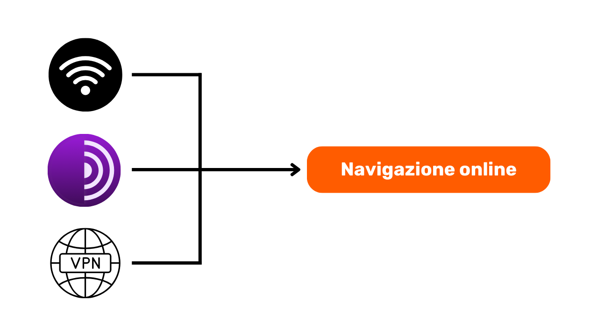
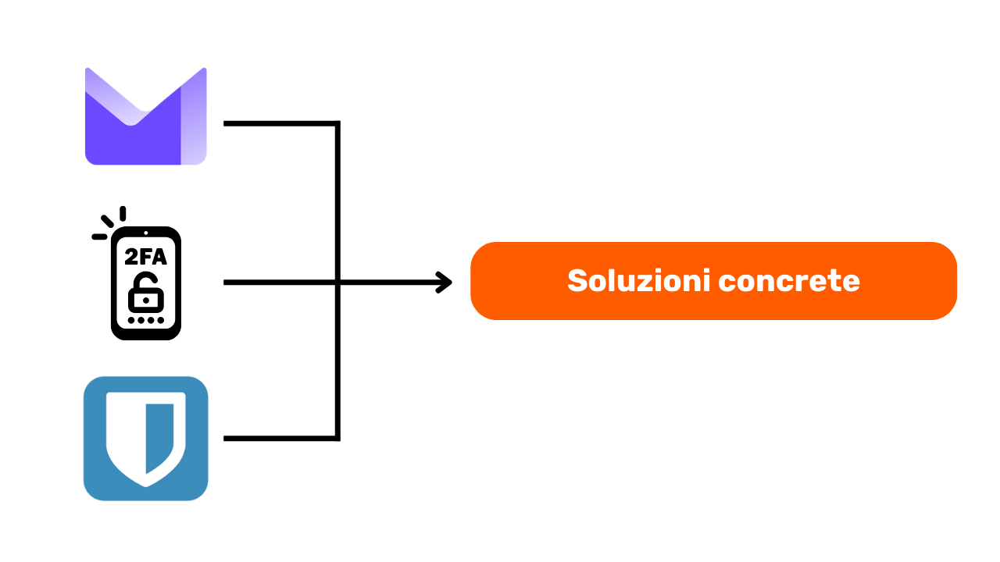
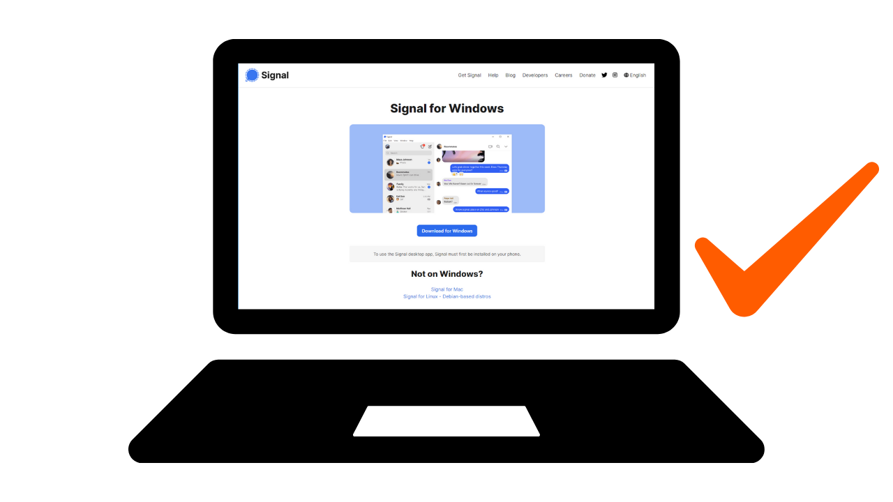
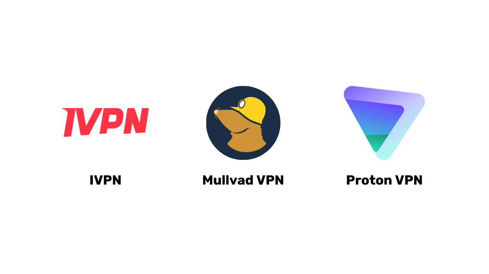
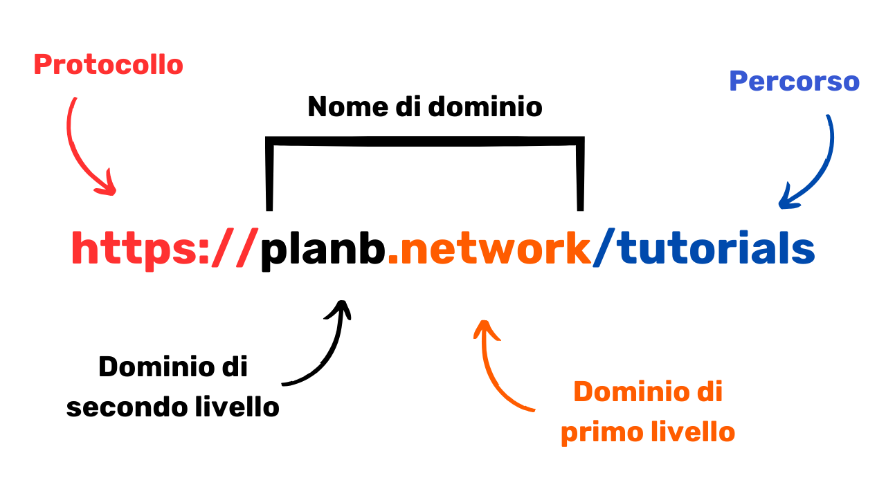
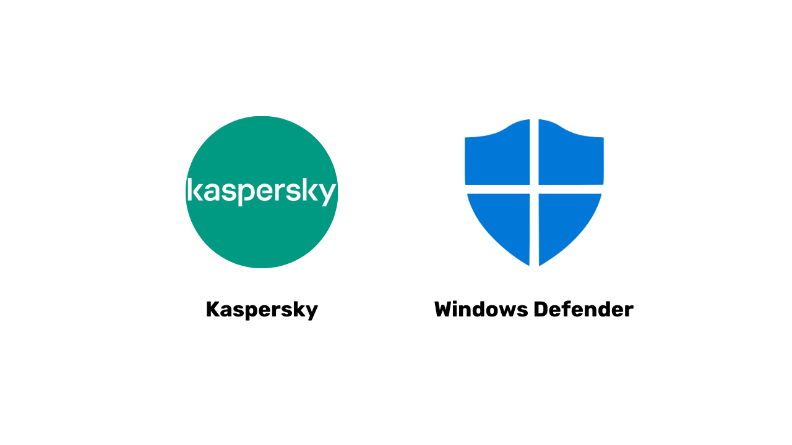
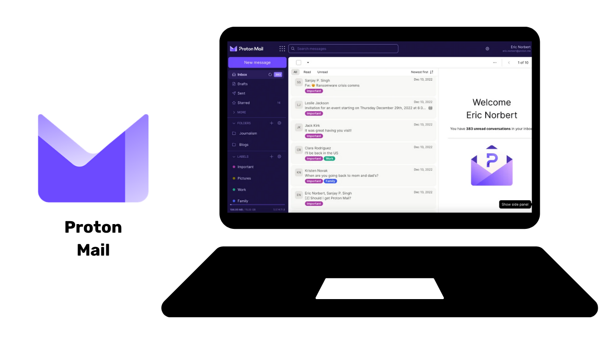
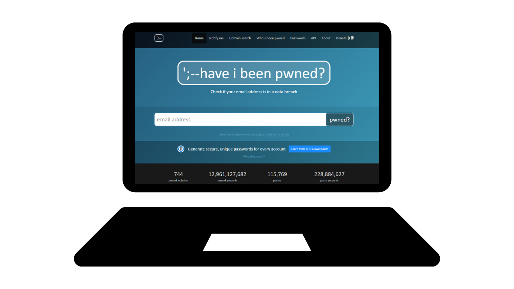
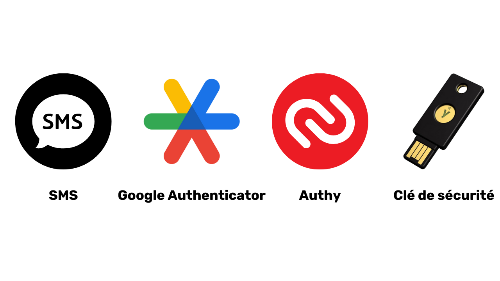
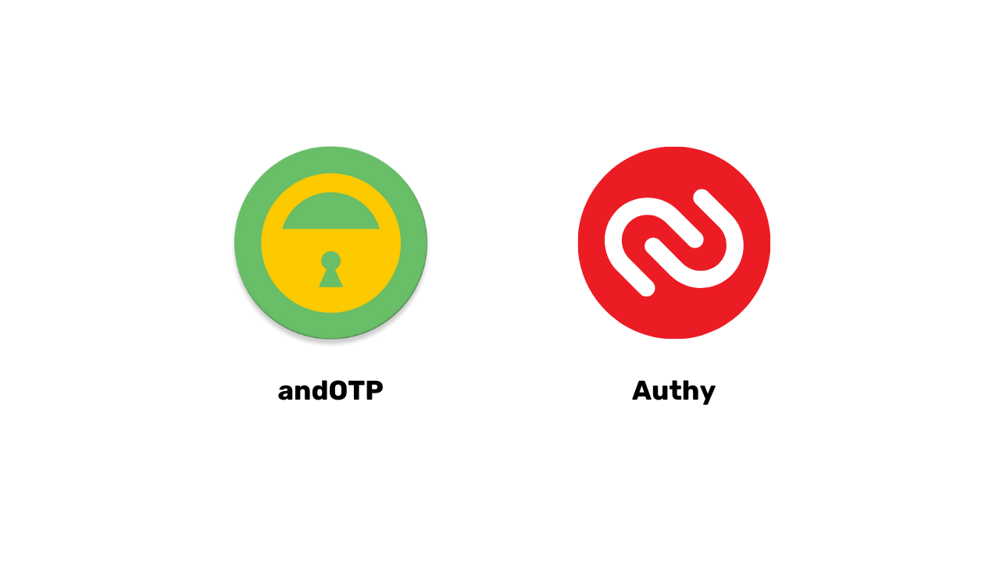

# Un viaggio verso la protezione dei tuoi dati

Benvenuti a tutti in questo programma di insegnamento dedicato alla sicurezza informatica. Questa formazione è progettata per essere accessibile a tutti, quindi non sono necessari prerequisiti informatici. Il nostro obiettivo principale è fornire le conoscenze e le competenze necessarie per navigare in modo più sicuro e privato nel mondo digitale.

Ciò si tradurrà nell'implementazione di diversi strumenti come una casella di posta sicura, uno strumento per gestire meglio le tue password e vari software per proteggere le tue attività quotidiane online.

In questa formazione, non cerchiamo di renderti un esperto, anonimo o invulnerabile, poiché ciò è impossibile. Invece, ti offriamo alcune soluzioni semplici e accessibili a tutti per iniziare a trasformare le tue abitudini online e riprendere il controllo della tua sovranità digitale.

Team dei contributori:
Muriel; design
Rogzy Noury & Fabian; produzione
Théo; contributo

+++

# Introduzione
<partId>534ab66c-b0e6-5757-a7dd-6ea04647edf2</partId>

## Introduzione al corso
<chapterId>2f3d005d-8b49-5a3f-b90d-94c11f613407</chapterId>

### Obiettivo: aggiornamento!

Benvenuti a tutti in questo programma di insegnamento dedicato alla sicurezza informatica. Questa formazione è progettata per essere accessibile a tutti, quindi non sono necessari prerequisiti informatici. Il nostro obiettivo principale è fornire le conoscenze e le competenze necessarie per navigare in modo più sicuro e privato nel mondo digitale.

Ciò si tradurrà nell'implementazione di diversi strumenti come una casella di posta sicura, uno strumento per gestire meglio le tue password e vari software per proteggere le tue attività quotidiane online.

Questa formazione è uno sforzo congiunto di tre dei nostri professori:

- Renaud Lifchitz, esperto in sicurezza informatica
- Théo Pantamis, dottore in matematica applicata
- Rogzy, CEO di DécouvreBitcoin

La tua igiene digitale è cruciale in un mondo sempre più digitale. Nonostante il costante aumento di casi di hacking e sorveglianza di massa, non è mai troppo tardi per fare il primo passo e proteggerti.
Con questo percorso di formazione, non cerchiamo di renderti un esperto, anonimo o inattaccabile, ciò è impossibile. Invece, ti offriamo alcune soluzioni semplici e accessibili per tutti per iniziare a trasformare le tue abitudini online e riprendere il controllo della tua sovranità digitale.
Se stai cercando competenze più avanzate sull'argomento, le nostre risorse, tutorial o altri corsi sulla sicurezza informatica sono qui per te. Nel frattempo, ecco una breve panoramica del nostro programma per le prossime ore insieme.

### Sezione 1: Tutto ciò che devi sapere sulla navigazione online

- Capitolo 1 - Navigazione online
- Capitolo 2 - Utilizzare Internet in sicurezza

Per iniziare, discuteremo dell'importanza della scelta di un browser web e delle sue implicazioni in termini di sicurezza. Esploreremo poi le specificità dei browser, in particolare per quanto riguarda la gestione dei cookie. Vedremo anche come garantire una navigazione più sicura e anonima, utilizzando strumenti come TOR. Successivamente, metteremo l'accento sull'uso delle VPN per rafforzare la protezione dei tuoi dati. Infine, concluderemo con alcune raccomandazioni sull'uso sicuro delle connessioni WiFi.

### Sezione 2: Buone pratiche nell'uso del computer

- Capitolo 3 - Utilizzo del computer
- Capitolo 4 - Hack e gestione del backup

In questa sezione, affronteremo tre aree chiave della sicurezza informatica. Innanzitutto, esploreremo i diversi sistemi operativi: Mac, PC e Linux, evidenziandone le specificità e i punti di forza. Successivamente, ci concentreremo sui metodi per proteggerti efficacemente dai tentativi di hacking e per rafforzare la sicurezza dei tuoi dispositivi. Infine, metteremo l'accento sull'importanza di proteggere e fare regolarmente il backup dei tuoi dati per prevenire perdite o ransomware.

### Sezione 3: Implementazione delle soluzioni

- Capitolo 6 - Gestione della casella di posta
- Capitolo 7 - Gestore di password
- Capitolo 8 - Autenticazione a due fattori

In questa terza sezione pratica, passeremo alla pratica con l'implementazione delle tue soluzioni concrete.

Prima di tutto, vedremo come proteggere la tua casella di posta, essenziale per le tue comunicazioni e spesso presa di mira dai pirati informatici. Successivamente, ti presenteremo cos'è un gestore di password: una soluzione pratica per non dimenticare o confondere le tue password, mantenendole comunque sicure. Infine, parleremo di una misura di sicurezza aggiuntiva, l'autenticazione a due fattori, che aggiunge un ulteriore livello di protezione ai tuoi account. Tutto sarà spiegato in modo chiaro e accessibile.

### Sezione Bonus: Intervista con Pantamis e Renaud

Come bonus, vi proponiamo un'intervista esclusiva con Pantamis e Renaud, i nostri esperti di sicurezza informatica. Condivideranno le loro conoscenze approfondite e consigli aggiuntivi per rafforzare la vostra igiene digitale. L'idea è imparare di più da questi professionisti esperti.

Questo programma di formazione è offerto gratuitamente con una licenza redistribuibile CC BY SA. Desideriamo esprimere la nostra gratitudine ai nostri Patreons e al nostro team di ripresa per il loro indispensabile supporto nella realizzazione di questa formazione. Ringraziamo anche tutti i nostri donatori e sostenitori che ci permettono di continuare a produrre contenuti educativi gratuiti a livello mondiale.

# Tutto quello che c'è da sapere sulla navigazione online
<partId>b4b5379a-d8ef-59ae-94d3-a6e88959c149</partId>

## Navigazione online
<chapterId>3a935da9-fa6e-57eb-bf85-7b3ec35e6ee2</chapterId>

Durante la navigazione su internet, è importante evitare alcuni errori comuni per preservare la propria sicurezza online. Ecco alcuni consigli per evitarli:

### Attenzione ai download di software:

Si consiglia di scaricare software dal sito ufficiale anziché da siti generici.
Esempio: Utilizzare www.signal.org/download e non www.logicieltelechargement.fr/signal.

È anche consigliabile privilegiare i software open source perché spesso sono più sicuri e privi di software dannosi. Un software "open-source", ovvero aperto o libero, è un software il cui codice è noto a tutti e accessibile a tutti. È quindi possibile verificare, tra le altre cose, che non ci siano accessi nascosti per rubare i vostri dati personali.

> Bonus: i software open source sono spesso gratuiti! Questa università è al 100% open source, quindi potete anche voi verificare il nostro codice tramite il nostro GitHub.

### Gestione dei cookie: errori e buone pratiche

I cookie sono file creati dai siti web per memorizzare informazioni sul vostro dispositivo. Sebbene alcuni siti richiedano questi cookie per funzionare correttamente, possono anche essere sfruttati da siti di terze parti, in particolare per scopi di tracciamento pubblicitario. In conformità con regolamenti come il GDPR, è possibile - e consigliato - rifiutare i cookie di tracciamento di terze parti, accettando quelli essenziali per il corretto funzionamento del sito. Dopo ogni visita a un sito, è consigliabile eliminare i cookie ad esso associati, sia manualmente che tramite un'estensione o un programma specifico. Alcuni browser offrono anche la possibilità di effettuare questa eliminazione in modo selettivo. Nonostante queste precauzioni, è fondamentale comprendere che le informazioni raccolte da diversi siti possono rimanere interconnesse, da qui l'importanza di trovare un equilibrio tra praticità e sicurezza.

> Nota: Limitate anche il numero di estensioni installate sul vostro browser per evitare potenziali problemi di sicurezza e prestazioni.

### Browser web: scelta, sicurezza

Esistono due grandi famiglie di browser: quelli basati su Chrome e quelli basati su Firefox.
Anche se entrambe le famiglie offrono un livello di sicurezza simile, si consiglia di evitare il browser Chrome di Google a causa dei suoi tracker. Possono essere preferite alternative più leggere di Chrome, come Chromium o Brave. Brave è particolarmente consigliato per la sua capacità di bloccare le pubblicità. Potrebbe essere necessario utilizzare più browser per accedere a determinati siti.

### La navigazione privata, TOR e altre alternative per una navigazione più sicura e anonima

La navigazione privata, anche se non nasconde la navigazione al proprio provider di servizi Internet, consente di non lasciare tracce locali sul proprio computer. I cookie vengono automaticamente eliminati alla fine di ogni sessione, consentendo di accettare tutti i cookie senza essere tracciati. La navigazione privata può essere utile durante l'acquisto di servizi online, poiché i siti web seguono le nostre abitudini di ricerca e regolano i prezzi di conseguenza. Tuttavia, è importante notare che la navigazione privata è consigliata per sessioni temporanee e specifiche, non per un utilizzo generale della navigazione su Internet.

Un'alternativa più avanzata è la rete TOR (The Onion Router), che offre l'anonimato mascherando l'indirizzo IP dell'utente e consentendo l'accesso al Darknet. TOR Browser è un browser appositamente progettato per utilizzare la rete TOR. Consente di visitare sia siti web convenzionali che siti web in .onion, che sono generalmente gestiti da individui e possono avere una natura illegale.

TOR è legale ed è utilizzato da giornalisti, attivisti per la libertà e altre persone che desiderano sfuggire alla censura in paesi autoritari. Tuttavia, è importante capire che TOR non protegge i siti visitati né il computer stesso. Inoltre, l'utilizzo di TOR può rallentare la connessione Internet poiché i dati passano attraverso i computer di altre tre persone prima di raggiungere la loro destinazione. È anche essenziale notare che TOR non è una soluzione infallibile per garantire l'anonimato al 100% e non deve essere utilizzato per condurre attività illegali.

### BRAVE

**_Tutorial in costruzione, per contribuire o aggiungerlo, è possibile passare attraverso GitHub_**

## VPN e connessione Internet
<chapterId>5aac83f4-a685-54b0-9759-d71bea7eeed2</chapterId>

### i VPN

La protezione della propria connessione Internet è un aspetto cruciale della sicurezza online e l'utilizzo di reti private virtuali (VPN) è un metodo efficace per migliorare questa sicurezza, sia per le aziende che per gli utenti individuali.

Le VPN sono strumenti che crittografano i dati trasmessi su Internet, rendendo così la connessione più sicura. In un contesto professionale, le VPN consentono ai dipendenti di accedere in modo sicuro alla rete interna dell'azienda da remoto. I dati scambiati sono crittografati, rendendo molto più difficile l'intercettazione da parte di terzi. Oltre a garantire l'accesso a una rete interna, l'uso di una VPN può consentire a un utente di far passare la propria connessione Internet attraverso la rete interna dell'azienda, dando l'impressione che la connessione provenga dall'azienda stessa. Ciò può essere particolarmente utile per accedere a servizi online che sono geograficamente limitati.

### Tipi di VPN

Ci sono due tipi principali di VPN: le VPN aziendali e le VPN per il grande pubblico, come NordVPN. Le VPN aziendali tendono ad essere più costose e complesse, mentre le VPN per il grande pubblico sono generalmente più accessibili e facili da usare. NordVPN, ad esempio, consente agli utenti di connettersi a Internet passando attraverso un server situato in un altro paese, il che può consentire di aggirare le restrizioni geografiche.

Tuttavia, l'uso di una VPN per il grande pubblico non garantisce un anonimato completo. Molti fornitori di VPN conservano informazioni sui propri utenti, il che potrebbe compromettere potenzialmente la loro anonimato. Sebbene le VPN possano essere utili per migliorare la sicurezza online, non sono una soluzione universale. Sono efficaci per alcuni utilizzi specifici, come l'accesso a servizi geograficamente limitati o il miglioramento della sicurezza in movimento, ma non garantiscono una sicurezza totale. Quando si sceglie una VPN, è essenziale privilegiare l'affidabilità e la tecnicalità piuttosto che la popolarità. I fornitori di VPN che raccolgono meno informazioni personali sono generalmente i più sicuri. Servizi come iVPN e Mullvad non raccolgono informazioni personali e consentono persino pagamenti in Bitcoin per una maggiore privacy.

Infine, una VPN può anche essere utilizzata per bloccare la pubblicità online, offrendo così un'esperienza di navigazione più piacevole e sicura. Tuttavia, è importante fare le proprie ricerche per trovare la VPN più adatta alle proprie esigenze specifiche. L'uso di una VPN è consigliato per rafforzare la sicurezza, anche quando si naviga su Internet da casa. Ciò contribuisce a garantire un livello più elevato di sicurezza per i dati scambiati online. Infine, assicurati di verificare gli URL e il lucchetto nella barra degli indirizzi per confermare di essere sul sito che pensi di visitare.

### HTTPS e le reti Wi-Fi pubbliche

In materia di sicurezza online, è essenziale comprendere che la connessione 4G è generalmente più sicura del Wi-Fi pubblico. Tuttavia, l'utilizzo della connessione 4G può rapidamente esaurire il tuo pacchetto dati mobile. Il protocollo HTTPS è diventato lo standard per la crittografia dei dati sui siti web. Assicura che i dati scambiati tra l'utente e il sito web siano sicuri. È quindi fondamentale verificare che il sito che stai visitando utilizzi effettivamente il protocollo HTTPS.

Nell'Unione europea, la protezione dei dati è regolamentata dal Regolamento generale sulla protezione dei dati (GDPR). È quindi più sicuro utilizzare fornitori europei di punti di accesso Wi-Fi, come la SNCF, che non rivendono i dati di connessione degli utenti. Tuttavia, il semplice fatto che un sito mostri un lucchetto non garantisce la sua autenticità. È importante verificare la chiave pubblica del sito utilizzando un sistema di certificati per confermarne l'autenticità. Sebbene la crittografia dei dati impedisca a terzi di intercettare i dati scambiati, è comunque possibile per un individuo malintenzionato fingersi il sito e trasferire i dati in chiaro.

Per evitare truffe online, è fondamentale verificare l'identità del sito su cui stai navigando, controllando in particolare l'estensione e il nome di dominio. Inoltre, fai attenzione ai truffatori che utilizzano lettere simili negli URL per ingannare gli utenti.

In sintesi, l'utilizzo di una VPN può migliorare notevolmente la sicurezza online, sia per le aziende che per gli utenti individuali. Inoltre, l'adozione di buone abitudini di navigazione può contribuire a una migliore igiene digitale. Nella prossima sezione di questo corso, affronteremo la sicurezza del computer, inclusi gli aggiornamenti, l'antivirus e la gestione delle password.

### Tutorial: IVPN

**_ Tutorial in costruzione, per contribuire o aggiungerlo, puoi passare attraverso GitHub _**

# Buone pratiche per l'uso del computer
<partId>e6eac20b-ba24-5d9a-8d86-8e0164074457</partId>

## Utilizzo del computer
<chapterId>16745632-b56b-5423-9873-ddf70fdf1efd</chapterId>

La sicurezza dei nostri computer è una questione fondamentale nel mondo digitale odierno. Oggi affronteremo tre punti chiave:

- la scelta del computer
- gli aggiornamenti e l'antivirus per una sicurezza ottimale
- le buone pratiche per la sicurezza del computer e dei dati.

### La scelta del computer e del sistema operativo

Per quanto riguarda la scelta del computer, non ci sono differenze significative di sicurezza tra i computer vecchi e quelli nuovi. Tuttavia, esistono differenze di sicurezza tra i sistemi operativi: Windows, Linux e Mac.

Riguardo a Windows, è consigliato non utilizzare un account amministratore quotidianamente, ma piuttosto creare due account separati: un account amministratore e un account per l'uso quotidiano. Windows è spesso più esposto a software dannosi a causa del suo elevato numero di utenti e della facilità di passaggio dall'utente all'amministratore. Al contrario, le minacce sono meno numerose su Linux e Mac.

La scelta del sistema operativo deve essere fatta in base alle proprie esigenze e preferenze. I sistemi Linux sono notevolmente migliorati negli ultimi anni, diventando sempre più user-friendly. Ubuntu è un'alternativa interessante per i principianti, con un'interfaccia grafica facile da usare. È possibile partizionare un computer per sperimentare con Linux mantenendo comunque Windows, ma ciò può risultare complesso. Spesso è preferibile avere un computer dedicato, una macchina virtuale o una chiavetta USB per testare Linux o Ubuntu.

### Aggiornamento del software

Per quanto riguarda gli aggiornamenti, la regola è semplice: **è fondamentale mantenere regolarmente aggiornato il sistema operativo e le applicazioni.**

Su Windows 10, gli aggiornamenti sono quasi continui ed è cruciale non bloccarli o ritardarli. Ogni anno vengono identificate circa 15.000 vulnerabilità, il che sottolinea l'importanza di mantenere il software aggiornato per proteggersi dai virus. In generale, il supporto software termina tra 3 e 5 anni dopo il rilascio, quindi è necessario passare alla versione successiva per continuare a beneficiare della sicurezza.

La regola si applica praticamente a tutti i software. Infatti, gli aggiornamenti non hanno lo scopo di rendere obsoleta o lenta la tua macchina, ma di proteggerla dalle nuove minacce. Alcuni aggiornamenti sono considerati importanti e senza di essi il tuo computer corre seri rischi di essere sfruttato.

Per darti un esempio concreto di errore: un software crackato che non può essere aggiornato rappresenta una doppia minaccia potenziale. Infatti, non avrai mai la certezza che il software stesso sia esente da virus, ne la possibilità di aggiornarlo per tutelarti da future vulnerabilità. 

### Antivirus

- Hai bisogno di un antivirus? SÌ
- Devi pagare? Dipende!

La scelta e l'installazione di un antivirus sono importanti. Windows Defender, l'antivirus integrato in Windows, è una soluzione sicura ed efficace. Per una soluzione gratuita è estremamente buono e molto meglio di molte soluzioni gratuite disponibili online. Infatti, è necessario fare attenzione agli antivirus scaricati da Internet, che possono essere dannosi o obsoleti.
Per coloro che desiderano investire in un antivirus a pagamento, è consigliato scegliere un antivirus che analizzi intelligentemente le minacce sconosciute ed emergenti, come Kaspersky. Gli aggiornamenti dell'antivirus sono essenziali per proteggersi dalle nuove minacce.

Nota: Linux e Mac, grazie al loro sistema di separazione dei diritti degli utenti, spesso non hanno bisogno di un antivirus.

Infine, ecco alcune buone pratiche per la sicurezza del tuo computer e dei tuoi dati. È importante scegliere un antivirus efficace e piacevole da utilizzare. È anche cruciale adottare buone pratiche sul proprio computer, come non inserire chiavi USB sconosciute o trovate in luoghi sospetti. Queste chiavi USB potrebbero contenere programmi dannosi che si avviano automaticamente una volta inserite. Il controllo della chiave USB non servirà a nulla una volta che sarà stata inserita. Alcune aziende sono state vittime di hacking a causa di chiavi USB lasciate in modo negligente in zone accessibili, come un parcheggio.

Tratta il tuo computer come faresti con la tua casa: rimani vigile, effettua regolarmente gli aggiornamenti, elimina i file inutili e utilizza una password sicura per la sicurezza. È cruciale crittografare i dati su laptop e smartphone per prevenire furti o perdite di dati. BitLocker per Windows, LUKS per Linux e FileVault per Mac sono soluzioni per la crittografia dei dati. È consigliabile attivare senza esitazione la crittografia dei dati e annotare la password su un foglio da conservare in un luogo sicuro. Sì!, meglio un foglio (meglio una doppia copia) piuttosto che un file digitale. 

In conclusione, è fondamentale optare per un sistema operativo adatto alle proprie esigenze e tenerlo aggiornato regolarmente, così come le applicazioni installate. È anche essenziale utilizzare un antivirus efficace e piacevole da utilizzare e adottare buone pratiche per la sicurezza del tuo computer e dei tuoi dati.

### Tutorial: Ubuntu

**_ Tutorial in costruzione, per contribuire o aggiungerlo, è possibile passare attraverso GitHub _**

## Hack & gestione del backup: proteggere i propri dati
<chapterId>9ddfcb6a-a253-5542-b7eb-df7222b46dc7</chapterId>

### Come attaccano gli hacker?

Per proteggersi adeguatamente, è fondamentale capire come i pirati informatici cercano di infiltrarsi nel tuo computer. Infatti, i virus non arrivano spesso per magia, ma sono piuttosto il risultato delle nostre azioni, anche involontarie!

In generale, i virus arrivano perché hai autorizzato il tuo computer a invitarli a casa tua. Questo può accadere scaricando un software sospetto, un file torrent compromesso o semplicemente cliccando sul link di una e-mail fraudolenta!

### Phishing, attenzione alle e-mail fraudolente:

Attenzione! Le e-mail sono il primo vettore di attacco, ecco alcuni consigli:

- Stai attento ai tentativi di phishing che cercano di ottenere informazioni sensibili come le tue credenziali e password. Evita di cliccare su link sospetti e di condividere le tue informazioni personali senza verificare la legittimità del mittente.
- Fai attenzione agli allegati e alle immagini nelle email:
  Gli allegati e le immagini nelle email possono contenere software dannosi. Non scaricare e non aprire gli allegati provenienti da mittenti sconosciuti o sospetti e assicurati che il tuo antivirus sia aggiornato.

La regola d'oro qui è verificare attentamente il nome completo del mittente e l'origine dell'email. In caso di dubbio, cancella!

### Ransomware e tipi di attacchi informatici:

Il ransomware è un tipo di software dannoso che crittografa i dati dell'utente e richiede un riscatto per decifrarli. Questo tipo di attacco è sempre più comune e può diventare molto fastidioso per un'azienda o un individuo. Per proteggersi, è essenziale creare backup dei file più sensibili! Questo non fermerà il ransomware, ma ti permetterà semplicemente di ignorarlo.

Effettua regolarmente il backup dei tuoi dati importanti su un supporto esterno o un servizio di archiviazione online sicuro. In questo modo, in caso di attacco informatico o guasto hardware, potrai recuperare i tuoi dati senza perdere informazioni cruciali.

Soluzione semplice:

- Acquista un disco rigido esterno e copia i tuoi dati su di esso. Scollegalo e riponilo in un luogo sicuro in casa. (Fai questo due volte e conserva uno dei due dischi in un altro luogo per proteggerti da un potenziale incendio.)

- Crea un backup "cloud" tramite ProtonMail Drive, Sync o anche Google Drive. Devi solo caricare i tuoi dati sensibili su questo servizio di archiviazione online. Tuttavia, fai attenzione; i tuoi dati saranno potenzialmente su Internet e saranno detenuti da un terzo di fiducia.

### Dovresti pagare gli hacker?

NO, di solito è sconsigliato pagare gli hacker in caso di ransomware o altri tipi di attacchi. Pagare il riscatto non garantisce il recupero dei tuoi dati e può incoraggiare i criminali informatici a continuare le loro attività dannose. È meglio privilegiare la prevenzione e il regolare backup dei tuoi dati per proteggerti.

Se rilevi un virus sul tuo computer, disconnettilo da Internet, effettua una scansione antivirus completa ed elimina i file infetti. Successivamente, aggiorna i tuoi software e il sistema operativo e cambia le tue password per evitare ulteriori intrusioni.

# Implementazione delle soluzioni.
<partId>215ec902-ba05-5549-87fc-cb8d82665f7b</partId>

## Gestione delle caselle di posta
<chapterId>dfceea33-8712-5557-ace1-6ba5598d33d8</chapterId>

### Inizio della sezione 2 del corso!

Ora iniziamo la sezione 2 del corso. In questa sezione affronteremo tre argomenti essenziali per garantire la sicurezza degli accessi online: la gestione delle email, l'uso di un gestore di password e l'autenticazione a due fattori (2FA).

### Creazione di una nuova casella di posta!

La casella di posta è il punto centrale della tua attività online: se viene compromessa, un hacker può utilizzarla per ricreare tutte le tue password tramite la funzione "password dimenticata" e quindi accedere a molti altri siti. Ecco perché è importante proteggerla adeguatamente.

Una casella di posta deve quindi essere creata con una password unica e robusta (dettagli nel capitolo 7) e idealmente con un sistema di autenticazione a due fattori (dettagli nel capitolo 8).

Nonostante tutti abbiamo già una casella di posta, è importante considerare la creazione di una nuova, più moderna, per partire su basi solide.

### Scelta del provider di posta e gestione degli indirizzi email

La corretta gestione dei nostri indirizzi email è cruciale per garantire la sicurezza dei nostri accessi online. È importante scegliere un provider di posta sicuro e rispettoso della privacy. Ad esempio, ProtonMail è un servizio di posta sicuro e rispettoso della privacy.

Nella scelta di un provider di posta e nella creazione di una password, è essenziale non riutilizzare mai la stessa password per diversi servizi online. È consigliabile creare nuovi indirizzi email regolarmente e separare gli utilizzi utilizzando indirizzi email diversi. È meglio optare per un servizio di posta sicuro per gli account critici. È importante anche notare che alcuni servizi limitano la lunghezza delle password, quindi è importante fare attenzione a questa limitazione. Sono disponibili anche servizi per la creazione di indirizzi email temporanei, che possono essere utilizzati per account a durata limitata.

È importante considerare che vecchi provider di posta come La Poste, Arobase, Wig, Hotmail, sono ancora utilizzati, ma le loro pratiche di sicurezza potrebbero essere meno buone rispetto a quelle di Gmail. Pertanto, è consigliabile avere due indirizzi email separati, uno per le comunicazioni generali e l'altro per il recupero dell'account, quest'ultimo deve essere meglio protetto. È meglio evitare di mescolare l'indirizzo email con il proprio operatore telefonico o provider di accesso a Internet, poiché potrebbe costituire un vettore di attacco.

### Dovrei cambiare casella di posta?

Si consiglia di utilizzare il sito Have I Been Pwned (Sono stato violato) - https://haveibeenpwned.com/ - per verificare se il tuo indirizzo email è stato compromesso e per essere avvisati di future violazioni dei dati. Un database violato potrebbe essere sfruttato da hacker per inviare email di phishing o riutilizzare password compromesse.

In generale, iniziare a utilizzare un nuovo indirizzo email più sicuro non è una pratica sbagliata e addirittura necessaria se si desidera ripartire da basi sane.
Bonus Bitcoin: Può essere consigliabile creare un indirizzo email appositamente per le nostre attività Bitcoin (creazione di account di scambio) al fine di separare realmente i centri di attività nelle nostre vite.

### Tutorial: creazione di un account ProtonMail

**_ Tutorial in costruzione, per contribuire o aggiungerlo, è possibile passare attraverso GitHub _**

## Gestore di password
<chapterId>0b3c69b2-522c-56c8-9fb8-1562bd55930f</chapterId>

### Cosa è un gestore di password?

Un gestore di password è uno strumento che consente di memorizzare, generare e gestire le password per diversi account online. Invece di dover ricordare molteplici password, è sufficiente ricordare una sola password principale per accedere a tutte le altre.

Con un gestore di password, non è più necessario preoccuparsi di dimenticare le password o di annotarle da qualche parte. È sufficiente ricordare una sola password principale. Inoltre, la maggior parte di questi strumenti genera password robuste per voi, aumentando la sicurezza dei vostri account.

### Differenze tra alcuni gestori popolari:

- LastPass: Uno dei gestori più popolari. È un servizio di terze parti, il che significa che le vostre password sono memorizzate sui loro server. Offre una versione gratuita e una versione a pagamento, con un'interfaccia user-friendly.

- Dashlane: È anche un servizio di terze parti, con un'interfaccia intuitiva e funzionalità aggiuntive come il monitoraggio delle informazioni delle carte di credito e note sicure.

### Auto-hosting per un maggiore controllo:

- Bitwarden: È uno strumento open source, il che significa che è possibile esaminare il suo codice per verificare la sua sicurezza. Sebbene Bitwarden offra un servizio di hosting, consente anche agli utenti di selh-hostare la propria istanza, il che significa che è possibile controllare dove vengono memorizzate le vostre password, offrendo potenzialmente maggiore sicurezza e controllo.

- KeePass: È una soluzione open source che è principalmente destinata al self-hosting. I vostri dati sono memorizzati localmente per impostazione predefinita, ma è possibile sincronizzare il database delle password utilizzando diversi metodi se lo si desidera. KeePass è ampiamente riconosciuto per la sua sicurezza e flessibilità, anche se potrebbe essere un po' meno user-friendly per i principianti.

(Nota: La scelta tra un servizio di terze parti o un servizio di slef-hosting dipende dal vostro livello di comfort tecnologico e da come priorizzate il controllo rispetto alla comodità. I servizi di terze parti sono generalmente più convenienti per la maggior parte delle persone, mentre il self-hosting richiede una maggiore conoscenza tecnica ma può offrire maggiore controllo e tranquillità in termini di sicurezza.)

### Cosa è una buona password:

Un buona password è generalmente:

- Lunga: almeno 12 caratteri.
- Complessa: una combinazione di lettere maiuscole e minuscole, numeri e simboli.
- Unico: non riutilizzare la stesso password per diversi account.
- Non basata su informazioni personali: evitare date di nascita, nomi, ecc.

Per garantire la sicurezza del tuo account, è fondamentale creare password forti e sicure. La lunghezza della password non è sufficiente per garantirne la sicurezza. I caratteri devono essere completamente casuali per resistere agli attacchi di forza bruta. L'indipendenza degli eventi è anche importante per evitare le combinazioni più probabili. Password comuni come "password" sono facilmente compromesse.

Per creare una password forte, si consiglia di utilizzare un gran numero di caratteri casuali, evitando parole o schemi prevedibili. È anche essenziale includere numeri e caratteri speciali. Tuttavia, è importante notare che alcuni siti possono limitare l'uso di determinati caratteri speciali. Le password non generate casualmente sono facili da indovinare. Varianti o aggiunte alle password non sono sicure. I siti web non possono garantire la sicurezza delle password scelte dagli utenti.

Le password generate casualmente offrono un livello di sicurezza superiore, anche se possono essere più difficili da ricordare. I gestori di password possono generare password casuali più sicure. Utilizzando un gestore di password, non è necessario memorizzare tutte le password. È importante sostituire gradualmente le vecchie password con quelle generate dal gestore, poiché sono più forti e più lunghe. Assicurarsi che la password principale del gestore di password sia anche forte e sicura.

### Tutorial: creazione di una password principale

**_ Tutorial in costruzione, per contribuire o aggiungerlo, è possibile passare attraverso GitHub _**

### Tutorial: BitWarden

**_ Tutorial in costruzione, per contribuire o aggiungerlo, è possibile passare attraverso GitHub _**

### Tutorial: KeePass

**_ Tutorial in costruzione, per contribuire o aggiungerlo, è possibile passare attraverso GitHub _**

## I 2 fattori di autenticazione
<chapterId>9391e02e-e61b-5a86-93e0-91a07f217d35</chapterId>

### Perché implementare il 2FA

L'autenticazione a due fattori (2FA) è uno strato di sicurezza aggiuntivo utilizzato per garantire che le persone che cercano di accedere a un account online siano effettivamente chi dicono di essere. Invece di limitarsi a inserire un nome utente e una password, il 2FA richiede una seconda forma di verifica.

Questo secondo passaggio può essere:

- Un codice temporaneo inviato tramite SMS.
- Un codice generato da un'applicazione come Google Authenticator o Authy.
- Una chiave di sicurezza fisica che inserisci nel tuo computer.

Con il 2FA, anche se un hacker ottiene la tua password, non potrà accedere al tuo account senza questo secondo fattore di verifica. Questo rende il 2FA essenziale per proteggere i tuoi account online da accessi non autorizzati.

### Quale opzione scegliere?

Le diverse opzioni per l'autenticazione forte offrono livelli di sicurezza variabili.

- Gli SMS non sono considerati la migliore opzione perché forniscono solo una prova di possesso di un numero di telefono.
- Il 2FA (autenticazione a due fattori) è più sicuro perché utilizza diversi tipi di prove, come la conoscenza, il possesso e l'identificazione. I codici one-time password (HOTP e TOTP) sono più sicuri degli SMS perché richiedono un calcolo crittografico e vengono memorizzati localmente anziché nella memoria.
- I token hardware, come le chiavi USB o le smart card, offrono la massima sicurezza generando una chiave privata unica per ogni sito e verificando l'URL prima di autorizzare la connessione.

Per una sicurezza ottimale con l'autenticazione forte, si consiglia di utilizzare un indirizzo email sicuro, un gestore di password sicuro e di adottare il 2FA utilizzando YubiKey. È anche consigliabile acquistare due YubiKey per prevenire la perdita o il furto, ad esempio conservando una copia di backup sia a casa che con sé.

La biometria può essere utilizzata come sostituto, ma è meno sicura della combinazione di conoscenza e possesso. I dati biometrici devono rimanere sull'apparecchio di autenticazione e non devono essere divulgati online. È importante considerare il modello di minaccia associato ai diversi metodi di autenticazione e adattare la propria scelta di conseguenza.

### Conclusioni della formazione:

Come avete capito, l'implementazione di una buona igiene digitale non è necessariamente semplice, ma rimane accessibile!

- Creazione di un nuovo indirizzo email sicuro.
- Implementazione di un gestore di password.
- Attivazione del 2FA.
- Sostituzione progressiva delle nostre vecchie password con password forti con 2FA.

Continuate ad imparare e ad implementare gradualmente le buone pratiche!

Regola d'oro: La sicurezza informatica è un obiettivo in movimento che si adatta al vostro percorso di apprendimento!

# Sezione Pratica
<partId>98ccf14b-4053-5839-878c-7a73ff02eb95</partId>

## Configurazione di una Casella di Posta
<chapterId>afc9ab5d-7664-5a9b-ab50-225ac9ba8f7c</chapterId>

https://planb.network/tutorials/others/proton-mail

## Sicurezza con 2FA
<chapterId>09468ec1-95b7-56a4-a636-7618044568e1</chapterId>

https://planb.network/tutorials/others/authy

https://planb.network/tutorials/others/security-key

## Creazione di un gestore di password
<chapterId>ed579680-4e7b-5f65-8541-14e519a3b242</chapterId>
https://planb.network/tutorials/others/bitwarden
https://planb.network/tutorials/others/keepass

## Sicurezza dei tuoi account
<chapterId>7a774b34-aed0-57dd-b8f7-cf3be51c0d70</chapterId>
https://planb.network/tutorials/others/bitwarden
https://planb.network/tutorials/others/keepass

## Configurazione del backup
<chapterId>01cfcde1-77cb-506c-8df1-fa18a2e8cc6b</chapterId>
https://planb.network/tutorials/others/proton-drive
https://planb.network/tutorials/others/veracrypt

## Cambio di browser e VPN
<chapterId>8dc08feb-313c-5259-a54f-64aa68a07608</chapterId>
https://planb.network/tutorials/others/ivpn
https://planb.network/tutorials/others/mullvad
https://planb.network/tutorials/others/tor-browser

# Andare oltre
<partId>77113cad-a6d8-57e5-b903-50c223b277ba</partId>

## Come lavorare in questa industria della sicurezza informatica
<chapterId>aad1ae27-4280-5b07-b9ab-118ae013951a</chapterId>

La cybersecurity, un settore in forte crescita, offre molte opportunità per coloro che sono appassionati della protezione dei sistemi e dei dati. Se questo settore ti intriga, ecco alcuni passaggi chiave per orientarti.

### Fondamenta accademiche e certificazioni:

Una solida formazione in informatica, sistemi informativi o in un campo correlato è spesso il trampolino di lancio ideale per iniziare. Questi studi forniscono le basi necessarie per comprendere le sfide tecniche della cybersecurity. Per completare questa formazione, è opportuno ottenere certificazioni riconosciute nel settore. Sebbene queste certificazioni possano variare a seconda delle regioni, alcune come CISSP o CEH godono di un riconoscimento globale.

La cybersecurity è un campo vasto e in continua evoluzione. Familiarizzare con gli strumenti essenziali e i diversi sistemi è cruciale. Inoltre, con così tanti sottodomini, dalla risposta agli incidenti all'hacking etico, è vantaggioso trovare la propria nicchia e specializzarsi in essa.

### Acquisire esperienza pratica:

L'importanza dell'esperienza pratica non può essere sottovalutata. Cercare stage o posizioni junior in aziende con team di sicurezza informatica è un ottimo modo per mettere in pratica le proprie conoscenze teoriche. Inoltre, partecipare a competizioni di hacking etico o simulazioni di cybersecurity può affinare le tue competenze in situazioni reali.

La forza di una rete professionale è inestimabile. Unirsi ad associazioni professionali, hackerspace o forum online offre una piattaforma per scambiare idee con altri esperti. Allo stesso modo, partecipare a conferenze e workshop dedicati alla cybersecurity non solo permette di imparare, ma anche di creare legami con professionisti del settore.

L'evoluzione costante delle minacce richiede un costante monitoraggio delle notizie e dei forum specializzati. In un settore in cui la fiducia è fondamentale, agire con etica e integrità è essenziale in ogni fase della tua carriera.

### Competenze e strumenti da approfondire:

- Strumenti di cybersecurity: Wireshark, Metasploit, Nmap.
- Sistemi operativi: Linux, Windows, MacOS.
- Linguaggi di programmazione: Python, C, Java.
- Reti: TCP/IP, VPN, firewall.
- Basi di dati: SQL, NoSQL.
- Crittografia: SSL/TLS, crittografia simmetrica/asimmetrica.
- Gestione degli incidenti: Analisi dei log, risposta agli incidenti.
- Hacking etico: Tecniche di penetrazione, test di intrusioni.
- Governance: Standard ISO, regolamenti GDPR/CCPA.

Padroneggiando queste competenze e strumenti, sarai ben attrezzato per navigare con successo nel mondo della cybersecurity.

## Intervista a Renaud
<chapterId>7d83fd98-ce22-514e-b9e8-729fbf71ee6e</chapterId>

### Gestione efficace delle password e rafforzamento dell'autenticazione: un approccio accademico

Nel modulo di formazione "Sicurezza 101" offerto da Découvre Bitcoin all'interno dell'Accademia, abbiamo affrontato l'importanza dei gestori di password. Tre dimensioni sono fondamentali da considerare: la creazione, l'aggiornamento e l'implementazione delle password sui siti web.

In generale, è sconsigliato utilizzare estensioni del browser per il riempimento automatico delle password. Questi strumenti possono rendere l'utente più vulnerabile agli attacchi di phishing. Renaud, un esperto riconosciuto in materia di sicurezza informatica, preferisce una gestione manuale tramite KeePass, che implica una copia e incolla manuale della password. Le estensioni tendono ad aumentare la superficie di attacco, possono rallentare le prestazioni del browser e quindi presentano un rischio non trascurabile. Pertanto, l'uso minimo di estensioni sul browser è una pratica consigliata.

I gestori di password solitamente incoraggiano l'uso di fattori di autenticazione aggiuntivi, come l'autenticazione a due fattori. Per una sicurezza ottimale, è consigliabile conservare gli OTP (One-Time Password) sul proprio dispositivo mobile. AndoTP offre una soluzione open source per generare e memorizzare i codici OTP sul telefono. Se Google Authenticator consente l'esportazione dei seed dei codici di autenticazione, la fiducia nella loro conservazione su un account Google è limitata. Pertanto, le applicazioni OTI e AndoTP sono consigliate per una gestione autonoma degli OTP.

La questione dell'eredità digitale e del lutto digitale solleva l'importanza di avere una procedura per trasmettere le password dopo la morte di una persona. Un gestore di password facilita questa transizione memorizzando in modo sicuro tutti i segreti digitali in un unico luogo. Il gestore di password consente anche di identificare tutti gli account aperti e gestirne la chiusura o il trasferimento. È consigliabile annotare la password principale su carta, ma è necessario conservarla in un luogo nascosto e sicuro. Se il disco rigido è crittografato e il computer è bloccato, la password non sarà accessibile, nemmeno in caso di furto.

### Verso un'era post-password: esplorazione di alternative credibili

Le password, sebbene onnipresenti, presentano numerosi svantaggi, tra cui la possibilità di una trasmissione rischiosa durante il processo di autenticazione. Aziende leader come Microsoft e Apple propongono alternative innovative come la biometria e i token hardware, indicando una tendenza progressiva verso l'abbandono delle password.
Passkeys, per esempio, offre chiavi casuali crittografate, combinate con un fattore locale (biometria o PIN), che sono ospitate da un fornitore ma rimangono al di fuori della sua portata. Sebbene ciò richieda un aggiornamento dei siti web, l'approccio elimina la necessità di password, offrendo così un livello di sicurezza elevato senza i vincoli associati alle password tradizionali o alla gestione di un deposito digitale sicuro.
Passkiz è un'altra alternativa valida e sicura per la gestione delle password. Tuttavia, rimane una domanda importante: quella della disponibilità in caso di guasto del fornitore. Sarebbe quindi auspicabile che i giganti di Internet propongano sistemi per garantire questa disponibilità.

L'autenticazione diretta sul servizio in questione rappresenta un'opzione interessante per non dipendere da terze parti. Tuttavia, il SSO (Single Sign-On) proposto dai giganti di Internet pone anche problemi in termini di disponibilità e rischi di censura. Al fine di evitare perdite di dati, è fondamentale ridurre al minimo la quantità di informazioni raccolte durante il processo di autenticazione.

### La sicurezza informatica: l'imperativo di pratiche sicure e i rischi legati alla negligenza umana

La sicurezza informatica può essere compromessa da pratiche semplici e dall'uso di password predefinite, come "admin". Non sempre sono necessari attacchi sofisticati per mettere a rischio la sicurezza informatica. Ad esempio, le password degli amministratori di un canale YouTube erano scritte nel codice sorgente privato di un'azienda. Le vulnerabilità di sicurezza sono spesso il risultato della negligenza umana.

È importante notare anche che Internet è molto centralizzato e ampiamente controllato dagli Stati Uniti. Il server DNS può essere soggetto a censura e spesso utilizza DNS falsi per bloccare l'accesso a determinati siti. Il DNS è un protocollo vecchio e insufficientemente sicuro, il che può causare problemi di sicurezza. Nuovi protocolli, come DNSsec, sono emersi ma sono ancora poco utilizzati. Per aggirare la censura e il blocco degli annunci, è possibile scegliere fornitori DNS alternativi.
Alcune alternative alle pubblicità invasive includono Google DNS, OpenDNS e altri servizi indipendenti. Il protocollo DNS standard lascia le richieste DNS visibili al provider di servizi Internet. DOH (DNS over HTTPS) e DOT (DNS over TLS) consentono di crittografare la connessione DNS, offrendo maggiore privacy e sicurezza. Questi protocolli sono ampiamente utilizzati in ambito aziendale per la migliore sicurezza e sono nativamente supportati da Windows, Android e iPhone. Per utilizzare DOH e DOT, è necessario inserire un nome host TLS al posto di un indirizzo IP. I provider gratuiti di DOH e DOT sono disponibili online. DOH e DOT migliorano la privacy e la sicurezza evitando attacchi di tipo "man in the middle". Altre considerazioni chiave

Nel contesto del modulo di formazione "Sicurezza 101" di Découvre Bitcoin sull'Accademia, abbiamo anche discusso dell'autenticazione Lightning. Questo sistema genera un identificatore diverso per ogni servizio, senza la necessità di fornire un indirizzo email o informazioni personali. È possibile avere identità decentralizzate controllate dall'utente, ma manca una normalizzazione e standardizzazione nei progetti di identità decentralizzata. I gestori di pacchetti come Nuget e Chocolaté, che consentono di scaricare software open source al di fuori del Microsoft Store, sono consigliati per evitare attacchi maligni. In sintesi, il DNS è cruciale per la sicurezza online, ma è necessario rimanere vigili di fronte a potenziali attacchi ai server DNS.

## Ringraziamenti e continua a scavare la tana del coniglio
<chapterId>df3a962a-a96e-5006-b904-0dd9d4a072dd</chapterId>

### Valuta il corso e sostienici

Questo corso, insieme a tutto il contenuto presente su questa università, ti è stato offerto gratuitamente dalla nostra comunità. Per sostenerci, puoi condividerlo con gli altri, diventare membro dell'università e persino contribuire al suo sviluppo tramite GitHub. A nome di tutto il team, grazie!

Un sistema di valutazione per il corso sarà presto integrato in questa nuova piattaforma di e-learning! Nel frattempo, grazie mille per aver seguito il corso e se ti è piaciuto, pensa di condividerlo con gli altri.

### Vai oltre

Congratulazioni per aver completato questa formazione SECU 101! Spero sinceramente che ti sia piaciuta e ti abbia aperto nuove porte. Ora sei pronto per ottenere i tuoi primi bitcoin o semplicemente continuare l'avventura con i corsi di livello 2!

- BTC 101 ti fornirà le basi teoriche su Bitcoin
- BTC 102 ti aiuterà a pianificare il tuo piano bitcoin
- LN 201 e 202 ti permetteranno di scoprire il Lightning Network, una rete di pagamenti di secondo livello
- ECON 201 affronterà l'economia austriaca
- MINAGE 201 per saperne di più sul mining
- (e molti altri)

Un immenso grazie ai nostri Patreon, membri e donatori per il loro sostegno finanziario, grazie a coloro che condividono e grazie a coloro che hanno reso possibile questa formazione: Théo Pantamis, Renaud, Théo, Fabien, Noury, Muriel & tutto il team. A presto!
