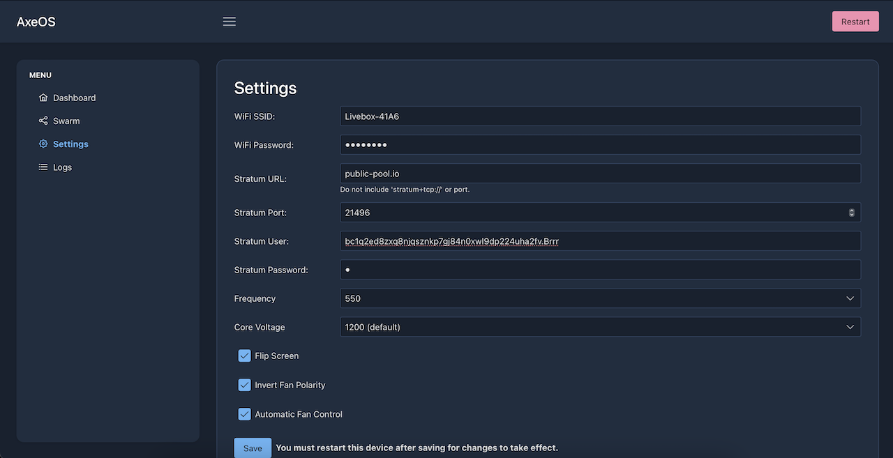
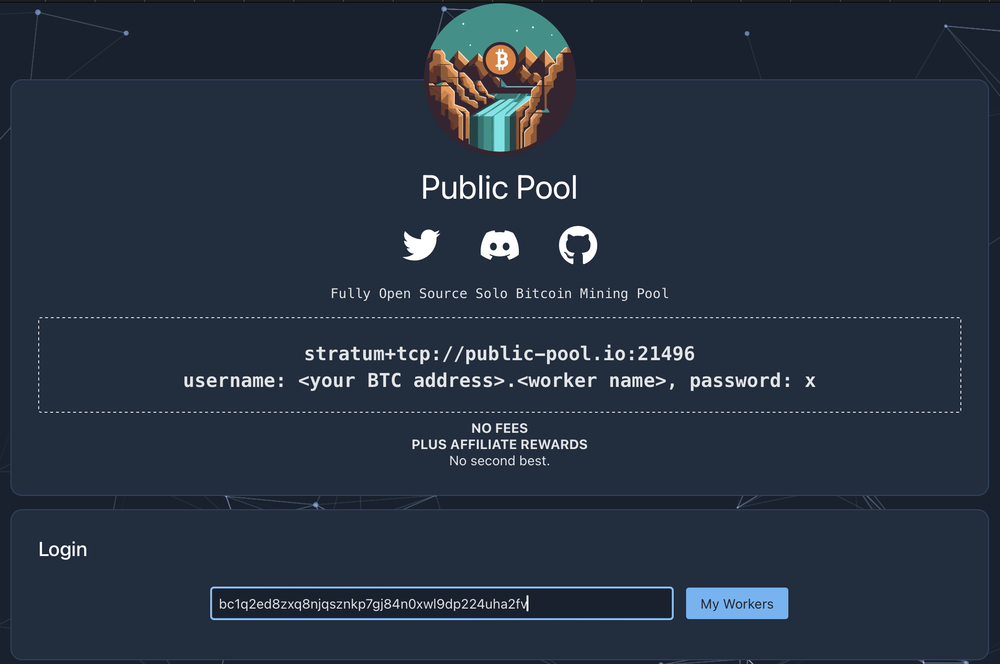

**Veřejný bazén** není jen tak nějaký bazén; je to to, co se také nazývá **Solo bazén**. Pokud váš miner úspěšně vytěží blok, pak obdržíte celou odměnu za blok, která se nesdílí s ostatními účastníky bazénu ani s bazénem samotným.

**Veřejný bazén** poskytuje pouze **šablonu bloku** pro váš miner, aby mohl vykonávat svou práci, aniž byste potřebovali mít **Bitcoinový uzel** a software, který komunikuje s vaším minerem. Jelikož nesdružujete svůj výpočetní výkon s výkonem ostatních účastníků, jsou vaše šance na úspěšné vytěžení bloku samozřejmě velmi nízké, což z toho dělá jakýsi loterijní systém, kde někdy šťastný jedinec vyhraje jackpot.

Na **Dashboardu** **Veřejného bazénu** máte stále nějaké statistiky, jako je **Celkový Hashrate** bazénu, stejně jako distribuci různých typů minerů, které jsou k bazénu připojeny.

V prvních řádcích můžeme vidět **Bitaxe** s 1323 připojenými **Bitaxe** pro celkový hashrate 649TH/s. **Bitaxe** je **Open source** projekt, který umožňuje jednoduché znovupoužití čipu z **ASIC** jako je **Antminer S19** na **opensource** elektronické desce, aby se vytvořil velmi malý miner o výkonu 0.5TH/s za 15W. Tento miner budeme používat jako příklad pro tento tutoriál.

## Přidat **Pracovníka** 👷‍♂️

Na vrcholu stránky můžete zkopírovat adresu bazénu **stratum+tcp://public-pool.io:21496**.

Dále, do pole **uživatel**, zadejte **Bitcoinovou** adresu, kterou vlastníte.

Pokud máte více minerů, můžete pro všechny zadat stejnou adresu, aby se jejich **hashraty** kombinovaly a zobrazovaly jako jeden miner. Můžete je také odlišit přidáním rozlišovacího jména pro každý. K tomu stačí přidat **.workername** za **Bitcoinovou** adresu.

Nakonec, pro pole **heslo**, použijte **‘x’**.

Příklad: Pokud je vaše **Bitcoinová** adresa **‘bc1q2ed8zxq8njqsznkp7gj84n0xwl9dp224uha2fv’** a přejete si pojmenovat svůj miner **« Brrrr »**, pak byste měli zadat následující informace do rozhraní vašeho mineru:

- **URL** : stratum+tcp://public-pool.io:21496
- **UŽIVATEL** : **‘bc1q2ed8zxq8njqsznkp7gj84n0xwl9dp224uha2fv.Brrrr’**
- **Heslo** : **‘x’**
Pokud je váš miner **Bitaxe**, pole jsou trochu jiná, ale informace zůstávají stejné:
- **URL**: public-pool.io (zde musíte odstranit část na začátku **‘stratum+tcp://’** a část na konci **‘:21496’**, která bude uvedena v poli port)
- **Port**: 21496
- **Uživatel**: **‘bc1q2ed8zxq8njqsznkp7gj84n0xwl9dp224uha2fv.Brrrr’**
- **Heslo**: **‘x’**

Několik minut po zahájení těžby budete moci vidět svá data na webových stránkách **Public Pool** vyhledáním vaší adresy.

## Dashboard

Jakmile se připojíte k **Public Pool**, můžete přistupovat k vašemu **Dashboardu** vyhledáním pomocí vaší **Bitcoin** adresy, kterou jste zadali do pole **Uživatel**. V našem případě je to **‘bc1q2ed8zxq8njqsznkp7gj84n0xwl9dp224uha2fv’**.

Na **Dashboardu** se zobrazují různé informace jak o vašich datech, tak o síti.

Máte **Network Hash Rate**, což odpovídá celkovému výpočetnímu výkonu sítě **Bitcoin**.

**Network Difficulty** udává obtížnost, která musí být dosažena pro validaci bloku.

A **Your Best Difficulty** je nejvyšší obtížnost, kterou jste dosáhli. Pokud se vám náhodou 🍀 podaří dosáhnout obtížnosti sítě, pak vyhráváte celou odměnu za blok... po 100 blocích. Museli byste počkat 100 bloků, než byste je mohli utratit.

Máte také **Block Height**, což je číslo posledního vytěženého bloku, jakož i jeho váhu vyjádřenou ve WU, maximální je 4,000,000.

Níže můžete vidět všechny statistiky každého z vašich zařízení individuálně, pokud jste jim dali rozlišující název přidáním **.name** za vaši **Bitcoin** adresu v poli **Uživatel**.