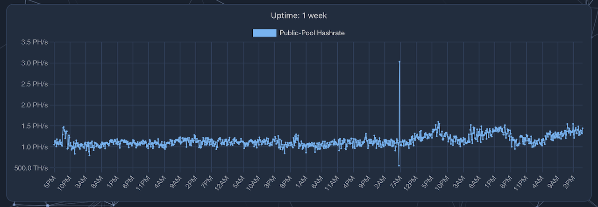

**公共矿池**不仅仅是一个普通的矿池；它也被称为**独立矿池**。如果您的矿机成功挖到一个区块，那么您将获得整个区块奖励，这不会与矿池中的其他参与者或矿池本身共享。

**公共矿池**仅为您的矿机提供一个**区块模板**，使其能够执行工作，无需您拥有**比特币节点**和与矿机通信的软件。由于您没有与其他参与者合并计算能力，成功挖掘区块的机会显然非常低，这使其在某种程度上成为一种彩票系统，有时幸运的个人会赢得大奖。

在**公共矿池**的**仪表盘**上，您仍然可以看到一些统计数据，如矿池的**总哈希率**以及连接到矿池的不同类型矿机的分布。

在前几行中，我们可以看到有1323台**Bitaxe**连接，总计649TH/s。**Bitaxe**是一个**开源**项目，允许简单地重用像**Antminer S19**这样的**ASIC**芯片，在一个**开源**电子板上制作一个非常小的矿机，其算力为0.5TH/s，功耗为15W。这是我们将在本教程中使用的示例矿机。

## 添加一个**工人** 👷‍♂️

在页面顶部，您可以复制矿池地址 **stratum+tcp://public-pool.io:21496**。

接下来，对于**用户**字段，输入您拥有的**比特币**地址。

如果您有多个矿机，您可以为所有矿机输入相同的地址，以便它们的**哈希率**合并并显示为单个矿机。您也可以通过为每个矿机添加不同的名称来区分它们。要做到这一点，只需在**比特币**地址后添加**.workername**。

最后，对于**密码**字段，使用**‘x’**。

示例：如果您的**比特币**地址是**‘bc1q2ed8zxq8njqsznkp7gj84n0xwl9dp224uha2fv’**，并且您希望为您的矿机命名为**「Brrrr」**，那么您应该在矿机的界面中输入以下信息：

- **URL** : stratum+tcp://public-pool.io:21496
- **用户** : **‘bc1q2ed8zxq8njqsznkp7gj84n0xwl9dp224uha2fv.Brrrr’**
- **密码** : **‘x’**
如果您的矿机是**Bitaxe**，字段有些不同，但信息保持不变：
- **URL**: public-pool.io（这里，您需要去掉开头的**‘stratum+tcp://’**和末尾的**‘:21496’**，这将在端口字段中报告）
- **端口**: 21496
- **用户**: **‘bc1q2ed8zxq8njqsznkp7gj84n0xwl9dp224uha2fv.Brrrr’**
- **密码**: **‘x’**

在您开始挖矿几分钟后，通过搜索您的地址，您将能够在**公共矿池**网站上看到您的数据。

## 仪表板

一旦您连接到**公共矿池**，您可以通过使用您在**用户**字段中输入的**比特币**地址进行搜索来访问您的**仪表板**。在我们这个例子中，它是**‘bc1q2ed8zxq8njqsznkp7gj84n0xwl9dp224uha2fv’**。

在**仪表板**上，显示了关于您的数据和网络的不同信息。

您有**网络哈希率**，它对应于**比特币**网络的总工作能力。

**网络难度**指出了验证一个区块所需达到的难度。

而**您的最佳难度**是您达到的最高难度。如果，凭借运气🍀，您达到了网络难度，那么您就赢得了整个区块奖励……在100个区块之后。您需要等待100个区块才能花费它们。

您还有**区块高度**，这是最后一个被挖出的区块的编号，以及其重量以WU表示，最大值为4,000,000。

下面，如果您通过在**用户**字段中的**比特币**地址后面添加**.name**给它们分配了不同的名称，您可以看到每个设备的所有统计信息。