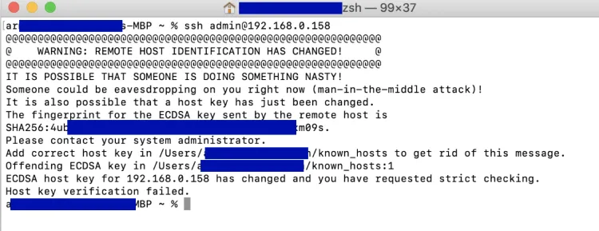
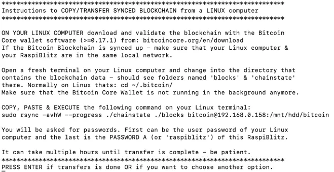

RaspiBlitz on tee-se-itse Lightning Node (LND ja/tai Core Lightning), joka toimii yhdessä Bitcoin-Fullnoden kanssa RaspberryPillä (1TB SSD) ja mukavalla näytöllä helppoa asetusta & seurantaa varten.

RaspiBlitz on suunnattu pääasiassa oppimaan, miten pyörittää omaa nodia hajautetusti kotoa - koska: Ei sinun Node, Ei sinun Säännöt. Löydä & kehitä kasvavaa Lightning Networkin ekosysteemiä tulemalla sen täysivaltaiseksi osaksi. Rakenna se osana työpajaa tai viikonloppuprojektina itse.


RASPIBLITZ - Kuinka Pyörittää Lightning ja Bitcoin Full Nodea BTC sessionin toimesta

# Parmanin Raspiblitzin asennusopas

Raspiblitz on erinomainen järjestelmä Bitcoin Noden ja siihen liittyvien sovellusten ajamiseen. Suosittelen tätä ja My Node -nodea useimmille käyttäjille (Ideaalitilanteessa kaksi nodea redundanssin vuoksi.) Yksi merkittävä etu on, että Raspiblitz-node on "Vapaa Avoin Lähdekoodi Ohjelmisto", toisin kuin MyNode tai Umbrel. Miksi se on tärkeää? Vlad Costa selittää. Voit myös ajaa RaspbiBlitzin WiFi-yhteydellä ethernetin sijaan – tässä on lisäopas siihen. (En ole löytänyt tapaa tehdä tätä MyNoden kanssa).

Voit ostaa valmiin noden kiinnitetyllä mininäytöllä, tai voit rakentaa sen itse (et tarvitse näyttöä).

Github-sivun opas on erinomainen, mutta mahdollisesti liian yksityiskohtainen kohtalaisen kokeneelle käyttäjälle. Ohjeeni ovat ytimekkäämmät ja toivottavasti helpommat seurata.

Käytännössä prosessi on hyvin samanlainen kuin MyNode-noden asettaminen Raspberry Pi 4:lle. Raspiblitzin opas ehdottaa monitorin ostamista, mutta todellisuudessa et tarvitse sitä, enkä suosittelisi. Et tarvitse edes ylimääräistä näppäimistöä tai hiirtä. Pääset vain laitteen terminaalivalikkoon tietokoneella samassa kotiverkossa ja käytät ssh-komentoa terminaalissa. Tämä on mahdollista Linux/Macilla (helppo) ja hieman vaikeampaa Windowsilla.

## Vaihe 1: Osta laitteet.

Tarvitset täsmälleen samat laitteet, joita tarvitset MyNode-noden ajamiseen. Voit kokeilla toista tai toista, ainoa ero on mikro SD-kortin tiedoissa.

- Raspberry Pi 4, 4Gb muistia tai 8Gb (4Gb riittää)
- Virallinen Raspberry Pi Virta (Erittäin Tärkeää! Älä hanki geneeristä, vakavasti)
- Kotelo Pi:lle. (FLIRC-kotelo on mahtava. Koko kotelo on jäähdytyslevy etkä tarvitse tuuletinta, mikä voi olla meluisa)
- 32 Gb mikroSD-kortti (tarvitset yhden, mutta muutama on kätevä.)
- Muistikortinlukija (useimmilla tietokoneilla ei ole paikkaa mikroSD-kortille).
- Ulkoinen SSD 1Tb kovalevy.
- Ethernet-kaapeli (kotireitittimeen yhdistämiseen).

Et tarvitse monitoria (tai näppäimistöä tai hiirtä)

Huom: Tämä on väärä kovalevy: Tämä on kannettava ulkoinen kovalevy. Se ei ole SSD. SSD on ratkaiseva. Tämän vuoksi se on halpa (Hinta AUD:ssa)


Tämä on oikean tyyppinen hankittava:


Tämä on nopeampi, mutta tarpeettoman kallis:


## Vaihe 2: Lataa Raspiblitz-kuva
Siirry Raspiblitzin GitHub-sivustolle ja etsi "lataa kuva" -linkki:


Ladatun tiedoston sha-256-tiiviste on annettu verkkosivustolla. Se muuttuu jokaisen päivityksen yhteydessä. Jos et ymmärrä, mistä tässä on kyse, sinun pitäisi, joten kirjoitin oppaan, jonka voit lukea täältä.


## Vaihe 3: Vahvista kuva

Ennen kuin jatkat, jos et tunne tiedostojärjestelmää komentorivillä, on helppo oppia, ja sinun pitäisi.

Tässä on hyödyllinen video Linuxille, mutta se pätee myös Maciin.

Windowsille, tässä on yksinkertainen opas.
Mac/Linux

Odota, että tiedosto on valmis latautumaan (tärkeää!), ja avaa sitten terminaali, siirry kansioon, johon latasit tiedoston, ja kirjoita seuraava komento...

```bash
shasum -a 256 xxxxxxxxxxxxxx
```

missä xxxxxxxxxxxxxx on juuri lataamasi tiedoston nimi. Jos et ole siinä hakemistossa, jossa tiedosto on, sinun täytyy kirjoittaa koko polku.

Tietokone ajattelee noin 20 sekuntia. Tarkista, että tulosteen tiiviste vastaa verkkosivustolta edellisessä vaiheessa ladattua tiivistettä. Jos se on identtinen, voit jatkaa.
Windows

Avaa komentokehote ja siirry kansioon, johon tiedosto on ladattu, ja kirjoita tämä komento:

```bash
certUtil -hashfile xxxxxxxxxxxxxxx SHA256
```

missä xxxxxxxxxxxxxx on juuri lataamasi tiedoston nimi. Jos et ole hakemistossa, jossa tiedosto on, sinun täytyy kirjoittaa koko polku.

Tietokone ajattelee noin 20 sekuntia. Tarkista, että tulosteen tiiviste vastaa verkkosivustolta edellisessä vaiheessa ladattua tiivistettä. Jos se on identtinen, voit jatkaa.

## Vaihe 4: Flashaa SD-kortti

Voit käyttää tähän Balena Etcheria. Lataa se täältä.

Etcher on itsestään selvä käyttää. Aseta micro SD -korttisi ja flashaa Raspiblitz-ohjelmisto (.img-tiedosto) SD-kortille.


Kun se on valmis, asema ei ole enää luettavissa. Saatat saada käyttöjärjestelmältä virheilmoituksen, ja aseman pitäisi kadota työpöydältä. Vedä kortti ulos.

## Vaihe 5: Aseta Pi paikoilleen ja aseta SD-kortti

Osat (kotelo ei näy):


Yhdistä ethernet-kaapeli ja kiintolevyn USB-liitin (ei vielä virtaa). Vältä yhdistämistä keskellä oleviin sinisiin USB-portteihin. Ne ovat USB 3. Käytä USB 2 -porttia, vaikka asema olisikin USB 3 -yhteensopiva (luotettavampi).


Micro SD -kortti menee tänne:


Lopuksi, yhdistä virta:


## Vaihe 6: Etsi Pin IP-osoite

Raspiblitzin kanssa et tarvitse näyttöä. Tarvitset kuitenkin toisen tietokoneen kotiverkossa. Jos Pi ei ole yhdistetty ethernetillä ja haluat luottaa WiFiin, IP-osoitteen löytäminen vaatii jonkin verran tietokonetaitoja. Valitettavasti en voi auttaa tässä. Tarvitset ethernet-yhteyden. (Ongelma johtuu tarpeesta päästä käsiksi näyttöön ja käyttöjärjestelmään WiFiin yhdistämiseksi ja salasanan syöttämiseksi.)

Tarkista reitittimesi, löytääksesi listan kaikista yhteydessä olevista laitteista ja niiden IP-osoitteista.
Kirjoitin selaimessa osoitteen 192.168.0.1 (ohjeet tulivat reitittimeni mukana), kirjauduin sisään ja näin laitteeni IP-osoitteella 192.168.0.191. Huomaa, että nämä IP-osoitteet eivät ole julkisesti näkyvissä internetissä (ne kulkevat ensin reitittimen kautta), ne ovat vain tunnisteita kotiverkkosi laitteille.
IP-osoitteen löytäminen on ratkaisevan tärkeää.

> PÄIVITYS: voit käyttää terminaalia Mac- tai Linux-koneella löytääksesi kaikkien Ethernetillä yhdistettyjen laitteiden IP-osoitteet kotiverkossa komennolla “arp -a”. Tuloste ei ole yhtä selkeä kuin mitä reititin näyttää, mutta kaikki tarvittava tieto on siellä. Jos ei ole ilmeistä, mikä on Pi, suorita kokeilu ja virhe -menetelmää.

## Vaihe 7: SSH-yhteys Pi:hin

Muista laittaa SD-kortti Pi:hin ennen sen päälle kytkemistä. Odota muutama minuutti, ja sitten toisella Linux/Mac-koneella, avaa terminaali.

Mac/Linuxille, terminaalissa kirjoita:

```bash
ssh admin@Sinun_Pi:n_IP_osoite
```

Windowsille, sinun täytyy asentaa putty, jotta voit muodostaa ssh-yhteyden Pi:hin. Kirjoita sama komento kuin yllä.

Ensimmäisellä kerralla, tai aina kun vaihdat Pi:n käyttöjärjestelmää vaihtamalla SD-korttia, saatat saada tämän virheen...



Virheen korjaamiseksi siirry sinne, missä “known_hosts”-tiedosto on (virheviesti kertoo sen), ja poista se. Komento on "rm known_hosts"

Toista sitten ssh-komento kirjautuaksesi sisään. Tämä tapahtuu...


Kirjoita yes (koko sana) jatkaaksesi.

Jos onnistut, sinulta pyydetään salasanaa. Tämä ei ole tietokoneesi salasana, vaan raspiblitzin. Yleinen salasana on “raspiblitz”, ja vaihdat sen myöhemmin. Terminaali-ikkuna muuttuu siniseksi ja sinulla on valikkovaihtoehtoja kuin vanhoissa DOS-valikoissa. Navigoi nuolinäppäimillä tai hiirellä.


Noudata kehotteita, aseta salasanasi, ja sitten se tunnistaa kovalevysi ja antaa sinulle mahdollisuuden alustaa sen tarvittaessa.

Sitten sinulta kysytään, haluatko kopioida lohkoketjun datan toisesta lähteestä vai ladata sen uudelleen. Kopioiminen on oppimisprosessi ja ohjeet ovat melko hyvät, ja hyvä pitää käden ulottuvilla….



Yksinkertainen mutta hitaampi tapa on ladata koko ketju alusta...


Paljon tekstiä vilkkuu terminaalin näytöllä. Saatat luulla, että se on lohkoketjun latausprosessi, mutta minusta näyttää, että se luo yksityisen avaimen viestintää varten.

Sitten salamavaihtoehdot ilmestyvät.


Luo uusi salasana salamalompakkosi lukitsemiseksi, sitten uusi lompakko luodaan ja sinulle annetaan 24 sanaa kirjoitettavaksi ylös...


Varmista, että kirjoitat sen ylös ja pidät sen turvassa. Kuulin yhdestä henkilöstä, joka ei tehnyt niin, koska hän ei aikonut käyttää salamaa, mutta sitten vuotta myöhemmin päätti käyttää sitä ja avasi kanavia. Sitten hän tajusi, ettei hänen sanojaan oltu varmuuskopioitu, ja muistaakseni laitteesta ei ollut mahdollista kaivaa sanoja uudelleen, hänen piti sulkea kaikki kanavansa ja aloittaa alusta. Hän selvisi siitä, mutta toiset eivät ehkä ole niin onnekkaita.

Tämän jälkeen muutaman minuutin ajan tekstiä vierii alas terminaali-ikkunassa. Sitten...


Sinut kirjataan ulos ssh-istunnosta. Kirjaudu takaisin sisään, tällä kertaa uudella salasanallasi, salasana A. Sisään päästyäsi sinulta pyydetään salasanaa C lightning-lompakon avaamiseksi.
Nyt odotamme. Nähdään 2 viikon kuluttua. Voit sulkea terminaalin, se ei tee mitään Pi:lle, se on vain viestintäikkuna.


Jos jostain syystä haluat sammuttaa Pi:n ennen kuin lohkoketju on latautunut valmiiksi, se on fine, kunhan teet sen oikein. Lohkoketju jatkaa lataamista siitä, mihin se jäi, kun yhdistät uudelleen.

Paina CTRL+c poistuaksesi siniseltä näytöltä. Pääset käyttämään Pi:n Linux-terminaalia. Täällä voit kirjoittaa "menu", joka lataa seuraavan näytön, ja sieltä voit sammuttaa Pi:n.


OPPAAN LOPPU

Joten nyt solmusi on valmis käyttöön. Jos tarvitset vielä apua lisävaihtoehtojen navigoinnissa, katso lisää ohjeita ja oppaita githubista https://github.com/raspiblitz/raspiblitz#feature-documentation