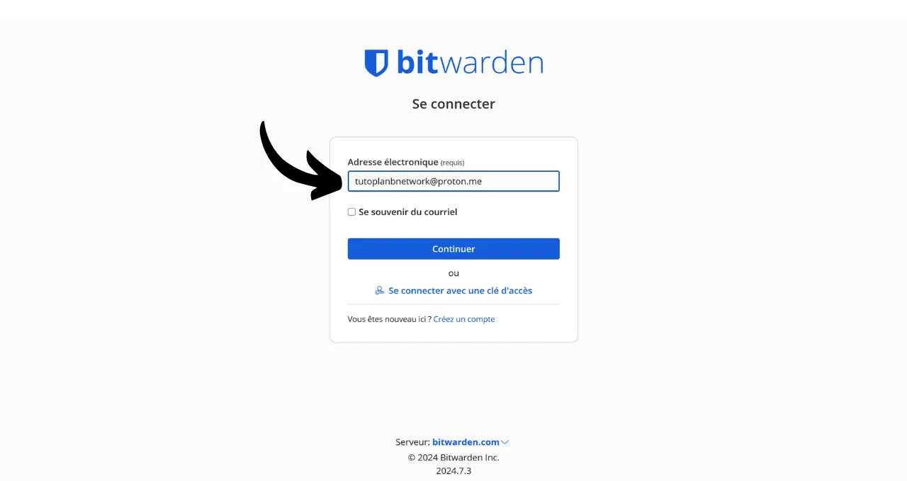
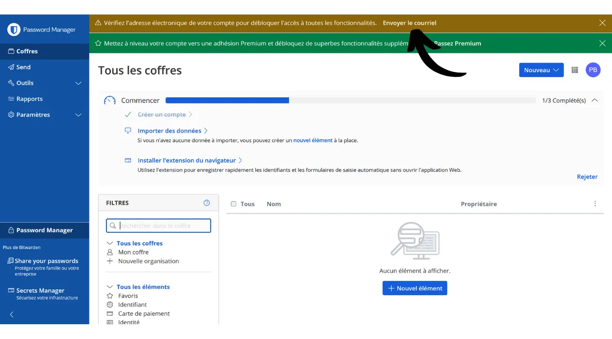
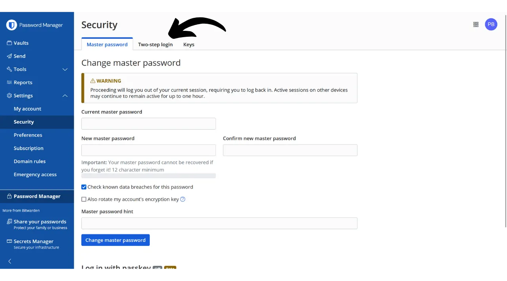

デジタル時代において、私たちは銀行、金融プラットフォーム、メール、ファイルストレージ、健康、行政、ソーシャルネットワーク、ビデオゲームなど、日常生活の様々な側面をカバーする多数のオンラインアカウントを管理する必要があります。

これらのアカウントのそれぞれに自分を認証するために、私たちは識別子（よくメールアドレス）とパスワードを使用します。多くのユニークなパスワードを記憶することが不可能であるため、同じパスワードを再利用したり、共通の基盤をわずかに変更して簡単に覚えられるようにしたいと思うかもしれません。しかし、これらの慣行はアカウントのセキュリティを深刻に損ないます。

パスワードに関して従うべき第一原則は、それらを再利用しないことです。各オンラインアカウントは、ユニークで完全に異なるパスワードで保護されるべきです。これは重要です。なぜなら、攻撃者があなたのパスワードの1つを侵害した場合、彼らがあなたのすべてのアカウントにアクセスできるようになってほしくないからです。各アカウントにユニークなパスワードを持つことは、潜在的な攻撃を隔離し、その範囲を限定します。例えば、ビデオゲームプラットフォームとメールの両方に同じパスワードを使用しており、そのパスワードがゲームプラットフォームに関連するフィッシングサイトを通じて侵害された場合、攻撃者は簡単にあなたのメールにアクセスし、他のすべてのオンラインアカウントを制御することができます。

第二の重要な原則は、パスワードの強度です。パスワードが強いとは、試行錯誤を通じて推測することが難しいことを意味します。つまり、パスワードはできるだけランダムで、長く、文字の多様性（小文字、大文字、数字、記号）を含む必要があります。

これら2つのパスワードセキュリティ原則（ユニークさと堅牢性）を日常生活で適用することは難しいかもしれません。なぜなら、私たちのすべてのアカウントに対してユニークでランダムで強力なパスワードを記憶することはほぼ不可能だからです。ここでパスワードマネージャーの出番です。

パスワードマネージャーは強力なパスワードを生成し、安全に保存することで、個々にそれらを記憶する必要なく、すべてのオンラインアカウントにアクセスできるようにします。あなたが覚える必要があるのは1つのパスワード、マスターパスワードだけで、これによりマネージャー内の保存されたすべてのパスワードにアクセスできます。パスワードマネージャーを使用することは、パスワードの再利用を防ぎ、ランダムなパスワードを体系的に生成することで、オンラインセキュリティを強化します。しかし、あなたのアカウントの日常使用を、あなたの機密情報へのアクセスを一元化することで簡素化します。
このチュートリアルでは、パスワードマネージャーを設定し、使用してオンラインセキュリティを強化する方法を探ります。Bitwardenについて紹介し、別のチュートリアルではKeePassという別のソリューションを見ていきます。
https://planb.network/tutorials/others/keepass

警告：パスワードマネージャーはパスワードの保存には最適ですが、**ビットコインウォレットのニーモニックフレーズをそれに保存してはいけません！** ニーモニックフレーズは、紙や金属のような物理的な形式でのみ専用に保存されるべきです。

## Bitwardenの紹介

Bitwardenは、初心者から上級ユーザーまで適したパスワードマネージャーです。それは数多くの利点を提供します。まず第一に、Bitwardenはマルチプラットフォームソリューションであり、モバイルアプリ、ウェブアプリケーション、ブラウザ拡張機能、デスクトップソフトウェアとして使用できます。

Bitwardenを使用すると、オンラインでパスワードを保存し、すべてのデバイス間で同期しながら、マスターパスワードでエンドツーエンドの暗号化を確保できます。これにより、例えば、コンピュータとスマートフォンの両方でパスワードにアクセスし、2つの間で同期することができます。パスワードが暗号化されているため、マスターパスワードである復号化キーなしには、Bitwardenを含む誰にもアクセスできません。
さらに、Bitwardenはオープンソースであるため、独立した専門家によってソフトウェアの監査が可能です。価格設定に関しては、Bitwardenは以下の3つのプランを提供しています：
- このチュートリアルで探る無料版。無料であるにもかかわらず、有料版と同等のセキュリティレベルを提供します。無制限の数のパスワードを保存し、好きなだけデバイスを同期することができます；
- 年間$10のプレミアム版は、ファイルストレージ、クレジットカードのバックアップ、物理セキュリティキーでの2FAの設定、Bitwardenで直接TOTP 2FA認証へのアクセスなど、追加機能を含みます；
- 年間$40のファミリープランは、プレミアム版の利点を6人の異なるユーザーに拡張します。

私の意見では、これらの価格は公正です。無料版は初心者にとって優れた選択肢であり、プレミアム版は市場の他のパスワードマネージャーと比較して非常に良い価値を提供し、さらに多くの機能を提供します。さらに、Bitwardenがオープンソースであることは大きな利点です。したがって、特に初心者にとっては興味深い妥協点です。
Bitwardenのもう一つの特徴は、例えば自宅にNASを所有している場合、自分のパスワードマネージャーを自己ホストできる能力です。この設定を行うことで、パスワードはBitwardenのサーバーではなく、自分のサーバーに保存されます。これにより、パスワードの可用性を完全にコントロールできます。ただし、このオプションはアクセスの損失を避けるために厳格なバックアップ管理を必要とするため、Bitwardenの自己ホスティングは上級ユーザーにより適しており、別のチュートリアルで議論します。
## Bitwardenアカウントの作成方法は？

[Bitwardenのウェブサイト](https://bitwarden.com/)にアクセスし、"*Get Started*"をクリックしてください。

まず、メールアドレスと名前またはニックネームを入力します。

次に、マスターパスワードを設定する必要があります。序章で見たように、このパスワードは非常に重要で、マネージャーに保存されている他のすべてのパスワードへのアクセスを提供します。これには2つの主なリスクがあります：紛失と侵害。このパスワードへのアクセスを失うと、すべての資格情報にアクセスできなくなります。パスワードが盗まれた場合、攻撃者はすべてのアカウントにアクセスできるようになります。

紛失のリスクを最小限に抑えるために、マスターパスワードの物理的なバックアップを紙に作成し、安全な場所に保管することをお勧めします。可能であれば、このバックアップを安全な封筒に封印し、他の誰もアクセスしていないことを定期的に確認してください。

マスターパスワードの侵害を防ぐためには、非常に強固でなければなりません。できるだけ長く、さまざまな文字を使用し、ランダムに選ばれるべきです。2024年の安全なパスワードの最小推奨事項は、パスワードが本当にランダムであることを前提に、数字、小文字と大文字の文字、および記号を含む13文字です。しかし、すべての可能なタイプの文字を含む少なくとも20文字のパスワードを選択することで、そのセキュリティをより長く保証することをお勧めします。

専用のボックスにマスターパスワードを入力し、次のボックスでそれを確認してください。

希望する場合は、マスターパスワードのヒントを追加することができます。しかし、パスワードを失った場合の信頼できる回復方法を提供しないため、また攻撃者がパスワードを推測したりブルートフォース攻撃を試みるのに役立つ可能性があるため、これを行うことはお勧めしません。一般的に、マスターパスワードのセキュリティを損なう可能性のある公開ヒントの作成は避けてください。
次に、「*アカウントを作成*」ボタンをクリックしてください。

これで、新しいBitwardenアカウントにログインできます。メールアドレスを入力してください。

次に、マスターパスワードを入力してください。

これで、パスワードマネージャーのウェブインターフェースに入りました。

## Bitwardenの設定方法は？

まず、メールアドレスを確認します。「*メール送信*」をクリックしてください。

次に、メールで受け取ったボタンをクリックしてください。

最後に、再度ログインしてください。

まず最初に、パスワードマネージャーを保護するために、二要素認証（2FA）の設定を強くお勧めします。TOTPアプリケーションを使用するか、物理的なセキュリティキーを選択できます。2FAを有効にすると、Bitwardenアカウントにログインするたびに、マスターパスワードだけでなく、二つ目の認証要素の証明も求められます。これは、マスターパスワードの紙のバックアップが危険にさらされた場合に特に有用な、追加のセキュリティ層です。

これらの2FAデバイスの設定と使用方法が不明な場合は、以下の2つのチュートリアルをお勧めします：

https://planb.network/tutorials/others/authy

https://planb.network/tutorials/others/security-key

これを行うには、「*設定*」メニューの「*セキュリティ*」タブに移動してください。

次に、「*二段階ログイン*」タブをクリックしてください。

ここで、好みの2FA方法を選択できます。例えば、私はTOTPアプリケーションを使用した2FAを選択するために、「*管理*」ボタンをクリックします。

マスターパスワードを確認してください。

次に、2FAアプリケーションでQRコードをスキャンしてください。

2FAアプリケーションに表示された6桁のコードを入力し、「*有効にする*」ボタンをクリックしてください。
二要素認証がアカウントに正常に設定されました。

これで、マネージャーに再度ログインしようとすると、まずマスターパスワードを入力し、次に2FAアプリケーションによって生成される6桁の動的コードを入力する必要があります。この動的コードに常にアクセスできるようにしてください。これがないと、パスワードを回復することができません。

設定では、「*Preferences*」タブのマネージャーをカスタマイズするオプションもあります。ここでは、マネージャーが自動的にロックされるまでの時間、インターフェースの言語やテーマを変更できます。

Bitwardenによって生成されるパスワードの長さを調整することを強くお勧めします。デフォルトでは、長さは14文字に設定されていますが、最適なセキュリティには不十分かもしれません。すべてのパスワードを覚えるためにマネージャーを持っているのですから、非常に強力なパスワードを使用することを利用するべきです。
これを行うには、"*Generator*" メニューに移動してください。
ここで、パスワードの長さの値を40まで増やし、記号を含めるためのボックスにチェックを入れることができます。

## Bitwardenでアカウントを保護する方法は？

パスワードマネージャーの設定が完了したら、オンラインアカウントの認証情報を保存し始めることができます。新しいアイテムを追加するには、画面右上にある "*New item*" ボタンまたは "*New*" ボタンを直接クリックし、次に "*item*" をクリックします。

開いたフォームで、保存するアイテムの性質をまず決定します。ログイン認証情報を保存するには、ドロップダウンメニューから "*Login*" オプションを選択します。

"*Name*" フィールドには、認証情報の説明的な名前を入力します。これにより、特に多くのパスワードを持っている場合に、パスワードの検索と整理が容易になります。例えば、PlanB Networkサイトの認証情報を保存したい場合、将来の検索時にすぐに認識できるようにこのアイテムに名前を付けることができます。

"*Folder*" フィールドを使用すると、認証情報をフォルダに分類できます。現時点ではまだ作成していませんが、後で作成方法をお見せします。

"*Username*" フィールドには、通常はメールアドレスであるユーザー名を入力します。
次に、"*Password*" フィールドにパスワードを入力できます。しかし、Bitwardenに長く、ランダムで、ユニークなパスワードを生成させることを強くお勧めします。これにより、強力なパスワードを持つことができます。この機能を使用するには、入力するフィールドの上にある二重矢印アイコンをクリックします。

パスワードが生成されたことがわかります。

"*URI 1*" フィールドには、ウェブサイトのドメイン名を入力できます。

最後に、"*Notes*" フィールドには、必要に応じて追加の詳細を追加できます。

これらのフィールドすべてに入力を終えたら、"*Save*" ボタンをクリックします。

あなたの認証情報は、今Bitwardenマネージャーに表示されています。

それをクリックすると、その詳細にアクセスして変更することができます。

右側の三つの小さな点をクリックすると、パスワードやユーザー名をコピーするためのクイックアクセスが得られます。

おめでとうございます、あなたはマネージャーに最初のパスワードを正常に保存しました！認証情報をより良く整理したい場合は、特定のフォルダを作成できます。これを行うには、画面右上にある "*New*" ボタンをクリックし、"*Folder*" を選択します。

フォルダに名前を入力します。

次に、"*Save*" をクリックします。

あなたのフォルダは、今マネージャーに表示されています。
新しく作成する際や既存のクレデンシャルを変更する際に、フォルダをクレデンシャルに割り当てることができます。例えば、PlanB Networkの私のクレデンシャルをクリックすると、"*Bitcoin*"フォルダに分類することを選択できます。

この方法で、パスワードマネージャーを構造化し、クレデンシャルを見つけやすくすることができます。個人用、職業用、銀行、メール、ソーシャルネットワーク、サブスクリプション、ショッピング、行政、ストリーミング、ストレージ、旅行、健康などのフォルダで整理することができます。
Bitwardenのウェブ版のみを使用したい場合は、それも全く問題ありません。その場合は、ブラウザのお気に入りにパスワードマネージャーを追加して、簡単にアクセスできるようにし、フィッシングのリスクを避けることをお勧めします。しかし、Bitwardenは様々なデバイスでマネージャーを使用し、日常的な使用を簡素化するためのクライアントのフルレンジも提供しています。特に、モバイルアプリ、ブラウザ拡張機能、デスクトップソフトウェアがあります。それらの設定方法を見ていきましょう。

## Bitwardenのブラウザ拡張機能の使用方法は？

まず、ブラウザ拡張機能を設定することができます。この拡張機能はマネージャーの簡易版として機能し、新しいパスワードの自動保存、安全なパスワード提案の生成、ウェブページのログインフォームでのクレデンシャルの自動入力の可能性を提供します。

この拡張機能を日常的に使用することは非常に便利ですが、新たな攻撃ベクトルを開く可能性もあります。そのため、一部のサイバーセキュリティ専門家は、パスワードマネージャーのブラウザ拡張機能の使用を勧めていません。しかし、Bitwardenの拡張機能を使用することを選択した場合、以下の手順で進めてください：

[公式Bitwardenダウンロードページ](https://bitwarden.com/download/#downloads-web-browser)にアクセスしてください。

提供されているリストからブラウザを選択します。この例ではFirefoxを使用しているので、Firefox Add-ons Storeの公式Bitwarden拡張機能にリダイレクトされます。他のブラウザでも手順はほぼ同じです。

"*Add to Firefox*"ボタンをクリックします。

拡張機能バーにBitwardenを追加して、簡単にアクセスできるようにします。拡張機能をクリックしてログインします。

メールアドレスを入力します。

次にマスターパスワードを入力します。

最後に、認証アプリからの6桁のコードを入力します。

これで、ブラウザ拡張機能を通じてBitwardenマネージャーに接続されました。

例えば、PlanB Networkサイトに戻ってアカウントにログインしようとすると、ブラウザに統合されたBitwarden拡張機能がログインフィールドを認識し、以前に保存した識別子を選択することを自動的に提案してくれるのがわかります。

この識別子を選択すると、Bitwardenがログインフィールドを自動で埋めてくれます。この拡張機能により、Bitwardenのウェブアプリケーションやソフトウェアから資格情報をコピー＆ペーストする必要なく、迅速にウェブサイトへ接続できます。 この拡張機能は、新しいアカウントの作成も検出します。例えば、PlanB Networkで新しいアカウントを作成する際、Bitwardenは新しい識別子を保存することを自動的に提案します。 この提案が表示されると、拡張機能が開きます。新しい識別子の詳細を入力し、強力でユニークなパスワードを生成することができます。 情報を入力し、「*Save*」をクリックすると、拡張機能が資格情報を保存します。 その後、拡張機能は自動的にウェブサイト上の適切なフィールドに資格情報を追加します。 ## Bitwardenソフトウェアの使用方法は？
Bitwardenデスクトップソフトウェアをインストールするには、まず[ダウンロードページ](https://bitwarden.com/download/#downloads-desktop)にアクセスします。お使いのオペレーティングシステムに対応するバージョンを選択し、ダウンロードしてください。 ダウンロードが完了したら、コンピューターにソフトウェアをインストールしてください。Bitwardenソフトウェアを初めて起動する際には、パスワードマネージャーをアンロックするために資格情報を入力する必要があります。 そうすると、マネージャーのホームページに到着します。インターフェースはウェブアプリケーションとほぼ同じです。 ## Bitwardenアプリの使用方法は？

スマートフォンからパスワードにアクセスするには、Bitwardenモバイルアプリをインストールできます。まず、[ダウンロードページ](https://bitwarden.com/download/#downloads-mobile)にアクセスし、お使いのオペレーティングシステムに対応するQRコードをスマートフォンでスキャンしてください。 公式のBitwardenモバイルアプリをダウンロードしてインストールします。アプリを初めて開いた際には、パスワードマネージャーへのアクセスをアンロックするために資格情報を入力してください。 接続すると、アプリから直接すべてのパスワードを確認し、管理することができます。 アプリのセキュリティを強化するためには、設定に入り、PIN保護を有効にすることをお勧めします。これにより、電話の紛失や盗難の場合に追加のセキュリティ層が追加されます。 ## Bitwardenのバックアップ方法は？
マスターパスワードの紛失やBitwardenのサーバーに影響を与える災害が発生した場合でも、パスワードへのアクセスを決して失わないようにするためには、定期的にマネージャーの暗号化バックアップを外部メディアに実行することをお勧めします。

この方法では、Bitwardenの資格情報をマスターパスワードとは異なるパスワードで暗号化し、例えば自宅に保管しているUSBスティックやハードドライブにこの暗号化バックアップを保存します。その後、バックアップメディアが保管されている場所とは別の場所に復号化パスワードの物理的なコピーを保管することができます。例えば、USBスティックを自宅に保管し、暗号化パスワードの物理的なコピーを信頼できる友人に託すことができます。

この方法により、バックアップメディアが盗まれたとしても、復号化パスワードなしにはデータにアクセスできないようになります。同様に、物理的なメディアを持っていない友人もデータにアクセスできません。
しかし、問題が発生した場合には、パスワードと外部メディアを使用して、Bitwardenに依存せずに自分の認証情報に再びアクセスできるようになります。したがって、Bitwardenのサーバーが破壊されたとしても、パスワードを取り戻す可能性はまだあります。
そのため、常に最新の認証情報を含むように、これらのバックアップを定期的に実行することをお勧めします。新しいバックアップごとに暗号化パスワードのコピーを持っている友人を煩わせないようにするため、このパスワードをパスワードマネージャーに保存できます。これはバックアップとして意図されているわけではありません。なぜなら、友人がすでに物理的なコピーを持っているからです。しかし、将来のエクスポート手続きを簡素化するためです。

エクスポートを進めるには、非常に簡単です：Bitwardenマネージャーの「*Tools*」セクションに移動し、「*Export vault*」を選択します。

フォーマットには「*.json (Encrypted)*」を選択します。

次に、「*Password protected*」オプションを選択します。

ここでは、バックアップを暗号化するために、強力でユニークでランダムに生成されたパスワードを選択することが重要です。これにより、暗号化されたバックアップが盗まれた場合でも、攻撃者がブルートフォースによってそれを解読することが不可能になります。

「*Confirm format*」をクリックし、エクスポートを進めるためにマスターパスワードを入力します。

エクスポートが完了すると、暗号化されたバックアップファイルがダウンロードに見つかります。それをUSBスティックやハードドライブなどの安全な外部ストレージデバイスに転送します。使用状況に応じて、この操作を定期的に繰り返します。例えば、ニーズに応じて、バックアップを毎週または毎月更新できます。