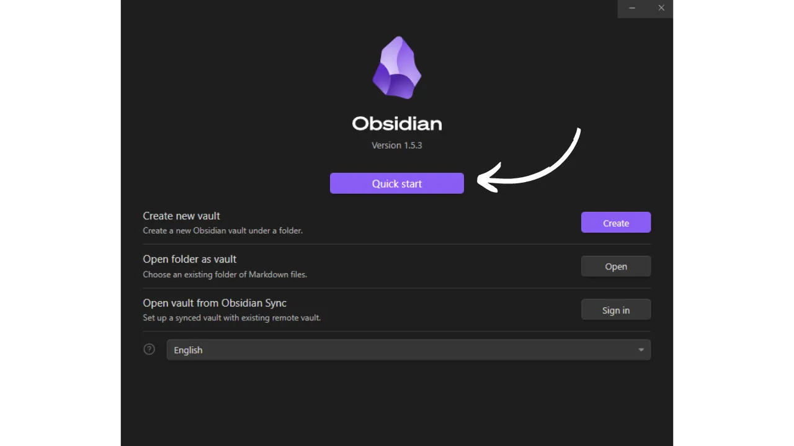
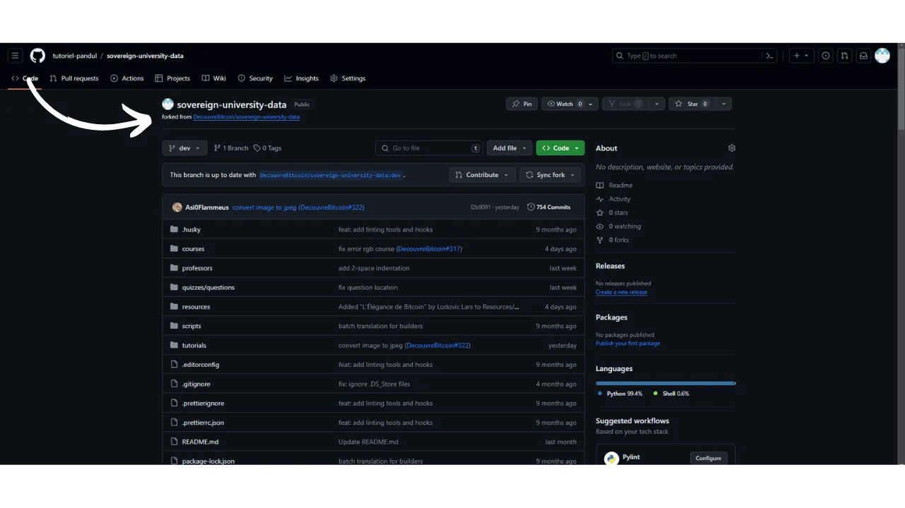
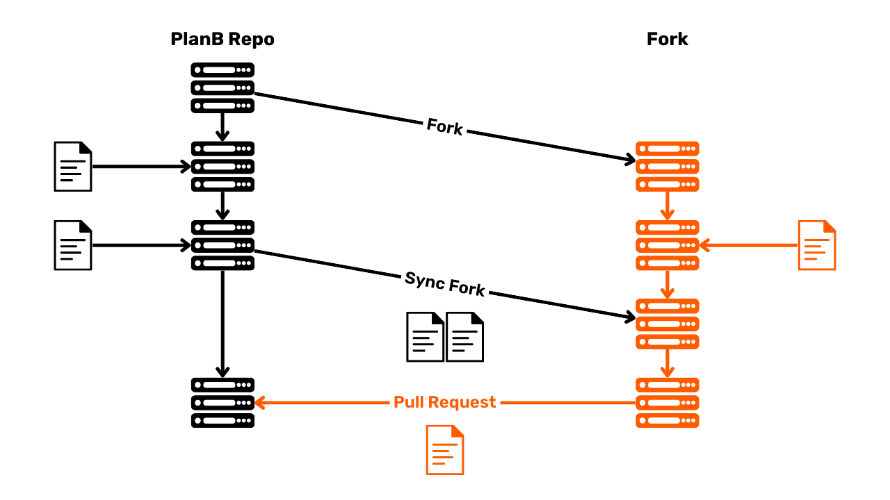

Mise PlanB je poskytovat špičkové vzdělávací zdroje o Bitcoinu v co nejvíce jazycích. Veškerý obsah publikovaný na webu je open-source a hostovaný na GitHubu, což umožňuje každému podílet se na obohacování platformy. Příspěvky mohou mít různé formy: oprava a korektura stávajících textů, překlad do jiných jazyků, aktualizace informací nebo vytváření nových tutoriálů, které ještě na našem webu nejsou.

Pokud si přejete přispět do sítě PlanB, budete potřebovat použít GitHub k navrhování změn. K tomu máte dvě možnosti:
- **Přímo přispět prostřednictvím webového rozhraní GitHubu**: To je nejjednodušší metoda. Pokud jste začátečník nebo plánujete udělat jen několik malých příspěvků, tato možnost je pravděpodobně pro vás nejlepší;
- **Přispívat lokálně pomocí Gitu**: Tato metoda je vhodnější, pokud plánujete pravidelně nebo významně přispívat do sítě PlanB. I když se na první pohled může zdát nastavení vašeho lokálního Git prostředí na počítači složité, tento přístup je na dlouhou trať efektivnější. Umožňuje flexibilnější správu změn. Pokud jste v tomto noví, nebojte se, **v tomto tutoriálu vysvětlujeme celý proces nastavení vašeho prostředí** (slíbíme, že nebudete muset psát žádné příkazové řádky ^^).

Pokud nevíte, co je GitHub, nebo pokud se chcete dozvědět více o technických termínech souvisejících s Gitem a GitHubem, doporučuji vám přečíst náš úvodní článek, abyste se seznámili s těmito koncepty.

https://planb.network/tutorials/others/basics-of-github

- Začněte tím, že budete samozřejmě potřebovat účet na GitHubu. Pokud už jeden máte, můžete se přihlásit, jinak můžete použít náš tutoriál k vytvoření nového.

https://planb.network/tutorials/others/create-github-account

## Krok 1: Instalace GitHub Desktop

- Přejděte na https://desktop.github.com/ a stáhněte si software GitHub Desktop. Tento software vám umožní snadno interagovat s GitHubem, aniž byste museli používat terminál:

- Při prvním spuštění softwaru budete vyzváni k připojení vašeho účtu na GitHubu. K tomu klikněte na `Sign in to GitHub.com`:

- V prohlížeči se otevře stránka pro ověření. Zadejte svou e-mailovou adresu a heslo zvolené při vytváření účtu, poté klikněte na tlačítko `Sign in`:

- Klikněte na `Authorize desktop` a potvrďte spojení mezi vaším účtem a softwarem:

- Budete automaticky přesměrováni do softwaru GitHub Desktop. Klikněte na `Finish`: 
- Pokud jste si právě vytvořili svůj účet na GitHubu, budete přesměrováni na stránku, která vám sdělí, že jste ještě nevytvořili žádné repozitáře. V tomto bodě odložte software GitHub Desktop stranou; vrátíme se k němu později: 

## Krok 2: Instalace Obsidian

Přejděme k instalaci softwaru pro psaní. Zde máte několik možností. Budete potřebovat software, který podporuje úpravy souborů Markdown, jelikož PlanB Network používá tento formát pro textové soubory ve svém repozitáři.
Existuje mnoho softwarů specializovaných na úpravu souborů Markdown, jako je například Typora, která je navržena speciálně pro psaní. Ačkoli to není ideální, je také možné vybrat si editor kódu, jako je Visual Studio Code (VSC) nebo Sublime Text. Jako spisovatel však dávám přednost používání softwaru Obsidian. Pojďme se společně podívat, jak ho nainstalovat a začít s ním pracovat.
- Přejděte na https://obsidian.md/download a stáhněte si software: 
- Nainstalujte Obsidian, spusťte software, vyberte svůj jazyk a poté klikněte na `Quick Start`: 
- Dostanete se do softwaru Obsidian. Zatím nemáte otevřené žádné soubory: 

## Krok 3: Forkněte repozitář PlanB Network

- Přejděte na datový repozitář PlanB Network na následující adrese: [https://github.com/DecouvreBitcoin/sovereign-university-data](https://github.com/DecouvreBitcoin/sovereign-university-data): 
- Na této stránce klikněte na tlačítko `Fork` v pravém horním rohu okna: 
- V menu vytváření můžete ponechat výchozí nastavení. Ujistěte se, že je zaškrtnuto políčko `Copy the dev branch only`, a poté klikněte na tlačítko `Create fork`: 
- Poté se dostanete na vlastní fork repozitáře PlanB Network: 
Tento fork představuje samostatný repozitář od původního, ačkoli v současné době obsahuje stejná data. Nyní budete pracovat na tomto novém repozitáři.

V jistém smyslu jsme udělali kopii zdrojového repozitáře PlanB Network. Váš fork (kopie) a původní repozitář se nyní budou vyvíjet nezávisle na sobě. Na původním repozitáři mohou ostatní přispěvatelé přidávat nová data, zatímco vy, na vašem forku, budete provádět vlastní úpravy.
Pro udržení konzistence mezi těmito dvěma repozitáři bude nutné je pravidelně synchronizovat, aby obsahovaly stejné informace. Pro odeslání vašich změn do zdrojového repozitáře použijete to, co se nazývá **Pull Request**. A pro integraci změn ze zdrojového repozitáře do vašeho forku použijete příkaz **Sync fork** dostupný na webovém rozhraní GitHubu.

## Krok 4: Klonujte fork

- Vraťte se do softwaru GitHub Desktop. Váš fork by nyní měl být viditelný v sekci `Your repositories`. Pokud ho hned nevidíte, použijte tlačítko se dvojitou šipkou pro obnovení seznamu. Když se váš fork objeví, klikněte na něj, abyste ho vybrali:

- Poté klikněte na modré tlačítko: `Clone [username]/sovereign-university-data`:

- Ponechte výchozí cestu. Pro potvrzení klikněte na modré tlačítko `Clone`:

- Počkejte, až GitHub Desktop lokálně naklonuje váš fork:

- Po klonování repozitáře vám software nabídne dvě možnosti. Musíte vybrat první: `Přispět do mateřského projektu`. Tato volba vám umožní prezentovat vaši budoucí práci jako příspěvek do mateřského projektu (`DecouvreBitcoin/sovereign-university-data`), a ne výhradně jako úpravu vašeho osobního forku (`[username]/sovereign-university-data`). Jakmile je možnost vybrána, klikněte na `Pokračovat`: 
- Váš GitHub Desktop je nyní správně nakonfigurován. Nyní můžete nechat software otevřený na pozadí, abyste sledovali úpravy, které provedeme.

To, co jsme na této fázi dosáhli, je vytvoření lokální kopie vašeho repozitáře, který je hostován na GitHubu. Připomínáme, že tento repozitář je forkem zdrojového repozitáře PlanB Network. Budete moci provádět úpravy této lokální kopie, jako je přidávání tutoriálů, překladů nebo oprav. Jakmile jsou tyto úpravy provedeny, použijete příkaz **Push origin** k odeslání vašich lokálních úprav do vašeho forku hostovaného na GitHubu.

Můžete také načítat úpravy z forku, například během synchronizace s repozitářem PlanB Network. Pro to použijete příkaz **Fetch origin** ke stažení úprav do vaší lokální kopie (vašeho klonu) a poté příkaz **Pull origin** k jejich sloučení s vaší prací. To vám umožňuje zůstat v kontaktu s nejnovějšími vývoji projektu, zatímco efektivně přispíváte.

## Krok 5: Vytvoření nového trezoru v Obsidian

- Otevřete software Obsidian a klikněte na malou ikonu trezoru v levém dolním rohu okna:

- Klikněte na tlačítko `Otevřít` pro otevření existující složky jako trezoru: 
- Otevře se váš průzkumník souborů. Musíte najít a vybrat složku s názvem `GitHub`, která by měla být ve vašem adresáři `Dokumenty` mezi vašimi soubory. Tato cesta odpovídá té, kterou jste nastavili během kroku 4. Po výběru složky potvrďte její výběr. Vytvoření vašeho trezoru v Obsidian se poté spustí na nové stránce softwaru:

-> **Pozor**, je důležité nevybrat složku `sovereign-university-data` při vytváření nového trezoru v Obsidian. Místo toho vyberte nadřazenou složku, `GitHub`. Pokud vyberete složku `sovereign-university-data`, konfigurační složka `.obsidian`, obsahující vaše lokální nastavení Obsidian, bude automaticky integrována do repozitáře. Chceme tomu zabránit, protože není nutné přenášet vaše konfigurace Obsidian do repozitáře PlanB Network. Alternativou je přidat složku `.obsidian` do souboru `.gitignore`, ale tato metoda by také upravila soubor `.gitignore` zdrojového repozitáře, což není žádoucí.

- Na levé straně okna můžete vidět strom souborů s vašimi různými repozitáři GitHub, které byly lokálně naklonovány.
- Kliknutím na šipky vedle názvů složek je můžete rozbalit a získat tak přístup k podsložkám repozitářů a jejich dokumentům:

- Nezapomeňte nastavit Obsidian na tmavý režim: "Světlo přitahuje brouky" ;)

## Krok 6: Instalace editoru kódu
Většina vašich úprav bude na souborech ve formátu Markdown (`.md`). Pro editaci těchto dokumentů můžete použít Obsidian, software, o kterém jsme dříve hovořili. Nicméně, PlanB Network používá i jiné formáty souborů a budete muset některé z nich upravit.
Například při vytváření nového tutoriálu budete muset vytvořit soubor YAML (`.yml`) pro zadání tagů vašeho tutoriálu, jeho názvu a vašeho ID učitele. Obsidian nenabízí možnost upravovat tento typ souborů, takže budete potřebovat editor kódu.

Pro tento účel máte k dispozici několik možností. Ačkoliv standardní poznámkový blok vašeho počítače lze pro tyto úpravy použít, toto řešení není ideální pro precizní práci. Doporučuji vybrat software speciálně navržený pro tento účel, jako je [VS Code](https://code.visualstudio.com/download) nebo [Sublime Text](https://www.sublimetext.com/download). Sublime Text, který je obzvláště lehký, bude pro naše potřeby více než dostačující.
- Nainstalujte jeden z těchto programů a nechte ho stranou pro vaše budoucí úpravy. 
Gratulujeme! Vaše pracovní prostředí je nyní připraveno k přispívání do PlanB Network. Nyní můžete prozkoumat naše další specifické tutoriály pro každý typ příspěvku (překlad, korektury, psaní.

https://planb.network/tutorials/others

..).