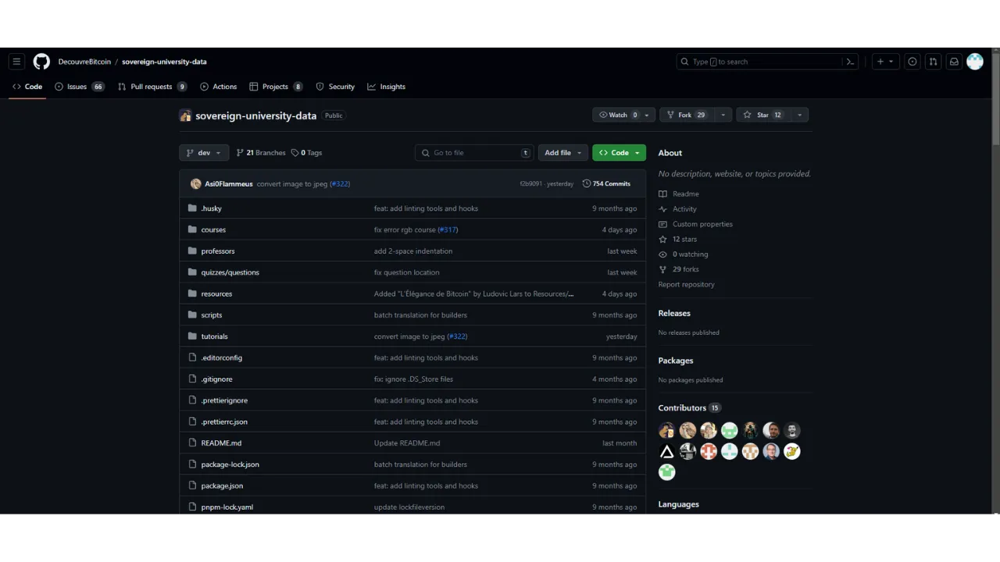
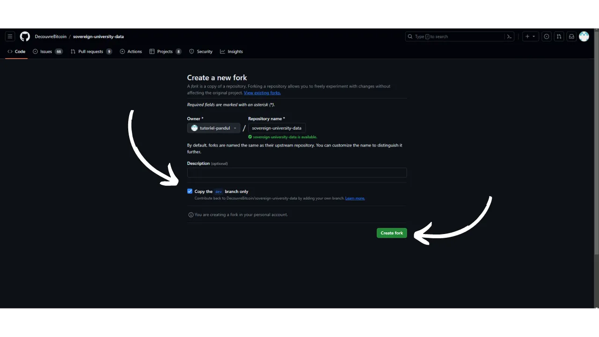
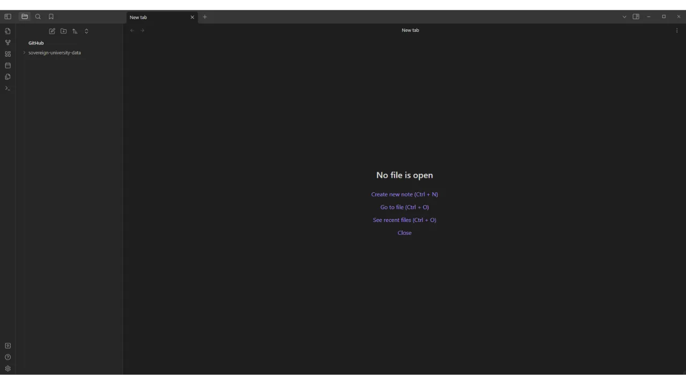

A missão da PlanB é fornecer recursos educacionais de primeira linha sobre Bitcoin em tantos idiomas quanto possível. Todo o conteúdo publicado no site é de código aberto e hospedado no GitHub, o que permite que qualquer pessoa participe do enriquecimento da plataforma. As contribuições podem assumir várias formas: corrigir e revisar textos existentes, traduzir para outros idiomas, atualizar informações ou criar novos tutoriais ainda não disponíveis em nosso site.

Se você deseja contribuir para a Rede PlanB, precisará usar o GitHub para propor mudanças. Para fazer isso, você tem duas opções:
- **Contribuir diretamente via interface web do GitHub**: Este é o método mais simples. Se você é iniciante ou se planeja fazer apenas algumas contribuições menores, esta opção provavelmente é a melhor para você;
- **Contribuir localmente usando Git**: Este método é mais adequado se você planeja fazer contribuições regulares ou significativas para a Rede PlanB. Embora configurar seu ambiente Git local no seu computador possa parecer complexo inicialmente, esta abordagem é mais eficiente a longo prazo. Ela permite um gerenciamento mais flexível das mudanças. Se você é novo nisso, não se preocupe, **explicamos todo o processo de configuração do seu ambiente neste tutorial** (promessa, você não precisará digitar nenhuma linha de comando ^^).

Se você não tem ideia do que é o GitHub, ou se quer aprender mais sobre os termos técnicos relacionados ao Git e GitHub, recomendo que leia nosso artigo introdutório para se familiarizar com esses conceitos.

https://planb.network/tutorials/others/basics-of-github

- Para começar, você obviamente precisará de uma conta no GitHub. Se você já tem uma, pode fazer login, caso contrário, pode usar nosso tutorial para criar uma nova.

https://planb.network/tutorials/others/create-github-account

## Passo 1: Instalar o GitHub Desktop

- Vá para https://desktop.github.com/ para baixar o software GitHub Desktop. Este software permite que você interaja facilmente com o GitHub, sem precisar usar um terminal:

- Quando você iniciar o software pela primeira vez, será solicitado que conecte sua conta do GitHub. Para fazer isso, clique em `Sign in to GitHub.com`:

- Uma página de autenticação será aberta em seu navegador. Insira seu endereço de email e senha escolhidos ao criar sua conta, depois clique no botão `Sign in`:

- Clique em `Authorize desktop` para confirmar a conexão entre sua conta e o software:

- Você será redirecionado automaticamente para o software GitHub Desktop. Clique em `Finish`: 
- Se você acabou de criar sua conta no GitHub, será redirecionado para uma página indicando que você ainda não criou nenhum repositório. Neste ponto, deixe de lado o software GitHub Desktop; voltaremos a ele mais tarde: 

## Passo 2: Instalar o Obsidian

Vamos passar para a instalação do software de escrita. Aqui, você tem várias opções. Você precisará de um software que suporte a edição de arquivos Markdown, já que a Rede PlanB usa esse formato para os arquivos de texto em seu repositório.
Existem uma infinidade de softwares especializados na edição de arquivos Markdown, como o Typora, projetado especificamente para escrita. Embora não seja o ideal, também é possível escolher um editor de código, como o Visual Studio Code (VSC) ou o Sublime Text. No entanto, como escritor, prefiro usar o software Obsidian. Vamos ver juntos como instalar e começar a usá-lo.
- Acesse https://obsidian.md/download e baixe o software: 
- Instale o Obsidian, inicie o software, escolha seu idioma e, em seguida, clique em `Quick Start`: 
- Você chegará ao software Obsidian. Por enquanto, você não tem nenhum arquivo aberto: 

## Passo 3: Faça um Fork do repositório PlanB Network

- Vá ao repositório de dados da PlanB Network no seguinte endereço: [https://github.com/DecouvreBitcoin/sovereign-university-data](https://github.com/DecouvreBitcoin/sovereign-university-data): 
- Nesta página, clique no botão `Fork` no topo direito da janela: 
- No menu de criação, você pode deixar as configurações padrão. Certifique-se de que a caixa `Copy the dev branch only` esteja marcada, depois clique no botão `Create fork`: 
- Você então chegará ao seu próprio fork do repositório PlanB Network: 
Este fork constitui um repositório separado do original, embora atualmente contenha os mesmos dados. Agora você trabalhará neste novo repositório.

De certa forma, fizemos uma cópia do repositório fonte da PlanB Network. Seu fork (a cópia) e o repositório original agora evoluirão independentemente um do outro. No repositório original, outros contribuidores podem adicionar novos dados, enquanto você, no seu fork, procederá com suas próprias modificações.
Para manter a consistência entre esses dois repositórios, será necessário sincronizá-los periodicamente para que recuperem as mesmas informações. Para enviar suas alterações ao repositório fonte, você usará o que é chamado de **Pull Request**. E para integrar mudanças do repositório fonte ao seu fork, você usará o comando **Sync fork** disponível na interface web do GitHub.

## Passo 4: Clone o fork

- Retorne ao software GitHub Desktop. Até agora, seu fork deve aparecer na seção `Your repositories`. Se você não o vir imediatamente, use o botão de seta dupla para atualizar a lista. Quando seu fork aparecer, clique nele para selecioná-lo:

- Em seguida, clique no botão azul: `Clone [username]/sovereign-university-data`:

- Mantenha o caminho padrão. Para confirmar, clique no botão azul `Clone`:

- Aguarde enquanto o GitHub Desktop clona seu fork localmente:

- Após clonar o repositório, o software oferece duas opções. Você deve selecionar a primeira: `To contribute to the parent project`. Essa escolha permitirá que você apresente seu trabalho futuro como uma contribuição ao projeto pai (`DecouvreBitcoin/sovereign-university-data`), e não exclusivamente como uma modificação do seu fork pessoal (`[username]/sovereign-university-data`). Uma vez que a opção é escolhida, clique em `Continue`: 
- Seu GitHub Desktop agora está corretamente configurado. Agora, você pode deixar o software aberto em segundo plano para acompanhar as modificações que faremos.

O que alcançamos nesta etapa é a criação de uma cópia local do seu repositório, que está hospedado no GitHub. Como lembrete, este repositório é um fork do repositório fonte da PlanB Network. Você poderá fazer modificações nesta cópia local, como adicionar tutoriais, traduções ou correções. Uma vez que estas modificações são feitas, você usará o comando **Push origin** para enviar suas modificações locais para o seu fork hospedado no GitHub.

Você também pode recuperar modificações do fork, por exemplo, durante uma sincronização com o repositório da PlanB Network. Para isso, você usará o comando **Fetch origin** para baixar as modificações para a sua cópia local (seu clone), e então o comando **Pull origin** para mesclá-las com seu trabalho. Isso permite que você fique atualizado com os últimos desenvolvimentos do projeto enquanto contribui efetivamente.

## Passo 5: Criar um novo cofre no Obsidian

- Abra o software Obsidian e clique no pequeno ícone de cofre na parte inferior esquerda da janela:

- Clique no botão `Open` para abrir uma pasta existente como um cofre: 
- Seu explorador de arquivos será aberto. Você precisa localizar e selecionar a pasta intitulada `GitHub`, que deve estar no seu diretório `Documentos` entre seus arquivos. Este caminho corresponde ao que você estabeleceu durante o passo 4. Após escolher a pasta, confirme sua seleção. A criação do seu cofre no Obsidian será então iniciada em uma nova página do software:

-> **Atenção**, é importante não escolher a pasta `sovereign-university-data` ao criar um novo cofre no Obsidian. Em vez disso, selecione a pasta pai, `GitHub`. Se você selecionar a pasta `sovereign-university-data`, a pasta de configuração `.obsidian`, contendo suas configurações locais do Obsidian, será automaticamente integrada ao repositório. Queremos evitar isso, pois não é necessário transferir suas configurações do Obsidian para o repositório da PlanB Network. Uma alternativa é adicionar a pasta `.obsidian` ao arquivo `.gitignore`, mas este método também modificaria o arquivo `.gitignore` do repositório fonte, o que não é desejável.

- No lado esquerdo da janela, você pode ver a árvore de arquivos com seus diferentes repositórios do GitHub que foram clonados localmente.
- Clicando nas setas ao lado dos nomes das pastas, você pode expandi-las para acessar as subpastas dos repositórios e seus documentos:

- Não esqueça de configurar o Obsidian para o modo escuro: "A luz atrai bugs" ;)

## Passo 6: Instalar um Editor de Código
A maioria das suas modificações será em arquivos no formato Markdown (`.md`). Para editar esses documentos, você pode usar o Obsidian, o software que discutimos anteriormente. No entanto, a PlanB Network utiliza outros formatos de arquivo, e você precisará modificar alguns deles.
Por exemplo, ao criar um novo tutorial, você precisará criar um arquivo YAML (`.yml`) para inserir as tags do seu tutorial, seu título e seu ID de professor. O Obsidian não oferece a possibilidade de modificar esse tipo de arquivos, então você precisará de um editor de código.

Para isso, várias opções estão disponíveis para você. Embora o bloco de notas padrão do seu computador possa ser usado para essas modificações, essa solução não é ideal para um trabalho organizado. Eu recomendo escolher um software especificamente projetado para esse propósito, como o [VS Code](https://code.visualstudio.com/download) ou o [Sublime Text](https://www.sublimetext.com/download). O Sublime Text, por ser particularmente leve, será mais do que suficiente para nossas necessidades.
- Instale um desses programas de software e mantenha-o à parte para suas futuras modificações. 
Parabéns! Seu ambiente de trabalho agora está configurado para contribuir com a PlanB Network. Agora você pode explorar nossos outros tutoriais específicos para cada tipo de contribuição (tradução, revisão, escrita.

https://planb.network/tutorials/others

..).