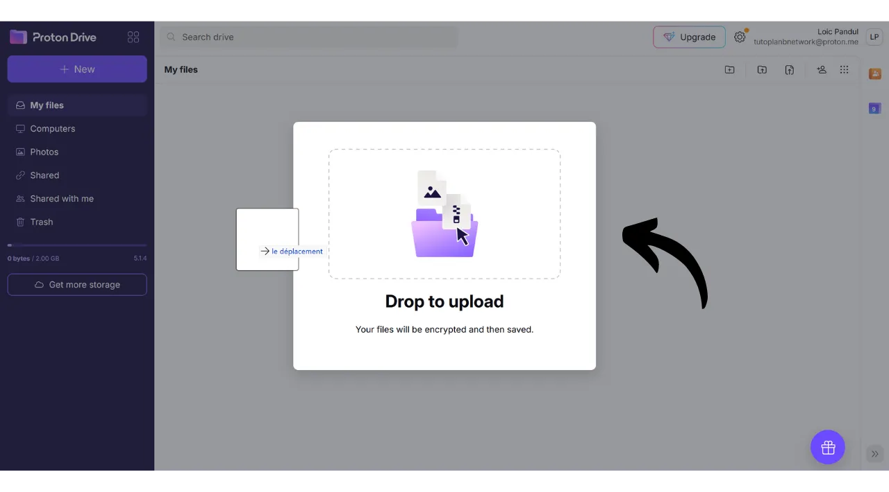
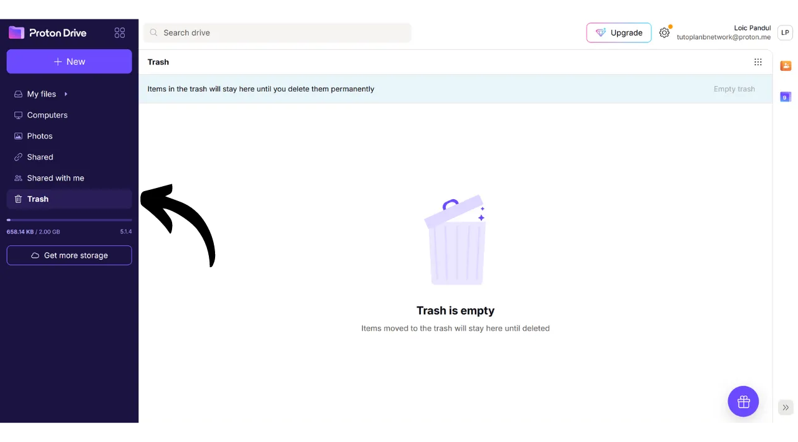
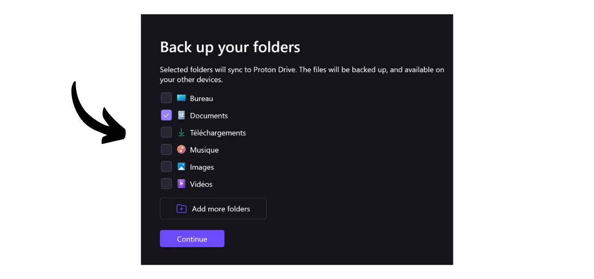

如今，确保个人文件的可访问性、安全性和备份非常重要，这些个人文件可能包括您的个人文档、照片或重要项目。丢失这些数据可能是灾难性的。

为了预防这些问题，我建议您在不同的媒介上维护文件的多重备份。计算中常用的策略是“3-2-1”备份策略，它确保了文件的保护：
- **3**份文件的副本；
- 至少保存在**2**种不同类型的媒介上；
- 至少**1**份副本保存在异地。

换句话说，建议您在3个不同的位置存储文件，使用不同类型的媒介，如您的电脑、外部硬盘、USB闪存盘或在线存储服务。最后，拥有一个异地副本意味着您应该在家庭或业务之外存储一个备份。这最后一点有助于避免在发生火灾或洪水等本地灾害时文件的全面丢失。一个远离您的家庭或业务的外部副本，确保您的数据无论本地风险如何都能存活下来。

为了便于实施3-2-1备份策略，您可以使用在线存储服务。这些解决方案通常被称为“云”，通过在可从任何设备访问的安全服务器上存储您的数据，为您提供额外的保护。术语“云”简单地指的是在外部服务器上存储数据。

许多人使用大型数字公司的存储解决方案：Google Drive、Microsoft OneDrive或Apple iCloud。

这些解决方案便于日常使用，并确保了数据的可访问性，但它们不确保保密性。在本教程中，我提议发现另一种解决方案，它与大科技公司的存储工具一样易于使用，但增加了保护您隐私的额外措施。这个解决方案是Proton Drive，来自瑞士公司Proton的在线存储工具。我们还将看到如何轻松实施适合日常使用的3-2-1策略。

## 介绍 Proton Drive
Proton Drive是一个有趣的在线存储解决方案，因为它将易用性与文件安全性相结合。与来自科技巨头的传统云服务不同，Proton Drive实施了保护您隐私的措施。它确保了所有文件的端到端加密，这意味着即使是Proton的团队也无法访问您的数据。此外，Proton Drive是开源的，允许独立专家自由审计软件的代码。

Proton的商业模式基于订阅系统，这是令人安心的，因为它表明该公司的资金来源并不一定是利用用户数据。在本教程中，我将解释如何使用Proton Drive的免费版本，但也有提供更多功能的几个订阅级别。这种商业模式比大科技风格的免费系统更可取，后者可能会引起人们对我们的个人数据是否被用于盈利的担忧。Proton似乎并非如此。

Proton Drive提供的不仅仅是简单的存储选项；它还允许在线共享、编辑和协作文档，使用的编辑工具类似于Google的软件套件。
关于[定价](https://proton.me/pricing)，免费版本提供最多5 GB的存储空间，并包括基本功能。要将存储能力扩展到200 GB，可以订阅Proton Drive的特定套餐，每月费用为4欧元。另一方面，Proton Unlimited计划每月10欧元，提供最多500 GB的Proton Drive存储空间，并包括Proton的所有付费服务，如VPN和密码管理器，以及免费工具（电子邮件和日历）的额外好处。
## 如何创建Proton账户？

如果您还没有Proton账户，您需要创建一个。我推荐您参考我们的Proton Mail教程，在其中我们详细解释了如何创建一个免费的Proton账户并进行设置：

https://planb.network/tutorials/others/proton-mail

## 如何设置Proton Drive？

登录您的Proton邮件后，点击屏幕左上角有四个小方块的图标。

然后点击“*Drive*”。

现在您已经在您的Proton Drive上了。

## 如何使用Proton Drive？
要向您的Proton Drive添加文件，如果您仅使用网络版本（我们稍后将讨论本地版本的使用），您只需将文档直接拖放到界面中。

然后您可以在首页上找到您的文档。

要添加新项目，请点击屏幕左上角的“*新建*”按钮。

“*上传文件*”功能打开您的本地文件浏览器，允许您选择并导入新文档到Proton Drive，就像您通过拖放做的那样。

“*上传文件夹*”允许您导入整个文件夹。

“*新建文件夹*”使您能够创建一个文件夹以更好地在Proton Drive上组织您的文档。

点击此选项，为您的文件夹命名。

然后您将直接在Proton Drive的首页上找到它。

最后，“*新建文档*”允许您直接在Proton Drive中创建一个新的文本文档。

点击它，一个新的空白文档打开。

您可以在上面写字并编辑它。

如果您点击右上角的“*分享*”按钮，您可以分享该文档。

然后您只需输入您希望授予文档访问权限的贡献者的电子邮件，可以是只读或具有编辑权限。

如果您回到您的Proton Drive，您可以看到文档已被保存。
在“*共享*”标签页中，你可以找到你与他人共享的文档。

而在“*与我共享*”标签页中，你可以看到别人与你共享的文档。

最后，在“*垃圾箱*”标签页中，你可以找到你最近删除的文档。

你的Proton Drive的大多数设置都集成到你的Proton账户中。关于设置账户的详细指南，请参考此教程：

https://planb.network/tutorials/others/proton-mail

## 如何安装Proton Drive软件？
Proton Drive还提供了一款软件，能够实现你的本地文件与在线存储空间的同步。这一功能便于并自动化了我们的3-2-1备份策略的实施。通过Proton Drive软件，你可以获得两份同步的文件副本：一份在你的电脑上，另一份在Proton的服务器上，从而满足了两种媒介类型和异地备份的标准。你只需创建第三份副本，我们稍后将进行设置。
要使用该软件，请在你的Proton Drive账户上点击“*电脑*”标签页，并选择与你的操作系统相对应的按钮进行下载。

安装完成后，你需要登录以解锁你的账户，然后点击“*登录*”。

选择你希望与你的Proton Drive同步的本地文件。

例如，我只选择了“*Proton备份*”文件夹。然后点击“*继续*”按钮。

接下来，你将进入与网页应用类似的软件界面。

从现在起，你的电脑本地将有一个名为“*Proton Drive*”的文件夹，它将汇总所有存储在Proton在线的文档。如果你从电脑向这个文件夹添加一个文件，你将自动在Proton Drive网页应用的首页找到它，反之亦然。对于你选择在软件安装期间同步的文件夹，你也可以通过访问Proton Drive的“*电脑*”部分然后选择你的电脑来在线找到它们。

因此，你的所有文件都在你的机器本地和Proton Drive的在线服务器上备份和同步。

## 如何备份Proton Drive？

如果你已经按照前面的步骤操作，你现在已经有了两个不同的备份位置来存储你的重要文件。为了完成我们的3-2-1备份策略，我们需要添加第三份副本。
我建议你在外部媒介上执行这个额外的备份，例如硬盘或USB闪存盘。根据你的使用强度，设置一个合适的备份更新频率（每周、每月、半年……）。在每个选定的间隔，你将需要下载你的Proton Drive的全部内容，以便在选定的外部媒介上备份数据。这样，即使在你的电脑被盗和Proton的服务器同时被毁的情况下，你仍然可以通过USB闪存盘上的副本安全地访问你的文件。
为此，请转到您的Proton Drive。
选择您的所有文件。

然后点击小箭头下载它们。

接下来，我们将重复此操作，同步我们电脑中的文件。

然后，您会在下载文件夹中找到.zip文件。只需将您选择的外部存储设备连接到电脑，然后将这些文件传输到该设备上。

如果您担心这个USB闪存盘可能会被盗，考虑使用VeraCrypt之类的软件对其进行加密（我们很快会就这个软件制作教程）。

恭喜您，您现在拥有一个非常健壮的3-2-1备份策略，这使您能够大幅降低无论在什么情况下丢失访问个人文件的风险。通过选择Proton Drive作为您的在线备份，您还将受益于端到端加密，这保证了您隐私的保护。

要了解更多关于保护您的在线存在并避免黑客攻击的信息，我还推荐您查阅我们关于Bitwarden密码管理器的详细教程：

https://planb.network/tutorials/others/bitwarden