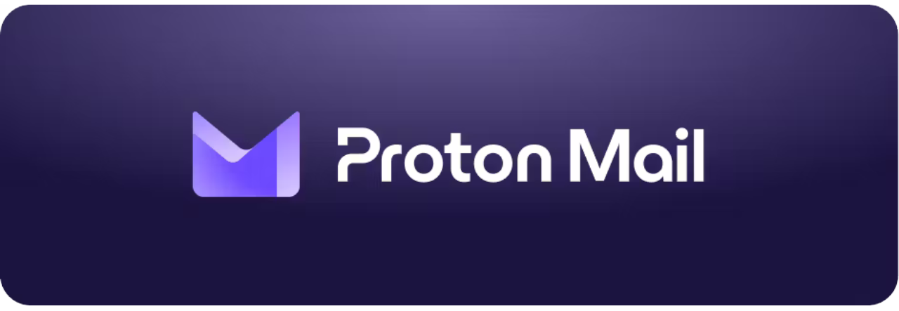
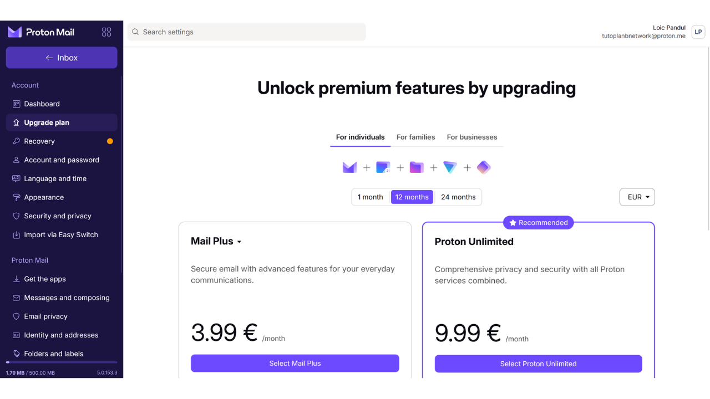
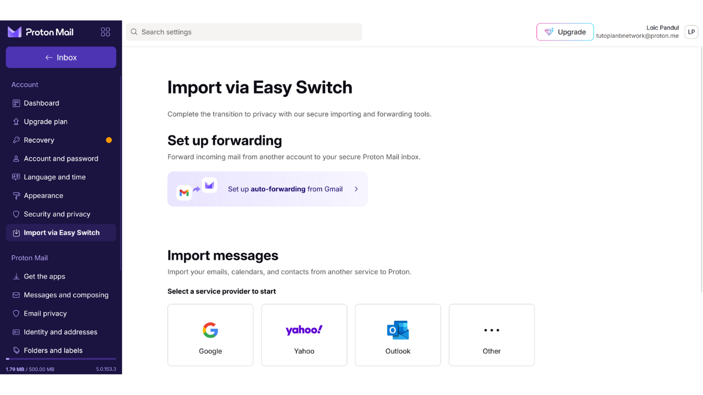
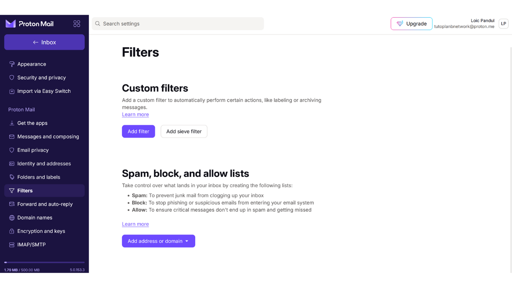

电子邮件账户是您在线活动的核心元素，通常在计算机安全中扮演着至关重要的角色。如果攻击者设法侵入您的电子邮件账户，他们可以通过“忘记密码”功能轻松访问您的其他账户。这可能允许他们控制您的社交网络、银行账户和其他在线服务，因为如今，电子邮件地址通常被用作您在线身份的唯一标识符。因此，保护您的电子邮件账户对于防止攻击非常重要。

为了确保您的电子邮件账户的安全，采取一些简单的良好实践非常重要，我们将在本教程中研究这些实践，该教程面向计算机初学者。选择一个提供高级保护选项和健壮隐私保护政策的安全电子邮件提供商也很重要。这就是为什么我在本教程中推荐探索ProtonMail的原因。即使您选择不使用这个提供商，这里介绍的良好实践也可以应用于任何电子邮件账户以增强其安全性。

## 为什么使用ProtonMail？

ProtonMail是一个相当安全的消息解决方案，这得益于几个特性。首先，ProtonMail确保您的电子邮件端到端加密，这意味着只有发送者和接收者可以阅读其内容。理论上，即使是ProtonMail也无法访问其用户的电子邮件。这种加密是自动应用的，不需要用户具备任何特定的技术技能。

此外，ProtonMail集成了先进的技术来保护您的隐私，包括阻止某些跟踪系统和掩盖您的IP地址。由于Proton公司位于瑞士，它受益于一些在其他国家找不到的数据保护法律。另外，ProtonMail是开源的，这允许独立专家自由审计软件代码。

Proton的商业模式基于订阅系统，这是令人安心的，因为它表明公司的资金来源不必然是利用用户数据。在本教程中，我们将探索如何使用ProtonMail的免费版本，但也有提供更多功能的几个订阅等级。这种商业模式比完全免费的系统更可取，后者可能会引起人们对我们的个人数据是否被用于盈利的担忧。幸运的是，ProtonMail似乎并非如此。

## 创建Proton账户

访问官方Proton网站：https://proton.me/

点击“创建账户”按钮：
您可以根据您的需求选择不同的计划。开始时，您可以选择一个免费账户，这将允许您测试ProtonMail的基本服务。稍后，如果您希望访问额外的功能和其他Proton软件，如日历、VPN或密码管理器，您可以考虑订阅付费计划。

然后您将进入账户创建页面。

您可以通过点击小箭头选择您喜欢的电子邮件地址域名。这个选择对接下来的步骤没有影响。

同时，为您的电子邮件地址选择用户名。

接下来您将被要求设置密码。在这个阶段选择一个强密码非常重要，因为它将允许访问您的邮箱。一个强大的密码应该尽可能长，使用各种字符，并且是随机选择的。到2024年，一个安全密码的最低推荐是13个字符，包括数字、小写和大写字母以及符号，前提是密码是真正随机的。然而，我推荐选择至少20个字符的密码，包括所有可能的字符类型，以确保其安全性更长时间。
使用密码管理器是一种极好的做法。它不仅允许您安全地存储密码而无需记忆它们，还可以为您生成长且随机的密码。人类确实非常不擅长创建随机序列，一个不够随机的密码可能会容易受到暴力破解攻击。我还推荐您查看我们关于设置密码管理器的完整教程，以获取更多关于此主题的详细信息：
https://planb.network/tutorials/others/bitwarden

点击“*创建账户*”按钮。

解决验证码（CAPTCHA）。

选择一个显示名称。这是您发送电子邮件时收件人看到的名称。选择您的真实姓名或昵称。
Proton还为您提供了通过电话号码或备用电子邮件地址设置账户恢复方法的选项。重要的是要理解，这个选项可以增加您的电子邮箱收件箱的攻击面。对您来说，这是在忘记密码时重新获得账户访问权限的额外安全措施，但对于黑客来说，这是尝试入侵您账户的额外机会。您不必选择这个恢复选项，但如果您决定不选择，请确保保留密码的安全副本。没有它，如果您丢失了密码，您将无法恢复访问您的电子邮箱收件箱。

## 设置您的Proton邮箱

恭喜，您的Proton邮箱现已创建！首先选择您的邮箱主题颜色。

如果您愿意，您还可以设置将您旧的Gmail账户的电子邮件转发到您的新ProtonMail账户。

一旦进入您的邮箱界面，我建议您查看设置以进行自定义。点击右上角的齿轮图标。

然后点击“*所有设置*”按钮。

在“*仪表板*”标签页中，您将找到与您的账户相关的信息。在此部分向下滚动，您可以选择同意接收来自Proton的哪些类型的电子邮件。如果您更愿意不接收促销或信息通知，您可以选择取消选择所有。

在“*升级计划*”标签页中，您可以选择一个带有新功能的付费计划。

在“*恢复*”标签页中，您可以添加或修改您的恢复方法。

在“*账户和密码*”标签页中，您可以更改您的用户名，以及保护您账户的方法。

目前，您的邮箱仅通过密码保护。我建议您至少添加一个应用程序的双因素认证保护。为此，请点击复选框。

确认您的密码。

然后使用您的2FA应用扫描QR码。

欲了解更多信息，我建议您查看我们关于如何使用2FA应用的教程。
在“*语言和时间*”标签页中，您可以更改界面语言以及时区。

在“*外观*”标签中，您可以修改界面的颜色。

在“*安全与隐私*”标签中，您可以访问各种安全选项。其中一些选项仅在付费计划中可用。您还可以选择禁用Proton对您的数据收集，Proton使用这些信息进行诊断和解决故障。

在“*导入*”标签中，您可以管理将旧电子邮件迁移到新的ProtonMail账户的选项。如果您更愿意开始使用一个全新的邮箱，而不导入旧电子邮件，您可以选择忽略此选项。

“*获取应用程序*”标签允许您下载Proton的移动应用程序和桌面软件，以便在这些平台上管理您的邮箱。如果您愿意，您可以继续仅使用您当前正在使用的邮箱的网络版本，因为它提供相同的功能。

在“*消息和撰写*”标签中，您有大量自定义邮箱的选项。

在“*电子邮件隐私*”标签中，您可以选择有关电子邮件隐私的选项。

在“*身份和地址*”标签中，您可以自定义您的电子邮件签名。如果您有付费账户，您还可以创建几个不同的电子邮件地址，所有这些地址都将从同一个账户管理。这对于分隔您的不同用途非常有用。

在“*文件夹和标签*”标签中，您可以创建文件夹和标签来组织您的邮箱。

“*过滤器*”标签允许您管理接收的电子邮件的过滤器。

“*转发和自动回复*”标签允许您管理电子邮件的转发和自动回复。

在“*域名*”标签中，您可以选择使用您自己的域名设置电子邮件地址，如果您拥有网站，这可能很有用。对于个人使用，不一定需要使用此功能。

“*加密和密钥*”标签允许您管理电子邮件的加密选项。对于初级用户来说，通常不需要修改此部分的设置。

最后，“*IMAP/SMTP*”标签为您提供了使用ProtonMail与诸如Outlook或Apple Mail等电子邮件软件设置桥接的可能性。

要返回到您邮箱的首页，请点击左上角的“*收件箱*”按钮。

## 使用您的Proton邮箱

发送电子邮件非常简单，只需点击左上角的“*新消息*”按钮。

在“*收件人*”字段中，输入您收件人的电子邮件地址。

在“*主题*”字段中，输入您电子邮件的主题。

撰写您的消息。

最后，点击“*发送*”按钮来发送你的电子邮件。

然后，你可以在“*已发送*”标签中找到你发送的消息。

“*收件箱*”标签包含了你收到的电子邮件。

你可以通过点击它们来阅读你的电子邮件，然后将它们组织到你创建的不同文件夹中。

## 登录你的Proton邮箱

如前所述，你可以选择通过网页版本、下载桌面软件或通过移动应用程序使用你的ProtonMail邮箱。要下载软件，你可以访问官方页面：https://proton.me/mail/download

如果你更喜欢只使用ProtonMail的网页版本，请考虑将页面添加到你的浏览器收藏夹中，以便将来更容易访问并避免网络钓鱼尝试。

要访问它，请前往以下URL：https://account.proton.me/mail

输入你的用户名和密码，然后点击“*登录*”按钮。如果你启用了双因素认证（2FA），你还会被提示输入你的应用程序生成的6位动态数字。

你将回到你的ProtonMail收件箱。

